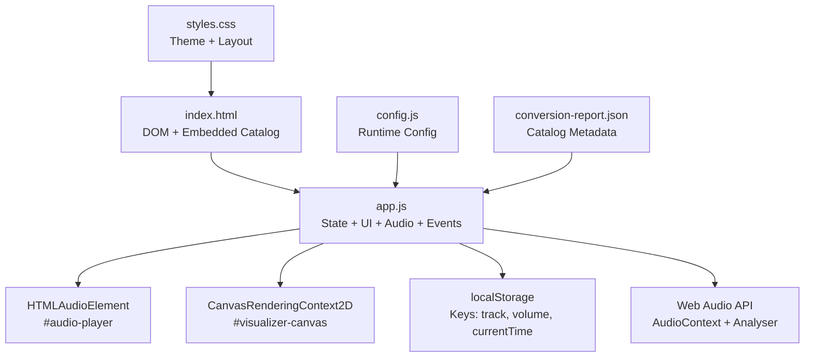
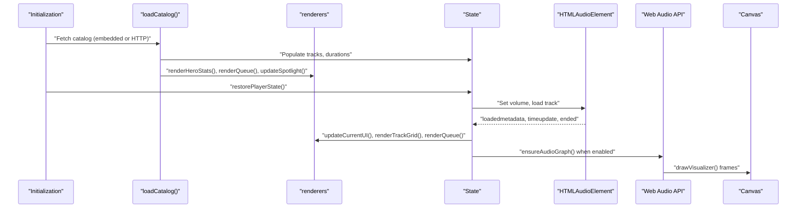
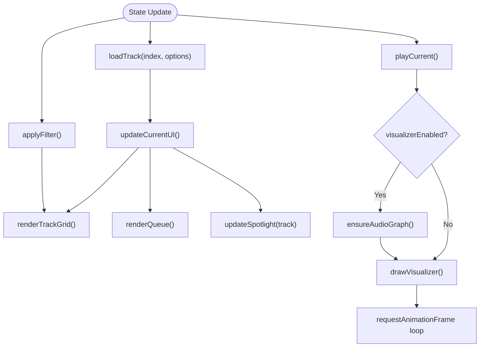
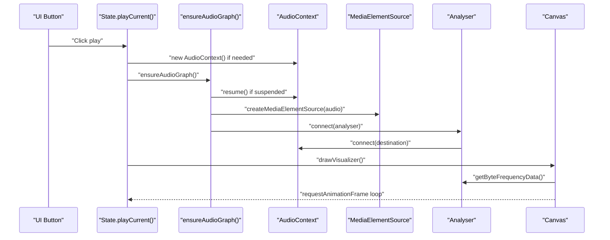
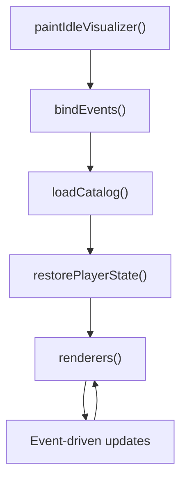
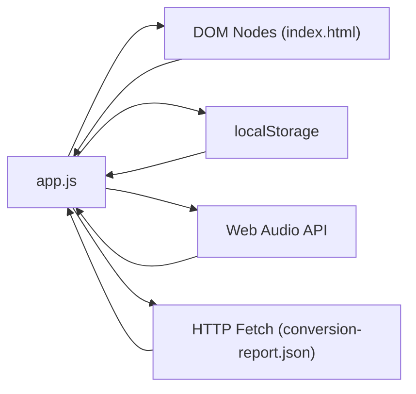

# API Reference

<cite>
**Referenced Files in This Document**
- [index.html](file://index.html)
- [app.js](file://app.js)
- [config.js](file://config.js)
- [styles.css](file://styles.css)
- [conversion-report.json](file://conversion-report.json)
- [README.md](file://README.md)
</cite>

## Table of Contents
1. [Introduction](#introduction)
2. [Project Structure](#project-structure)
3. [Core Components](#core-components)
4. [Architecture Overview](#architecture-overview)
5. [Detailed Component Analysis](#detailed-component-analysis)
6. [Dependency Analysis](#dependency-analysis)
7. [Performance Considerations](#performance-considerations)
8. [Troubleshooting Guide](#troubleshooting-guide)
9. [Conclusion](#conclusion)
10. [Appendices](#appendices)

## Introduction
This API reference documents the MusicLab-IA music player application. It covers:
- State management API: state object structure, state update methods, and event subscription patterns
- Audio processing API: Web Audio API integration, analyser node configuration, and visualization callbacks
- UI component API: DOM manipulation methods, event handlers registration, and component lifecycle management
- Configuration API endpoints: storage settings, theme options, and feature toggles
- Practical usage examples, parameter specifications, return value documentation, error handling strategies, method chaining patterns, and extension guidelines

## Project Structure
The application is a static single-page web app composed of:
- index.html: main UI shell, DOM nodes, and embedded catalog data
- app.js: state management, UI rendering, audio playback, Web Audio API integration, and event binding
- config.js: runtime configuration for audio base URL and cloud storage endpoints
- styles.css: theming and responsive layout
- conversion-report.json: catalog metadata for tracks
- README.md: deployment and setup guidance

**Diagram sources**
- [index.html:1-318](file://index.html#L1-L318)
- [app.js:1-590](file://app.js#L1-L590)
- [config.js:1-7](file://config.js#L1-L7)
- [styles.css:1-543](file://styles.css#L1-L543)
- [conversion-report.json:1-317](file://conversion-report.json#L1-L317)

**Section sources**
- [index.html:1-318](file://index.html#L1-L318)
- [app.js:1-590](file://app.js#L1-L590)
- [config.js:1-7](file://config.js#L1-L7)
- [styles.css:1-543](file://styles.css#L1-L543)
- [conversion-report.json:1-317](file://conversion-report.json#L1-L317)
- [README.md:1-27](file://README.md#L1-L27)

## Core Components
This section documents the central state object, UI rendering functions, and audio processing pipeline.

- State object structure
  - Tracks collection and filtering
  - Playback state and indices
  - Duration cache
  - Example keys: tracks, filteredTracks, currentIndex, query, filter, isPlaying, durations
  - See [state initialization:1-9](file://app.js#L1-L9)

- State update methods
  - loadTrack(index, options): loads a track by index, updates UI, persists current track and time
  - playCurrent(): starts playback, ensures audio graph if enabled, updates UI, draws visualizer
  - pauseCurrent(): pauses playback, updates UI, paints idle visualizer
  - applyFilter(): filters tracks based on query and selected filter, re-renders grid
  - renderTrackGrid(), renderQueue(), renderHeroStats(): update DOM nodes
  - updateCurrentUI(), updateSpotlight(track): update currently playing and spotlight panels
  - See [state update methods:231-278](file://app.js#L231-L278), [applyFilter:106-131](file://app.js#L106-L131), [renderers:133-181](file://app.js#L133-L181), [spotlight:183-196](file://app.js#L183-L196)

- Event subscription patterns
  - DOM event listeners bound in bindEvents(): click, input, play/pause/error/ended, seek/volume changes
  - Audio element events: loadedmetadata, timeupdate, play, pause, error, ended
  - See [bindEvents:384-519](file://app.js#L384-L519)

- Storage settings
  - Keys: musica-lab-ia-track, musica-lab-ia-volume, musica-lab-ia-time
  - Persisted values: current track ID, volume, current playback time
  - See [storage keys:50-54](file://app.js#L50-L54), [restorePlayerState:544-554](file://app.js#L544-L554), [prefetchDurations:556-576](file://app.js#L556-L576)

- Theme options
  - CSS variables define global theme (colors, backgrounds, accents)
  - Track cards compute dynamic palettes derived from track title
  - See [CSS variables:1-14](file://styles.css#L1-L14), [palette builder:60-68](file://app.js#L60-L68), [artStyle:224-229](file://app.js#L224-L229)

- Feature toggles
  - visualizerEnabled flag controls Web Audio integration
  - See [visualizerEnabled](file://app.js#L48), [ensureAudioGraph:280-319](file://app.js#L280-L319), [drawVisualizer:321-359](file://app.js#L321-L359)

**Section sources**
- [app.js:1-9](file://app.js#L1-L9)
- [app.js:50-54](file://app.js#L50-L54)
- [app.js:60-68](file://app.js#L60-L68)
- [app.js:106-131](file://app.js#L106-L131)
- [app.js:133-196](file://app.js#L133-L196)
- [app.js:231-278](file://app.js#L231-L278)
- [app.js:280-359](file://app.js#L280-L359)
- [app.js:384-519](file://app.js#L384-L519)
- [app.js:544-576](file://app.js#L544-L576)
- [styles.css:1-14](file://styles.css#L1-L14)
- [styles.css:160-225](file://styles.css#L160-L225)

## Architecture Overview
High-level flow:
- Initialization: load catalog (embedded JSON or HTTP), build track list, render UI, restore persisted state
- Playback: HTMLAudioElement drives audio; optional Web Audio pipeline renders frequency bars
- UI: DOM nodes updated by renderer functions; events trigger state updates and re-rendering
- Persistence: localStorage stores track selection, volume, and current time

**Diagram sources**
- [app.js:521-542](file://app.js#L521-L542)
- [app.js:544-554](file://app.js#L544-L554)
- [app.js:458-506](file://app.js#L458-L506)
- [app.js:280-359](file://app.js#L280-L359)

## Detailed Component Analysis

### State Management API
- State object
  - Tracks: array of normalized track objects
  - filteredTracks: derived subset based on query/filter
  - currentIndex: integer index of currently playing track
  - query: string search term
  - filter: "all" | "long" | "short" | "recent"
  - isPlaying: boolean playback state
  - durations: Map of track.id -> duration
  - See [state definition:1-9](file://app.js#L1-L9)

- Methods
  - loadTrack(index, options)
    - Parameters: index (number), options (autoplay: boolean, preserveTime: boolean)
    - Side effects: sets currentIndex, updates audio.src, resets seek/time, persists track/time, updates UI
    - Returns: undefined
    - See [loadTrack:231-254](file://app.js#L231-L254)

  - playCurrent()
    - Parameters: none
    - Side effects: ensures audio graph if enabled, sets isPlaying, updates UI, starts visualizer
    - Returns: Promise<void> (async)
    - See [playCurrent:256-272](file://app.js#L256-L272)

  - pauseCurrent()
    - Parameters: none
    - Side effects: pauses audio, sets isPlaying=false, updates UI
    - Returns: undefined
    - See [pauseCurrent:274-278](file://app.js#L274-L278)

  - applyFilter()
    - Parameters: none
    - Side effects: filters tracks, calls renderTrackGrid()
    - Returns: undefined
    - See [applyFilter:106-131](file://app.js#L106-L131)

  - renderTrackGrid(), renderQueue(), renderHeroStats()
    - Parameters: none
    - Side effects: update DOM innerHTML
    - Returns: undefined
    - See [renderers:133-181](file://app.js#L133-L181)

  - updateCurrentUI(), updateSpotlight(track)
    - Parameters: updateSpotlight takes a track object
    - Side effects: update DOM textContent and styles
    - Returns: undefined
    - See [updateCurrentUI:198-214](file://app.js#L198-L214), [updateSpotlight:183-196](file://app.js#L183-L196)

- Event subscription patterns
  - bindEvents() registers listeners for:
    - Track grid and queue clicks to load tracks
    - Filter chips to change filter and re-apply
    - Search input to update query and re-apply
    - Play/pause/previous/next buttons
    - Seek and volume sliders
    - Audio events: loadedmetadata, timeupdate, play, pause, error, ended
  - Returns: undefined
  - See [bindEvents:384-519](file://app.js#L384-L519)

- Storage persistence
  - Keys: musica-lab-ia-track, musica-lab-ia-volume, musica-lab-ia-time
  - restorePlayerState() restores volume and current track
  - prefetchDurations() probes track durations and updates UI
  - See [storage keys:50-54](file://app.js#L50-L54), [restorePlayerState:544-554](file://app.js#L544-L554), [prefetchDurations:556-576](file://app.js#L556-L576)

**Diagram sources**
- [app.js:231-278](file://app.js#L231-L278)
- [app.js:106-131](file://app.js#L106-L131)
- [app.js:198-214](file://app.js#L198-L214)
- [app.js:280-359](file://app.js#L280-L359)

**Section sources**
- [app.js:1-9](file://app.js#L1-L9)
- [app.js:50-54](file://app.js#L50-L54)
- [app.js:106-131](file://app.js#L106-L131)
- [app.js:133-214](file://app.js#L133-L214)
- [app.js:231-278](file://app.js#L231-L278)
- [app.js:280-359](file://app.js#L280-L359)
- [app.js:384-519](file://app.js#L384-L519)
- [app.js:544-576](file://app.js#L544-L576)

### Audio Processing API
- Web Audio API integration
  - AudioContext creation and resume on demand
  - MediaElementSource from HTMLAudioElement connected to Analyser
  - Analyser configured with fftSize=256
  - Destination connection to speakers
  - See [ensureAudioGraph:280-319](file://app.js#L280-L319)

- Analyser node configuration
  - Frequency domain data via getByteFrequencyData
  - Data length equals analyser.frequencyBinCount
  - See [drawVisualizer:321-359](file://app.js#L321-L359)

- Visualization callbacks
  - drawVisualizer(): clears canvas, computes gradient from current track palette, draws bars
  - paintIdleVisualizer(): draws idle waveform when not playing or disabled
  - Animation frame loop managed by requestAnimationFrame/cancelAnimationFrame
  - See [drawVisualizer:321-359](file://app.js#L321-L359), [paintIdleVisualizer:361-382](file://app.js#L361-L382)

- Method chaining patterns
  - ensureAudioGraph() returns early if already ready or disabled
  - drawVisualizer() cancels previous animation frame before starting a new loop
  - See [ensureAudioGraph:280-319](file://app.js#L280-L319), [drawVisualizer:321-359](file://app.js#L321-L359)

**Diagram sources**
- [app.js:256-272](file://app.js#L256-L272)
- [app.js:280-319](file://app.js#L280-L319)
- [app.js:321-359](file://app.js#L321-L359)

**Section sources**
- [app.js:280-359](file://app.js#L280-L359)

### UI Component API
- DOM manipulation methods
  - renderTrackGrid(): builds track cards with current track highlighting
  - renderQueue(): lists up to 18 upcoming tracks
  - renderHeroStats(): displays library statistics
  - updateCurrentUI(): updates now playing card and related UI
  - updateSpotlight(track): updates spotlight panel content and styles
  - See [renderTrackGrid:133-156](file://app.js#L133-L156), [renderQueue:158-171](file://app.js#L158-L171), [renderHeroStats:173-181](file://app.js#L173-L181), [updateCurrentUI:198-214](file://app.js#L198-L214), [updateSpotlight:183-196](file://app.js#L183-L196)

- Event handlers registration
  - bindEvents(): registers click/input/play/pause/error/ended handlers
  - Handles track selection, queue navigation, filter changes, search, seek, volume
  - See [bindEvents:384-519](file://app.js#L384-L519)

- Component lifecycle management
  - Initialization: paintIdleVisualizer(), bindEvents(), loadCatalog()
  - Rendering: triggered by state changes and UI interactions
  - Cleanup: cancelAnimationFrame on each draw cycle
  - See [initialization:584-589](file://app.js#L584-L589)

- Accessibility and theming
  - CSS variables define theme tokens
  - Track art uses computed gradients based on palette
  - See [CSS variables:1-14](file://styles.css#L1-L14), [artStyle:224-229](file://app.js#L224-L229)

**Diagram sources**
- [app.js:584-589](file://app.js#L584-L589)
- [app.js:384-519](file://app.js#L384-L519)
- [app.js:521-554](file://app.js#L521-L554)

**Section sources**
- [app.js:133-214](file://app.js#L133-L214)
- [app.js:384-519](file://app.js#L384-L519)
- [app.js:584-589](file://app.js#L584-L589)
- [styles.css:1-14](file://styles.css#L1-L14)
- [styles.css:160-225](file://styles.css#L160-L225)

### Configuration API Endpoints
- Runtime configuration
  - MUSICLAB_CONFIG: exposes audioBaseUrl, bucketName, accountId, s3Endpoint
  - audioBaseUrl influences track.src construction
  - See [config.js:1-7](file://config.js#L1-L7), [audioBaseUrl usage](file://app.js#L47), [buildTrackFromReport:91-104](file://app.js#L91-L104)

- Storage settings
  - Keys: musica-lab-ia-track, musica-lab-ia-volume, musica-lab-ia-time
  - Persisted values: current track ID, volume, current time
  - See [storage keys:50-54](file://app.js#L50-L54), [restorePlayerState:544-554](file://app.js#L544-L554), [volume persistence:515-518](file://app.js#L515-L518)

- Theme options
  - CSS variables define global theme tokens
  - Track palette computed from title hash
  - See [CSS variables:1-14](file://styles.css#L1-L14), [palette builder:60-68](file://app.js#L60-L68)

- Feature toggles
  - visualizerEnabled flag controls Web Audio integration
  - See [visualizerEnabled](file://app.js#L48)

**Section sources**
- [config.js:1-7](file://config.js#L1-L7)
- [app.js:47-104](file://app.js#L47-L104)
- [app.js:50-54](file://app.js#L50-L54)
- [app.js:544-554](file://app.js#L544-L554)
- [app.js:515-518](file://app.js#L515-L518)
- [app.js:48](file://app.js#L48)
- [styles.css:1-14](file://styles.css#L1-L14)
- [app.js:60-68](file://app.js#L60-L68)

## Dependency Analysis
- Internal dependencies
  - app.js depends on DOM nodes declared in index.html
  - app.js uses localStorage for persistence
  - app.js integrates Web Audio API when visualizerEnabled is true
  - See [DOM nodes:11-38](file://app.js#L11-L38), [localStorage:50-54](file://app.js#L50-L54), [Web Audio:280-319](file://app.js#L280-L319)

- External resources
  - Embedded catalog JSON in index.html
  - HTTP fetch fallback to conversion-report.json
  - See [embedded catalog:242-313](file://index.html#L242-L313), [loadCatalog:521-542](file://app.js#L521-L542)

**Diagram sources**
- [app.js:11-38](file://app.js#L11-L38)
- [app.js:50-54](file://app.js#L50-L54)
- [app.js:280-319](file://app.js#L280-L319)
- [app.js:521-542](file://app.js#L521-L542)
- [index.html:242-313](file://index.html#L242-L313)

**Section sources**
- [app.js:11-38](file://app.js#L11-L38)
- [app.js:50-54](file://app.js#L50-L54)
- [app.js:280-319](file://app.js#L280-L319)
- [app.js:521-542](file://app.js#L521-L542)
- [index.html:242-313](file://index.html#L242-L313)

## Performance Considerations
- Rendering
  - renderTrackGrid() and renderQueue() rebuild innerHTML; consider virtualization for large catalogs
  - drawVisualizer() uses requestAnimationFrame; cancel previous frame to prevent overlapping loops
  - See [renderTrackGrid:133-156](file://app.js#L133-L156), [drawVisualizer:321-359](file://app.js#L321-L359)

- Audio processing
  - Analyser fftSize set to 256; adjust for performance vs fidelity trade-offs
  - ensureAudioGraph() resumes context only when suspended
  - See [ensureAudioGraph:280-319](file://app.js#L280-L319)

- Persistence
  - localStorage writes on timeupdate and volume change; batch if needed
  - See [timeupdate handler:477-485](file://app.js#L477-L485), [volume handler:515-518](file://app.js#L515-L518)

[No sources needed since this section provides general guidance]

## Troubleshooting Guide
- Audio loading errors
  - Audio element error event triggers renderFatalError with a user-facing message
  - Check network connectivity and audioBaseUrl configuration
  - See [audio error handler:499-502](file://app.js#L499-L502), [renderFatalError:578-582](file://app.js#L578-L582)

- Web Audio context issues
  - ensureAudioGraph() handles suspend/resume and cleanup on failure
  - visualizerEnabled flag disables Web Audio pipeline if unavailable
  - See [ensureAudioGraph:280-319](file://app.js#L280-L319), [visualizerEnabled](file://app.js#L48)

- Catalog loading failures
  - loadCatalog() throws on HTTP fetch failure; fallback to embedded catalog
  - Verify conversion-report.json availability or embedded JSON presence
  - See [loadCatalog:521-542](file://app.js#L521-L542), [embedded catalog:242-313](file://index.html#L242-L313)

- Playback state inconsistencies
  - restorePlayerState() reads persisted volume and track; ensure keys exist
  - See [restorePlayerState:544-554](file://app.js#L544-L554)

**Section sources**
- [app.js:499-502](file://app.js#L499-L502)
- [app.js:578-582](file://app.js#L578-L582)
- [app.js:280-319](file://app.js#L280-L319)
- [app.js:48](file://app.js#L48)
- [app.js:521-542](file://app.js#L521-L542)
- [index.html:242-313](file://index.html#L242-L313)
- [app.js:544-554](file://app.js#L544-L554)

## Conclusion
MusicLab-IA provides a focused, modular API surface:
- State management encapsulates playback and UI state with straightforward methods
- Audio processing integrates Web Audio API conditionally with robust error handling
- UI rendering is event-driven and DOM-centric, with clear separation of concerns
- Configuration and persistence are centralized and easy to extend

[No sources needed since this section summarizes without analyzing specific files]

## Appendices

### API Usage Examples
- Initialize and play a track
  - Steps: loadCatalog(), select a track index, call loadTrack(index, { autoplay: true })
  - References: [loadCatalog:521-542](file://app.js#L521-L542), [loadTrack:231-254](file://app.js#L231-L254)

- Toggle visualizer
  - Steps: set visualizerEnabled flag, call ensureAudioGraph() on play
  - References: [visualizerEnabled](file://app.js#L48), [ensureAudioGraph:280-319](file://app.js#L280-L319)

- Persist playback state
  - Steps: on timeupdate, write currentTime; on volume change, write volume
  - References: [timeupdate handler:477-485](file://app.js#L477-L485), [volume handler:515-518](file://app.js#L515-L518)

- Customize audio source base URL
  - Steps: set MUSICLAB_CONFIG.audioBaseUrl; rebuild track URLs
  - References: [config.js:1-7](file://config.js#L1-L7), [audioBaseUrl usage](file://app.js#L47)

### Parameter Specifications
- loadTrack(index, options)
  - index: number
  - options.autoplay: boolean
  - options.preserveTime: boolean

- playCurrent()
  - No parameters

- pauseCurrent()
  - No parameters

- applyFilter()
  - No parameters

- renderTrackGrid(), renderQueue(), renderHeroStats()
  - No parameters

- updateCurrentUI(), updateSpotlight(track)
  - track: object with id, title, output, duration, palette

- ensureAudioGraph()
  - No parameters

- drawVisualizer()
  - No parameters

- paintIdleVisualizer()
  - No parameters

**Section sources**
- [app.js:231-254](file://app.js#L231-L254)
- [app.js:256-272](file://app.js#L256-L272)
- [app.js:274-278](file://app.js#L274-L278)
- [app.js:106-131](file://app.js#L106-L131)
- [app.js:133-181](file://app.js#L133-L181)
- [app.js:198-214](file://app.js#L198-L214)
- [app.js:183-196](file://app.js#L183-L196)
- [app.js:280-319](file://app.js#L280-L319)
- [app.js:321-359](file://app.js#L321-L359)
- [app.js:361-382](file://app.js#L361-L382)

### Return Value Documentation
- loadTrack(): undefined
- playCurrent(): Promise<void>
- pauseCurrent(): undefined
- applyFilter(): undefined
- renderTrackGrid(): undefined
- renderQueue(): undefined
- renderHeroStats(): undefined
- updateCurrentUI(): undefined
- updateSpotlight(track): undefined
- ensureAudioGraph(): undefined
- drawVisualizer(): undefined
- paintIdleVisualizer(): undefined

**Section sources**
- [app.js:231-278](file://app.js#L231-L278)
- [app.js:280-359](file://app.js#L280-L359)

### Integration Guidelines
- Extending the catalog
  - Add entries to conversion-report.json or embed JSON in index.html
  - Ensure output filenames match audioBaseUrl and bucket configuration
  - See [conversion-report.json:1-317](file://conversion-report.json#L1-L317), [config.js:1-7](file://config.js#L1-L7)

- Adding new UI panels
  - Define DOM nodes in index.html
  - Add renderer functions and bindEvents handlers
  - Update state structure as needed
  - See [index.html:1-318](file://index.html#L1-L318), [bindEvents:384-519](file://app.js#L384-L519)

- Customizing theme
  - Modify CSS variables in :root and component styles
  - Adjust palette computation if needed
  - See [styles.css:1-14](file://styles.css#L1-L14), [palette builder:60-68](file://app.js#L60-L68)

- Enabling advanced audio features
  - Set visualizerEnabled to true
  - Configure analyser parameters and visualization callbacks
  - See [visualizerEnabled](file://app.js#L48), [ensureAudioGraph:280-319](file://app.js#L280-L319), [drawVisualizer:321-359](file://app.js#L321-L359)

**Section sources**
- [conversion-report.json:1-317](file://conversion-report.json#L1-L317)
- [config.js:1-7](file://config.js#L1-L7)
- [index.html:1-318](file://index.html#L1-L318)
- [app.js:384-519](file://app.js#L384-L519)
- [styles.css:1-14](file://styles.css#L1-L14)
- [app.js:60-68](file://app.js#L60-L68)
- [app.js:48](file://app.js#L48)
- [app.js:280-359](file://app.js#L280-L359)