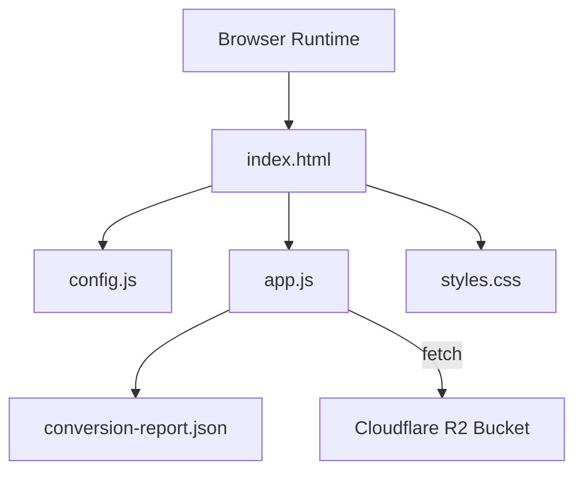
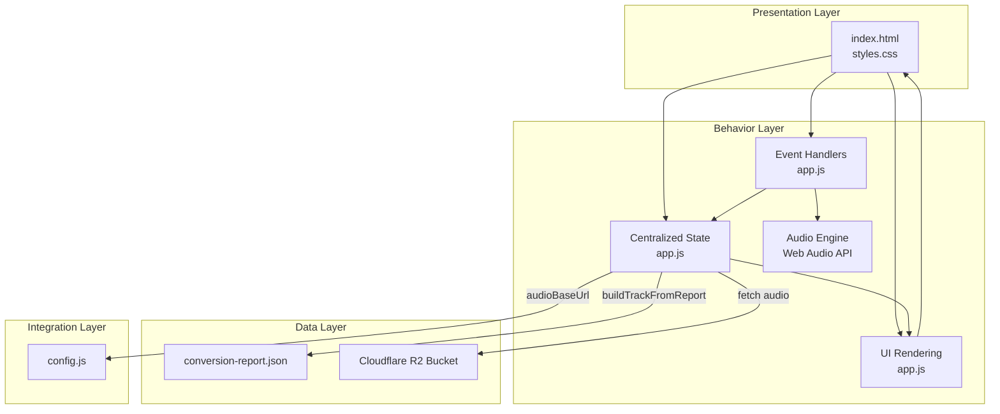
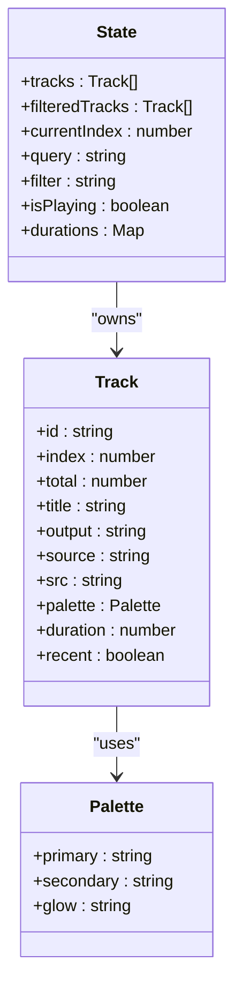
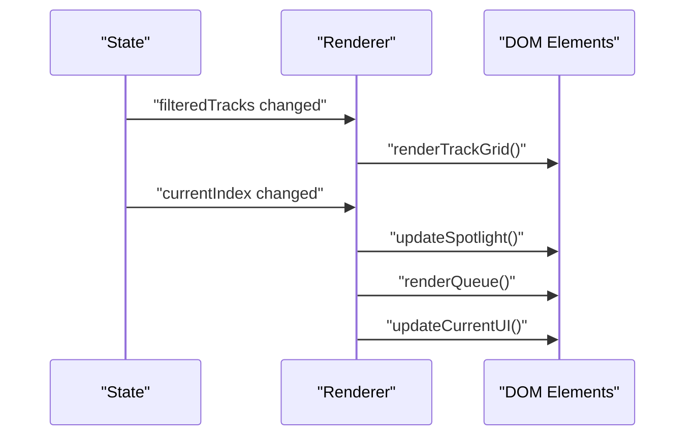
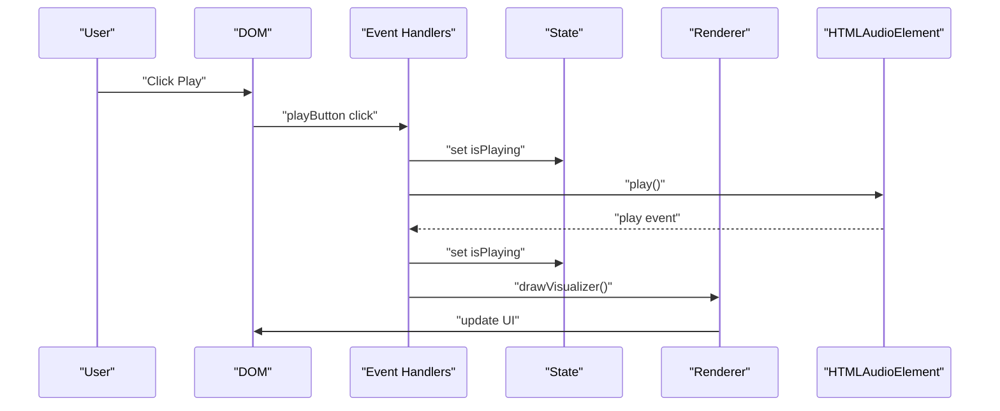
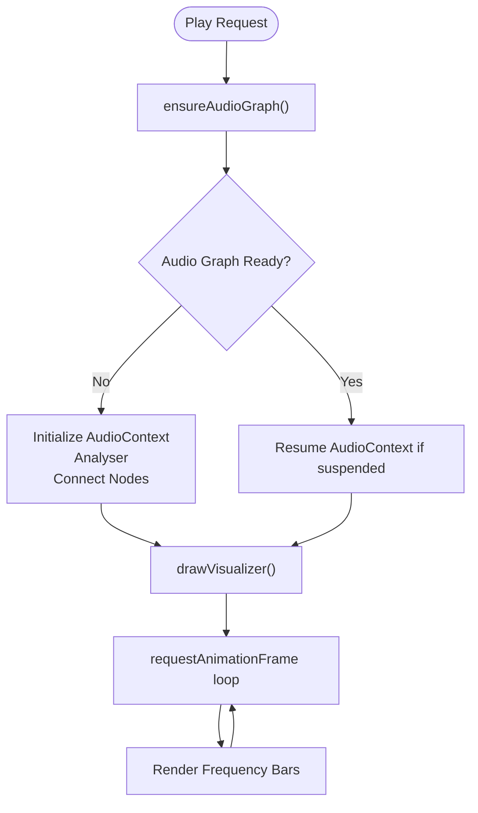
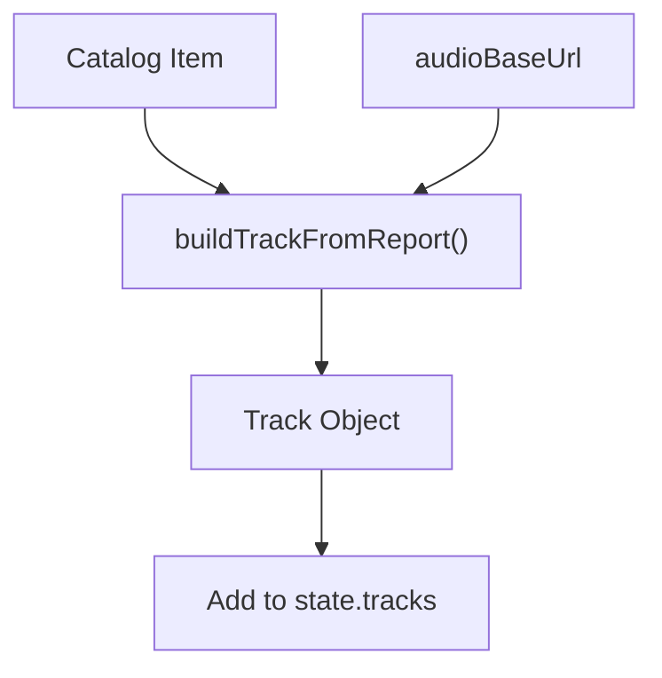
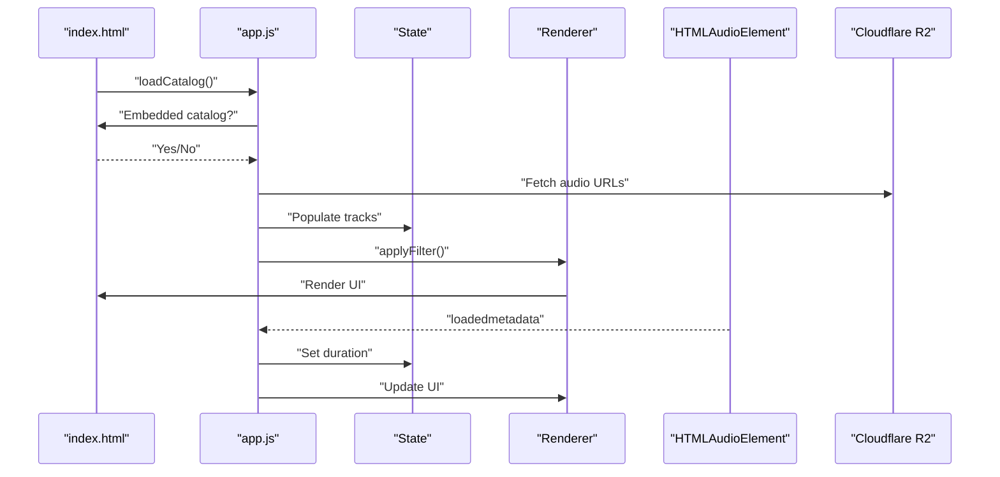
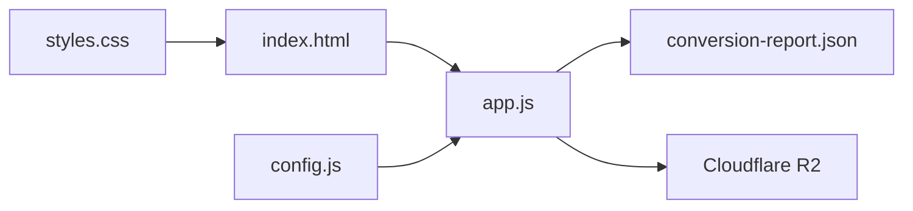

# Architecture Overview

<cite>
**Referenced Files in This Document**
- [index.html](file://index.html)
- [app.js](file://app.js)
- [config.js](file://config.js)
- [styles.css](file://styles.css)
- [conversion-report.json](file://conversion-report.json)
- [README.md](file://README.md)
</cite>

## Table of Contents
1. [Introduction](#introduction)
2. [Project Structure](#project-structure)
3. [Core Components](#core-components)
4. [Architecture Overview](#architecture-overview)
5. [Detailed Component Analysis](#detailed-component-analysis)
6. [Dependency Analysis](#dependency-analysis)
7. [Performance Considerations](#performance-considerations)
8. [Troubleshooting Guide](#troubleshooting-guide)
9. [Conclusion](#conclusion)

## Introduction
MusicLab-IA is a static web music player designed to stream an audio catalog from Cloudflare R2 storage. It is implemented as a modular vanilla JavaScript application with centralized state management. The system integrates:
- A state-driven UI rendering framework
- An audio processing engine using the Web Audio API
- An event-driven architecture leveraging DOM events
- Cloud storage integration via Cloudflare R2 for audio assets

The application loads metadata from a catalog file, builds a normalized track model, and renders a responsive UI with filtering, search, playback controls, and a real-time audio visualizer.

## Project Structure
The project follows a minimal, flat structure optimized for static hosting:
- index.html: Application shell, markup, and embedded catalog data
- app.js: Centralized state, UI rendering, event handling, audio engine, and data flow
- config.js: Cloud storage configuration for R2 audio base URL and S3-compatible endpoint
- styles.css: Responsive styling and theming
- conversion-report.json: Catalog metadata used when the embedded catalog is unavailable
- README.md: Deployment and integration guidance

**Diagram sources**
- [index.html:1-318](file://index.html#L1-L318)
- [app.js:1-590](file://app.js#L1-L590)
- [config.js:1-7](file://config.js#L1-L7)
- [conversion-report.json:1-317](file://conversion-report.json#L1-L317)

**Section sources**
- [index.html:1-318](file://index.html#L1-L318)
- [app.js:1-590](file://app.js#L1-L590)
- [config.js:1-7](file://config.js#L1-L7)
- [styles.css:1-543](file://styles.css#L1-L543)
- [conversion-report.json:1-317](file://conversion-report.json#L1-L317)
- [README.md:1-27](file://README.md#L1-L27)

## Core Components
- Centralized State Manager: A global state object holds tracks, filters, current index, playback flags, and duration cache.
- UI Rendering Engine: Functions render the track grid, queue panel, spotlight, and hero stats based on state.
- Event Handler System: DOM event listeners orchestrate user interactions and audio lifecycle events.
- Audio Processing Engine: Uses the HTMLAudioElement and Web Audio API for playback and visualization.
- Factory Pattern: Tracks are constructed from catalog entries using a dedicated builder function.
- Observer Pattern: DOM events propagate state changes to UI updates and playback actions.

Key responsibilities:
- State initialization and persistence (localStorage)
- Catalog loading and normalization
- Filtering and search
- Playback control and timeline scrubbing
- Real-time audio visualization
- Cloud storage integration for audio URLs

**Section sources**
- [app.js:1-590](file://app.js#L1-L590)

## Architecture Overview
The system is a single-page application with a clear separation of concerns:
- Presentation Layer: index.html and styles.css define the UI and theming
- Behavior Layer: app.js encapsulates state, rendering, and event handling
- Data Layer: conversion-report.json supplies catalog metadata; Cloudflare R2 hosts audio assets
- Integration Layer: config.js defines R2 endpoint and base URL for audio resources

**Diagram sources**
- [index.html:1-318](file://index.html#L1-L318)
- [app.js:1-590](file://app.js#L1-L590)
- [config.js:1-7](file://config.js#L1-L7)
- [conversion-report.json:1-317](file://conversion-report.json#L1-L317)

## Detailed Component Analysis

### Centralized State Management
The state object centralizes all runtime data:
- Tracks: Normalized track list with computed properties
- Filtered tracks: Derived subset for UI rendering
- Current index: Active track position
- Query and filter: Search and category filters
- Playback flags: Playing state and duration cache
- UI references: DOM element handles for rendering

Patterns:
- Single source of truth for UI and playback
- LocalStorage-backed persistence for volume, current track, and playback position
- Map-based duration cache for efficient lookups

**Diagram sources**
- [app.js:1-104](file://app.js#L1-L104)

**Section sources**
- [app.js:1-104](file://app.js#L1-L104)

### UI Rendering Framework
Rendering functions produce DOM content from state:
- renderTrackGrid: Renders cards with dynamic palettes and duration badges
- renderQueue: Displays up-to-N recent tracks with duration tags
- renderHeroStats: Shows catalog statistics
- updateSpotlight: Highlights current track in the hero area
- updateCurrentUI: Synchronizes all current track displays

Rendering logic:
- Uses state-derived data to build HTML fragments
- Applies dynamic CSS custom properties for artwork gradients
- Updates accessibility attributes and aria-expanded states

**Diagram sources**
- [app.js:133-214](file://app.js#L133-L214)

**Section sources**
- [app.js:133-214](file://app.js#L133-L214)

### Event Handling System
The event system orchestrates user interactions and audio lifecycle:
- User actions: Play/pause, next/previous, seek scrubbing, volume control, search, and filter selection
- Audio lifecycle: loadedmetadata, timeupdate, play, pause, error, ended
- UI toggles: About panel expand/collapse

Event-driven patterns:
- DOM event listeners update state and trigger re-renders
- Audio errors are surfaced to the UI with a fatal error message
- Playback state transitions drive visualizer updates

**Diagram sources**
- [app.js:384-519](file://app.js#L384-L519)

**Section sources**
- [app.js:384-519](file://app.js#L384-L519)

### Audio Processing Engine
The audio engine manages playback and visualization:
- HTMLAudioElement for media playback
- Web Audio API for real-time frequency analysis
- Canvas-based visualization with animated bars
- Lazy initialization of audio graph on first play

Key behaviors:
- Ensures audio context is resumed when needed
- Creates analyser nodes and connects to destination
- Draws frequency bars synchronized with animation frames
- Falls back to idle visualization when not playing

**Diagram sources**
- [app.js:280-382](file://app.js#L280-L382)

**Section sources**
- [app.js:280-382](file://app.js#L280-L382)

### Factory Pattern for Dynamic Track Creation
Tracks are created from catalog entries using a builder function:
- buildTrackFromReport: Transforms catalog items into normalized track objects
- Computes derived properties: palette, duration, recent flag, and URL
- Uses app configuration for audio base URL

**Diagram sources**
- [app.js:91-104](file://app.js#L91-L104)
- [config.js:1-7](file://config.js#L1-L7)

**Section sources**
- [app.js:91-104](file://app.js#L91-L104)
- [config.js:1-7](file://config.js#L1-L7)

### Data Flow Patterns
End-to-end flow from catalog to UI:
1. Catalog loading: Embedded JSON or external fetch
2. Track normalization: buildTrackFromReport transforms entries
3. State population: tracks, durations, and derived properties
4. UI rendering: renderTrackGrid, renderQueue, updateSpotlight
5. User interaction: events update state and trigger re-render
6. Playback lifecycle: audio events update UI and persist state

**Diagram sources**
- [app.js:521-576](file://app.js#L521-L576)
- [index.html:242-317](file://index.html#L242-L317)

**Section sources**
- [app.js:521-576](file://app.js#L521-L576)
- [index.html:242-317](file://index.html#L242-L317)

## Dependency Analysis
The application exhibits low coupling and high cohesion:
- app.js depends on index.html for DOM elements and on config.js for R2 configuration
- Styles are decoupled and applied via CSS classes
- Catalog data can be embedded or fetched externally

**Diagram sources**
- [index.html:1-318](file://index.html#L1-L318)
- [app.js:1-590](file://app.js#L1-L590)
- [config.js:1-7](file://config.js#L1-L7)
- [conversion-report.json:1-317](file://conversion-report.json#L1-L317)

**Section sources**
- [index.html:1-318](file://index.html#L1-L318)
- [app.js:1-590](file://app.js#L1-L590)
- [config.js:1-7](file://config.js#L1-L7)
- [conversion-report.json:1-317](file://conversion-report.json#L1-L317)

## Performance Considerations
- Lazy audio graph initialization reduces startup overhead
- Duration preloading improves perceived responsiveness
- Efficient rendering with minimal DOM updates
- LocalStorage persistence avoids repeated server requests
- Canvas visualization runs at 60fps with requestAnimationFrame

## Troubleshooting Guide
Common issues and resolutions:
- Catalog loading failures: Verify embedded JSON or network availability of conversion-report.json
- Audio playback errors: Check CORS configuration and audio URL accessibility
- Visualizer not appearing: Confirm Web Audio API support and user gesture requirements
- Persistent state inconsistencies: Clear browser localStorage keys for track, volume, and time

**Section sources**
- [app.js:586-589](file://app.js#L586-L589)
- [app.js:499-502](file://app.js#L499-L502)

## Conclusion
MusicLab-IA demonstrates a clean, modular architecture for a static music player:
- Centralized state ensures predictable UI updates
- Event-driven handlers keep user interactions responsive
- Factory-based track creation simplifies data normalization
- Web Audio API enables real-time visualization
- Cloudflare R2 integration provides scalable audio delivery

The design favors simplicity, maintainability, and performance while remaining extensible for future enhancements.