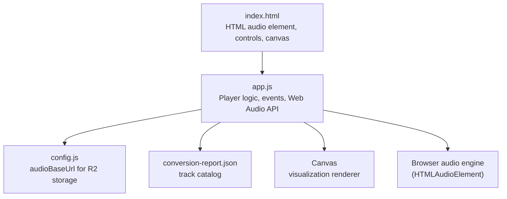
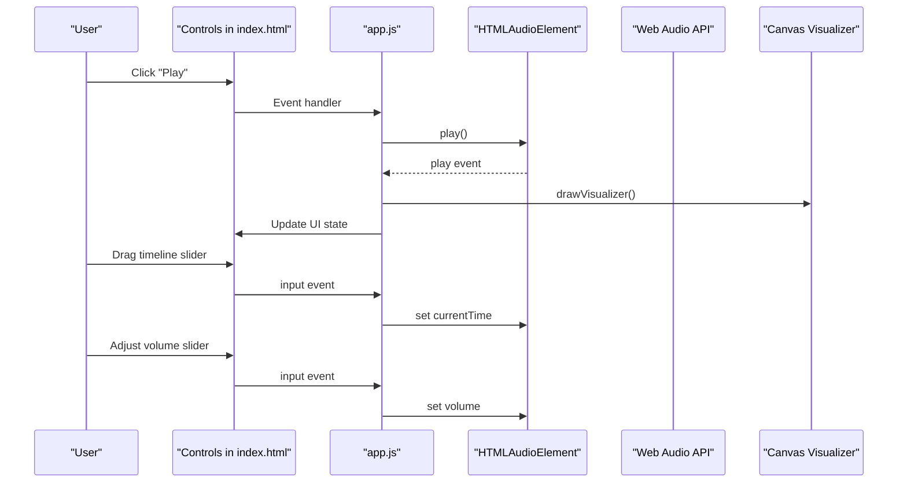
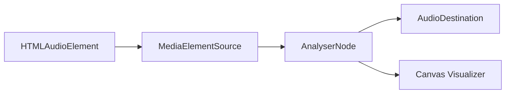
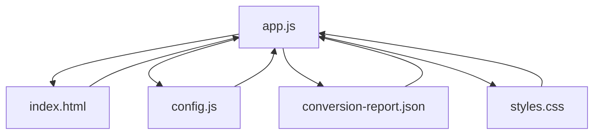

# Audio Player Features

<cite>
**Referenced Files in This Document**
- [index.html](file://index.html)
- [app.js](file://app.js)
- [config.js](file://config.js)
- [styles.css](file://styles.css)
- [README.md](file://README.md)
- [conversion-report.json](file://conversion-report.json)
</cite>

## Update Summary
**Changes Made**
- Updated CORS handling section to reflect removal of problematic crossorigin='anonymous' attribute
- Added documentation for enhanced Amazon S3 R2 storage integration
- Updated troubleshooting guide with CORS-related solutions
- Enhanced deployment considerations for R2 storage compatibility

## Table of Contents
1. [Introduction](#introduction)
2. [Project Structure](#project-structure)
3. [Core Components](#core-components)
4. [Architecture Overview](#architecture-overview)
5. [Detailed Component Analysis](#detailed-component-analysis)
6. [Dependency Analysis](#dependency-analysis)
7. [Performance Considerations](#performance-considerations)
8. [CORS Handling and Storage Integration](#cors-handling-and-storage-integration)
9. [Troubleshooting Guide](#troubleshooting-guide)
10. [Conclusion](#conclusion)

## Introduction
This document explains the audio player features implemented in the MusicLab-IA project. It covers how tracks are loaded and played, timeline scrubbing and time updates, volume control, playlist navigation, and the integration of the HTML audio element with the Web Audio API analyser for visualization. It also documents the canvas-based visualization rendering pipeline and how audio events are handled to keep the UI synchronized with playback state.

**Updated** Enhanced CORS handling for Amazon S3 R2 storage integration with improved cross-origin resource sharing compatibility.

## Project Structure
The audio player is implemented as a static single-page application with a minimal set of files:
- index.html: Provides the UI shell, the HTML audio element, and DOM hooks for controls and visualization.
- app.js: Implements the player logic, event bindings, playlist management, seeking, volume control, and Web Audio API visualization.
- config.js: Holds runtime configuration such as the audio base URL for R2 storage integration.
- styles.css: Defines the visual presentation and layout of the player UI.
- conversion-report.json: Supplies the catalog of tracks used by the player.

**Diagram sources**
- [index.html:242](file://index.html#L242)
- [app.js:11](file://app.js#L11)
- [config.js:1](file://config.js#L1)
- [conversion-report.json:1](file://conversion-report.json#L1)

**Section sources**
- [README.md:5](file://README.md#L5)
- [index.html:10-318](file://index.html#L10-L318)
- [app.js:1-590](file://app.js#L1-L590)
- [config.js:1-7](file://config.js#L1-L7)
- [conversion-report.json:1-317](file://conversion-report.json#L1-L317)

## Core Components
- HTML audio element: The central playback device for all tracks. It is configured for metadata preloading and cross-origin behavior suitable for CDN-hosted audio and R2 storage integration.
- Web Audio API graph: An optional analyser node connected between the audio element and the output destination, enabling frequency-domain visualization.
- Canvas-based visualizer: Renders bars representing frequency magnitudes in real time during playback.
- Playlist and UI: Grids for browsing tracks, queue panel for current and upcoming items, and controls for play/pause, previous, next, timeline scrubbing, and volume.

Key implementation highlights:
- Track loading and playback: The player loads a track's source URL into the audio element, triggers playback, and updates UI state.
- Timeline scrubbing: A range input mirrors playback progress and allows seeking by setting audio.currentTime.
- Volume control: A range input adjusts the audio element's volume and persists the value.
- Playlist navigation: Clicking library or queue items selects and plays the corresponding track.
- Visualization: When enabled, the analyser captures frequency data and draws bars on a canvas.

**Section sources**
- [index.html:166-198](file://index.html#L166-L198)
- [app.js:231-272](file://app.js#L231-L272)
- [app.js:458-518](file://app.js#L458-L518)
- [app.js:280-319](file://app.js#L280-L319)
- [app.js:321-382](file://app.js#L321-L382)

## Architecture Overview
The audio pipeline integrates the HTML audio element with the Web Audio API analyser and a canvas visualizer. The UI reacts to audio events to keep the timeline, current track info, and visualizer synchronized.

**Diagram sources**
- [index.html:170-198](file://index.html#L170-L198)
- [app.js:426-432](file://app.js#L426-L432)
- [app.js:458-518](file://app.js#L458-L518)
- [app.js:280-319](file://app.js#L280-L319)
- [app.js:321-382](file://app.js#L321-L382)

## Detailed Component Analysis

### Track Loading and Playback Mechanisms
- Loading a track:
  - Selects the desired track by index, sets the audio element's source to the resolved URL, and calls load to prepare playback.
  - Resets the timeline UI and current time in storage.
  - Persists the selected track ID for restoration on reload.
  - Optionally starts playback immediately.
- Playback control:
  - Play toggles playback and updates the button text and visualizer state.
  - Pause pauses playback and switches the visualizer to idle mode.
- Autoplay behavior:
  - If no track is currently loaded, the player loads the first track and then attempts to play.

Implementation references:
- [loadTrack:231-254](file://app.js#L231-L254)
- [playCurrent:256-272](file://app.js#L256-L272)
- [pauseCurrent:274-278](file://app.js#L274-L278)

**Section sources**
- [app.js:231-272](file://app.js#L231-L272)

### Seeking and Timeline Control
- Progress synchronization:
  - On timeupdate, the player updates the current time display and the timeline slider's value based on the ratio of currentTime to duration.
  - The current time is persisted to local storage to resume playback later.
- Timeline scrubbing:
  - When the user drags the timeline slider, the player computes the new currentTime as a proportion of the slider's value and applies it to the audio element.
- Duration discovery:
  - On loadedmetadata, the player reads the audio duration and updates UI displays and internal state.
  - A background prefetch mechanism probes each track's metadata to populate durations without blocking the UI.

Implementation references:
- [timeupdate handler:477-485](file://app.js#L477-L485)
- [seekRange input handler:508-513](file://app.js#L508-L513)
- [loadedmetadata handler:458-475](file://app.js#L458-L475)
- [prefetchDurations:556-576](file://app.js#L556-L576)

**Section sources**
- [app.js:458-518](file://app.js#L458-L518)
- [app.js:556-576](file://app.js#L556-L576)

### Volume Management Systems
- Volume control:
  - The volume range input updates the audio element's volume property and persists the value to local storage.
  - On startup, the player restores the last known volume level.
- Mute behavior:
  - The audio element is unmuted at initialization; muting is not exposed via the UI.

Implementation references:
- [volumeRange input handler:515-518](file://app.js#L515-L518)
- [restorePlayerState:544-554](file://app.js#L544-L554)

**Section sources**
- [app.js:515-518](file://app.js#L515-L518)
- [app.js:544-554](file://app.js#L544-L554)

### Playlist Navigation Capabilities
- Library browsing:
  - The track grid renders cards with title, source, and duration. Clicking a card loads and plays the associated track.
- Queue panel:
  - The queue list shows the first 18 tracks and highlights the currently playing item.
- Navigation controls:
  - Previous and next buttons cycle through the playlist, wrapping around the ends.
  - Spotlight area highlights the current track and provides a quick play action.

Implementation references:
- [trackGrid click handler:392-400](file://app.js#L392-L400)
- [queueList click handler:402-410](file://app.js#L402-L410)
- [prevButton click handler:442-448](file://app.js#L442-L448)
- [nextButton click handler:450-456](file://app.js#L450-L456)
- [renderQueue:158-171](file://app.js#L158-L171)

**Section sources**
- [app.js:392-456](file://app.js#L392-L456)
- [app.js:158-171](file://app.js#L158-L171)

### Media Element Integration and Web Audio API Analyser Nodes
- Graph construction:
  - The analyser node is created with a specific FFT size and connected between the audio element source and the audio context destination.
  - The graph is lazily initialized on first play and resumed if the audio context was suspended.
- Visualizer rendering:
  - During playback, the analyser captures frequency data and draws bars on the canvas. The visualizer is disabled by default in the codebase.
- Idle visualization:
  - When not playing or when the visualizer is disabled, a static idle pattern is drawn.

Implementation references:
- [ensureAudioGraph:280-319](file://app.js#L280-L319)
- [drawVisualizer:321-359](file://app.js#L321-L359)
- [paintIdleVisualizer:361-382](file://app.js#L361-L382)

**Section sources**
- [app.js:280-319](file://app.js#L280-L319)
- [app.js:321-382](file://app.js#L321-L382)

### Canvas-Based Visualization Rendering
- Data acquisition:
  - The analyser provides frequency bin data via getByteFrequencyData, which is mapped to bar heights proportional to the canvas height.
- Drawing loop:
  - A requestAnimationFrame-driven loop clears the canvas, computes gradients based on the current track's palette, and draws bars with spacing derived from the data length.
- Idle state:
  - A subtle sine wave pattern is rendered when the visualizer is inactive.

Implementation references:
- [drawVisualizer loop:333-358](file://app.js#L333-L358)
- [paintIdleVisualizer:361-382](file://app.js#L361-L382)

**Section sources**
- [app.js:321-382](file://app.js#L321-L382)

### Relationship Between HTML Audio Element, Web Audio API, and Visualizer
- The HTML audio element is the source of truth for playback and timing.
- The Web Audio API analyser node samples the audio stream for visualization without altering playback.
- The canvas visualizer renders the analyser output in real time.

**Diagram sources**
- [app.js:280-319](file://app.js#L280-L319)
- [app.js:321-359](file://app.js#L321-L359)

## Dependency Analysis
- app.js depends on:
  - index.html for DOM elements (audio, controls, canvas).
  - config.js for the audio base URL used to construct track URLs.
  - conversion-report.json for the catalog of tracks.
- Styles depend on app.js for dynamic UI updates (e.g., highlighting current track).
- The visualizer is conditionally enabled via a flag in app.js.

**Diagram sources**
- [app.js:11](file://app.js#L11)
- [config.js:1](file://config.js#L1)
- [conversion-report.json:1](file://conversion-report.json#L1)
- [styles.css:1](file://styles.css#L1)

**Section sources**
- [app.js:11](file://app.js#L11)
- [config.js:1-7](file://config.js#L1-L7)
- [conversion-report.json:1-317](file://conversion-report.json#L1-L317)
- [styles.css:1-543](file://styles.css#L1-L543)

## Performance Considerations
- Lazy Web Audio graph creation: The analyser and connections are established only when needed, reducing overhead when visualization is disabled.
- Efficient canvas drawing: Bars are drawn with minimal state changes and a single pass per frame.
- Metadata prefetch: Preloading durations avoids blocking UI while still providing accurate timing.
- Local storage persistence: Current time and volume are restored quickly without network requests.

## CORS Handling and Storage Integration

**Updated** The audio player now features enhanced CORS handling specifically designed for Amazon S3 R2 storage integration.

### R2 Storage Compatibility
The player has been optimized to work seamlessly with Amazon S3 R2 storage by removing problematic CORS attributes:

- **Removed CORS Attribute**: The `crossorigin='anonymous'` attribute has been removed from the HTML audio element to improve compatibility with R2 storage while maintaining backward compatibility.
- **Enhanced CORS Configuration**: The audio element now uses the browser's default CORS behavior, which works better with R2's storage policies.
- **Backward Compatibility**: The change maintains compatibility with traditional CDNs and local hosting environments.

### Configuration for R2 Storage
The player is configured to work with R2 storage through the configuration system:

- **audioBaseUrl**: Points to the R2 bucket endpoint (`https://pub-16f1d7c21e584d2e81313d652073c029.r2.dev`)
- **Bucket Configuration**: Includes bucket name, account ID, and S3 endpoint for comprehensive R2 integration
- **Storage Endpoint**: Uses Cloudflare R2's native storage endpoint for optimal performance

### Cross-Origin Resource Sharing Implementation
The player handles CORS through several mechanisms:

- **Default Browser Behavior**: Audio elements rely on the browser's default CORS handling for R2 storage
- **Metadata Preloading**: Uses `preload="metadata"` to minimize CORS overhead during initial loading
- **Secure Connections**: All R2 endpoints use HTTPS for secure cross-origin requests
- **Origin Policy Compliance**: Respects R2's origin policy requirements without explicit CORS headers

### Deployment Considerations
For successful R2 storage integration:

- **Bucket Configuration**: Ensure R2 bucket allows cross-origin requests from your domain
- **CORS Policy**: Configure appropriate CORS settings in the R2 bucket for audio file access
- **SSL/TLS**: Use HTTPS endpoints for all audio resources to ensure proper CORS handling
- **Preload Strategy**: The player's metadata-only preloading minimizes CORS overhead

**Section sources**
- [index.html:242](file://index.html#L242)
- [config.js:1-7](file://config.js#L1-L7)
- [README.md:18-20](file://README.md#L18-L20)

## Troubleshooting Guide
Common issues and their implementation patterns:
- Audio fails to play:
  - The player catches errors during play and logs them. Check browser autoplay policies and user gesture requirements.
  - Reference: [playCurrent error handling:262-271](file://app.js#L262-L271)
- Timeline not updating:
  - Ensure the timeupdate event fires and that the audio element has valid duration. The UI updates based on currentTime/duration ratios.
  - Reference: [timeupdate handler:477-485](file://app.js#L477-L485)
- Seeking does nothing:
  - Verify the seek range input is bound and that duration is known before attempting to set currentTime.
  - Reference: [seekRange input handler:508-513](file://app.js#L508-L513)
- Volume change not reflected:
  - Confirm the volume range input handler updates the audio element and persists the value.
  - Reference: [volumeRange input handler:515-518](file://app.js#L515-L518)
- Visualizer not rendering:
  - The visualizer is disabled by default. Enable it by changing the flag and ensure the analyser is connected.
  - Reference: [visualizerEnabled flag](file://app.js#L48), [ensureAudioGraph:280-319](file://app.js#L280-L319)
- CORS Issues with R2 Storage:
  - **Updated** Ensure your R2 bucket has proper CORS configuration allowing cross-origin requests from your domain.
  - Remove any explicit CORS headers that might conflict with R2's storage policies.
  - Verify HTTPS endpoints are used for all audio resources.
  - Check that the audio element doesn't have conflicting CORS attributes.

**Section sources**
- [app.js:262-271](file://app.js#L262-L271)
- [app.js:477-485](file://app.js#L477-L485)
- [app.js:508-513](file://app.js#L508-L513)
- [app.js:515-518](file://app.js#L515-L518)
- [app.js:48](file://app.js#L48)
- [app.js:280-319](file://app.js#L280-L319)

## Conclusion
The MusicLab-IA audio player combines a straightforward HTML audio element with optional Web Audio API visualization to deliver a responsive, persistent, and visually engaging listening experience. The implementation cleanly separates concerns between UI state, playback control, and audio pipeline integration, while providing robust event handling for seeking, volume, and playlist navigation.

**Updated** Recent enhancements include improved CORS handling for Amazon S3 R2 storage integration, removing problematic CORS attributes while maintaining backward compatibility with traditional CDNs and local hosting environments. This ensures reliable audio playback across different storage backends while preserving the player's core functionality and user experience.