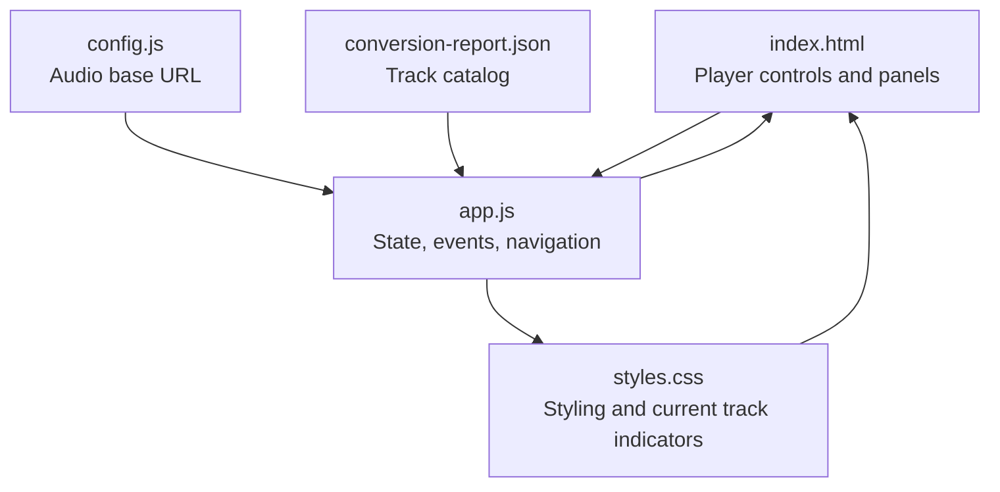
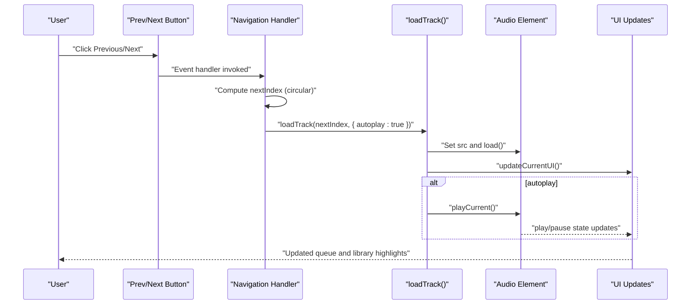
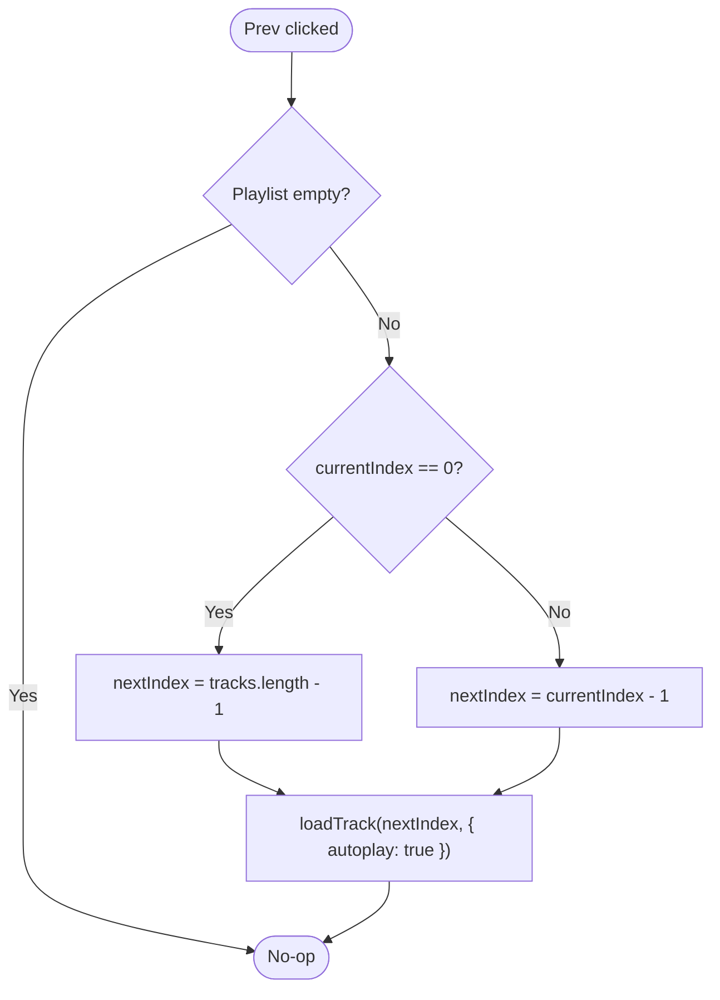
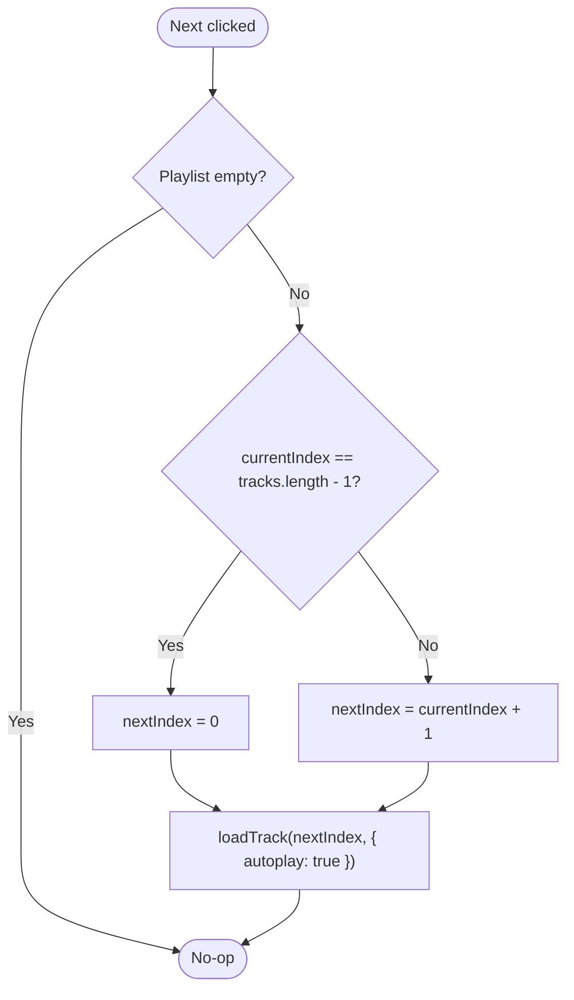
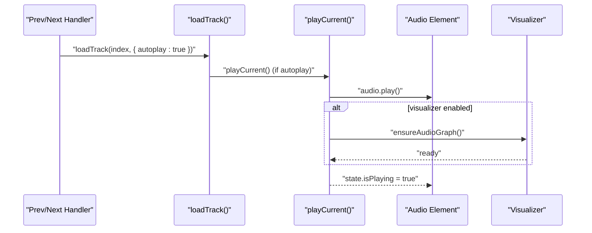
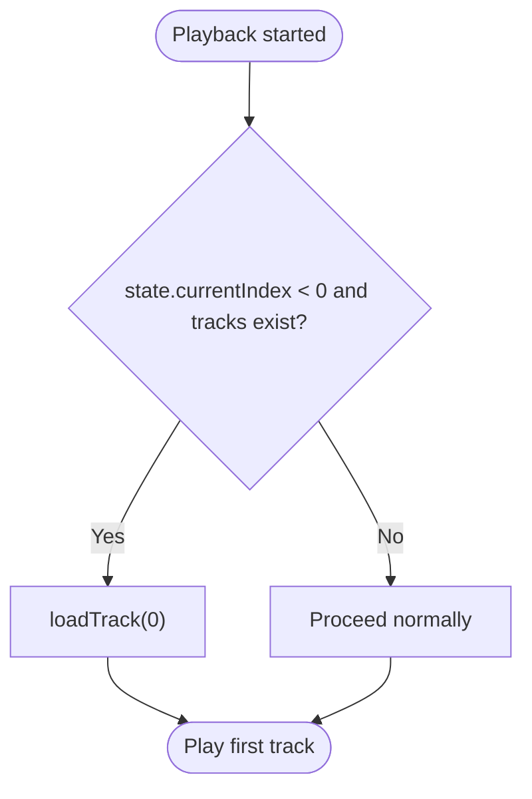
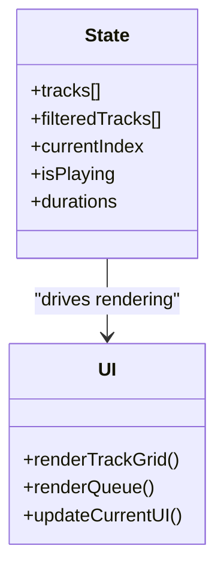
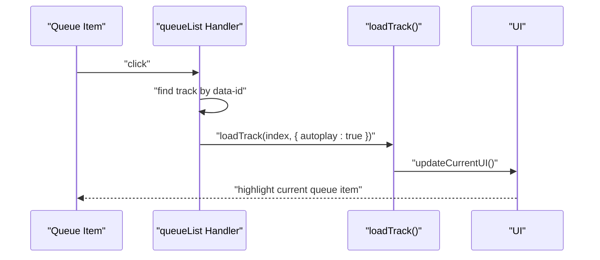
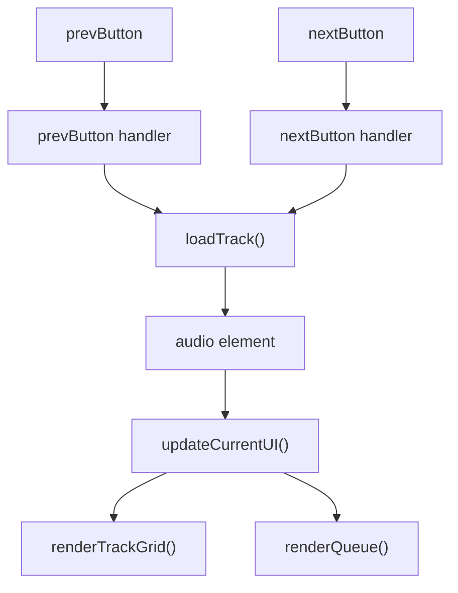

# Playlist Navigation

<cite>
**Referenced Files in This Document**
- [app.js](file://app.js)
- [index.html](file://index.html)
- [styles.css](file://styles.css)
- [config.js](file://config.js)
- [conversion-report.json](file://conversion-report.json)
</cite>

## Table of Contents
1. [Introduction](#introduction)
2. [Project Structure](#project-structure)
3. [Core Components](#core-components)
4. [Architecture Overview](#architecture-overview)
5. [Detailed Component Analysis](#detailed-component-analysis)
6. [Dependency Analysis](#dependency-analysis)
7. [Performance Considerations](#performance-considerations)
8. [Troubleshooting Guide](#troubleshooting-guide)
9. [Conclusion](#conclusion)

## Introduction
This document explains the playlist navigation system, focusing on how the Previous and Next buttons implement circular navigation around playlist boundaries, how index-based navigation cycles through tracks using modulo arithmetic, and how navigation integrates with track loading and autoplay behavior. It also covers how the system handles empty playlists, boundary conditions, and maintains proper UI state during navigation, including integration with the queue panel and current track highlighting.

## Project Structure
The playlist navigation system spans HTML markup, CSS styling, and JavaScript logic. The key elements are:
- HTML elements for the player controls and panels
- CSS classes that visually indicate the current track in the library and queue
- JavaScript state and event handlers that manage navigation, track loading, and UI updates



**Diagram sources**
- [index.html:171-179](file://index.html#L171-L179)
- [app.js:1-590](file://app.js#L1-L590)
- [styles.css:363-366](file://styles.css#L363-L366)
- [config.js:1-7](file://config.js#L1-L7)
- [conversion-report.json:1-317](file://conversion-report.json#L1-L317)

**Section sources**
- [index.html:171-179](file://index.html#L171-L179)
- [app.js:1-590](file://app.js#L1-L590)
- [styles.css:363-366](file://styles.css#L363-L366)
- [config.js:1-7](file://config.js#L1-L7)
- [conversion-report.json:1-317](file://conversion-report.json#L1-L317)

## Core Components
- State management: Tracks array, filtered tracks, current index, playback state, and durations
- Player controls: Previous, Play/Pause, Next buttons
- UI panels: Queue panel with current track highlighting and library grid with current track indicator
- Event bindings: Click handlers for Previous/Next, click handlers for library and queue items, and audio lifecycle events

Key behaviors:
- Circular navigation: Previous wraps from index 0 to last index; Next wraps from last index to index 0
- Index-based navigation: Uses modulo arithmetic to cycle through tracks
- Autoplay during navigation: Navigation triggers track loading with autoplay enabled
- Boundary handling: No-op when playlist is empty; fallback to first track when attempting to play without a current index
- UI synchronization: Updates current track display, queue highlights, and library highlights

**Section sources**
- [app.js:1-590](file://app.js#L1-L590)
- [index.html:171-179](file://index.html#L171-L179)
- [styles.css:363-366](file://styles.css#L363-L366)

## Architecture Overview
The navigation system is event-driven. Clicking Previous or Next triggers a handler that computes the next index using circular logic, loads the corresponding track, and optionally starts playback. The UI updates reflect the new current track in both the queue panel and the library grid.



**Diagram sources**
- [app.js:442-456](file://app.js#L442-L456)
- [app.js:231-254](file://app.js#L231-L254)
- [app.js:256-272](file://app.js#L256-L272)
- [app.js:198-214](file://app.js#L198-L214)

## Detailed Component Analysis

### Previous Button Behavior
- Condition: If the playlist is empty, do nothing
- Circular logic: If the current index is at the first element, wrap to the last element; otherwise decrement by 1
- Action: Load the computed index with autoplay enabled



**Diagram sources**
- [app.js:442-448](file://app.js#L442-L448)

**Section sources**
- [app.js:442-448](file://app.js#L442-L448)

### Next Button Behavior
- Condition: If the playlist is empty, do nothing
- Circular logic: If the current index is at the last element, wrap to the first element; otherwise increment by 1
- Action: Load the computed index with autoplay enabled



**Diagram sources**
- [app.js:450-456](file://app.js#L450-L456)

**Section sources**
- [app.js:450-456](file://app.js#L450-L456)

### Index-Based Navigation and Modulo Arithmetic
While the current implementation uses explicit boundary checks for Previous and Next, the underlying navigation relies on integer indices stored in state. The modulo operator is not explicitly used in the navigation handlers, but the circular behavior is achieved through conditional logic:
- Previous: wraps from 0 to length-1
- Next: wraps from length-1 to 0

This approach is straightforward and readable. An alternative modular approach would compute the next index as:
- nextIndex = (currentIndex ± 1 + tracks.length) % tracks.length

Both approaches yield equivalent results for circular navigation.

**Section sources**
- [app.js:442-456](file://app.js#L442-L456)

### Relationship Between Navigation Actions and Track Loading
- Navigation handlers call loadTrack with autoplay enabled
- loadTrack updates state.currentIndex, sets audio.src, reloads the audio element, resets seek position, and persists the current track ID
- If autoplay is requested, playCurrent is invoked to start playback
- UI updates occur after loadTrack completes, reflecting the new current track in the queue and library grids

```mermaid
sequenceDiagram
participant N as "Navigation Handler"
participant L as "loadTrack()"
participant A as "Audio Element"
participant U as "UI"
N->>L : "loadTrack(index, { autoplay : true })"
L->>L : "state.currentIndex = index"
L->>A : "src = track.src; load()"
L->>U : "updateCurrentUI()"
alt autoplay
L->>A : "playCurrent()"
end
A-->>U : "play/pause state updates"
```

**Diagram sources**
- [app.js:231-254](file://app.js#L231-L254)
- [app.js:256-272](file://app.js#L256-L272)
- [app.js:198-214](file://app.js#L198-L214)

**Section sources**
- [app.js:231-254](file://app.js#L231-L254)
- [app.js:256-272](file://app.js#L256-L272)
- [app.js:198-214](file://app.js#L198-L214)

### Autoplay Behavior During Navigation
- Navigation handlers pass autoplay: true to loadTrack
- loadTrack persists the current time if not preserving it, then updates UI and conditionally calls playCurrent
- playCurrent ensures a valid current index (fallback to first track if needed), attempts to play the audio element, resumes audio graph if enabled, toggles state.isPlaying, and draws the visualizer



**Diagram sources**
- [app.js:256-272](file://app.js#L256-L272)
- [app.js:280-319](file://app.js#L280-L319)
- [app.js:321-359](file://app.js#L321-L359)

**Section sources**
- [app.js:256-272](file://app.js#L256-L272)
- [app.js:280-319](file://app.js#L280-L319)
- [app.js:321-359](file://app.js#L321-L359)

### Handling Empty Playlists and Boundary Conditions
- Empty playlist: Both Previous and Next handlers return early if state.tracks.length is zero
- Fallback to first track: If playCurrent is called while state.currentIndex is negative and tracks exist, it loads the first track
- Last track behavior: When the audio ends, the system programmatically clicks Next to continue playback



**Diagram sources**
- [app.js:256-259](file://app.js#L256-L259)

**Section sources**
- [app.js:442-456](file://app.js#L442-L456)
- [app.js:256-259](file://app.js#L256-L259)
- [app.js:504-506](file://app.js#L504-L506)

### Maintaining Proper UI State During Navigation
- Current track highlighting:
  - Library grid: Each track card checks if its index matches state.currentIndex and applies the is-current class
  - Queue panel: Each queue item checks if its index matches state.currentIndex and applies the is-current class
- Current track display: updateCurrentUI updates the now playing card, timeline, and spotlight
- Duration updates: loadedmetadata updates track duration and UI timing displays



**Diagram sources**
- [app.js:198-214](file://app.js#L198-L214)
- [app.js:133-156](file://app.js#L133-L156)
- [app.js:158-171](file://app.js#L158-L171)

**Section sources**
- [app.js:133-156](file://app.js#L133-L156)
- [app.js:158-171](file://app.js#L158-L171)
- [app.js:198-214](file://app.js#L198-L214)
- [styles.css:363-366](file://styles.css#L363-L366)
- [styles.css:476-479](file://styles.css#L476-L479)

### Integration with Queue Panel and Current Track Highlighting
- Queue panel renders up to a fixed number of tracks and highlights the current one
- Clicking a queue item triggers loadTrack with autoplay, enabling seamless navigation from the queue
- The queue list uses data-id attributes to map clicks back to track IDs



**Diagram sources**
- [app.js:402-410](file://app.js#L402-L410)
- [app.js:158-171](file://app.js#L158-L171)

**Section sources**
- [app.js:402-410](file://app.js#L402-L410)
- [app.js:158-171](file://app.js#L158-L171)

## Dependency Analysis
The navigation system depends on:
- HTML elements for Previous, Next, Play/Pause, and queue/list containers
- CSS classes for current track highlighting
- JavaScript state and event handlers for navigation and UI updates
- Audio element lifecycle events for playback transitions



**Diagram sources**
- [index.html:171-179](file://index.html#L171-L179)
- [app.js:442-456](file://app.js#L442-L456)
- [app.js:231-254](file://app.js#L231-L254)
- [app.js:198-214](file://app.js#L198-L214)
- [app.js:133-156](file://app.js#L133-L156)
- [app.js:158-171](file://app.js#L158-L171)

**Section sources**
- [index.html:171-179](file://index.html#L171-L179)
- [app.js:442-456](file://app.js#L442-L456)
- [app.js:231-254](file://app.js#L231-L254)
- [app.js:198-214](file://app.js#L198-L214)
- [app.js:133-156](file://app.js#L133-L156)
- [app.js:158-171](file://app.js#L158-L171)

## Performance Considerations
- Rendering cost: renderTrackGrid and renderQueue iterate over the tracks array; for large catalogs, consider virtualization or limiting rendered items
- Event listeners: Multiple event listeners are attached; ensure they are efficient and avoid unnecessary DOM queries
- Autoplay policy: Modern browsers restrict autoplay; the system requests playback on user interaction, which is compliant and reliable

## Troubleshooting Guide
Common issues and resolutions:
- Previous/Next does nothing:
  - Verify that the playlist is not empty; handlers return early if tracks.length is zero
- Current track not highlighted:
  - Ensure state.currentIndex is set correctly by loadTrack and that renderTrackGrid/renderQueue use this index
- Autoplay fails:
  - Confirm that playCurrent is called after loadTrack and that the browser allows autoplay on user gesture
- Audio ends unexpectedly:
  - The ended event handler clicks Next; ensure the playlist has more tracks or handle the end-of-playlist state appropriately

**Section sources**
- [app.js:442-456](file://app.js#L442-L456)
- [app.js:198-214](file://app.js#L198-L214)
- [app.js:504-506](file://app.js#L504-L506)

## Conclusion
The playlist navigation system provides robust circular navigation with clear boundary handling, integrates seamlessly with track loading and autoplay, and maintains consistent UI state across the queue panel and library grid. The design balances simplicity and reliability, ensuring smooth user experience even with edge cases like empty playlists and boundary conditions.