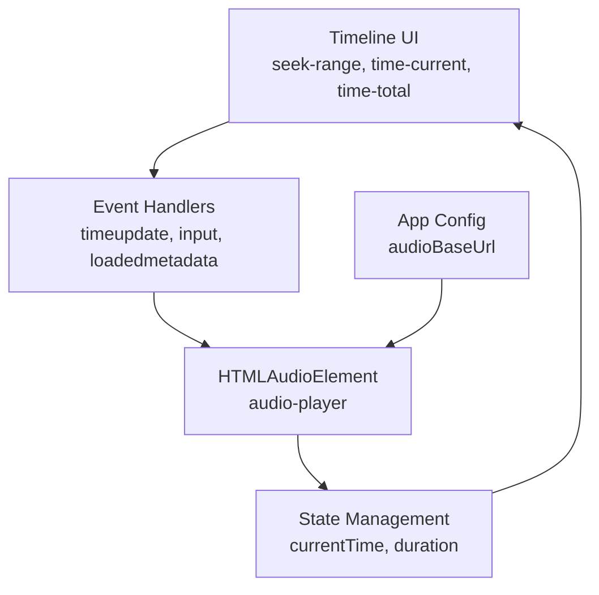
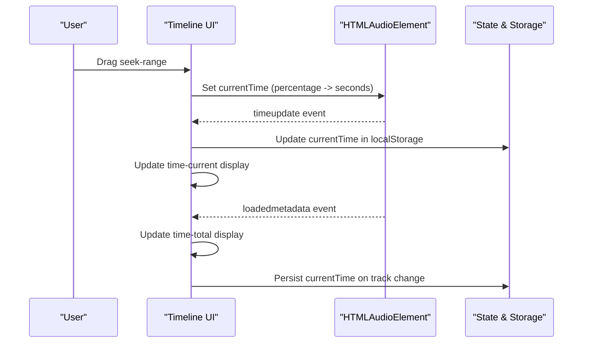
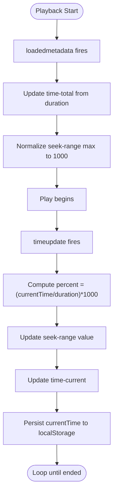
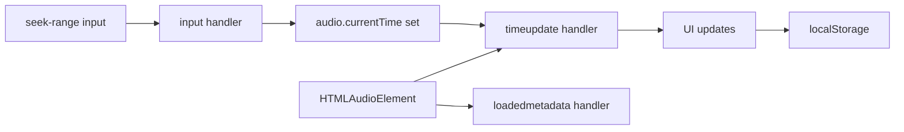

# Seeking and Timeline Control

<cite>
**Referenced Files in This Document**
- [index.html](file://index.html)
- [app.js](file://app.js)
- [config.js](file://config.js)
- [styles.css](file://styles.css)
</cite>

## Table of Contents
1. [Introduction](#introduction)
2. [Project Structure](#project-structure)
3. [Core Components](#core-components)
4. [Architecture Overview](#architecture-overview)
5. [Detailed Component Analysis](#detailed-component-analysis)
6. [Dependency Analysis](#dependency-analysis)
7. [Performance Considerations](#performance-considerations)
8. [Troubleshooting Guide](#troubleshooting-guide)
9. [Conclusion](#conclusion)

## Introduction
This document explains the seeking and timeline control system that powers audio playback navigation in the MusicLab-IA web player. It covers how the timeupdate event updates the seek range slider and current time display, how the seekRange input enables user scrubbing, and how timeline synchronization is maintained between the HTMLAudioElement and visual controls. It also documents the conversion between percentage values and actual time positions, the relationship between seek events, audio positioning, and UI state updates, and addresses edge cases such as duration loading and time formatting.

## Project Structure
The seeking and timeline control system spans three primary files:
- index.html: Declares the audio element and timeline UI (seek range slider and time displays).
- app.js: Implements event handlers, state management, and synchronization logic.
- styles.css: Provides styling for the timeline controls and visual feedback.

**Diagram sources**
- [index.html:182-186](file://index.html#L182-L186)
- [app.js:11-39](file://app.js#L11-L39)
- [app.js:458-519](file://app.js#L458-L519)
- [config.js:1-7](file://config.js#L1-L7)

**Section sources**
- [index.html:182-186](file://index.html#L182-L186)
- [app.js:11-39](file://app.js#L11-L39)
- [config.js:1-7](file://config.js#L1-L7)

## Core Components
- Audio element: The central playback engine that emits timeupdate and loadedmetadata events and exposes currentTime and duration.
- Seek range input: An HTMLInputElement of type range that reflects the current playback position as a percentage scale.
- Current time display: A span element that shows the formatted current playback time.
- Total time display: A span element that shows the formatted track duration.
- Event handlers: Bind to audio events and seek range input to synchronize UI and audio state.

Key implementation references:
- Timeline UI elements: [index.html:182-186](file://index.html#L182-L186)
- Audio element: [index.html:242](file://index.html#L242)
- Event bindings: [app.js:458-519](file://app.js#L458-L519)
- Time formatting: [app.js:70-78](file://app.js#L70-L78)

**Section sources**
- [index.html:182-186](file://index.html#L182-L186)
- [index.html:242](file://index.html#L242)
- [app.js:458-519](file://app.js#L458-L519)
- [app.js:70-78](file://app.js#L70-L78)

## Architecture Overview
The timeline control system follows a reactive model:
- Audio events drive UI updates (timeupdate updates the slider and current time).
- User interactions drive audio changes (seek range input sets currentTime).
- Duration metadata drives total time display and normalization of seek values.

**Diagram sources**
- [app.js:477-485](file://app.js#L477-L485)
- [app.js:458-475](file://app.js#L458-L475)
- [app.js:508-513](file://app.js#L508-L513)
- [app.js:231-254](file://app.js#L231-L254)

## Detailed Component Analysis

### Timeline Synchronization Model
The system maintains synchronization through two primary mechanisms:
- Audio-driven updates: timeupdate updates the seek range and current time display.
- Metadata-driven updates: loadedmetadata updates the total time display and duration-backed fallbacks.

**Diagram sources**
- [app.js:458-475](file://app.js#L458-L475)
- [app.js:477-485](file://app.js#L477-L485)
- [app.js:70-78](file://app.js#L70-L78)

**Section sources**
- [app.js:458-475](file://app.js#L458-L475)
- [app.js:477-485](file://app.js#L477-L485)
- [app.js:70-78](file://app.js#L70-L78)

### Timeupdate Event Handling
The timeupdate handler ensures the UI reflects real-time playback progress:
- Validates duration is finite and positive.
- Converts currentTime to a 0–1000 scale for the seek range.
- Updates the current time display.
- Persists currentTime to localStorage for continuity.

Implementation references:
- Event binding: [app.js:477-485](file://app.js#L477-L485)
- Time formatting: [app.js:70-78](file://app.js#L70-L78)
- Persistence: [app.js:484](file://app.js#L484)

Edge cases addressed:
- Undefined or zero duration: handler returns early to prevent invalid calculations.
- Non-finite currentTime: handled by the formatting function returning a default.

**Section sources**
- [app.js:477-485](file://app.js#L477-L485)
- [app.js:70-78](file://app.js#L70-L78)

### Seek Range Slider Behavior
The seek range input enables user-driven scrubbing:
- Input event reads the slider’s value (0–1000 scale).
- Converts the slider value to a time fraction and sets audio.currentTime.
- Prevents scrubbing when duration is unavailable.

Implementation references:
- Event binding: [app.js:508-513](file://app.js#L508-L513)
- Slider element: [index.html:184](file://index.html#L184)

Edge cases addressed:
- Undefined or zero duration: input handler returns early.
- Out-of-range values: audio.currentTime is clamped by the browser.

**Section sources**
- [app.js:508-513](file://app.js#L508-L513)
- [index.html:184](file://index.html#L184)

### Percentage-to-Time Conversion
The system uses a 0–1000 scale for the seek range to improve precision and responsiveness:
- Conversion from time to slider: value = round((currentTime / duration) × 1000)
- Conversion from slider to time: currentTime = (value / 1000) × duration

Implementation references:
- Slider update: [app.js:482](file://app.js#L482)
- Slider input: [app.js:512](file://app.js#L512)

Precision and rounding:
- Rounding to nearest integer on the 0–1000 scale prevents jitter and ensures smooth scrubbing.

**Section sources**
- [app.js:482](file://app.js#L482)
- [app.js:512](file://app.js#L512)

### Timeline UI Elements and Styling
The timeline consists of:
- Current time display: [index.html:183](file://index.html#L183)
- Seek range input: [index.html:184](file://index.html#L184)
- Total time display: [index.html:185](file://index.html#L185)

Styling considerations:
- Full-width sliders: [styles.css:325-335](file://styles.css#L325-L335)
- Accent color for sliders: [styles.css:334](file://styles.css#L334)
- Timeline layout: [styles.css:446-455](file://styles.css#L446-L455)

**Section sources**
- [index.html:183-185](file://index.html#L183-L185)
- [styles.css:325-335](file://styles.css#L325-L335)
- [styles.css:446-455](file://styles.css#L446-L455)

### Relationship Between Seek Events, Audio Positioning, and UI State
- Seek events originate from user input or programmatic updates.
- Audio positioning is updated via currentTime, which triggers timeupdate.
- UI state updates include slider value, current time display, and persisted storage.

Implementation references:
- Programmatic seek: [app.js:512](file://app.js#L512)
- UI updates on timeupdate: [app.js:482-484](file://app.js#L482-L484)
- Storage persistence: [app.js:484](file://app.js#L484)

**Section sources**
- [app.js:512](file://app.js#L512)
- [app.js:482-484](file://app.js#L482-L484)

### Edge Cases and Robustness
Duration loading:
- Initial duration may be unknown; the system falls back to track duration and updates displays when metadata loads.
- References: [app.js:458-475](file://app.js#L458-L475), [app.js:209](file://app.js#L209)

Zero or infinite duration:
- Handlers check for finite, positive duration before performing calculations.
- References: [app.js:477-480](file://app.js#L477-L480), [app.js:509-511](file://app.js#L509-L511)

Time formatting:
- Ensures consistent MM:SS display and handles invalid inputs gracefully.
- Reference: [app.js:70-78](file://app.js#L70-L78)

Storage continuity:
- Preserves currentTime across sessions and track changes.
- References: [app.js:471-474](file://app.js#L471-L474), [app.js:244-246](file://app.js#L244-L246)

**Section sources**
- [app.js:458-475](file://app.js#L458-L475)
- [app.js:477-480](file://app.js#L477-L480)
- [app.js:509-511](file://app.js#L509-L511)
- [app.js:70-78](file://app.js#L70-L78)
- [app.js:471-474](file://app.js#L471-L474)
- [app.js:244-246](file://app.js#L244-L246)

## Dependency Analysis
The timeline control system depends on:
- HTMLAudioElement for playback and timing events.
- DOM elements for UI representation and user interaction.
- Local storage for persistence of playback state.
- Formatting utilities for consistent time display.

**Diagram sources**
- [app.js:458-519](file://app.js#L458-L519)
- [index.html:184](file://index.html#L184)

**Section sources**
- [app.js:458-519](file://app.js#L458-L519)
- [index.html:184](file://index.html#L184)

## Performance Considerations
- Event throttling: timeupdate fires frequently; keep UI updates minimal and efficient.
- Precision vs. responsiveness: The 0–1000 scale balances precision and smoothness.
- Storage writes: Persisting currentTime on each timeupdate is lightweight but should avoid excessive writes in other contexts.
- Metadata prefetch: Preloading durations reduces UI flicker and improves perceived responsiveness.

References:
- Slider scale: [app.js:482](file://app.js#L482), [app.js:512](file://app.js#L512)
- Prefetch durations: [app.js:556-576](file://app.js#L556-L576)

**Section sources**
- [app.js:482](file://app.js#L482)
- [app.js:512](file://app.js#L512)
- [app.js:556-576](file://app.js#L556-L576)

## Troubleshooting Guide
Common issues and resolutions:
- Slider does not move during playback:
  - Verify duration is known before updating the slider.
  - Confirm timeupdate handler executes and seek-range element exists.
  - References: [app.js:477-480](file://app.js#L477-L480), [app.js:482](file://app.js#L482)

- Scrubbing has no effect:
  - Ensure input handler reads the slider value and sets audio.currentTime.
  - Confirm duration is finite and positive.
  - References: [app.js:508-513](file://app.js#L508-L513), [app.js:509-511](file://app.js#L509-L511)

- Total time shows zero:
  - loadedmetadata must fire and update time-total.
  - References: [app.js:458-475](file://app.js#L458-L475), [app.js:209](file://app.js#L209)

- Time formatting anomalies:
  - Ensure formatTime receives finite seconds.
  - References: [app.js:70-78](file://app.js#L70-L78)

- Playback resumes at wrong position:
  - Confirm stored time is read and clamped to duration.
  - References: [app.js:471-474](file://app.js#L471-L474)

**Section sources**
- [app.js:477-480](file://app.js#L477-L480)
- [app.js:482](file://app.js#L482)
- [app.js:508-513](file://app.js#L508-L513)
- [app.js:509-511](file://app.js#L509-L511)
- [app.js:458-475](file://app.js#L458-L475)
- [app.js:209](file://app.js#L209)
- [app.js:70-78](file://app.js#L70-L78)
- [app.js:471-474](file://app.js#L471-L474)

## Conclusion
The seeking and timeline control system integrates tightly with the HTMLAudioElement to provide responsive, synchronized playback navigation. By converting between percentage-based slider values and actual time positions, and by persisting state across sessions, the system delivers a robust and user-friendly experience. Proper handling of duration loading and edge cases ensures reliability across diverse audio assets.