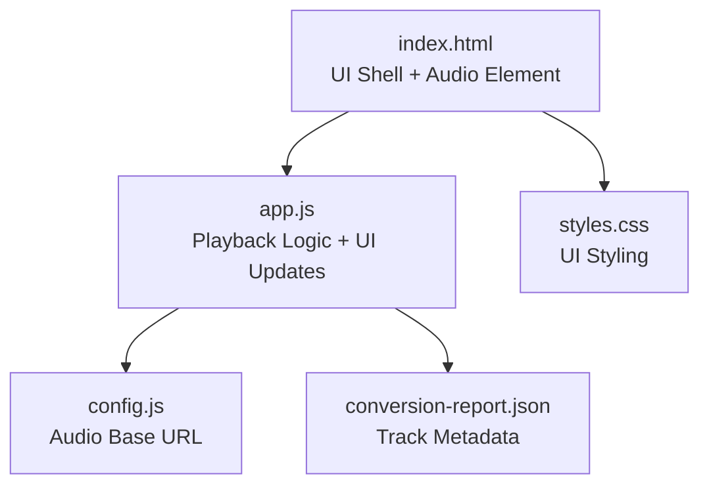
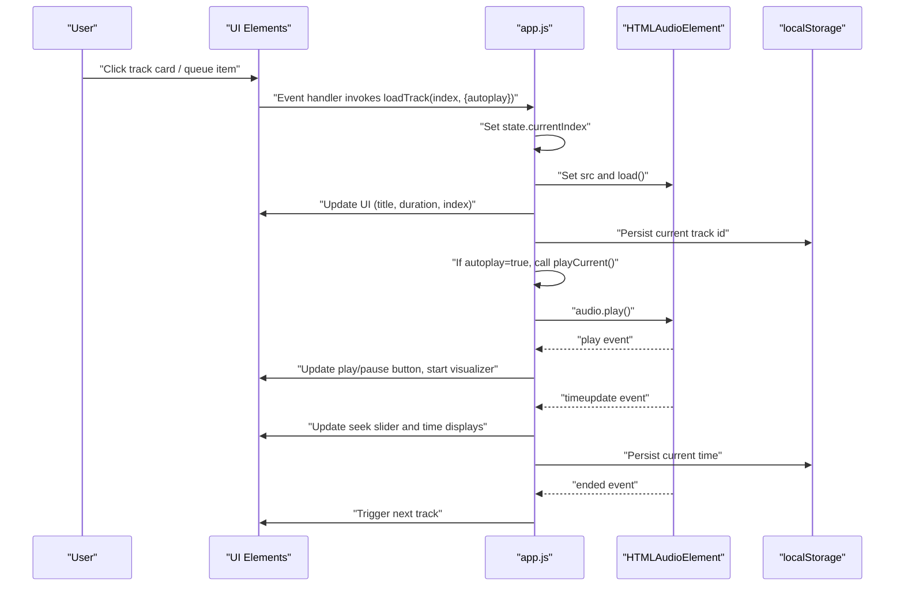
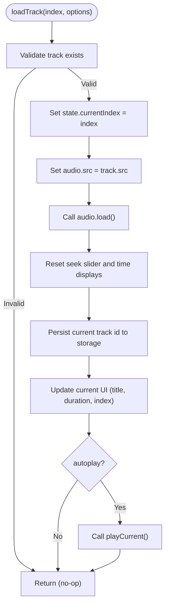
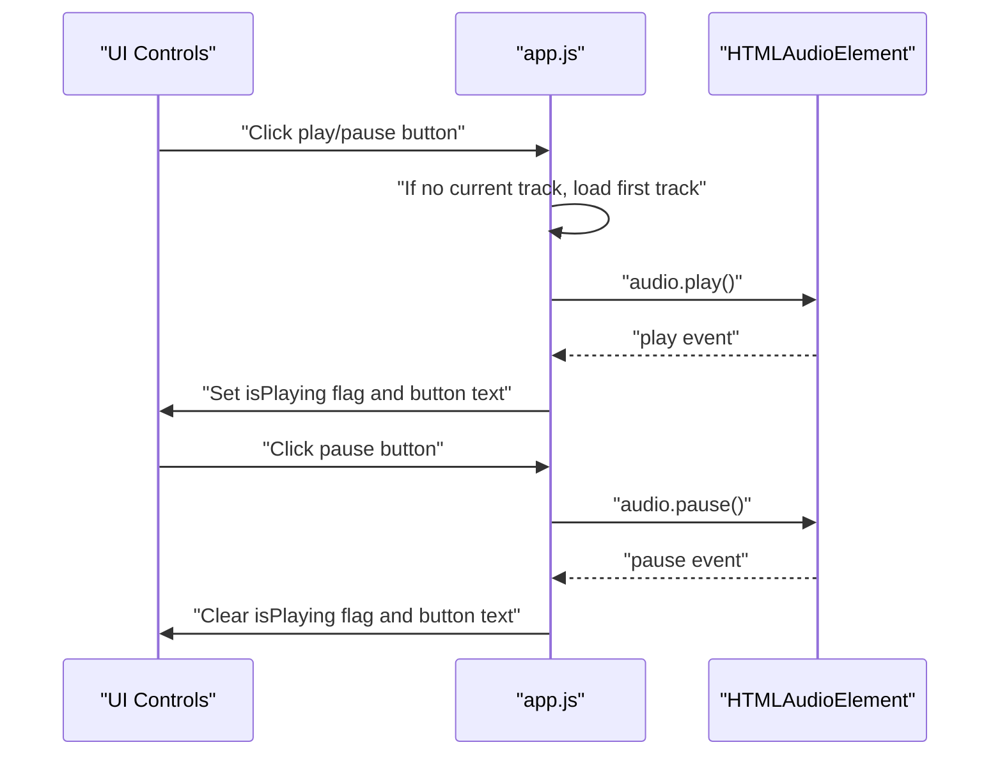
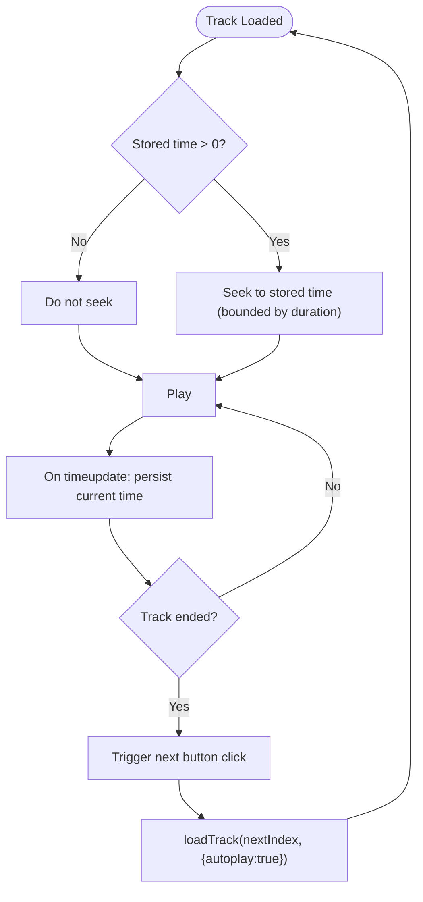
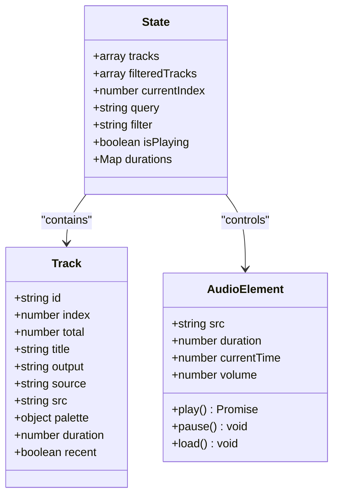
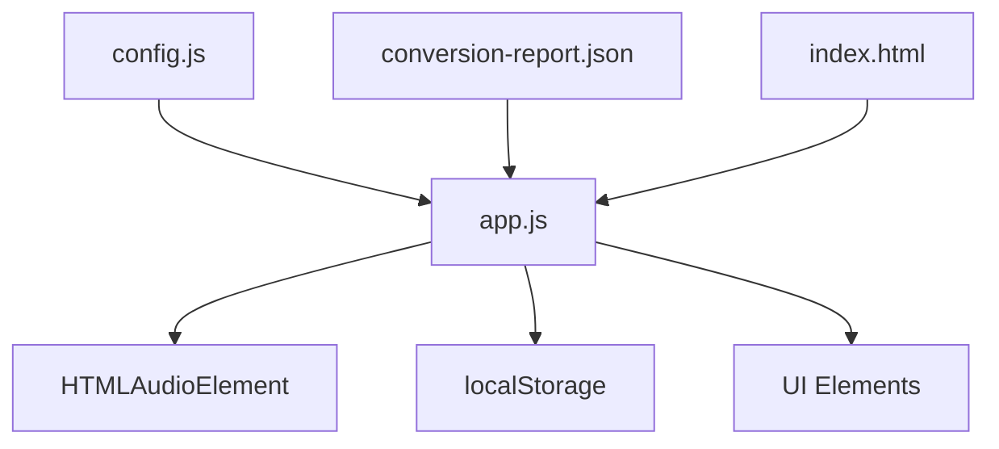

# Track Loading and Playback

<cite>
**Referenced Files in This Document**
- [index.html](file://index.html)
- [app.js](file://app.js)
- [config.js](file://config.js)
- [conversion-report.json](file://conversion-report.json)
- [styles.css](file://styles.css)
</cite>

## Table of Contents
1. [Introduction](#introduction)
2. [Project Structure](#project-structure)
3. [Core Components](#core-components)
4. [Architecture Overview](#architecture-overview)
5. [Detailed Component Analysis](#detailed-component-analysis)
6. [Dependency Analysis](#dependency-analysis)
7. [Performance Considerations](#performance-considerations)
8. [Troubleshooting Guide](#troubleshooting-guide)
9. [Conclusion](#conclusion)

## Introduction
This document explains the track loading and playback functionality of the MusicLab-IA application. It focuses on how tracks are selected, loaded, and played, how the audio element state is managed, and how UI state is synchronized with playback operations. It also covers the track loading workflow from catalog selection to audio element initialization, track transitions, preservation of playback position, and the relationship between track objects, audio sources, and UI updates.

## Project Structure
The application consists of a minimal HTML shell, a JavaScript runtime orchestrating playback, a configuration module, and a static catalog of tracks. Styles define the UI layout and visual themes.

**Diagram sources**
- [index.html:242](file://index.html#L242)
- [app.js:11](file://app.js#L11)
- [config.js:1](file://config.js#L1)
- [conversion-report.json:1](file://conversion-report.json#L1)
- [styles.css:1](file://styles.css#L1)

**Section sources**
- [index.html:1-318](file://index.html#L1-L318)
- [app.js:1-590](file://app.js#L1-L590)
- [config.js:1-7](file://config.js#L1-L7)
- [conversion-report.json:1-317](file://conversion-report.json#L1-L317)
- [styles.css:1-543](file://styles.css#L1-L543)

## Core Components
- State management: Tracks, filters, current index, playback state, and durations.
- Audio element: Single HTMLAudioElement used for playback.
- UI elements: Grid of tracks, queue list, now playing panel, controls, and visualizer.
- Event bindings: Click handlers for track selection, queue navigation, and transport controls; audio lifecycle listeners for metadata, time updates, play/pause, errors, and ended events.
- Configuration: Audio base URL for resolving track sources.

Key functions and responsibilities:
- loadTrack(index, options): Selects a track, assigns audio source, resets UI, and optionally starts playback.
- playCurrent(): Starts playback for the current track or loads the first track if none is selected.
- pauseCurrent(): Pauses playback and updates UI.
- restorePlayerState(): Restores volume, current track, and optionally playback position from persisted storage.
- prefetchDurations(): Preloads track durations for responsive UI rendering.
- Event-driven UI updates: loadedmetadata, timeupdate, play, pause, error, ended.

**Section sources**
- [app.js:1-590](file://app.js#L1-L590)

## Architecture Overview
The playback pipeline integrates UI selection, state updates, and audio element lifecycle. The flow begins with catalog loading, continues with track selection and loading, and ends with playback and UI synchronization.

**Diagram sources**
- [app.js:231-254](file://app.js#L231-L254)
- [app.js:256-272](file://app.js#L256-L272)
- [app.js:274-278](file://app.js#L274-L278)
- [app.js:384-519](file://app.js#L384-L519)

## Detailed Component Analysis

### Track Loading Workflow
The loadTrack function coordinates track selection, source assignment, UI reset, and optional autoplay.

Behavior highlights:
- Track selection sets the global current index and ensures the audio element switches to the new source.
- The seek slider is reset to zero and time displays are refreshed.
- The current track identifier is persisted so the player can resume playback on reload.
- Autoplay behavior is controlled by the autoplay option; if true, playCurrent is invoked immediately after loading.

**Diagram sources**
- [app.js:231-254](file://app.js#L231-L254)

**Section sources**
- [app.js:231-254](file://app.js#L231-L254)

### Playback Control Functions
playCurrent and pauseCurrent manage the audio element’s state and reflect changes in the UI.

Autoplay behavior:
- If playCurrent is called while no track is selected, it automatically loads the first track and attempts to play it.

Error handling:
- Audio errors are captured and surfaced to the UI as a fatal error state, disabling interactive lists and updating the spotlight description.

**Diagram sources**
- [app.js:256-272](file://app.js#L256-L272)
- [app.js:274-278](file://app.js#L274-L278)
- [app.js:499-502](file://app.js#L499-L502)

**Section sources**
- [app.js:256-278](file://app.js#L256-L278)
- [app.js:499-502](file://app.js#L499-L502)

### Track Transitions and Position Preservation
The system supports seamless transitions between tracks and preserves playback position across sessions.

- Transition logic:
  - Previous/Next buttons compute the next index with wrap-around behavior and trigger loadTrack with autoplay enabled.
  - On track ended, the system triggers the next button click to advance to the next track.

- Position preservation:
  - On loadedmetadata, the system reads the stored current time and seeks to it (with a safety floor to avoid immediate end-of-track).
  - During playback, timeupdate persists the current time to storage.
  - On loadTrack, if preserveTime is false, the stored time is reset to zero; otherwise, the stored time is respected.

- Current track restoration:
  - On startup, restorePlayerState restores volume, selects the previously playing track (or the first), and loads it with preserveTime to resume playback.

**Diagram sources**
- [app.js:458-475](file://app.js#L458-L475)
- [app.js:477-485](file://app.js#L477-L485)
- [app.js:504-506](file://app.js#L504-L506)
- [app.js:442-456](file://app.js#L442-L456)
- [app.js:544-554](file://app.js#L544-L554)

**Section sources**
- [app.js:458-475](file://app.js#L458-L475)
- [app.js:477-485](file://app.js#L477-L485)
- [app.js:504-506](file://app.js#L504-L506)
- [app.js:442-456](file://app.js#L442-L456)
- [app.js:544-554](file://app.js#L544-L554)

### Relationship Between Track Objects, Audio Sources, and UI State
- Track objects:
  - Built from catalog data with computed fields: id, index, total, title, output, source, src, palette, duration, recent.
  - The src field is constructed from the configured audio base URL and the track’s output filename.

- Audio sources:
  - The audio element’s src is set to the selected track’s src, and load() is invoked to initialize playback.

- UI state updates:
  - Current track metadata (title, file, duration, index) is reflected in the now playing panel.
  - The current track is highlighted in both the grid and queue views.
  - The visualizer is started upon successful play and paused on pause.

**Diagram sources**
- [app.js:91-104](file://app.js#L91-L104)
- [app.js:1-9](file://app.js#L1-L9)
- [app.js:11](file://app.js#L11)

**Section sources**
- [app.js:91-104](file://app.js#L91-L104)
- [app.js:1-9](file://app.js#L1-L9)
- [app.js:11](file://app.js#L11)

### UI Interaction and Event Bindings
- Track selection:
  - Clicking a track card or queue item triggers loadTrack with autoplay enabled.

- Transport controls:
  - Previous/Next buttons compute the next index with wrap-around and load the new track with autoplay.
  - Play/Pause toggles playback state and updates the button text.

- Timeline and volume:
  - Seek slider updates audio.currentTime proportionally to duration.
  - Volume slider updates audio.volume and persists to storage.

- Lifecycle events:
  - loadedmetadata: populate duration, update UI, and optionally seek to stored time.
  - timeupdate: update seek slider and time displays, persist current time.
  - play/pause: update state and visualizer.
  - error: render a fatal error state.
  - ended: advance to next track.

**Section sources**
- [app.js:392-410](file://app.js#L392-L410)
- [app.js:442-456](file://app.js#L442-L456)
- [app.js:426-432](file://app.js#L426-L432)
- [app.js:458-475](file://app.js#L458-L475)
- [app.js:477-485](file://app.js#L477-L485)
- [app.js:487-497](file://app.js#L487-L497)
- [app.js:499-502](file://app.js#L499-L502)
- [app.js:504-506](file://app.js#L504-L506)
- [app.js:508-513](file://app.js#L508-L513)
- [app.js:515-518](file://app.js#L515-L518)

### Catalog Loading and Initialization
- Catalog data:
  - Embedded in index.html or fetched from conversion-report.json.
  - Tracks are mapped to normalized track objects with computed src and palette.

- UI initialization:
  - Hero stats, filtered track grid, queue list, and spotlight are rendered.
  - restorePlayerState restores volume, selects the last played track, and loads it with position preservation.

- Duration prefetch:
  - A temporary audio element probes each track’s metadata to prefill durations for responsive UI.

**Section sources**
- [index.html:243-315](file://index.html#L243-L315)
- [app.js:521-542](file://app.js#L521-L542)
- [app.js:544-554](file://app.js#L544-L554)
- [app.js:556-576](file://app.js#L556-L576)

## Dependency Analysis
The playback subsystem depends on:
- UI elements for user interaction and visual feedback.
- Audio element for media playback and event signaling.
- Local storage for persistence of volume, current track, and current time.
- Configuration for audio base URL resolution.
- Catalog data for track metadata and source URLs.

**Diagram sources**
- [config.js:1](file://config.js#L1)
- [conversion-report.json:1](file://conversion-report.json#L1)
- [index.html:242](file://index.html#L242)
- [app.js:11](file://app.js#L11)

**Section sources**
- [config.js:1-7](file://config.js#L1-L7)
- [conversion-report.json:1-317](file://conversion-report.json#L1-L317)
- [index.html:242](file://index.html#L242)
- [app.js:11](file://app.js#L11)

## Performance Considerations
- Preloading durations: Prefetching durations avoids blocking UI updates until metadata is available.
- Efficient seeking: Using a range input for seeking reduces DOM updates and improves responsiveness.
- Visualizer overhead: The visualizer is disabled by default; enabling it adds CPU/GPU cost and requires audio graph setup.
- Network efficiency: The audio base URL is configurable, allowing hosting on CDNs or cloud storage for fast delivery.

[No sources needed since this section provides general guidance]

## Troubleshooting Guide
Common issues and remedies:
- Audio fails to load:
  - Check network connectivity and CORS settings for the audio base URL.
  - Verify the track src is correct and the file exists at the configured endpoint.
  - Inspect the error listener for detailed failure messages.

- Playback does not start:
  - Ensure autoplay is requested and the browser allows programmatic playback.
  - Confirm the audio element is not suspended; resume the audio context if needed.

- Position not preserved:
  - Verify that stored time is greater than zero and within track bounds.
  - Ensure timeupdate events are firing and current time is being persisted.

- UI not reflecting current track:
  - Confirm that updateCurrentUI is called after loading a track.
  - Check that the current index is correctly set and used to highlight cards.

**Section sources**
- [app.js:499-502](file://app.js#L499-L502)
- [app.js:477-485](file://app.js#L477-L485)
- [app.js:256-272](file://app.js#L256-L272)
- [app.js:198-214](file://app.js#L198-L214)

## Conclusion
The MusicLab-IA playback system integrates a clean separation of concerns: state management, audio element control, and UI synchronization. The loadTrack function centralizes track selection and source assignment, while playCurrent and pauseCurrent manage playback state and visual feedback. The system preserves playback position across sessions, supports smooth transitions, and maintains UI consistency through event-driven updates. With configuration-driven audio sourcing and preloaded durations, the application delivers a responsive and reliable listening experience.