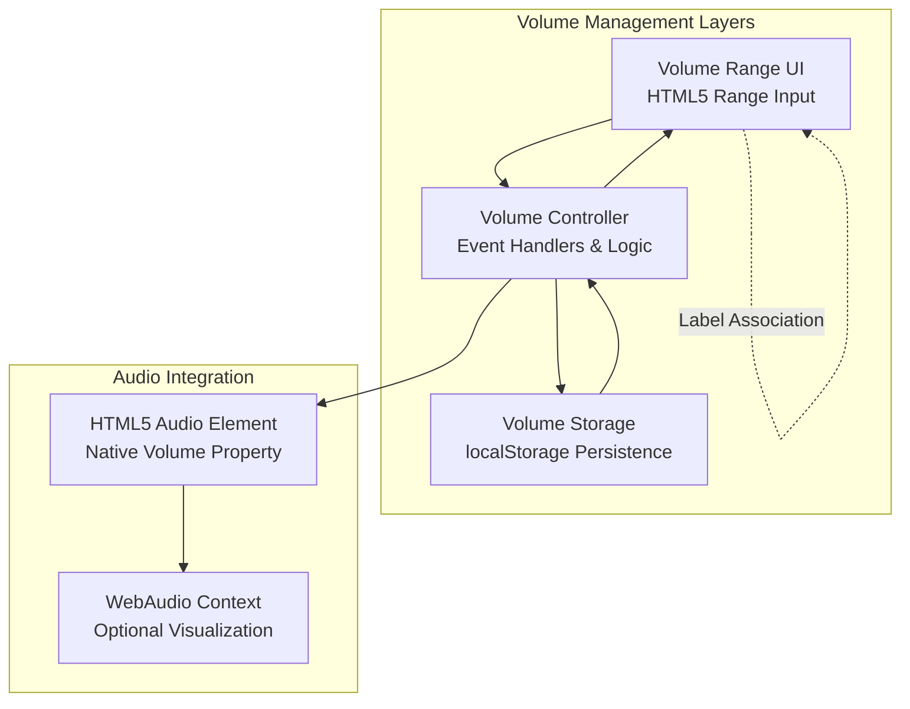
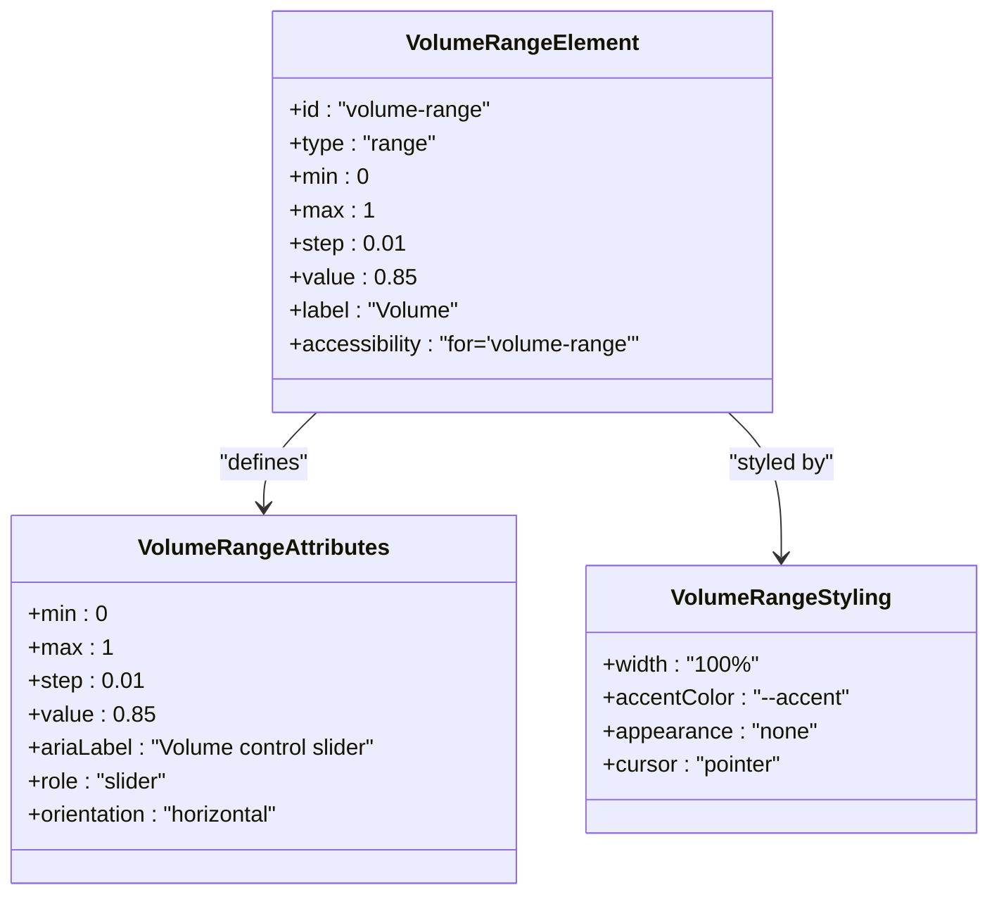
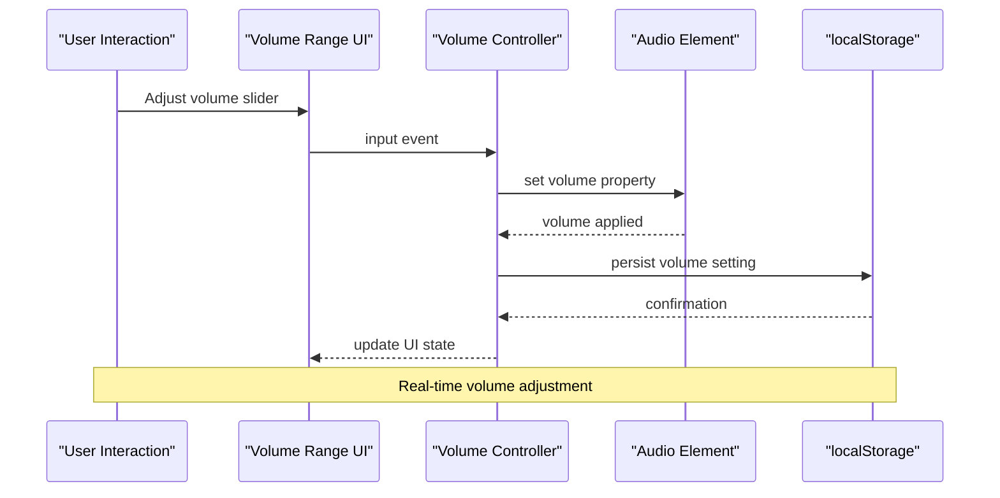
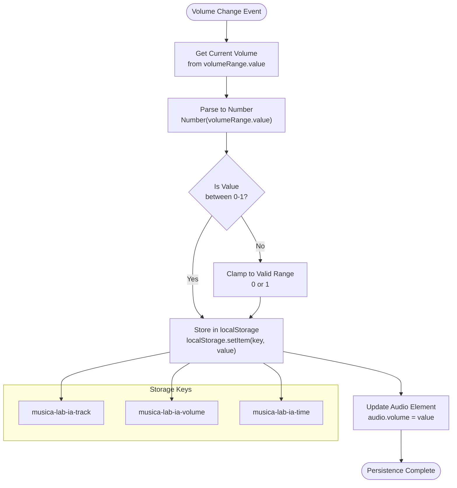
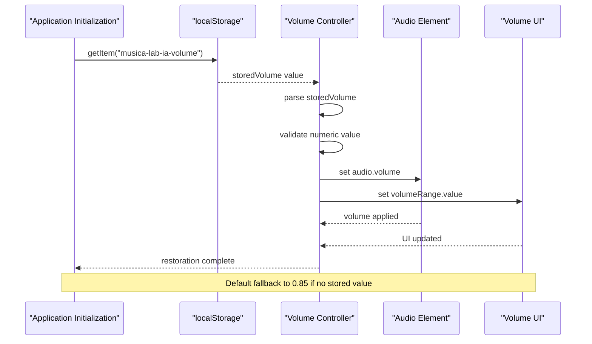
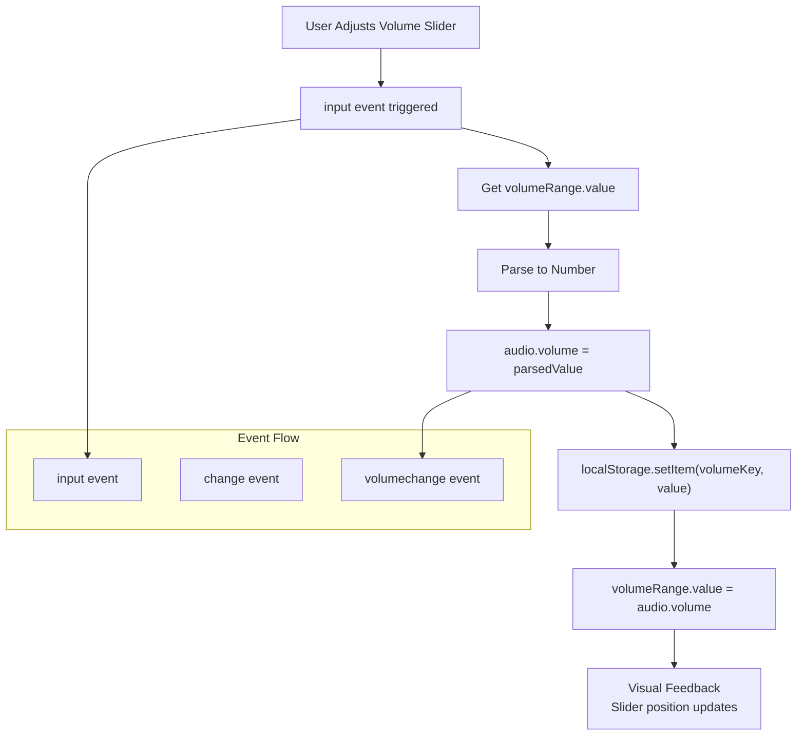

# Volume Management

<cite>
**Referenced Files in This Document**
- [index.html](file://index.html)
- [app.js](file://app.js)
- [styles.css](file://styles.css)
- [config.js](file://config.js)
</cite>

## Table of Contents
1. [Introduction](#introduction)
2. [Volume Control Architecture](#volume-control-architecture)
3. [Volume Range Element](#volume-range-element)
4. [Audio Element Integration](#audio-element-integration)
5. [Volume Persistence Mechanism](#volume-persistence-mechanism)
6. [Initial Volume Restoration](#initial-volume-restoration)
7. [Real-time Volume Changes](#real-time-volume-changes)
8. [Storage Keys and State Management](#storage-keys-and-state-management)
9. [UI Control Implementation](#ui-control-implementation)
10. [Performance Considerations](#performance-considerations)
11. [Troubleshooting Guide](#troubleshooting-guide)
12. [Conclusion](#conclusion)

## Introduction

The MusicLab-IA volume management system provides a sophisticated audio control interface that allows users to adjust playback volume with persistent preferences across browser sessions. This system integrates seamlessly with the HTML5 audio element through a range input control, maintaining user preferences using localStorage for seamless session continuity.

The volume management system consists of three primary components: the visual volume control element, the audio element integration layer, and the persistence mechanism that maintains user preferences across sessions. This implementation ensures that users can customize their listening experience while maintaining their preferred volume settings regardless of browser restarts or page reloads.

## Volume Control Architecture

The volume management system follows a client-side architecture that separates concerns between UI presentation, audio manipulation, and state persistence. The system operates through a three-layer approach:



**Diagram sources**
- [index.html:187-198](file://index.html#L187-L198)
- [app.js:515-518](file://app.js#L515-L518)
- [app.js:544-548](file://app.js#L544-L548)

The architecture ensures loose coupling between UI presentation and audio functionality while maintaining tight integration with the browser's native audio capabilities. The system leverages the HTML5 range input element for intuitive user interaction while utilizing the native audio element's volume property for precise audio control.

**Section sources**
- [index.html:187-198](file://index.html#L187-L198)
- [app.js:515-518](file://app.js#L515-L518)
- [app.js:544-548](file://app.js#L544-L548)

## Volume Range Element

The volume control is implemented as an HTML5 range input element with specific attributes designed for audio volume control:



**Diagram sources**
- [index.html:190-197](file://index.html#L190-L197)
- [styles.css:326-335](file://styles.css#L326-L335)

The volume range element features a carefully designed specification that ensures optimal user experience and precise audio control:

- **Range Specification**: Values from 0.00 (silent) to 1.00 (maximum volume) with 0.01 increments for fine-grained control
- **Default Value**: 0.85 (85% volume) providing a balanced starting point
- **Accessibility**: Proper labeling and ARIA attributes for screen reader support
- **Visual Design**: Integrated styling that matches the application's dark theme aesthetic

**Section sources**
- [index.html:190-197](file://index.html#L190-L197)
- [styles.css:326-335](file://styles.css#L326-L335)

## Audio Element Integration

The volume management system integrates directly with the HTML5 audio element's native volume property, providing seamless audio control:



**Diagram sources**
- [app.js:515-518](file://app.js#L515-L518)
- [app.js:11](file://app.js#L11)

The integration process follows a straightforward pattern where user interactions trigger immediate audio adjustments. The system maintains synchronization between the UI control and the audio element's volume property, ensuring consistent behavior across all user interactions.

**Section sources**
- [app.js:515-518](file://app.js#L515-L518)
- [app.js:11](file://app.js#L11)

## Volume Persistence Mechanism

The volume persistence system utilizes localStorage to maintain user preferences across browser sessions. The implementation employs a structured approach to ensure reliable data storage and retrieval:



**Diagram sources**
- [app.js:515-518](file://app.js#L515-L518)
- [app.js:50](file://app.js#L50-L54)

The persistence mechanism ensures that volume settings are maintained across browser restarts and page reloads. The system automatically validates volume values and clamps them to acceptable ranges, preventing invalid data from corrupting the user's preferences.

**Section sources**
- [app.js:515-518](file://app.js#L515-L518)
- [app.js:50-54](file://app.js#L50-L54)

## Initial Volume Restoration

The system implements intelligent volume restoration during application initialization, ensuring users maintain their preferred settings:



**Diagram sources**
- [app.js:544-548](file://app.js#L544-L548)

The restoration process prioritizes user preferences while providing sensible defaults when no stored data exists. The system checks for existing volume settings and applies them immediately upon application startup, ensuring a seamless user experience.

**Section sources**
- [app.js:544-548](file://app.js#L544-L548)

## Real-time Volume Changes

The volume management system responds to user interactions with immediate feedback, providing real-time audio adjustments:



**Diagram sources**
- [app.js:515-518](file://app.js#L515-L518)

The real-time adjustment mechanism ensures that audio changes are immediate and responsive, with visual feedback provided through the slider position updates. The system maintains synchronization between the UI control and the audio element, preventing desynchronization issues.

**Section sources**
- [app.js:515-518](file://app.js#L515-L518)

## Storage Keys and State Management

The volume management system utilizes a comprehensive storage key strategy that maintains multiple player preferences in localStorage:

| Storage Key | Purpose | Data Type | Default Value |
|-------------|---------|-----------|---------------|
| `musica-lab-ia-volume` | User's preferred volume level | Number (0.00-1.00) | 0.85 |
| `musica-lab-ia-track` | Currently playing track ID | String | None |
| `musica-lab-ia-time` | Current playback position | Number (seconds) | 0 |

```mermaid
erDiagram
STORAGE_KEYS {
string track
string volume
string currentTime
}
LOCALSTORAGE {
string musica-lab-ia-track
string musica-lab-ia-volume
string musica-lab-ia-time
}
STORAGE_KEYS ||--|| LOCALSTORAGE : "maps to"
subgraph "Volume State"
VOLUME_VALUE float
VOLUME_MIN float 0.00
VOLUME_MAX float 1.00
VOLUME_STEP float 0.01
end
STORAGE_KEYS --> VOLUME_VALUE
```

**Diagram sources**
- [app.js:50-54](file://app.js#L50-L54)

The storage key system provides a clean separation of concerns, allowing the application to manage different aspects of player state independently. Each storage key serves a specific purpose in maintaining the overall player experience.

**Section sources**
- [app.js:50-54](file://app.js#L50-L54)

## UI Control Implementation

The volume control implementation combines HTML accessibility standards with modern CSS styling to create an intuitive user interface:

```mermaid
classDiagram
class VolumeControl {
+container : ".volume-row"
+label : "<label for='volume-range'>Volume</label>"
+input : "<input type='range' id='volume-range'>"
+min : 0
+max : 1
+step : 0.01
+defaultValue : 0.85
}
class VolumeStyles {
+display : "flex"
+alignItems : "center"
+gap : "12px"
+width : "100%"
}
class VolumeInputStyles {
+width : "100%"
+accentColor : "--accent"
+cursor : "pointer"
}
class VolumeLabel {
+color : "var(--muted)"
+minWidth : "46px"
}
VolumeControl --> VolumeStyles : "container styled by"
VolumeControl --> VolumeInputStyles : "input styled by"
VolumeControl --> VolumeLabel : "label styled by"
```



**Diagram sources**
- [index.html:187-198](file://index.html#L187-L198)
- [styles.css:135-141](file://styles.css#L135-L141)
- [styles.css:326-335](file://styles.css#L326-L335)

The UI implementation emphasizes accessibility and cross-platform compatibility, ensuring that volume controls are usable across different devices and browsers. The design follows modern web standards for form controls and accessibility.

**Section sources**
- [index.html:187-198](file://index.html#L187-L198)
- [styles.css:135-141](file://styles.css#L135-L141)
- [styles.css:326-335](file://styles.css#L326-L335)

## Performance Considerations

The volume management system is designed for optimal performance through several key strategies:

- **Minimal DOM Manipulation**: Volume changes trigger only necessary UI updates
- **Efficient Event Handling**: Single event listener per volume control prevents memory leaks
- **Lazy Loading**: Volume persistence occurs only on user interaction
- **Validation Efficiency**: Quick numeric validation prevents unnecessary processing
- **Memory Management**: Proper event listener cleanup prevents memory accumulation

The system avoids performance bottlenecks by limiting the scope of volume-related operations to essential tasks only. This approach ensures smooth user interactions even on lower-powered devices.

## Troubleshooting Guide

Common volume management issues and their solutions:

**Volume Not Persisting**
- Verify localStorage availability in browser settings
- Check for browser extensions blocking localStorage
- Ensure proper storage key format (`musica-lab-ia-volume`)

**Volume Control Unresponsive**
- Confirm event listener attachment in JavaScript
- Verify HTML element ID matches JavaScript selector
- Check for CSS pointer-events interference

**Incorrect Volume Values**
- Validate numeric parsing in JavaScript
- Ensure range boundaries (0-1) are respected
- Check for localStorage corruption or invalid data

**Section sources**
- [app.js:515-518](file://app.js#L515-L518)
- [app.js:544-548](file://app.js#L544-L548)

## Conclusion

The MusicLab-IA volume management system demonstrates a well-architected approach to audio control that balances user experience with technical robustness. Through careful integration of HTML5 range inputs, native audio element properties, and localStorage persistence, the system provides seamless volume control with reliable preference maintenance.

The implementation showcases best practices in client-side audio management, including proper event handling, accessibility compliance, and performance optimization. The system's modular design allows for easy maintenance and potential enhancements while maintaining backward compatibility with existing user preferences.

This volume management solution serves as an excellent foundation for similar audio applications, providing a comprehensive example of modern web audio control implementation with persistent user preferences.