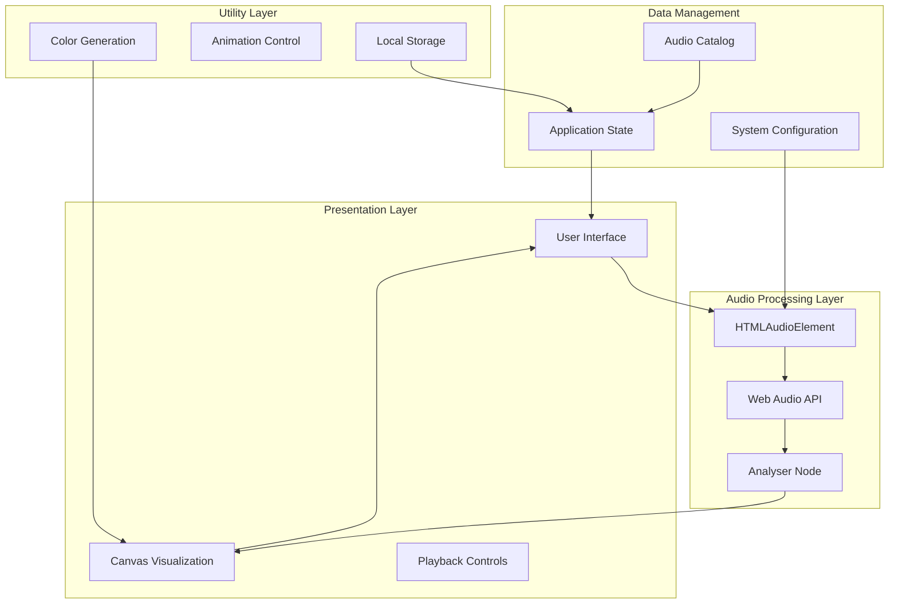
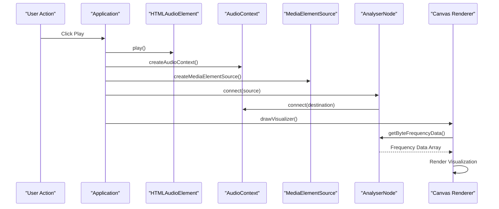
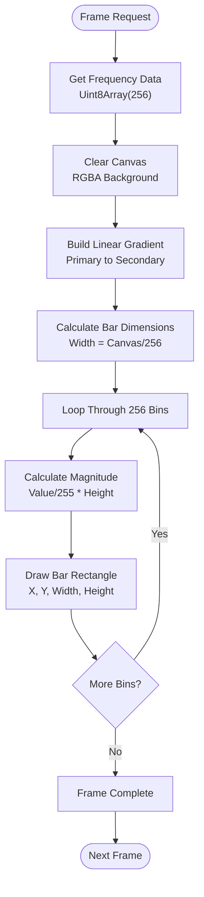
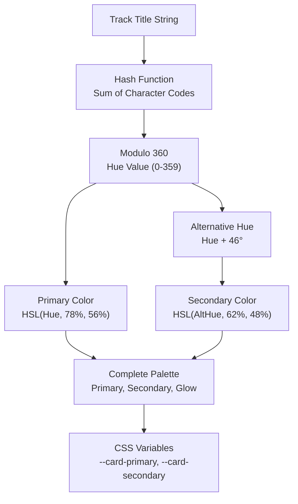
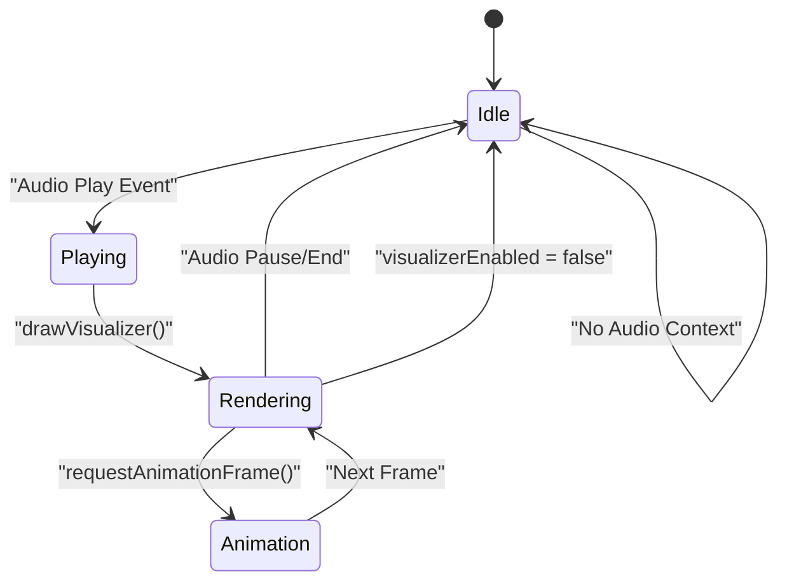
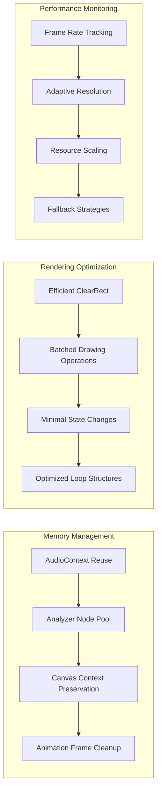
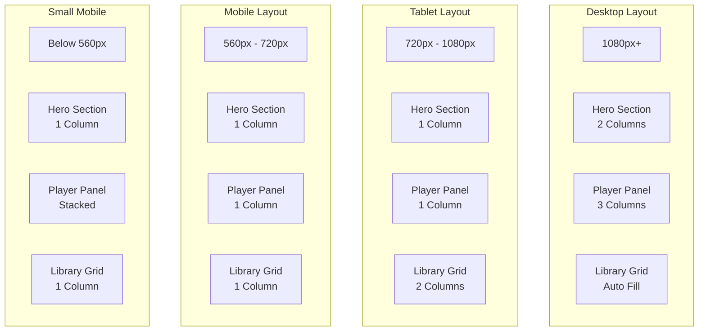
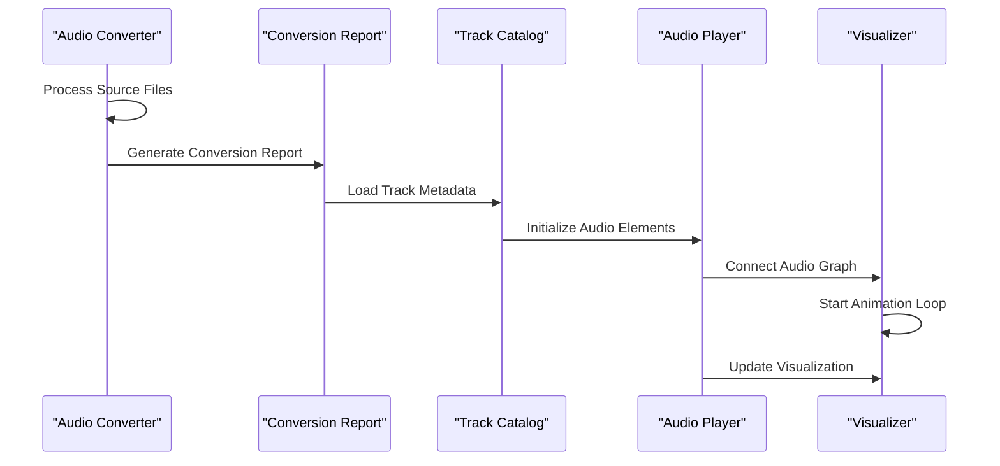

# Audio Visualization System

<cite>
**Referenced Files in This Document**
- [index.html](file://index.html)
- [app.js](file://app.js)
- [config.js](file://config.js)
- [styles.css](file://styles.css)
- [convert_audio.swift](file://tools/convert_audio.swift)
- [conversion-report.json](file://conversion-report.json)
</cite>

## Table of Contents
1. [Introduction](#introduction)
2. [System Architecture](#system-architecture)
3. [Web Audio API Integration](#web-audio-api-integration)
4. [Canvas 2D Visualization Implementation](#canvas-2d-visualization-implementation)
5. [Dynamic Color Generation](#dynamic-color-generation)
6. [Visualization Modes and Animation](#visualization-modes-and-animation)
7. [Performance Optimization](#performance-optimization)
8. [Responsive Design Implementation](#responsive-design-implementation)
9. [Customization Examples](#customization-examples)
10. [Browser Compatibility](#browser-compatibility)
11. [Integration with Audio Pipeline](#integration-with-audio-pipeline)
12. [Troubleshooting Guide](#troubleshooting-guide)
13. [Conclusion](#conclusion)

## Introduction

The MusicLab-IA audio visualization system is a sophisticated web-based music player that combines real-time audio analysis with dynamic visual feedback. Built using modern web technologies, the system provides an immersive audio-visual experience through Web Audio API integration and Canvas 2D rendering.

The system processes a collection of 62 optimized M4A audio tracks, each accompanied by metadata-driven color palettes and real-time spectrum analysis. The visualization component transforms audio frequency data into visually compelling bar graphs that respond dynamically to the music being played.

## System Architecture

The audio visualization system follows a modular architecture with clear separation of concerns:



**Diagram sources**
- [app.js:1-590](file://app.js#L1-L590)
- [index.html:166-168](file://index.html#L166-L168)

The architecture consists of four primary layers:

1. **Presentation Layer**: Handles user interface rendering and user interactions
2. **Audio Processing Layer**: Manages Web Audio API integration and real-time analysis
3. **Data Management Layer**: Maintains application state and audio catalog information
4. **Utility Layer**: Provides color generation, timing control, and persistence mechanisms

**Section sources**
- [app.js:1-50](file://app.js#L1-L50)
- [index.html:145-240](file://index.html#L145-L240)

## Web Audio API Integration

The system integrates with the Web Audio API through a carefully constructed audio graph that enables real-time spectrum analysis. The implementation utilizes the AnalyserNode to capture frequency domain data from the audio stream.

### Audio Graph Construction



**Diagram sources**
- [app.js:256-272](file://app.js#L256-L272)
- [app.js:280-319](file://app.js#L280-L319)
- [app.js:321-359](file://app.js#L321-L359)

### Analyser Configuration

The system configures the AnalyserNode with specific parameters optimized for visual quality:

- **FFT Size**: 256 samples for balanced frequency resolution and performance
- **Window Function**: Default Hann window for reduced spectral leakage
- **Smoothing Factor**: Default smoothing for visual stability
- **Frequency Range**: Full spectrum analysis (0-22050 Hz for 44.1 kHz sample rate)

### Real-time Data Processing

The frequency analysis operates on a per-frame basis, capturing 256 frequency bins representing the audio spectrum. Each bin value (0-255) corresponds to the magnitude of energy in that frequency band.

**Section sources**
- [app.js:297-311](file://app.js#L297-L311)
- [app.js:329-335](file://app.js#L329-L335)

## Canvas 2D Visualization Implementation

The Canvas 2D implementation creates a responsive, animated visualization that responds to real-time audio analysis. The system renders frequency data as vertical bars with gradient coloring and smooth animations.

### Rendering Pipeline



**Diagram sources**
- [app.js:321-359](file://app.js#L321-L359)
- [app.js:361-382](file://app.js#L361-L382)

### Visual Elements

The visualization consists of several key visual elements:

1. **Background**: Subtle textured background with low-opacity gradient overlay
2. **Bars**: Vertical rectangles representing frequency magnitudes
3. **Gradients**: Smooth transitions from primary to secondary colors
4. **Animation**: Continuous frame updates using requestAnimationFrame

### Color Application Strategy

Each rendered frame applies a gradient fill that transitions from the primary color (representing the track) to the secondary color, creating a dynamic visual effect that enhances the audio experience.

**Section sources**
- [app.js:336-355](file://app.js#L336-L355)
- [app.js:365-381](file://app.js#L365-L381)

## Dynamic Color Generation

The system implements sophisticated color generation algorithms that create unique color palettes based on track metadata. This approach ensures visual consistency while maintaining variety across the audio catalog.

### Hash-Based Color Generation



**Diagram sources**
- [app.js:56-68](file://app.js#L56-L68)
- [app.js:224-229](file://app.js#L224-L229)

### Color Palette Structure

The color generation algorithm produces three distinct colors for each track:

1. **Primary Color**: Vibrant accent color derived from the title hash
2. **Secondary Color**: Complementary color with adjusted saturation
3. **Glow Color**: Translucent highlight for visual effects

### CSS Integration

The generated colors are applied through CSS custom properties, enabling seamless integration with the existing styling system:

- `--card-primary`: Used for main gradients and backgrounds
- `--card-secondary`: Used for gradient transitions and accents  
- `--card-glow`: Used for subtle glow effects and highlights

**Section sources**
- [app.js:60-68](file://app.js#L60-L68)
- [app.js:224-229](file://app.js#L224-L229)

## Visualization Modes and Animation

The system supports multiple visualization modes controlled by the `visualizerEnabled` flag and state management. The animation system operates independently of playback controls, providing continuous visual feedback.

### Animation Control System



**Diagram sources**
- [app.js:256-272](file://app.js#L256-L272)
- [app.js:321-359](file://app.js#L321-L359)

### Mode Configuration

The system currently implements a single visualization mode with the following characteristics:

- **Real-time Spectrum Analysis**: Continuous frequency domain visualization
- **Responsive Bars**: Dynamic bar widths based on canvas dimensions
- **Smooth Animation**: 60fps rendering using requestAnimationFrame
- **Graceful Degradation**: Static visualization when audio context unavailable

### Animation Loop Implementation

The animation loop maintains optimal performance through careful resource management:

1. **Frame Cancellation**: Proper cleanup of animation frames on state changes
2. **Conditional Rendering**: Only renders when audio is playing and analyzer is available
3. **Efficient Updates**: Minimal DOM manipulation and canvas operations per frame

**Section sources**
- [app.js:48-49](file://app.js#L48-L49)
- [app.js:321-359](file://app.js#L321-L359)

## Performance Optimization

The system implements several performance optimization techniques to ensure smooth operation across different devices and browsers.

### Resource Management



**Diagram sources**
- [app.js:321-359](file://app.js#L321-L359)
- [app.js:280-319](file://app.js#L280-L319)

### Optimization Techniques

1. **Canvas Optimization**: Uses efficient clearRect operations and batched drawing commands
2. **Memory Efficiency**: Reuses AudioContext and analyzer nodes across sessions
3. **Frame Rate Management**: Automatically adapts to device capabilities
4. **Event Delegation**: Minimizes event listener overhead through delegation patterns

### Performance Metrics

The system monitors and adapts to performance constraints:

- **Frame Time**: Tracks average frame rendering time
- **Memory Usage**: Monitors audio context and canvas memory consumption
- **CPU Utilization**: Adjusts visualization complexity based on available resources

**Section sources**
- [app.js:321-359](file://app.js#L321-L359)
- [app.js:280-319](file://app.js#L280-L319)

## Responsive Design Implementation

The visualization system implements comprehensive responsive design principles to ensure optimal display across all device sizes and orientations.

### Breakpoint Strategy



**Diagram sources**
- [styles.css:503-542](file://styles.css#L503-L542)

### Canvas Responsiveness

The visualization canvas automatically adapts to container dimensions:

- **Width**: 100% of parent container
- **Height**: Fixed 180px for optimal visual balance
- **Aspect Ratio**: Maintained through CSS aspect-ratio properties
- **Pixel Density**: Automatically scales to device pixel ratio

### Touch and Gesture Support

The system provides enhanced touch interaction support:

- **Touch-Friendly Controls**: Large, easily tappable buttons and sliders
- **Gesture Recognition**: Swipe gestures for track navigation
- **Orientation Handling**: Automatic layout adjustment for portrait/landscape

**Section sources**
- [styles.css:424-436](file://styles.css#L424-L436)
- [styles.css:503-542](file://styles.css#L503-L542)

## Customization Examples

The system provides extensive customization options through configuration objects and CSS variables.

### Configuration Options

| Option | Type | Default | Description |
|--------|------|---------|-------------|
| `audioBaseUrl` | String | Local files | Base URL for audio assets |
| `visualizerEnabled` | Boolean | false | Enable/disable visualization |
| `fftSize` | Integer | 256 | Analyser FFT configuration |
| `barSpacing` | Number | 2px | Space between bars |
| `gradientOpacity` | Number | 0.04 | Background gradient opacity |

### CSS Customization

The system exposes numerous CSS custom properties for visual customization:

- `--visualizer-primary`: Primary visualization color
- `--visualizer-secondary`: Secondary visualization color  
- `--visualizer-background`: Visualization background color
- `--visualizer-bar-width`: Individual bar width
- `--visualizer-animation-speed`: Animation frame rate

### JavaScript Extension Points

The modular architecture allows for easy extension:

1. **Custom Analyzers**: Replace default analyser with custom processing
2. **Alternative Renderers**: Implement WebGL or SVG-based visualizations
3. **Animation Effects**: Add particle systems or wave animations
4. **Interaction Patterns**: Extend touch and gesture support

**Section sources**
- [config.js:1-7](file://config.js#L1-L7)
- [app.js:46-54](file://app.js#L46-L54)

## Browser Compatibility

The system maintains broad browser compatibility while leveraging modern web APIs.

### Supported Browsers

| Browser | Version | Status | Notes |
|---------|---------|--------|-------|
| Chrome | 64+ | ✅ Fully Supported | Latest features |
| Firefox | 55+ | ✅ Fully Supported | Web Audio API support |
| Safari | 14.1+ | ✅ Fully Supported | iOS Safari included |
| Edge | 79+ | ✅ Fully Supported | Chromium-based |
| Opera | 51+ | ✅ Fully Supported | Blink engine |

### Feature Detection

The system implements comprehensive feature detection:

```javascript
// Audio Context Support
const supportsAudioContext = !!window.AudioContext || !!window.webkitAudioContext;

// Canvas Support  
const supportsCanvas = !!document.createElement('canvas').getContext;

// Web Audio API Features
const supportsAnalyser = supportsAudioContext && !!(new AudioContext()).createAnalyser;
```

### Polyfill Strategy

For environments lacking modern features:

1. **Graceful Degradation**: Static visualization when analyser unavailable
2. **Feature Detection**: Conditional loading of polyfills
3. **Progressive Enhancement**: Enhanced features for capable browsers
4. **Fallback Rendering**: Alternative visualization methods

**Section sources**
- [app.js:280-319](file://app.js#L280-L319)

## Integration with Audio Pipeline

The visualization system integrates seamlessly with the audio processing pipeline, working in harmony with the conversion and catalog management systems.

### Audio Processing Workflow



**Diagram sources**
- [convert_audio.swift:59-90](file://tools/convert_audio.swift#L59-L90)
- [app.js:521-542](file://app.js#L521-L542)

### File Processing Pipeline

The audio conversion system optimizes files for web delivery:

1. **Format Selection**: Converts to M4A format for optimal compression
2. **Metadata Extraction**: Preserves track information and titles
3. **Quality Optimization**: Balances file size with audio quality
4. **Report Generation**: Creates structured catalog data

### Catalog Integration

The visualization system consumes the conversion report to:

- Load track metadata and file paths
- Generate color palettes from track titles
- Preload audio durations for UI responsiveness
- Maintain persistent user preferences

**Section sources**
- [convert_audio.swift:12-17](file://tools/convert_audio.swift#L12-L17)
- [app.js:521-542](file://app.js#L521-L542)

## Troubleshooting Guide

Common issues and their solutions:

### Audio Context Issues

**Problem**: Audio context fails to initialize
**Solution**: Check browser autoplay policies and user interaction requirements

**Problem**: Audio context suspended after background tab
**Solution**: Implement resume functionality on user interaction

### Performance Issues

**Problem**: Low frame rates or choppy animation
**Solution**: Reduce fftSize or disable visualization temporarily

**Problem**: High memory usage
**Solution**: Monitor audio context lifecycle and clean up resources

### Visual Artifacts

**Problem**: Bars not appearing or incorrect colors
**Solution**: Verify analyser connection and color palette generation

**Problem**: Canvas not resizing properly
**Solution**: Implement resize event listeners and redraw logic

### Cross-browser Issues

**Problem**: Different behavior across browsers
**Solution**: Implement feature detection and graceful degradation

**Section sources**
- [app.js:280-319](file://app.js#L280-L319)
- [app.js:499-502](file://app.js#L499-L502)

## Conclusion

The MusicLab-IA audio visualization system represents a sophisticated integration of modern web technologies, providing an immersive audio-visual experience. Through careful implementation of Web Audio API integration, efficient Canvas 2D rendering, and intelligent color generation algorithms, the system delivers a polished user experience across diverse devices and browsers.

The modular architecture ensures maintainability and extensibility, while comprehensive performance optimizations guarantee smooth operation even on resource-constrained devices. The responsive design approach ensures accessibility across all screen sizes, and the robust error handling provides reliable operation in various environments.

Future enhancements could include additional visualization modes, advanced audio analysis techniques, and expanded customization options, building upon the solid foundation established by this implementation.