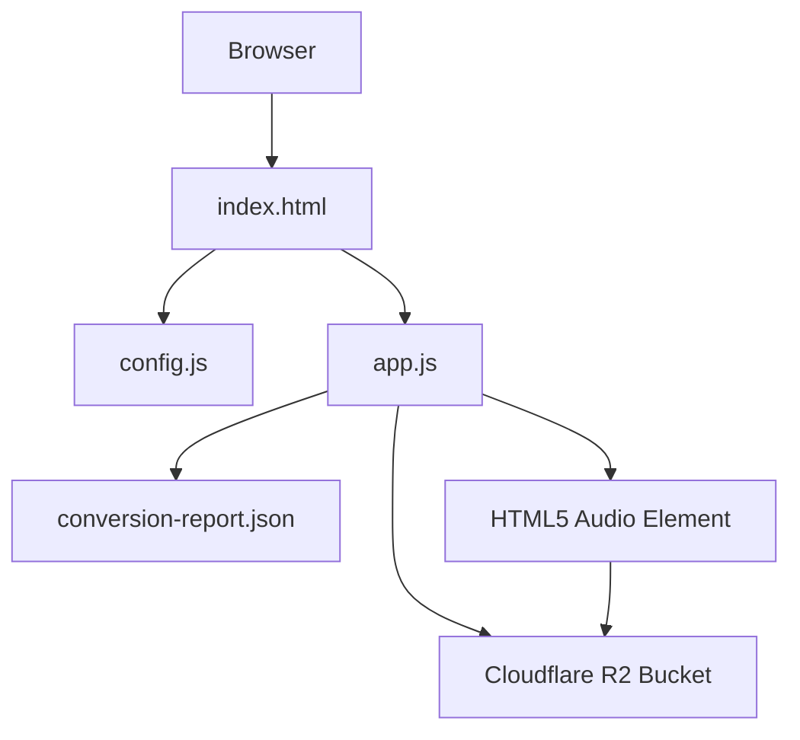
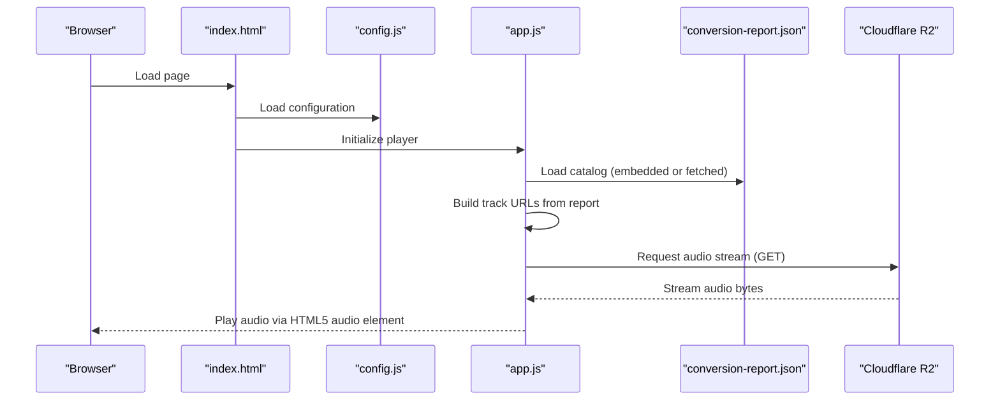
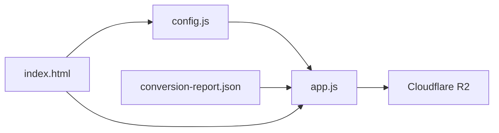

# Cloud Storage Integration

<cite>
**Referenced Files in This Document**
- [config.js](file://config.js)
- [app.js](file://app.js)
- [index.html](file://index.html)
- [conversion-report.json](file://conversion-report.json)
- [README.md](file://README.md)
- [convert_audio.swift](file://tools/convert_audio.swift)
</cite>

## Table of Contents
1. [Introduction](#introduction)
2. [Project Structure](#project-structure)
3. [Core Components](#core-components)
4. [Architecture Overview](#architecture-overview)
5. [Detailed Component Analysis](#detailed-component-analysis)
6. [Dependency Analysis](#dependency-analysis)
7. [Performance Considerations](#performance-considerations)
8. [Troubleshooting Guide](#troubleshooting-guide)
9. [Conclusion](#conclusion)
10. [Appendices](#appendices)

## Introduction
This document provides comprehensive documentation for integrating Cloudflare R2 storage with the MusicLab-IA web audio player. It explains configuration options in config.js, describes how audio delivery is optimized for streaming, and outlines deployment requirements, bucket setup procedures, and production URL adjustments. It also covers security considerations, bandwidth optimization, monitoring integration, migration strategies, and troubleshooting common storage-related issues.

## Project Structure
The project consists of a static web player that streams audio from Cloudflare R2. The key files are:
- config.js: Defines the R2 audio base URL, bucket name, account ID, and S3-compatible endpoint.
- app.js: Implements the audio player, track loading, filtering, and streaming logic.
- index.html: Provides the UI shell and embeds the conversion report.
- conversion-report.json: Contains metadata for all tracks, including filenames and titles.
- tools/convert_audio.swift: Converts source audio files to optimized M4A format suitable for web streaming.

**Diagram sources**
- [index.html:242](file://index.html#L242)
- [config.js:1-7](file://config.js#L1-L7)
- [app.js:46-104](file://app.js#L46-L104)
- [conversion-report.json:1-317](file://conversion-report.json#L1-L317)

**Section sources**
- [README.md:14-21](file://README.md#L14-L21)
- [index.html:1-318](file://index.html#L1-L318)
- [config.js:1-7](file://config.js#L1-L7)
- [app.js:1-590](file://app.js#L1-L590)
- [conversion-report.json:1-317](file://conversion-report.json#L1-L317)
- [convert_audio.swift:1-174](file://tools/convert_audio.swift#L1-L174)

## Core Components
- Configuration module: Centralizes R2 endpoint and bucket settings used by the player.
- Player logic: Builds track URLs from the conversion report and loads audio via the configured base URL.
- Conversion pipeline: Produces optimized M4A files and generates a conversion report consumed by the player.
- Static hosting: The app is deployed to a static host and serves audio from R2.

Key configuration options in config.js:
- audioBaseUrl: Public URL of the R2 bucket used to construct audio URLs.
- bucketName: Name of the R2 bucket storing audio assets.
- accountId: Cloudflare account identifier used for constructing the S3-compatible endpoint.
- s3Endpoint: S3-compatible endpoint for R2, enabling SDK/tool compatibility.

How audio URLs are constructed:
- The player reads the conversion report and builds each track's audio URL by concatenating the configured audio base URL with the encoded filename from the report.

**Section sources**
- [config.js:1-7](file://config.js#L1-L7)
- [app.js:91-104](file://app.js#L91-L104)
- [index.html:243-313](file://index.html#L243-L313)
- [conversion-report.json:1-317](file://conversion-report.json#L1-L317)

## Architecture Overview
The player architecture integrates static hosting with Cloudflare R2 for audio delivery. The browser loads index.html, which embeds the conversion report and loads config.js and app.js. The app constructs audio URLs using the configured base URL and streams audio via the HTML5 audio element.

**Diagram sources**
- [index.html:242-315](file://index.html#L242-L315)
- [config.js:1-7](file://config.js#L1-L7)
- [app.js:521-542](file://app.js#L521-L542)
- [conversion-report.json:1-317](file://conversion-report.json#L1-L317)

## Detailed Component Analysis

### Configuration Module (config.js)
The configuration module defines:
- audioBaseUrl: The public R2 bucket URL used to construct audio URLs.
- bucketName: The R2 bucket name.
- accountId: Cloudflare account ID used to build the S3-compatible endpoint.
- s3Endpoint: S3-compatible endpoint for R2.

Important considerations:
- The audio base URL must point to the public R2 bucket endpoint in production.
- The S3-compatible endpoint enables compatibility with S3-based tooling and SDKs.

**Section sources**
- [config.js:1-7](file://config.js#L1-L7)
- [README.md:18-20](file://README.md#L18-L20)

### Player Logic (app.js)
Key responsibilities:
- Load catalog from embedded conversion report or fetch it from conversion-report.json.
- Build track objects with audio URLs derived from audioBaseUrl and encoded filenames.
- Stream audio via the HTML5 audio element with metadata preloading and error handling.
- Persist playback state (volume, current time) in localStorage.

Audio URL construction:
- Each track’s src is built by concatenating audioBaseUrl with the encoded output filename from the conversion report.

Metadata preloading:
- The app prefetches track durations by creating temporary audio elements with preload set to metadata.

Playback controls:
- Play/pause, next/previous navigation, seeking, and volume control are implemented with event listeners.

Error handling:
- On audio errors, the app logs the error and displays a user-facing message.

**Section sources**
- [app.js:46-104](file://app.js#L46-L104)
- [app.js:521-576](file://app.js#L521-L576)
- [app.js:499-502](file://app.js#L499-L502)

### Conversion Pipeline (convert_audio.swift)
The conversion script:
- Scans the current directory for supported audio files (.aif, .aiff, .wav, .mp3).
- Selects preferred source files based on extension priority and file size.
- Normalizes titles and generates slugs for filenames.
- Exports each track to M4A format with network optimization enabled.
- Writes a conversion report containing createdAt, outputDirectory, totalTracks, and track metadata.

Output artifacts:
- Optimized M4A files placed in the web-audio directory.
- conversion-report.json describing the catalog.

**Section sources**
- [convert_audio.swift:19-58](file://tools/convert_audio.swift#L19-L58)
- [convert_audio.swift:59-90](file://tools/convert_audio.swift#L59-L90)
- [convert_audio.swift:159-174](file://tools/convert_audio.swift#L159-L174)

### Static Hosting and Catalog Delivery (index.html)
The HTML file:
- Embeds the conversion report directly in a script tag for immediate availability.
- Loads config.js and app.js in order.
- Initializes the audio element with preload set to metadata and crossOrigin set to anonymous.

Embedding the catalog:
- Embedding the report avoids external fetches during initial load and simplifies deployment.

**Section sources**
- [index.html:243-315](file://index.html#L243-L315)
- [index.html:242](file://index.html#L242)

## Dependency Analysis
The player depends on:
- Configuration module for R2 endpoint settings.
- Conversion report for track metadata and filenames.
- Cloudflare R2 for serving audio assets.

**Diagram sources**
- [config.js:1-7](file://config.js#L1-L7)
- [app.js:46-104](file://app.js#L46-L104)
- [conversion-report.json:1-317](file://conversion-report.json#L1-L317)
- [index.html:314-315](file://index.html#L314-L315)

**Section sources**
- [app.js:46-104](file://app.js#L46-L104)
- [index.html:243-315](file://index.html#L243-L315)
- [config.js:1-7](file://config.js#L1-L7)
- [conversion-report.json:1-317](file://conversion-report.json#L1-L317)

## Performance Considerations
Streaming optimization strategies:
- Network-optimized exports: The conversion script sets shouldOptimizeForNetworkUse to true, reducing latency and improving streaming performance.
- Metadata preloading: Prefetching track durations reduces UI delays and improves perceived performance.
- Preload configuration: The audio element is configured to preload metadata, enabling quick duration detection and smoother playback.

CDN and caching:
- Cloudflare R2 provides global edge caching; configure appropriate cache-control headers and consider Cloudflare cache policies for optimal performance.
- Use Cloudflare Workers KV for lightweight metadata caching if needed.

Bandwidth optimization:
- Serve M4A files optimized for web streaming.
- Consider enabling compression at the CDN level if applicable to your deployment.

Monitoring and observability:
- Monitor R2 bucket metrics and Cloudflare analytics for bandwidth, requests, and latency.
- Track audio load failures and error rates to identify delivery issues.

[No sources needed since this section provides general guidance]

## Troubleshooting Guide
Common storage-related issues and resolutions:
- Audio fails to load:
  - Verify that audioBaseUrl points to the correct public R2 bucket endpoint.
  - Confirm that the bucket allows public access to audio files.
  - Check that filenames in conversion-report.json match the actual files in the bucket.
- CORS errors:
  - Ensure the bucket policy permits cross-origin requests from your domain.
  - The audio element uses crossOrigin set to anonymous; confirm your R2 bucket CORS settings support this.
- Incorrect filenames:
  - Re-run the conversion script to regenerate conversion-report.json and upload updated M4A files.
- Deployment mismatch:
  - After deploying, adjust audioBaseUrl in config.js to the production R2 bucket URL as instructed in the README.

**Section sources**
- [app.js:499-502](file://app.js#L499-L502)
- [README.md:18-20](file://README.md#L18-L20)
- [index.html:242](file://index.html#L242)

## Conclusion
The MusicLab-IA project demonstrates a clean integration of Cloudflare R2 for audio delivery. By centralizing configuration in config.js, building deterministic audio URLs from the conversion report, and leveraging optimized M4A exports, the player achieves efficient streaming performance. Proper bucket setup, CORS configuration, and CDN caching are essential for reliable production operation.

[No sources needed since this section summarizes without analyzing specific files]

## Appendices

### Deployment Requirements
- Static hosting: Deploy the app to a static host (Netlify as indicated in the README).
- R2 bucket setup: Create a bucket named musica and upload the generated M4A files from the conversion pipeline.
- Production URL adjustment: Update audioBaseUrl in config.js to the public R2 bucket URL before final deployment.

**Section sources**
- [README.md:14-21](file://README.md#L14-L21)
- [config.js:2](file://config.js#L2)

### Security Considerations
- Access control: Restrict bucket access to public read-only for audio files while keeping source materials private.
- CORS policy: Configure CORS to allow only your domain(s) to access audio resources.
- Endpoint protection: Use Cloudflare Access or similar to protect administrative endpoints if applicable.

**Section sources**
- [README.md:18](file://README.md#L18)

### Migration Between Storage Providers
- Export strategy: Continue using the conversion pipeline to produce M4A files and conversion-report.json.
- Provider switch: Update audioBaseUrl in config.js to point to the new provider’s public endpoint.
- Validation: Test playback across devices and networks to ensure compatibility.

**Section sources**
- [config.js:2](file://config.js#L2)
- [convert_audio.swift:159-174](file://tools/convert_audio.swift#L159-L174)

### Monitoring Integration
- Metrics: Track R2 bucket bandwidth, requests, and latency via Cloudflare dashboard.
- Player health: Monitor audio load errors and duration prefetch failures in the browser console.
- CDN insights: Use Cloudflare Analytics to observe caching effectiveness and origin hit ratios.

**Section sources**
- [app.js:499-502](file://app.js#L499-L502)