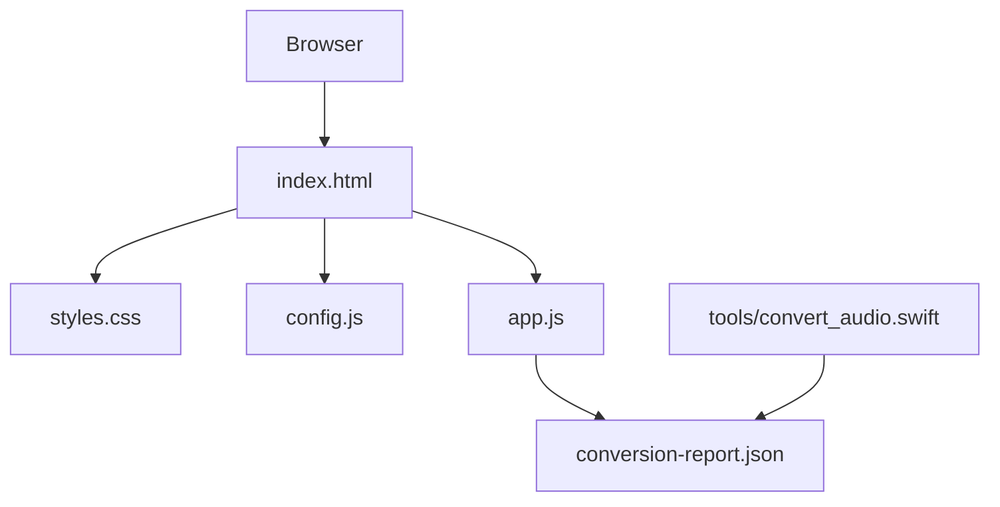
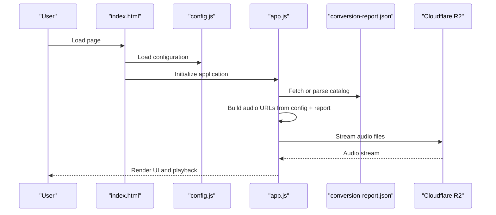
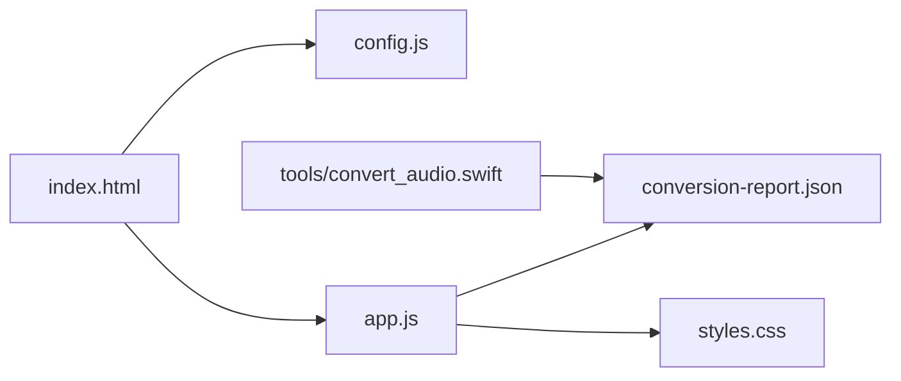

# Configuration and Customization

<cite>
**Referenced Files in This Document**
- [README.md](file://README.md)
- [config.js](file://config.js)
- [app.js](file://app.js)
- [styles.css](file://styles.css)
- [index.html](file://index.html)
- [conversion-report.json](file://conversion-report.json)
- [tools/convert_audio.swift](file://tools/convert_audio.swift)
</cite>

## Table of Contents
1. [Introduction](#introduction)
2. [Project Structure](#project-structure)
3. [Core Components](#core-components)
4. [Architecture Overview](#architecture-overview)
5. [Detailed Component Analysis](#detailed-component-analysis)
6. [Dependency Analysis](#dependency-analysis)
7. [Performance Considerations](#performance-considerations)
8. [Troubleshooting Guide](#troubleshooting-guide)
9. [Conclusion](#conclusion)
10. [Appendices](#appendices)

## Introduction
This document explains how to configure and customize the MusicLab-IA audio player application. It covers Cloudflare R2 storage integration, audio base URL customization, theme customization via CSS custom properties, state management customization for filters and preferences, performance tuning, and extension points for adding new features and audio formats.

## Project Structure
The application consists of a static HTML page, a CSS stylesheet, a JavaScript application module, a configuration module, and a Swift-based audio conversion toolchain. The configuration module defines Cloudflare R2 storage parameters and the audio base URL used to resolve audio file locations. The application loads a catalog of tracks from either an embedded JSON script tag or a JSON file, constructs audio URLs using the configured base URL, and renders a responsive UI with a dark theme.

**Diagram sources**
- [index.html](file://index.html)
- [styles.css](file://styles.css)
- [config.js](file://config.js)
- [app.js](file://app.js)
- [conversion-report.json](file://conversion-report.json)
- [tools/convert_audio.swift](file://tools/convert_audio.swift)

**Section sources**
- [README.md](file://README.md)
- [index.html](file://index.html)

## Core Components
- Configuration module: Defines Cloudflare R2 storage parameters and the audio base URL used to construct audio resource paths.
- Application module: Manages state, UI rendering, playback controls, filtering, and persistence of user preferences.
- Stylesheet: Provides a dark theme using CSS custom properties for colors, backgrounds, and typography.
- Catalog: A JSON report describing the audio tracks, their titles, sources, and output filenames.
- Conversion tool: A Swift script that converts audio files to M4A and generates the catalog report.

**Section sources**
- [config.js](file://config.js)
- [app.js](file://app.js)
- [styles.css](file://styles.css)
- [conversion-report.json](file://conversion-report.json)
- [tools/convert_audio.swift](file://tools/convert_audio.swift)

## Architecture Overview
The application architecture centers on a configuration-driven audio base URL, a catalog-driven track model, and a state-managed UI. The configuration module exposes a global configuration object consumed by the application module. The application module builds audio URLs from the configuration and the catalog, then renders cards and lists. The stylesheet defines theme tokens that can be customized to change the visual identity.

**Diagram sources**
- [index.html](file://index.html)
- [config.js](file://config.js)
- [app.js](file://app.js)
- [conversion-report.json](file://conversion-report.json)

## Detailed Component Analysis

### Cloudflare R2 Storage Configuration
The configuration module defines the audio base URL, bucket name, account ID, and S3-compatible endpoint for Cloudflare R2. The application reads these values to construct audio URLs for streaming.

- Key configuration keys:
  - audioBaseUrl: Base URL for audio resources
  - bucketName: Target bucket name
  - accountId: Cloudflare account identifier
  - s3Endpoint: S3-compatible endpoint for R2

- How it is used:
  - The application reads the configuration object and derives the audio base URL.
  - Each track’s audio URL is constructed by appending the encoded output filename to the base URL.

- Example modification steps:
  - Update the audio base URL to match your public R2 bucket URL.
  - Ensure the bucket name and endpoint reflect your Cloudflare R2 configuration.

**Section sources**
- [config.js](file://config.js)
- [app.js](file://app.js)

### Audio Base URL Customization
The application constructs audio URLs by combining the configured base URL with the encoded output filename from the catalog. This allows hosting audio assets on any CDN or storage service by simply changing the base URL.

- Construction logic:
  - Base URL is derived from configuration and normalized (trailing slash removed).
  - Each track’s src is set to base URL plus the encoded output filename.

- Customization examples:
  - Change the base URL to point to a different CDN or bucket.
  - Ensure the audio files are publicly accessible at the constructed URLs.

**Section sources**
- [app.js](file://app.js)
- [conversion-report.json](file://conversion-report.json)

### Storage Provider Integration
The application does not implement a custom storage provider abstraction. Instead, it relies on the configuration-defined base URL to resolve audio resources. To integrate a different storage provider:
- Provide a compatible base URL that resolves to the desired storage backend.
- Ensure the catalog output filenames match the actual stored files.
- Verify CORS and access permissions for the chosen storage provider.

**Section sources**
- [config.js](file://config.js)
- [app.js](file://app.js)

### Theme Customization Using CSS Custom Properties
The stylesheet defines a set of CSS custom properties in the root scope that control colors, backgrounds, typography, and spacing. These properties enable broad theme customization without altering the layout logic.

- Root-level custom properties:
  - Backgrounds, panels, text, muted text, borders, accents, shadows, and radii
- Color scheme:
  - The document sets a dark color-scheme preference for the root element.
- Typography:
  - Serif fonts for headings and sans-serif for body text.
- Theming approach:
  - Replace or override root-level custom properties to change the visual identity.
  - The application uses these properties in computed styles for cards and gradients.

- Customization examples:
  - Override background and panel colors to switch to a light theme.
  - Adjust accent colors and radii to match brand guidelines.
  - Modify typography families and sizes for different readability profiles.

**Section sources**
- [styles.css](file://styles.css)
- [app.js](file://app.js)

### Visual Branding Options
The application computes a palette per track based on the track title, generating primary, secondary, and glow colors. These are applied to visual elements such as track cards and the spotlight area.

- Palette generation:
  - A deterministic hash of the title produces a hue value.
  - Alternate hues produce complementary primary and secondary colors.
  - Glow color is derived from the primary hue with transparency.
- Application:
  - The palette is injected into inline styles for track cards and the visualizer.
  - The visualizer uses the current track’s palette for gradient fills.

- Customization examples:
  - Modify the palette generation function to use a different seed or algorithm.
  - Override the inline styles to enforce brand-consistent colors.

**Section sources**
- [app.js](file://app.js)

### State Management Customization
The application maintains a central state object containing tracks, filtered tracks, current index, query, filter mode, playback status, and duration cache. User preferences are persisted in localStorage under dedicated keys.

- State structure:
  - Tracks: Array of track objects built from the catalog
  - Filtered tracks: Subset of tracks after applying query and filter
  - Current index: Index of the currently playing track
  - Query: Search term for filtering
  - Filter: Active filter mode (all, long, short, recent)
  - Is playing: Playback state
  - Durations: Map of track IDs to durations
- Persistence keys:
  - Track ID, volume, and current time are stored in localStorage
- Extending filters:
  - Add new filter modes by updating the filter logic and UI chips.
  - Extend the filter category function to support additional categories.

- Customization examples:
  - Add a “favorites” filter by integrating with a favorites collection.
  - Extend the query logic to include metadata beyond title and source.
  - Persist additional preferences (e.g., shuffle mode) using new localStorage keys.

**Section sources**
- [app.js](file://app.js)

### UI Rendering and Interaction
The application binds DOM events to state updates and renders the library, queue, and spotlight views. It supports search, filtering, playback controls, seeking, and volume adjustment.

- Rendering:
  - Grid of track cards with dynamic styles based on palette
  - Queue list with current track highlighting
  - Spotlight area with title, file, and description
- Interactions:
  - Clicking a track card or queue item loads and plays the track
  - Filter chips toggle filter modes
  - Play/pause, previous, next buttons control playback
  - Seek slider and volume slider update playback position and volume

- Customization examples:
  - Add new filter chips or categories by updating the filter logic and UI.
  - Extend the spotlight description with additional metadata.
  - Customize the visualizer behavior by enabling or disabling it and adjusting analyser settings.

**Section sources**
- [app.js](file://app.js)
- [index.html](file://index.html)

### Catalog and Audio Formats
The catalog is a JSON report that enumerates tracks with their titles, original sources, and output filenames. The Swift conversion tool selects preferred source files, exports them to M4A, and writes the report.

- Catalog fields:
  - Created timestamp, output directory, total tracks, and an array of track entries
- Conversion pipeline:
  - Preferred source extensions and ordering
  - Slug generation for output filenames
  - Export to M4A with network optimization
  - Report writing with ISO date formatting

- Adding new audio formats:
  - Extend the allowed source extensions in the conversion tool.
  - Update the application logic to handle new file types if needed.
  - Ensure the base URL serves the new formats correctly.

**Section sources**
- [conversion-report.json](file://conversion-report.json)
- [tools/convert_audio.swift](file://tools/convert_audio.swift)

## Dependency Analysis
The application’s runtime dependencies are minimal and explicit. The HTML page loads the configuration, then the application module initializes and renders the UI. The catalog can be embedded or fetched dynamically.

**Diagram sources**
- [index.html](file://index.html)
- [config.js](file://config.js)
- [app.js](file://app.js)
- [conversion-report.json](file://conversion-report.json)
- [tools/convert_audio.swift](file://tools/convert_audio.swift)

**Section sources**
- [index.html](file://index.html)
- [app.js](file://app.js)

## Performance Considerations
- Streaming optimization:
  - The conversion tool enables network optimization for M4A exports, reducing buffering overhead.
- Preloading and metadata:
  - The application preloads metadata for tracks to compute durations and improve UI responsiveness.
- Visualizer:
  - The visualizer is disabled by default; enabling it adds CPU/GPU overhead. Consider disabling it on low-power devices.
- Local storage:
  - Volume, current track, and current time are cached locally to resume playback quickly.
- Network requests:
  - Ensure the audio base URL points to a fast CDN to minimize latency.

[No sources needed since this section provides general guidance]

## Troubleshooting Guide
- Audio fails to load:
  - Verify the audio base URL points to a public R2 bucket or compatible storage.
  - Confirm the catalog output filenames match the stored files.
  - Check CORS settings and access permissions for the bucket.
- Visualizer errors:
  - The visualizer requires a compatible browser and may fail on unsupported platforms. The application handles errors gracefully and falls back to a static visualization.
- Persistent state issues:
  - Clear browser localStorage keys for track, volume, and current time if playback resumes incorrectly.
- Catalog loading failures:
  - If the catalog is missing or malformed, the application displays a fatal error and suggests running the app via a local server.

**Section sources**
- [app.js](file://app.js)

## Conclusion
MusicLab-IA offers a flexible configuration system centered on a Cloudflare R2 base URL, a catalog-driven track model, and a dark-themed UI controlled via CSS custom properties. By adjusting the configuration, overriding CSS variables, and extending the state logic, you can tailor the application to your storage provider, branding, and feature requirements while maintaining optimal performance.

[No sources needed since this section summarizes without analyzing specific files]

## Appendices

### Configuration Reference
- Configuration object keys:
  - audioBaseUrl: Base URL for audio resources
  - bucketName: Target bucket name
  - accountId: Cloudflare account identifier
  - s3Endpoint: S3-compatible endpoint for R2

- Example modification steps:
  - Update the base URL to your public R2 bucket URL.
  - Ensure the bucket is configured for public access and CORS.

**Section sources**
- [config.js](file://config.js)
- [README.md](file://README.md)

### Theme Customization Guide
- Override CSS custom properties in :root to change:
  - Backgrounds, panels, text, muted text, borders, accents, shadows, and radii
- Apply brand colors by replacing accent and panel colors
- Maintain accessibility by preserving contrast ratios

**Section sources**
- [styles.css](file://styles.css)

### State Management Extension Guide
- Add new filters:
  - Extend the filter logic and add UI chips for new modes
  - Update the filter category function to support new categories
- Persist additional preferences:
  - Define new localStorage keys and restore them during initialization
- Extend search:
  - Enhance the query logic to include additional metadata fields

**Section sources**
- [app.js](file://app.js)

### Audio Format Extension Guide
- Add new source formats:
  - Update the allowed extensions in the conversion tool
  - Re-run the conversion pipeline to regenerate the catalog
- Ensure compatibility:
  - Verify the base URL serves the new formats and that browsers support them

**Section sources**
- [tools/convert_audio.swift](file://tools/convert_audio.swift)
- [conversion-report.json](file://conversion-report.json)