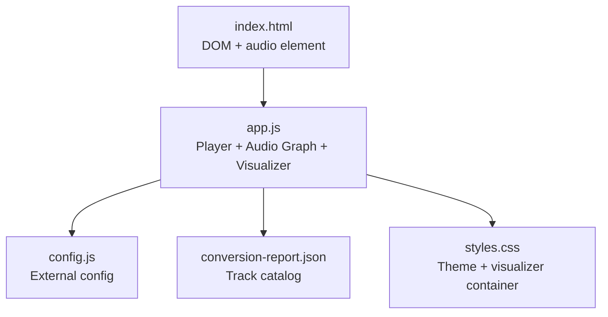
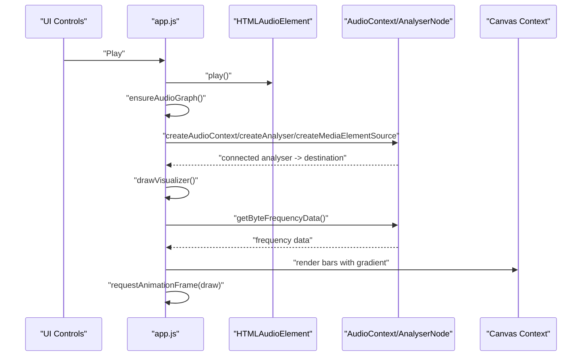
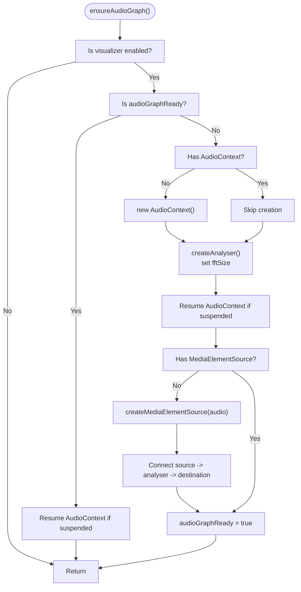
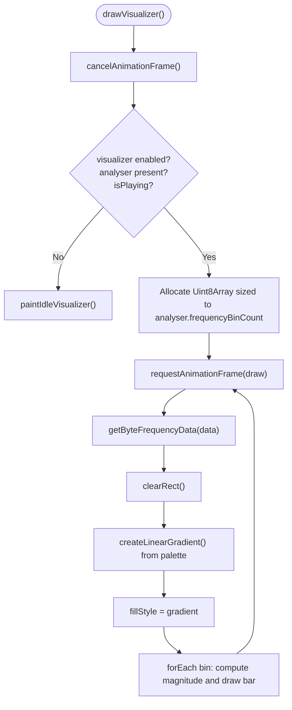
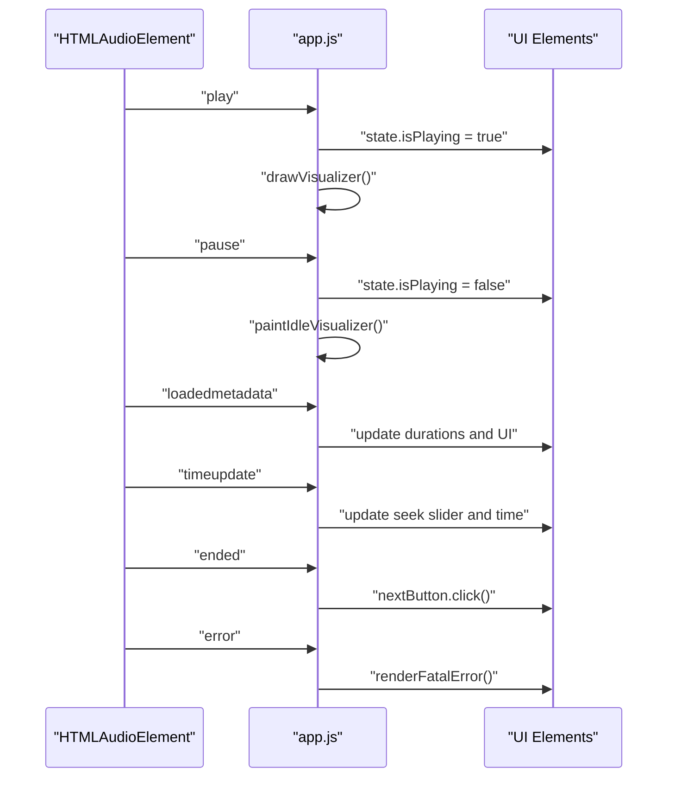
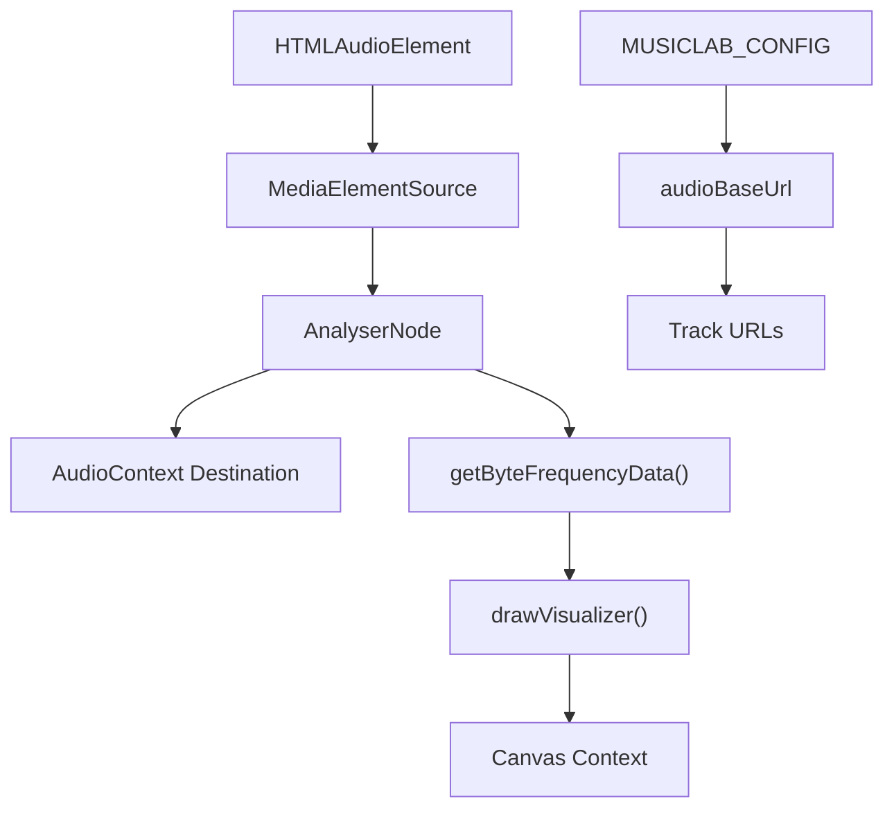

# Audio Processing Engine

<cite>
**Referenced Files in This Document**
- [index.html](file://index.html)
- [app.js](file://app.js)
- [styles.css](file://styles.css)
- [config.js](file://config.js)
- [conversion-report.json](file://conversion-report.json)
- [README.md](file://README.md)
</cite>

## Table of Contents
1. [Introduction](#introduction)
2. [Project Structure](#project-structure)
3. [Core Components](#core-components)
4. [Architecture Overview](#architecture-overview)
5. [Detailed Component Analysis](#detailed-component-analysis)
6. [Dependency Analysis](#dependency-analysis)
7. [Performance Considerations](#performance-considerations)
8. [Troubleshooting Guide](#troubleshooting-guide)
9. [Conclusion](#conclusion)
10. [Appendices](#appendices)

## Introduction
This document describes the Web Audio API-based audio processing engine powering the MusicLab-IA player. It focuses on the audio graph construction using AudioContext, AnalyserNode, and MediaElementSource, the lazy initialization and error handling of the audio graph via ensureAudioGraph(), the real-time visualization pipeline using getByteFrequencyData(), canvas rendering with gradient effects, and animation frame management. It also covers the audio graph lifecycle, context state management, and integration with the main audio element. Practical guidance is included for visualizer customization, performance tuning, and troubleshooting audio graph issues.

## Project Structure
The project is a static web application composed of:
- index.html: Application shell, DOM elements, and the main audio element.
- app.js: Player logic, audio graph management, visualization, UI bindings, and state.
- styles.css: Visual theme and layout, including the visualizer container styling.
- config.js: External configuration for audio storage endpoint.
- conversion-report.json: Catalog of audio assets used by the player.
- README.md: Project overview and deployment notes.

**Diagram sources**
- [index.html:1-318](file://index.html#L1-L318)
- [app.js:1-590](file://app.js#L1-L590)
- [config.js:1-7](file://config.js#L1-L7)
- [conversion-report.json:1-317](file://conversion-report.json#L1-L317)
- [styles.css:1-543](file://styles.css#L1-L543)

**Section sources**
- [index.html:1-318](file://index.html#L1-L318)
- [app.js:1-590](file://app.js#L1-L590)
- [config.js:1-7](file://config.js#L1-L7)
- [conversion-report.json:1-317](file://conversion-report.json#L1-L317)
- [styles.css:1-543](file://styles.css#L1-L543)
- [README.md:1-27](file://README.md#L1-L27)

## Core Components
- Audio graph globals: audioContext, analyser, sourceNode, animationFrameId, audioGraphReady.
- ensureAudioGraph(): Lazy initialization and error handling for the Web Audio API graph.
- drawVisualizer(): Real-time visualization loop using requestAnimationFrame and getByteFrequencyData().
- paintIdleVisualizer(): Canvas fallback rendering when audio is paused or not playing.
- UI integration: Play/pause events, loadedmetadata, timeupdate, and ended handlers.

Key responsibilities:
- Build and resume the audio graph on demand.
- Render frequency bars with gradient fills.
- Manage animation frames and cancel them appropriately.
- Provide graceful fallback visuals when audio is idle.

**Section sources**
- [app.js:40-48](file://app.js#L40-L48)
- [app.js:280-319](file://app.js#L280-L319)
- [app.js:321-382](file://app.js#L321-L382)

## Architecture Overview
The audio processing engine integrates the browser’s native audio element with the Web Audio API to enable real-time visualization. The audio element emits PCM data that is routed through a MediaElementSource into an AnalyserNode. The AnalyserNode feeds frequency data to the visualization loop, which renders bars on a canvas.

**Diagram sources**
- [app.js:256-272](file://app.js#L256-L272)
- [app.js:280-319](file://app.js#L280-L319)
- [app.js:321-359](file://app.js#L321-L359)
- [index.html:242-242](file://index.html#L242-L242)

## Detailed Component Analysis

### Audio Graph Construction and Lifecycle
The audio graph is constructed lazily when the user initiates playback and the visualizer is enabled. The ensureAudioGraph() function:
- Checks if the visualizer is enabled.
- Resumes the AudioContext if suspended.
- Creates the AnalyserNode and sets fftSize.
- Creates a MediaElementSource from the audio element and connects it to the analyser and destination.
- Sets a flag indicating the graph is ready.

**Diagram sources**
- [app.js:280-319](file://app.js#L280-L319)

**Section sources**
- [app.js:280-319](file://app.js#L280-L319)

### Real-time Visualization Pipeline
The drawVisualizer() function:
- Cancels any existing animation frame.
- If the visualizer is disabled, paused, or analyser is missing, paints the idle visualizer.
- Otherwise, creates a typed array sized to analyser.frequencyBinCount, clears the canvas, computes a gradient from the current track’s palette, and draws bars proportional to frequency magnitudes.

**Diagram sources**
- [app.js:321-359](file://app.js#L321-L359)
- [app.js:361-382](file://app.js#L361-L382)

**Section sources**
- [app.js:321-382](file://app.js#L321-L382)

### Canvas Rendering Details
- Frequency data collection: getByteFrequencyData() populates a Uint8Array with amplitude values scaled to 0–255.
- Bar rendering: Bars are drawn with width proportional to the canvas width divided by the number of bins, and height proportional to the magnitude.
- Gradient effects: A linear gradient is computed from the current track’s palette and applied to each bar.
- Background: A semi-transparent white fill is drawn behind bars to create trailing effect.

**Section sources**
- [app.js:329-355](file://app.js#L329-L355)
- [app.js:340-342](file://app.js#L340-L342)

### Animation Frame Management
- drawVisualizer() cancels any previous animation frame before starting a new loop.
- The loop uses requestAnimationFrame to schedule the next draw call, ensuring smooth updates synchronized with the display refresh rate.
- The loop continues while the visualizer is enabled, analyser is present, and the player is playing.

**Section sources**
- [app.js:321-359](file://app.js#L321-L359)

### Idle Visualizer Fallback
When the player is paused or the visualizer is disabled, paintIdleVisualizer():
- Clears the canvas.
- Creates a subtle gradient background.
- Draws a light sine wave pattern across the canvas to indicate the visualizer is present but inactive.

**Section sources**
- [app.js:361-382](file://app.js#L361-L382)

### UI Integration and Event Handling
- Play/pause toggling triggers drawing or idle rendering.
- loadedmetadata updates track durations and UI state.
- timeupdate updates seek slider and persists current time.
- ended advances to the next track.
- error displays a fatal error message and disables interactive controls.

**Diagram sources**
- [app.js:487-502](file://app.js#L487-L502)
- [app.js:477-485](file://app.js#L477-L485)
- [app.js:504-506](file://app.js#L504-L506)
- [app.js:499-502](file://app.js#L499-L502)

**Section sources**
- [app.js:487-502](file://app.js#L487-L502)
- [app.js:477-485](file://app.js#L477-L485)
- [app.js:504-506](file://app.js#L504-L506)
- [app.js:499-502](file://app.js#L499-L502)

### Track Catalog and Audio Base URL
- Tracks are loaded from conversion-report.json or embedded JSON in index.html.
- The audioBaseUrl is configurable via window.MUSICLAB_CONFIG and used to construct track URLs.

**Section sources**
- [app.js:521-542](file://app.js#L521-L542)
- [index.html:243-313](file://index.html#L243-L313)
- [config.js:1-7](file://config.js#L1-L7)

## Dependency Analysis
The audio processing engine depends on:
- Browser APIs: HTMLAudioElement, AudioContext, AnalyserNode, MediaElementSource, CanvasRenderingContext2D.
- DOM elements: audio-player, visualizer-canvas, UI controls.
- Internal state: global audioContext, analyser, sourceNode, animationFrameId, audioGraphReady.
- External configuration: audioBaseUrl from config.js.

**Diagram sources**
- [app.js:280-319](file://app.js#L280-L319)
- [app.js:321-359](file://app.js#L321-L359)
- [config.js:1-7](file://config.js#L1-L7)

**Section sources**
- [app.js:280-319](file://app.js#L280-L319)
- [app.js:321-359](file://app.js#L321-L359)
- [config.js:1-7](file://config.js#L1-L7)

## Performance Considerations
- Use requestAnimationFrame for smooth, efficient rendering aligned with the display refresh rate.
- Reuse a single typed array sized to analyser.frequencyBinCount to minimize allocations.
- Clear the canvas once per frame and draw bars efficiently with fillRect.
- Avoid unnecessary DOM updates during the visualization loop; keep palette computations minimal.
- Consider reducing fftSize for lower CPU usage if needed, trading off frequency resolution for performance.
- Cancel animation frames promptly when the visualizer is disabled or the player is paused.

[No sources needed since this section provides general guidance]

## Troubleshooting Guide
Common issues and resolutions:
- AudioContext suspended: ensureAudioGraph() resumes the context on play. If resume fails, the visualizer is disabled and playback continues through the audio element alone.
- Visualizer not appearing: verify visualizerEnabled is true and analyser is present. Check that ensureAudioGraph() ran successfully.
- No frequency data: confirm the audio element is playing and the graph is connected. Ensure getByteFrequencyData() is called inside the animation loop.
- Canvas artifacts: ensure clearRect() is called each frame and that the gradient is created per frame or cached per palette.
- UI errors: listen for audio error events and display a user-friendly message.

**Section sources**
- [app.js:280-319](file://app.js#L280-L319)
- [app.js:321-359](file://app.js#L321-L359)
- [app.js:499-502](file://app.js#L499-L502)

## Conclusion
The MusicLab-IA audio processing engine demonstrates a clean separation between UI controls, audio graph management, and real-time visualization. The ensureAudioGraph() function encapsulates lazy initialization and robust error handling, while drawVisualizer() provides an efficient, visually appealing frequency visualization. The design balances simplicity with performance, leveraging the Web Audio API and Canvas for a responsive user experience.

[No sources needed since this section summarizes without analyzing specific files]

## Appendices

### Visualizer Customization Examples
- Change gradient colors: modify the palette computation and gradient stops used in drawVisualizer().
- Adjust bar spacing: tweak barWidth calculation and minimum bar width to balance density and readability.
- Modify background: adjust the semi-transparent overlay or switch to a solid background.
- Tune responsiveness: adjust the frequency data sampling rate indirectly by changing analyser.fftSize.

**Section sources**
- [app.js:338-355](file://app.js#L338-L355)
- [app.js:340-342](file://app.js#L340-L342)

### Performance Tuning Tips
- Reduce fftSize to lower CPU usage at the cost of frequency resolution.
- Limit the number of bars rendered by downsampling frequency data.
- Cache gradients per palette to avoid repeated gradient creation.
- Minimize DOM updates during the animation loop.

[No sources needed since this section provides general guidance]