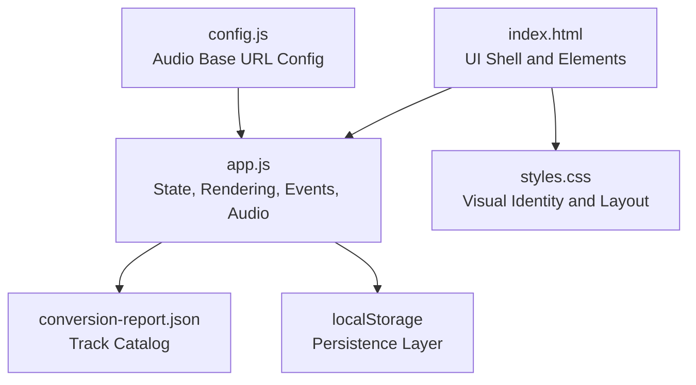
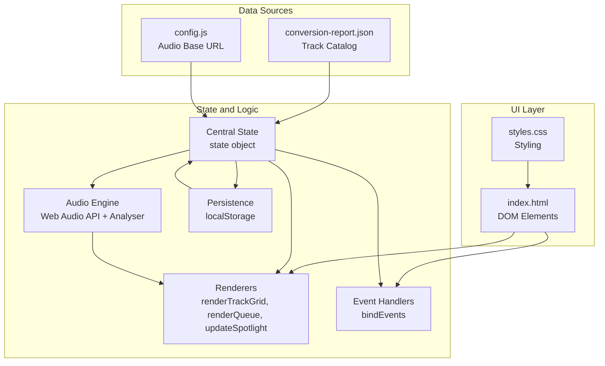
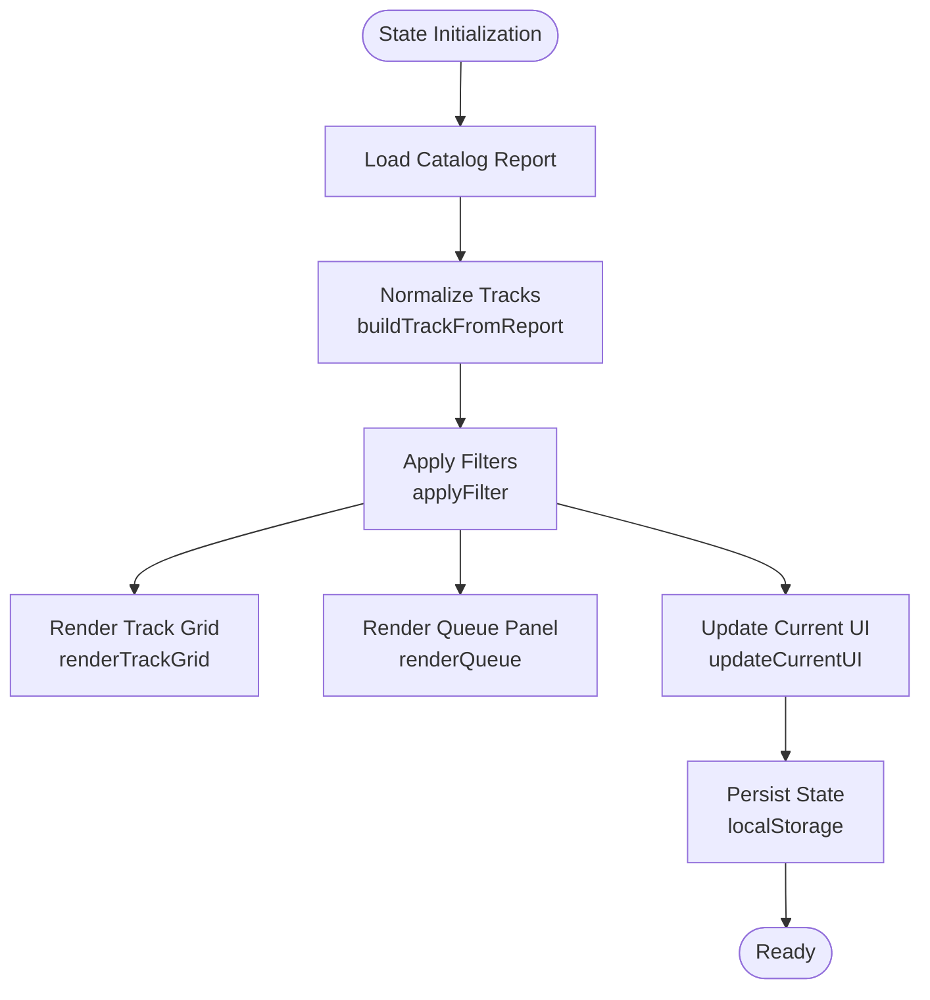
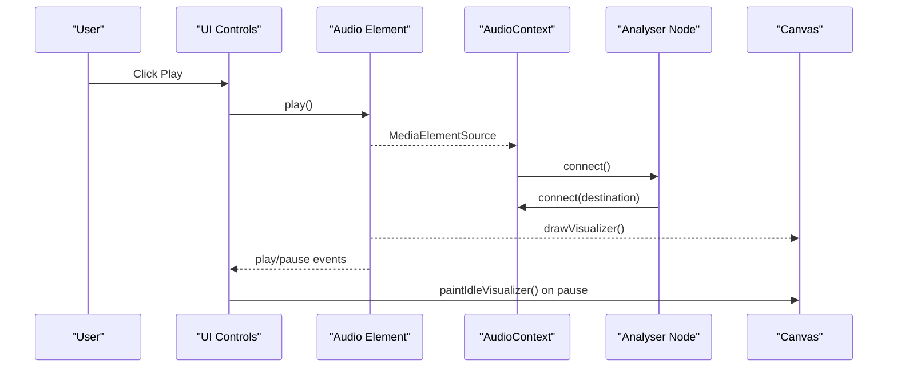
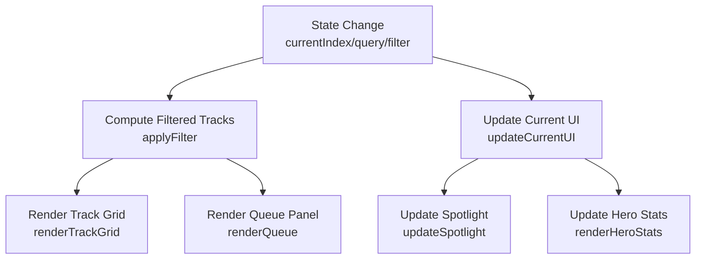
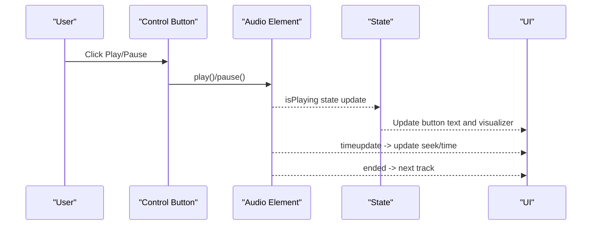
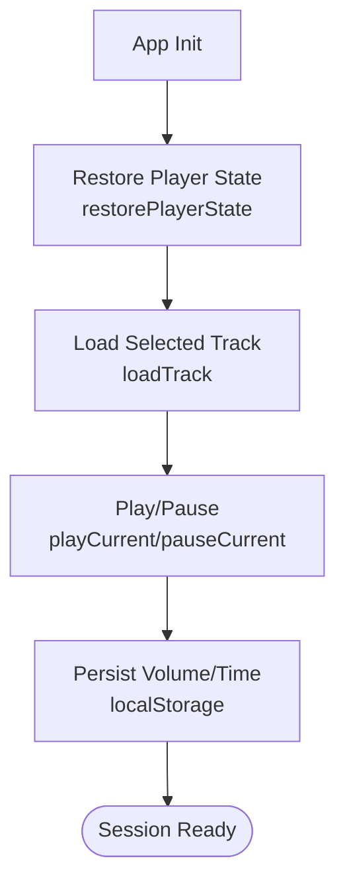
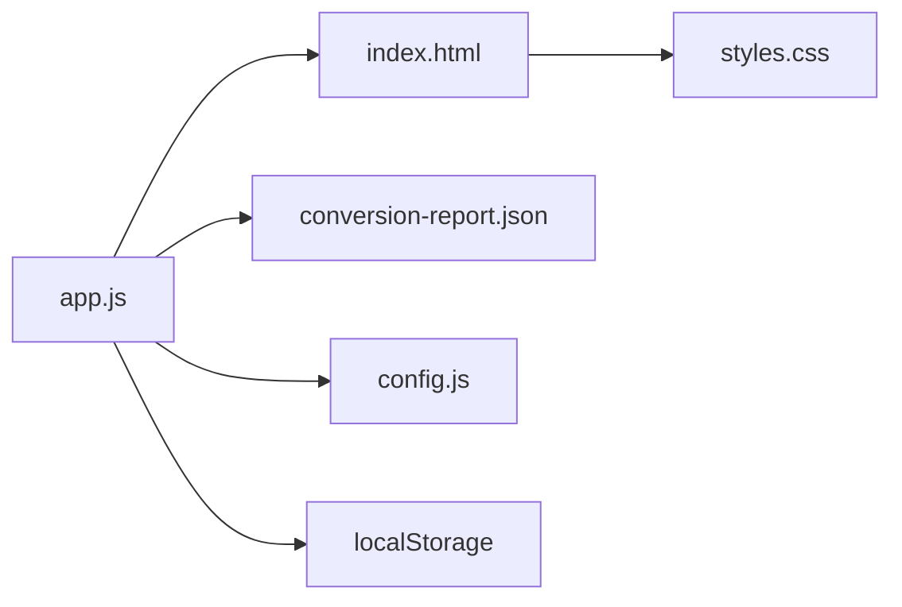

# Core Application Components

<cite>
**Referenced Files in This Document**
- [app.js](file://app.js)
- [config.js](file://config.js)
- [index.html](file://index.html)
- [styles.css](file://styles.css)
- [conversion-report.json](file://conversion-report.json)
- [README.md](file://README.md)
</cite>

## Table of Contents
1. [Introduction](#introduction)
2. [Project Structure](#project-structure)
3. [Core Components](#core-components)
4. [Architecture Overview](#architecture-overview)
5. [Detailed Component Analysis](#detailed-component-analysis)
6. [Dependency Analysis](#dependency-analysis)
7. [Performance Considerations](#performance-considerations)
8. [Troubleshooting Guide](#troubleshooting-guide)
9. [Conclusion](#conclusion)

## Introduction
This document describes the core application components of the MusicLab-IA music player. It focuses on the centralized state management system, the audio processing engine built on the Web Audio API with analyser node integration for real-time visualization, the UI rendering framework responsible for dynamic DOM manipulation, track grids, and queue panels, the event handling system using observer-like patterns for user interactions and state synchronization, and the persistence layer leveraging localStorage for user preferences and playback state. Concrete examples from the codebase illustrate component initialization, state updates, and inter-component communication patterns.

## Project Structure
The MusicLab-IA project is a static web application composed of:
- A single HTML page defining the UI shell and DOM elements
- A CSS stylesheet providing visual identity and responsive layout
- A JavaScript module implementing state, rendering, audio processing, and event handling
- A configuration module defining audio base URLs and cloud storage integration
- A JSON catalog containing track metadata for the library
- A Swift tool for local audio conversion to M4A format

**Diagram sources**
- [index.html:1-318](file://index.html#L1-L318)
- [app.js:1-590](file://app.js#L1-L590)
- [config.js:1-7](file://config.js#L1-L7)
- [conversion-report.json:1-317](file://conversion-report.json#L1-L317)

**Section sources**
- [README.md:1-27](file://README.md#L1-L27)
- [index.html:1-318](file://index.html#L1-L318)
- [app.js:1-590](file://app.js#L1-L590)
- [config.js:1-7](file://config.js#L1-L7)
- [conversion-report.json:1-317](file://conversion-report.json#L1-L317)

## Core Components
This section documents the central state management, UI rendering, audio engine, event handling, and persistence mechanisms.

- Centralized State Management
  - Tracks collection and derived filtered tracks
  - Current index and playback state
  - Query and filter configuration
  - Duration cache for efficient rendering
  - Example initialization and usage: [state object:1-9](file://app.js#L1-L9), [applyFilter:106-131](file://app.js#L106-L131), [renderTrackGrid:133-156](file://app.js#L133-L156)

- Track Objects and Metadata
  - Build from catalog report with computed palette and recent flag
  - Example builder: [buildTrackFromReport:91-104](file://app.js#L91-L104)
  - Duration category computation: [trackLengthCategory:80-89](file://app.js#L80-L89)

- UI Rendering Framework
  - Dynamic DOM updates for track grid, queue panel, spotlight, and hero stats
  - Example renderers: [renderTrackGrid:133-156](file://app.js#L133-L156), [renderQueue:158-171](file://app.js#L158-L171), [renderHeroStats:173-181](file://app.js#L173-L181), [updateSpotlight:183-196](file://app.js#L183-L196), [updateCurrentUI:198-214](file://app.js#L198-L214)

- Audio Processing Engine (Web Audio API)
  - Audio element integration with analyser node for real-time visualization
  - Example graph setup: [ensureAudioGraph:280-319](file://app.js#L280-L319)
  - Visualization drawing loop: [drawVisualizer:321-359](file://app.js#L321-L359), [paintIdleVisualizer:361-382](file://app.js#L361-L382)

- Event Handling System
  - Observer-like event bindings for user interactions and media events
  - Example bindings: [bindEvents:384-519](file://app.js#L384-L519)
  - Playback lifecycle: [playCurrent:256-272](file://app.js#L256-L272), [pauseCurrent:274-278](file://app.js#L274-L278)

- Persistence Layer (localStorage)
  - Stores current track ID, volume, and current time
  - Example persistence: [restorePlayerState:544-554](file://app.js#L544-L554), [prefetchDurations:556-576](file://app.js#L556-L576)

**Section sources**
- [app.js:1-590](file://app.js#L1-L590)
- [index.html:1-318](file://index.html#L1-L318)
- [config.js:1-7](file://config.js#L1-L7)
- [conversion-report.json:1-317](file://conversion-report.json#L1-L317)

## Architecture Overview
The application follows a modular architecture with a single-page UI, centralized state, and event-driven interactions. The audio engine is integrated via the Web Audio API analyser node for visualization. Local storage persists user preferences and playback state.

**Diagram sources**
- [index.html:1-318](file://index.html#L1-L318)
- [styles.css:1-543](file://styles.css#L1-L543)
- [app.js:1-590](file://app.js#L1-L590)
- [config.js:1-7](file://config.js#L1-L7)
- [conversion-report.json:1-317](file://conversion-report.json#L1-L317)

## Detailed Component Analysis

### Centralized State Management
The state object encapsulates all runtime data:
- Tracks: normalized track list
- Filtered tracks: derived subset for UI display
- Current index: active track position
- Query and filter: search and filter criteria
- Is playing: playback state
- Durations: cached duration Map for fast rendering

Key operations:
- Filtering and rendering pipeline: [applyFilter:106-131](file://app.js#L106-L131)
- UI updates synchronized with state: [updateCurrentUI:198-214](file://app.js#L198-L214)
- Duration caching and prefetching: [prefetchDurations:556-576](file://app.js#L556-L576)

**Diagram sources**
- [app.js:106-131](file://app.js#L106-L131)
- [app.js:133-156](file://app.js#L133-L156)
- [app.js:158-171](file://app.js#L158-L171)
- [app.js:198-214](file://app.js#L198-L214)
- [app.js:521-542](file://app.js#L521-L542)

**Section sources**
- [app.js:1-590](file://app.js#L1-L590)

### Audio Processing Engine (Web Audio API)
The audio engine integrates with the HTMLAudioElement and uses an analyser node to drive real-time visualization. The analyser is lazily initialized and connected to the audio context when playback starts.

Key functions:
- Graph setup and connection: [ensureAudioGraph:280-319](file://app.js#L280-L319)
- Visualization loop: [drawVisualizer:321-359](file://app.js#L321-L359)
- Idle visualization: [paintIdleVisualizer:361-382](file://app.js#L361-L382)
- Playback triggers: [playCurrent:256-272](file://app.js#L256-L272), [pauseCurrent:274-278](file://app.js#L274-L278)

**Diagram sources**
- [app.js:256-272](file://app.js#L256-L272)
- [app.js:280-319](file://app.js#L280-L319)
- [app.js:321-359](file://app.js#L321-L359)
- [app.js:361-382](file://app.js#L361-L382)

**Section sources**
- [app.js:256-272](file://app.js#L256-L272)
- [app.js:280-319](file://app.js#L280-L319)
- [app.js:321-359](file://app.js#L321-L359)
- [app.js:361-382](file://app.js#L361-L382)

### UI Rendering Framework
The rendering framework updates the DOM based on state changes. It manages:
- Track grid cards with current selection highlighting
- Queue panel with current track emphasis
- Spotlight area with palette-based styling
- Hero statistics and search/filter chips

Key functions:
- Track grid rendering: [renderTrackGrid:133-156](file://app.js#L133-L156)
- Queue panel rendering: [renderQueue:158-171](file://app.js#L158-L171)
- Spotlight updates: [updateSpotlight:183-196](file://app.js#L183-L196)
- Hero stats: [renderHeroStats:173-181](file://app.js#L173-L181)
- Palette-based styling: [artStyle:224-229](file://app.js#L224-L229)

**Diagram sources**
- [app.js:106-131](file://app.js#L106-L131)
- [app.js:133-156](file://app.js#L133-L156)
- [app.js:158-171](file://app.js#L158-L171)
- [app.js:183-196](file://app.js#L183-L196)
- [app.js:173-181](file://app.js#L173-L181)

**Section sources**
- [app.js:133-156](file://app.js#L133-L156)
- [app.js:158-171](file://app.js#L158-L171)
- [app.js:183-196](file://app.js#L183-L196)
- [app.js:173-181](file://app.js#L173-L181)
- [app.js:224-229](file://app.js#L224-L229)

### Event Handling System
The event system binds user interactions and media events to state updates and UI reactions. It uses observer-like patterns to synchronize state and UI.

Key bindings:
- About panel toggle: [bindEvents:384-390](file://app.js#L384-L390)
- Track selection from grid/queue: [bindEvents:392-410](file://app.js#L392-L410)
- Filter chip interactions: [bindEvents:412-419](file://app.js#L412-L419)
- Search input: [bindEvents:421-424](file://app.js#L421-L424)
- Playback controls: [bindEvents:426-456](file://app.js#L426-L456)
- Media events: [bindEvents:458-519](file://app.js#L458-L519)

**Diagram sources**
- [app.js:426-456](file://app.js#L426-L456)
- [app.js:477-502](file://app.js#L477-L502)
- [app.js:499-506](file://app.js#L499-L506)

**Section sources**
- [app.js:384-519](file://app.js#L384-L519)

### Persistence Layer (localStorage)
The application persists user preferences and playback state across sessions:
- Current track ID
- Volume level
- Current playback time

Key functions:
- Restore state on load: [restorePlayerState:544-554](file://app.js#L544-L554)
- Persist volume and time during playback: [bindEvents:515-518](file://app.js#L515-L518)
- Prefetch durations and persist to state: [prefetchDurations:556-576](file://app.js#L556-L576)

**Diagram sources**
- [app.js:544-554](file://app.js#L544-L554)
- [app.js:231-254](file://app.js#L231-L254)
- [app.js:515-518](file://app.js#L515-L518)

**Section sources**
- [app.js:544-554](file://app.js#L544-L554)
- [app.js:231-254](file://app.js#L231-L254)
- [app.js:515-518](file://app.js#L515-L518)
- [app.js:556-576](file://app.js#L556-L576)

## Dependency Analysis
The application exhibits a clean separation of concerns with minimal coupling:
- app.js depends on index.html for DOM elements and on conversion-report.json for catalog data
- config.js provides external configuration for audio base URLs
- styles.css defines UI presentation and does not depend on JavaScript
- localStorage acts as a lightweight persistence layer

**Diagram sources**
- [app.js:1-590](file://app.js#L1-L590)
- [index.html:1-318](file://index.html#L1-L318)
- [config.js:1-7](file://config.js#L1-L7)
- [conversion-report.json:1-317](file://conversion-report.json#L1-L317)

**Section sources**
- [app.js:1-590](file://app.js#L1-L590)
- [index.html:1-318](file://index.html#L1-L318)
- [config.js:1-7](file://config.js#L1-L7)
- [conversion-report.json:1-317](file://conversion-report.json#L1-L317)

## Performance Considerations
- Efficient filtering: The filter pipeline runs against the precomputed filteredTracks to minimize DOM churn. See [applyFilter:106-131](file://app.js#L106-L131).
- Lazy audio graph initialization: The analyser node is created only when needed and resumed on demand. See [ensureAudioGraph:280-319](file://app.js#L280-L319).
- Duration prefetching: Preloading metadata avoids blocking UI updates. See [prefetchDurations:556-576](file://app.js#L556-L576).
- Minimal DOM updates: Batched rendering via innerHTML and targeted updates for current track highlights. See [renderTrackGrid:133-156](file://app.js#L133-L156), [renderQueue:158-171](file://app.js#L158-L171).

[No sources needed since this section provides general guidance]

## Troubleshooting Guide
Common issues and resolutions:
- Audio loading errors: The app logs and displays a fatal error message when audio fails to load. See [bindEvents error handler:499-502](file://app.js#L499-L502) and [renderFatalError:578-582](file://app.js#L578-L582).
- No tracks found: When filters yield empty results, the grid shows a friendly message. See [renderTrackGrid:133-137](file://app.js#L133-L137).
- Visualizer not appearing: The visualizer is disabled by default (visualizerEnabled set to false). See [app.js constants:46-48](file://app.js#L46-L48).
- Persistent state restoration: If playback state is missing, defaults are applied. See [restorePlayerState:544-554](file://app.js#L544-L554).

**Section sources**
- [app.js:499-502](file://app.js#L499-L502)
- [app.js:578-582](file://app.js#L578-L582)
- [app.js:46-48](file://app.js#L46-L48)
- [app.js:544-554](file://app.js#L544-L554)

## Conclusion
MusicLab-IA demonstrates a cohesive architecture combining centralized state management, a Web Audio API-powered visualization engine, a reactive UI rendering framework, robust event handling, and a simple persistence layer. The codebase is structured for clarity and maintainability, with clear separation between UI, state, and audio logic. The documented patterns provide a solid foundation for extending functionality while preserving performance and user experience.