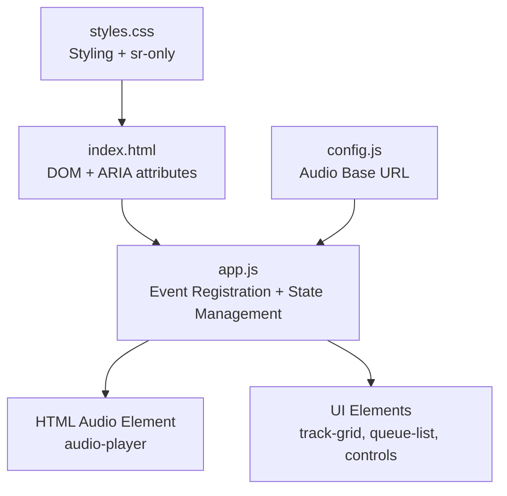
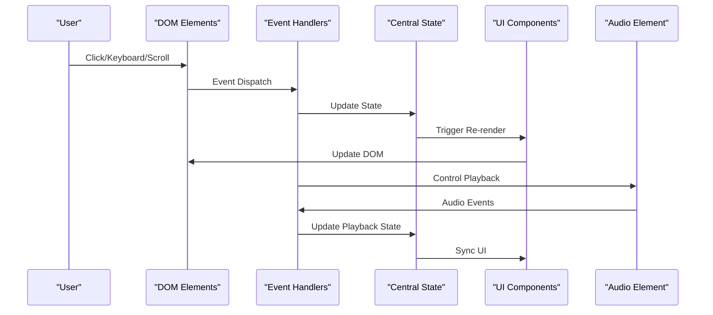
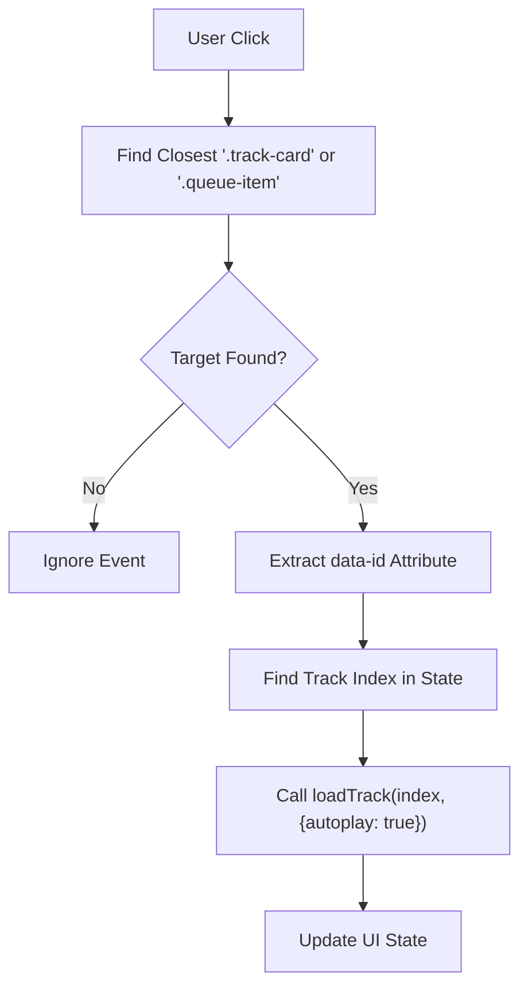
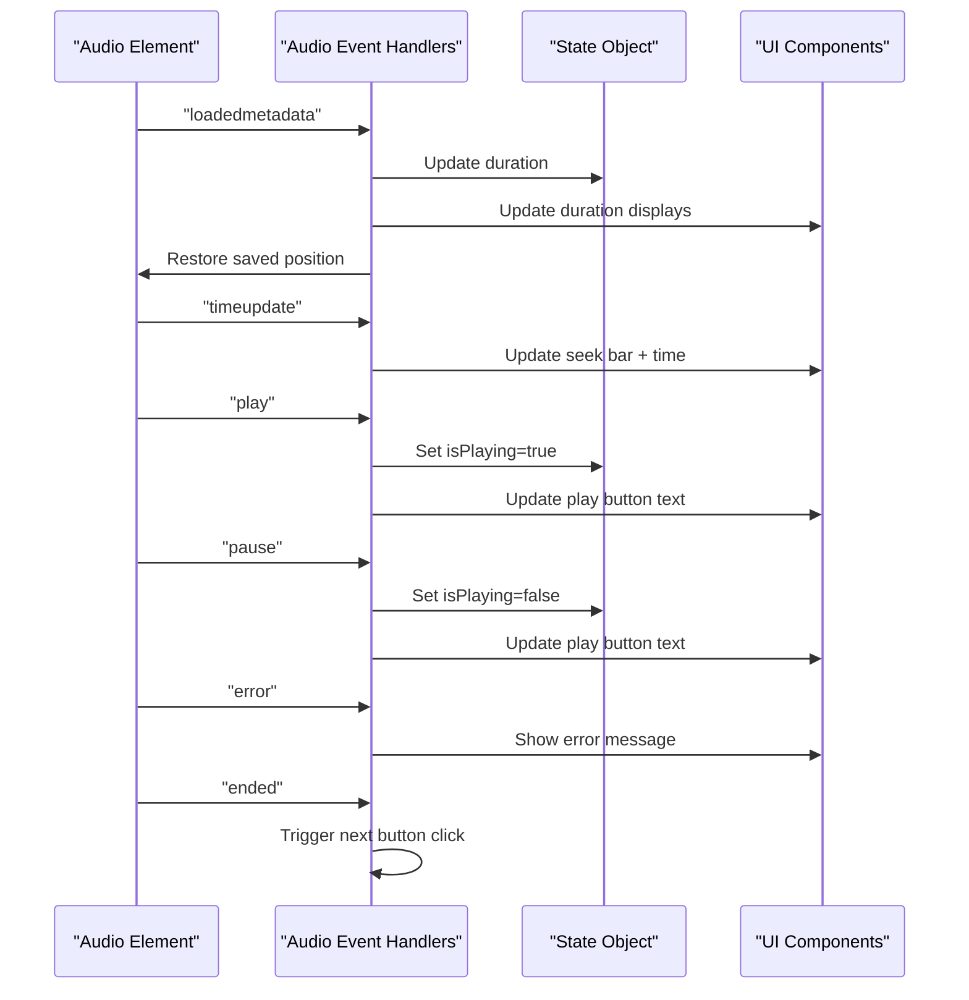
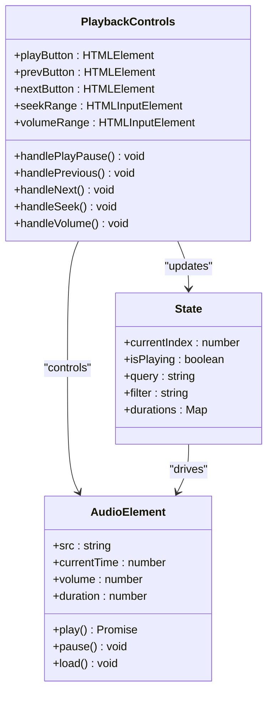
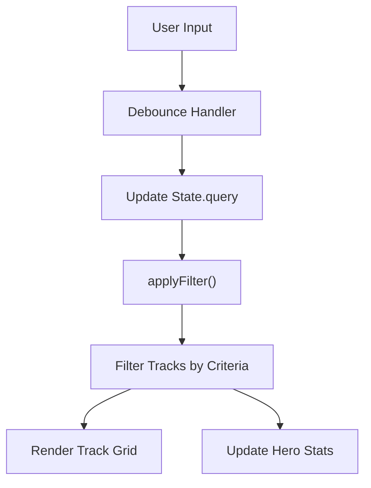
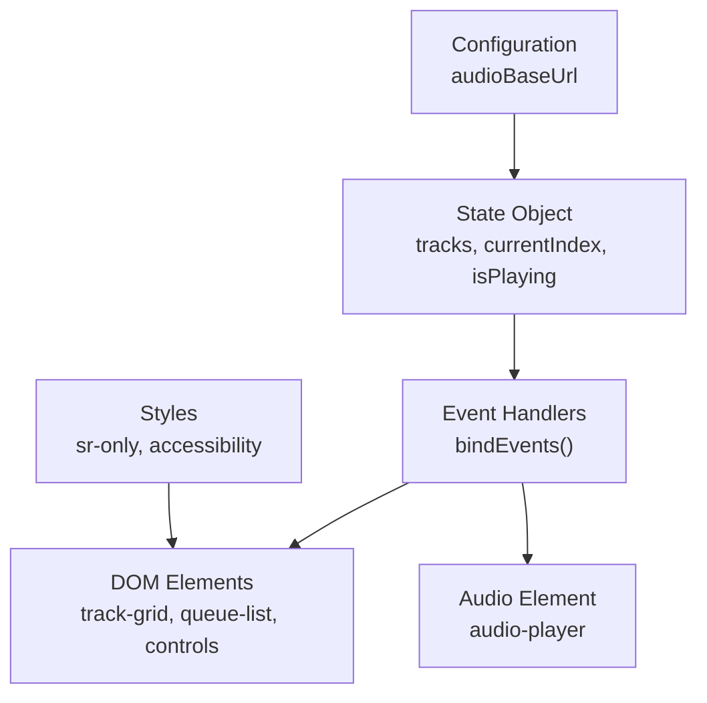

# Event Handling System

<cite>
**Referenced Files in This Document**
- [app.js](file://app.js)
- [index.html](file://index.html)
- [config.js](file://config.js)
- [styles.css](file://styles.css)
- [README.md](file://README.md)
</cite>

## Table of Contents
1. [Introduction](#introduction)
2. [Project Structure](#project-structure)
3. [Core Components](#core-components)
4. [Architecture Overview](#architecture-overview)
5. [Detailed Component Analysis](#detailed-component-analysis)
6. [Dependency Analysis](#dependency-analysis)
7. [Performance Considerations](#performance-considerations)
8. [Troubleshooting Guide](#troubleshooting-guide)
9. [Conclusion](#conclusion)

## Introduction
This document describes the event handling system built on observer pattern principles for user interaction management in the MusicLab-IA web audio player. The system registers listeners for track selection, queue navigation, filtering, search input, playback controls, seeking, and volume adjustment. It demonstrates event delegation patterns used for track cards and queue items, documents audio event handlers for metadata loading, time updates, play/pause states, errors, and completion, and explains state synchronization mechanisms that keep the UI consistent with application state. Accessibility features including ARIA attributes and keyboard navigation support are documented along with practical examples of event flow, error handling strategies, and extension patterns for adding new interactions.

## Project Structure
The event handling system spans three primary files:
- HTML defines the DOM structure and accessibility attributes
- JavaScript implements the observer-based event registration and state management
- CSS provides styling and accessibility utilities (screen reader helpers)

**Diagram sources**
- [index.html:1-318](file://index.html#L1-L318)
- [app.js:1-590](file://app.js#L1-L590)
- [config.js:1-7](file://config.js#L1-L7)
- [styles.css:1-543](file://styles.css#L1-L543)

**Section sources**
- [index.html:1-318](file://index.html#L1-L318)
- [app.js:1-590](file://app.js#L1-L590)
- [config.js:1-7](file://config.js#L1-L7)
- [styles.css:1-543](file://styles.css#L1-L543)
- [README.md:1-27](file://README.md#L1-L27)

## Core Components
The event handling system centers around a central state object and a binding function that registers observers for various UI interactions and audio events. Key components include:

- Central state object containing tracks, filters, current index, and playback flags
- Audio element for media playback and event propagation
- UI containers for track grid, queue list, and playback controls
- Filter chips and search input for library navigation
- About panel toggle with ARIA expanded state management

The system follows observer pattern principles by:
- Registering event listeners once during initialization
- Using event delegation to minimize listener overhead
- Synchronizing UI state with application state through centralized handlers
- Propagating state changes to multiple UI components

**Section sources**
- [app.js:1-590](file://app.js#L1-L590)
- [index.html:1-318](file://index.html#L1-L318)

## Architecture Overview
The event handling architecture employs a layered observer pattern:

**Diagram sources**
- [app.js:384-519](file://app.js#L384-L519)
- [index.html:1-318](file://index.html#L1-L318)

The architecture ensures loose coupling between UI components and state management while maintaining consistent synchronization across the application.

## Detailed Component Analysis

### Event Registration System
The `bindEvents()` function serves as the central hub for registering all event listeners. It establishes observer relationships between UI elements and state management functions.

Key responsibilities:
- About panel toggle with ARIA expanded state management
- Track selection via event delegation on track cards
- Queue navigation via event delegation on queue items
- Library filtering through filter chip interactions
- Real-time search input handling
- Playback control buttons (play/pause, previous, next)
- Audio element event handlers for metadata, time updates, play/pause, error, and ended states
- Seek bar and volume control synchronization

**Section sources**
- [app.js:384-519](file://app.js#L384-L519)

### Event Delegation Patterns
The system uses event delegation for track cards and queue items to minimize memory overhead and handle dynamic content efficiently.

Track Card Delegation:
- Parent container listens for click events
- Target element identification using closest() method
- Data attribute extraction for track identification
- State update and autoplay initiation

Queue Item Delegation:
- Similar pattern to track cards with queue-specific styling
- Maintains consistent user experience across both lists

**Diagram sources**
- [app.js:392-410](file://app.js#L392-L410)

**Section sources**
- [app.js:392-410](file://app.js#L392-L410)

### Audio Event Handlers
The audio element triggers several events that drive state synchronization and UI updates:

Metadata Loading:
- Updates track duration in state and UI
- Restores previously saved playback position
- Triggers grid and queue re-rendering

Time Updates:
- Synchronizes seek bar position
- Updates current time display
- Persists current playback position

Playback State Changes:
- Play event sets playing flag and starts visualization
- Pause event clears playing flag and idle visualization

Error Handling:
- Logs audio loading errors
- Displays fatal error message to user
- Prevents further playback attempts

End of Track:
- Automatically advances to next track

**Diagram sources**
- [app.js:458-506](file://app.js#L458-L506)

**Section sources**
- [app.js:458-506](file://app.js#L458-L506)

### State Synchronization Mechanisms
The system maintains UI consistency through several synchronization strategies:

Centralized State Updates:
- All UI modifications occur through state mutations
- UI rendering functions called after state changes
- Consistent updates across multiple components

Local Storage Persistence:
- Current track ID, volume, and playback position persisted
- Restored on application restart
- Ensures continuity across sessions

Real-time Synchronization:
- Immediate UI updates for user actions
- Debounced updates for frequent events (search input)
- Batched rendering for performance optimization

**Section sources**
- [app.js:544-554](file://app.js#L544-L554)
- [app.js:578-582](file://app.js#L578-L582)

### Keyboard Navigation and Accessibility
The application implements comprehensive accessibility features:

ARIA Attributes:
- `aria-expanded` on about toggle controls panel visibility
- `aria-controls` links toggle to panel content
- `aria-hidden` on visualizer canvas prevents screen reader interference
- `aria-describedby` for enhanced labeling

Screen Reader Support:
- Hidden labels for search field (`sr-only` class)
- Descriptive button text for all interactive elements
- Proper semantic markup for navigation elements

Focus Management:
- Logical tab order through DOM structure
- Clear visual focus indicators via CSS transitions
- Predictable keyboard navigation patterns

**Section sources**
- [index.html:22-24](file://index.html#L22-L24)
- [index.html:41-43](file://index.html#L41-L43)
- [index.html:211-219](file://index.html#L211-L219)
- [styles.css:491-501](file://styles.css#L491-L501)

### Playback Controls and Media Interaction
The system provides comprehensive media control capabilities:

Primary Controls:
- Play/Pause button toggles playback state
- Previous/Next buttons handle track navigation
- Automatic advancement on track completion

Seeking and Volume:
- Range input for precise seeking
- Continuous volume adjustment
- Real-time feedback for both controls

**Diagram sources**
- [app.js:426-456](file://app.js#L426-L456)
- [app.js:508-518](file://app.js#L508-L518)

**Section sources**
- [app.js:426-456](file://app.js#L426-L456)
- [app.js:508-518](file://app.js#L508-L518)

### Filtering and Search System
The filtering mechanism provides efficient library navigation:

Filter Chips:
- Active state management with visual feedback
- Real-time track filtering based on criteria
- Category-based filtering (all, long, short, recent)

Search Input:
- Debounced input handling for performance
- Case-insensitive text matching
- Multi-field search across title and source

**Diagram sources**
- [app.js:106-131](file://app.js#L106-L131)
- [app.js:421-424](file://app.js#L421-L424)

**Section sources**
- [app.js:106-131](file://app.js#L106-L131)
- [app.js:421-424](file://app.js#L421-L424)

## Dependency Analysis
The event handling system exhibits clean separation of concerns with minimal coupling:

**Diagram sources**
- [app.js:1-590](file://app.js#L1-L590)
- [config.js:1-7](file://config.js#L1-L7)
- [styles.css:491-501](file://styles.css#L491-L501)

Key dependency characteristics:
- Low coupling between UI and state management
- Event delegation reduces individual listener overhead
- Centralized configuration via global object
- Modular event handler organization

**Section sources**
- [app.js:1-590](file://app.js#L1-L590)
- [config.js:1-7](file://config.js#L1-L7)

## Performance Considerations
The event handling system implements several performance optimizations:

Memory Efficiency:
- Event delegation minimizes listener count
- Single handler per container element
- Efficient DOM traversal using closest()

Rendering Optimization:
- Batched UI updates after state changes
- Debounced search input handling
- Conditional rendering for empty states

Audio Performance:
- Metadata preloading for duration information
- Lazy audio graph initialization
- Efficient visualization rendering with requestAnimationFrame

Storage Efficiency:
- Local storage persistence for user preferences
- Minimal data duplication in state object
- Efficient track ID mapping

## Troubleshooting Guide

### Common Event Issues
Audio Loading Failures:
- Verify audio base URL configuration
- Check network connectivity and CORS settings
- Ensure audio files are accessible via configured endpoint

Event Listener Problems:
- Confirm DOM elements exist before binding
- Check for proper event delegation selectors
- Validate that event targets match expected classes

State Synchronization Errors:
- Monitor for race conditions in async operations
- Verify localStorage availability and permissions
- Check for infinite recursion in event handlers

### Debug Strategies
Console Logging:
- Enable detailed logging for event dispatch
- Monitor state transitions after each handler
- Track audio element state changes

DOM Inspection:
- Verify event delegation target matching
- Check ARIA attribute updates
- Validate CSS class toggling for active states

Performance Monitoring:
- Measure event handler execution time
- Monitor memory usage with event listeners
- Track rendering performance impact

**Section sources**
- [app.js:499-502](file://app.js#L499-L502)
- [app.js:578-582](file://app.js#L578-L582)

## Conclusion
The MusicLab-IA event handling system demonstrates robust implementation of observer pattern principles for user interaction management. Through centralized event registration, efficient delegation patterns, comprehensive audio event handling, and strict state synchronization, the system provides a responsive and accessible user experience. The modular architecture supports easy extension with new interactions while maintaining performance and reliability. The implementation showcases best practices for modern web audio applications, including proper accessibility support, error handling strategies, and performance optimizations.