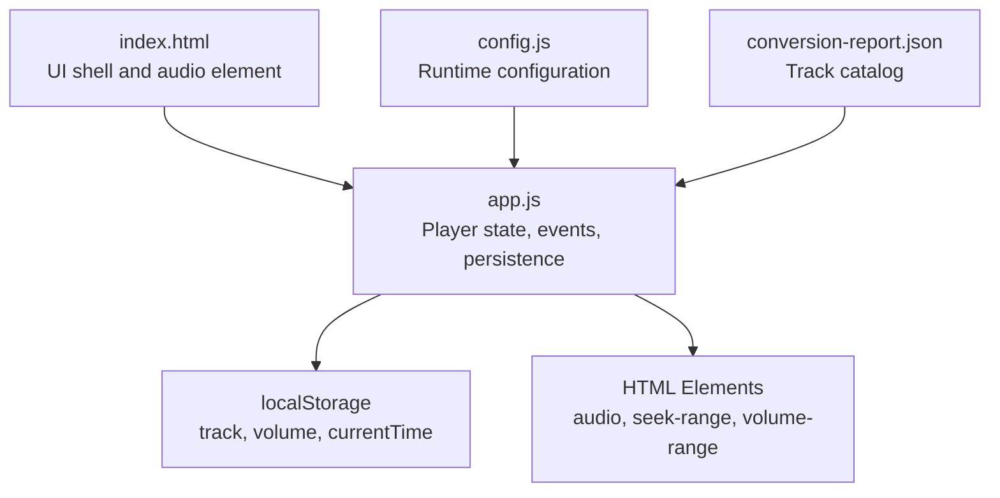
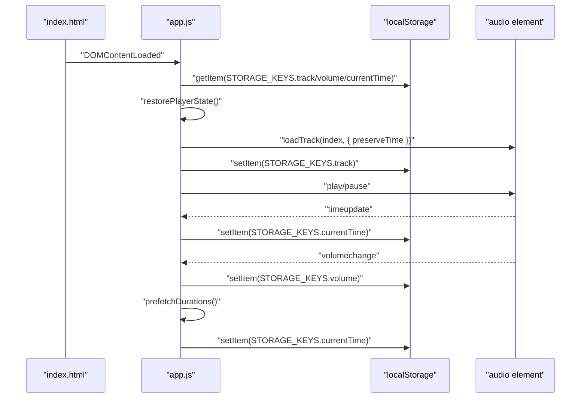
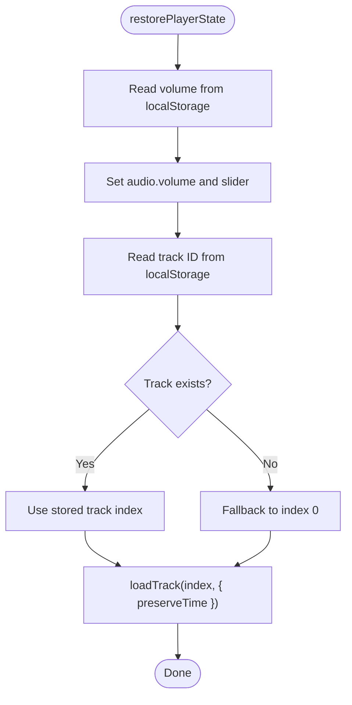
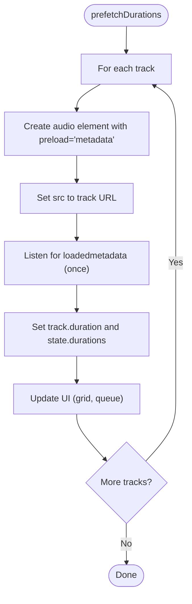
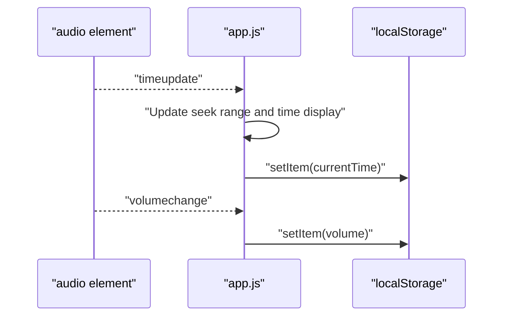
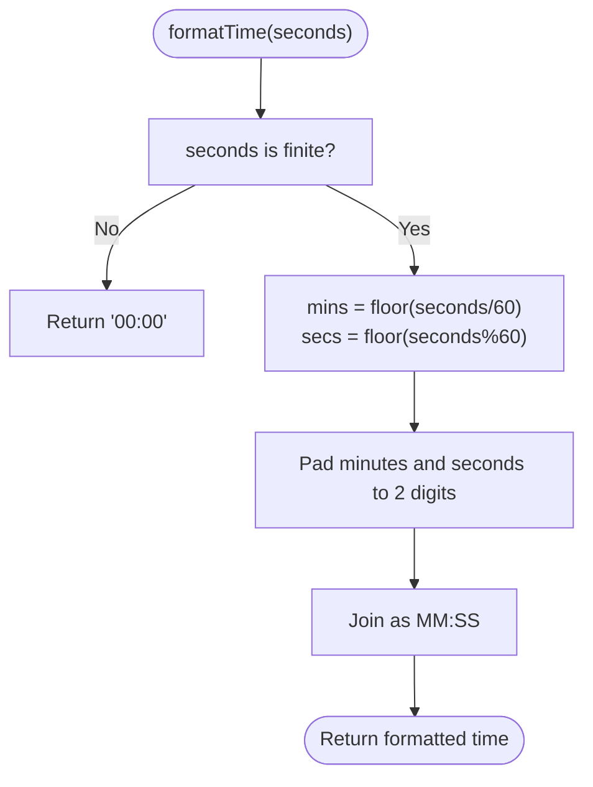
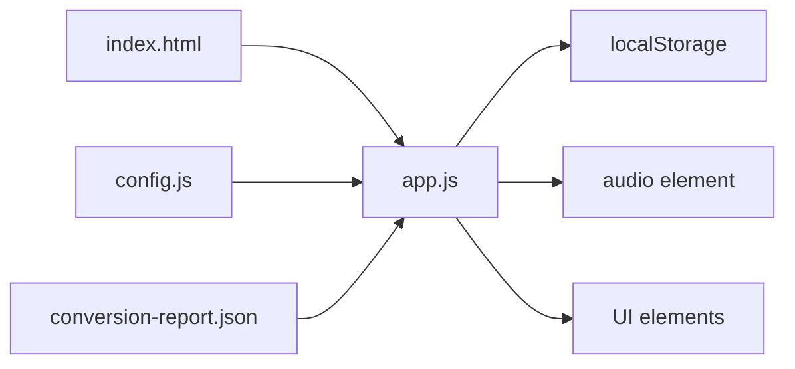

# Persistence Layer

<cite>
**Referenced Files in This Document**
- [app.js](file://app.js)
- [index.html](file://index.html)
- [config.js](file://config.js)
- [styles.css](file://styles.css)
- [conversion-report.json](file://conversion-report.json)
</cite>

## Table of Contents
1. [Introduction](#introduction)
2. [Project Structure](#project-structure)
3. [Core Components](#core-components)
4. [Architecture Overview](#architecture-overview)
5. [Detailed Component Analysis](#detailed-component-analysis)
6. [Dependency Analysis](#dependency-analysis)
7. [Performance Considerations](#performance-considerations)
8. [Troubleshooting Guide](#troubleshooting-guide)
9. [Conclusion](#conclusion)

## Introduction
This document describes the localStorage-based persistence layer that manages user preferences and playback state for the MusicLab-IA player. It covers the storage keys used to persist track selection, volume, and playback position, the restoration of previous sessions, preloading of track metadata for performance, and the automatic persistence triggered by events such as time updates and volume changes. It also documents the time formatting utility and palette generation seed function, and provides guidance on state serialization, migration strategies, and handling localStorage quota exceeded scenarios.

## Project Structure
The persistence layer is implemented in a single client-side JavaScript module with HTML and CSS assets. The key runtime elements are:
- Player state and UI bindings
- Storage keys for track, volume, and current time
- Event handlers for time updates and volume changes
- Restoration of player state on startup
- Prefetching of track durations for responsive UI

**Diagram sources**
- [index.html:242](file://index.html#L242)
- [app.js:11](file://app.js#L11)
- [app.js:50](file://app.js#L50)
- [app.js:544](file://app.js#L544)
- [app.js:556](file://app.js#L556)
- [app.js:477](file://app.js#L477)
- [app.js:515](file://app.js#L515)

**Section sources**
- [index.html:1-318](file://index.html#L1-L318)
- [app.js:1-590](file://app.js#L1-L590)
- [config.js:1-7](file://config.js#L1-L7)
- [conversion-report.json:1-317](file://conversion-report.json#L1-L317)

## Core Components
- STORAGE_KEYS: Defines the localStorage identifiers for persistent data:
  - Track identifier
  - Volume level
  - Current playback position
- restorePlayerState(): Restores volume, track selection, and playback position from localStorage.
- prefetchDurations(): Preloads track durations to improve UI responsiveness.
- Automatic persistence:
  - timeupdate handler persists current time
  - volumechange handler persists volume level
- Utility functions:
  - formatTime(): Formats seconds into MM:SS display
  - hashString(): Generates numeric seed for palette generation

**Section sources**
- [app.js:50-58](file://app.js#L50-L58)
- [app.js:544-554](file://app.js#L544-L554)
- [app.js:556-576](file://app.js#L556-L576)
- [app.js:477-485](file://app.js#L477-L485)
- [app.js:515-518](file://app.js#L515-L518)
- [app.js:70-78](file://app.js#L70-L78)
- [app.js:56-58](file://app.js#L56-L58)

## Architecture Overview
The persistence layer integrates with the player lifecycle:
- On page load, the catalog is loaded and the player state is restored from localStorage.
- During playback, current time and volume are persisted automatically on change events.
- Track durations are prefetched to populate UI elements immediately.

**Diagram sources**
- [index.html:242](file://index.html#L242)
- [app.js:544-554](file://app.js#L544-L554)
- [app.js:231-254](file://app.js#L231-L254)
- [app.js:477-485](file://app.js#L477-L485)
- [app.js:515-518](file://app.js#L515-L518)
- [app.js:556-576](file://app.js#L556-L576)

## Detailed Component Analysis

### STORAGE_KEYS Constants
Defines the keys used to persist state in localStorage:
- Track identifier key
- Volume key
- Current time key

These keys are used throughout the code to read/write persistent values.

**Section sources**
- [app.js:50-54](file://app.js#L50-L54)

### restorePlayerState() Function
Restores the previous session’s playback state:
- Sets the audio volume from localStorage or defaults to a safe value.
- Clears the current time when switching tracks.
- Resolves the previously selected track by ID and loads it while preserving time.
- Updates UI elements to reflect the restored state.

**Diagram sources**
- [app.js:544-554](file://app.js#L544-L554)
- [app.js:231-254](file://app.js#L231-L254)

**Section sources**
- [app.js:544-554](file://app.js#L544-L554)

### prefetchDurations() Function
Preloads track durations to improve UI responsiveness:
- Iterates through all tracks and creates temporary audio elements.
- Sets preload to metadata to fetch duration efficiently.
- Updates the state and UI when metadata is loaded.

**Diagram sources**
- [app.js:556-576](file://app.js#L556-L576)

**Section sources**
- [app.js:556-576](file://app.js#L556-L576)

### Automatic State Persistence Handlers
- timeupdate handler:
  - Updates seek range and current time display.
  - Persists current time to localStorage on every update.
- volumechange handler:
  - Persists the new volume level to localStorage.

**Diagram sources**
- [app.js:477-485](file://app.js#L477-L485)
- [app.js:515-518](file://app.js#L515-L518)

**Section sources**
- [app.js:477-485](file://app.js#L477-L485)
- [app.js:515-518](file://app.js#L515-L518)

### Utility Functions
- formatTime(seconds):
  - Converts seconds to MM:SS string with leading zeros.
  - Handles non-finite inputs gracefully.
- hashString(value):
  - Computes a numeric hash from a string to seed palette generation.

**Diagram sources**
- [app.js:70-78](file://app.js#L70-L78)

**Section sources**
- [app.js:70-78](file://app.js#L70-L78)
- [app.js:56-58](file://app.js#L56-L58)

## Dependency Analysis
The persistence layer depends on:
- HTML audio element for playback and events
- localStorage for durable storage
- Catalog data for track metadata and URLs
- UI elements for binding and rendering

**Diagram sources**
- [index.html:242](file://index.html#L242)
- [app.js:11](file://app.js#L11)
- [app.js:50](file://app.js#L50)
- [app.js:544](file://app.js#L544)
- [app.js:556](file://app.js#L556)

**Section sources**
- [index.html:1-318](file://index.html#L1-L318)
- [app.js:1-590](file://app.js#L1-L590)
- [config.js:1-7](file://config.js#L1-L7)
- [conversion-report.json:1-317](file://conversion-report.json#L1-L317)

## Performance Considerations
- Prefetching durations reduces UI latency by populating track durations before user interaction.
- Persisting current time on every timeupdate ensures minimal loss on reload, but frequent writes can impact performance. Consider debouncing if needed.
- Using preload="metadata" for duration prefetch avoids downloading full audio content.

[No sources needed since this section provides general guidance]

## Troubleshooting Guide
Common issues and resolutions:
- localStorage quota exceeded:
  - Symptoms: Writes fail silently or throw errors.
  - Mitigations:
    - Clear old entries or reduce payload size.
    - Implement graceful degradation by disabling persistence temporarily.
    - Use try/catch around localStorage operations and log warnings.
- Corrupted or missing keys:
  - Restore defaults when values are invalid or missing.
  - Example: If volume is NaN, fallback to a sensible default.
- Track mismatch:
  - If stored track ID does not exist, fall back to the first track.

**Section sources**
- [app.js:544-554](file://app.js#L544-L554)
- [app.js:477-485](file://app.js#L477-L485)
- [app.js:515-518](file://app.js#L515-L518)

## Conclusion
The persistence layer provides robust, automatic, and user-friendly state management for the MusicLab-IA player. It restores previous sessions seamlessly, optimizes UI responsiveness through prefetching, and maintains accurate playback position and volume across browser sessions. By leveraging localStorage and event-driven persistence, it balances simplicity and reliability for a smooth user experience.