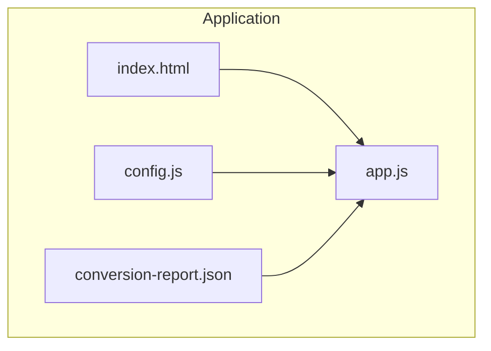
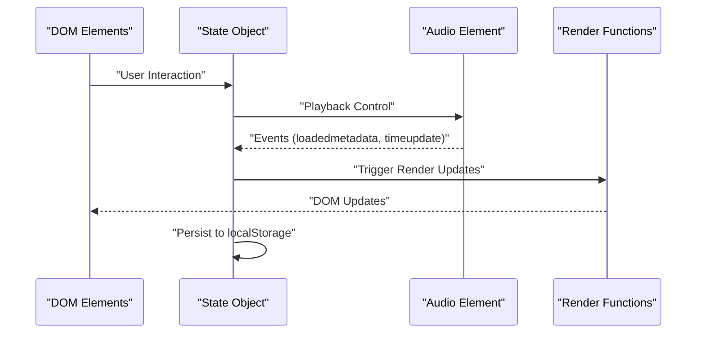
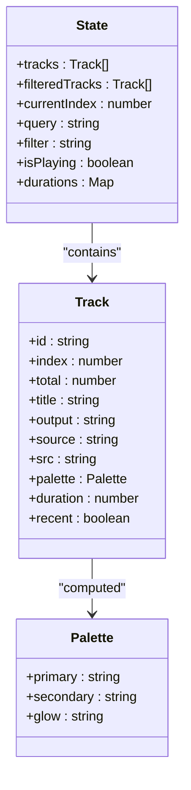
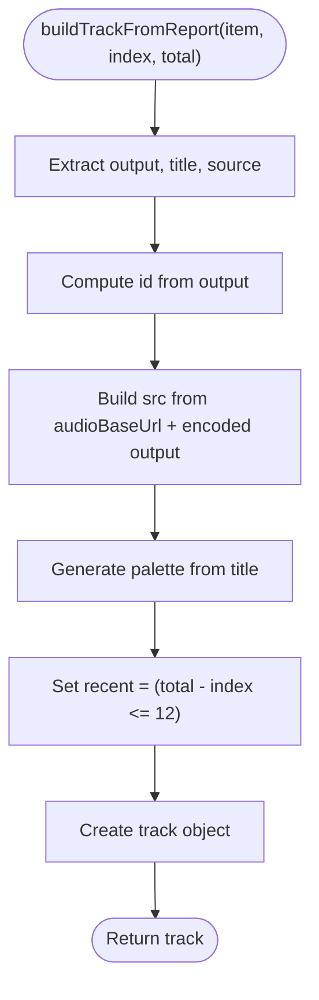
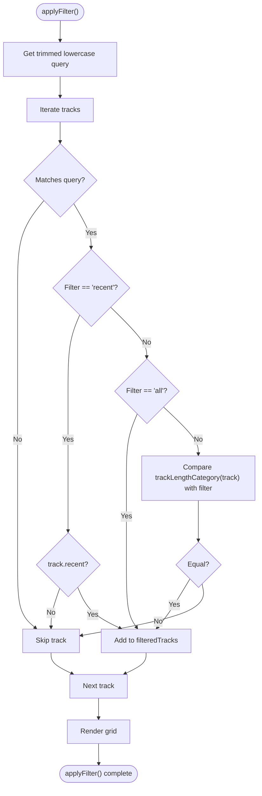
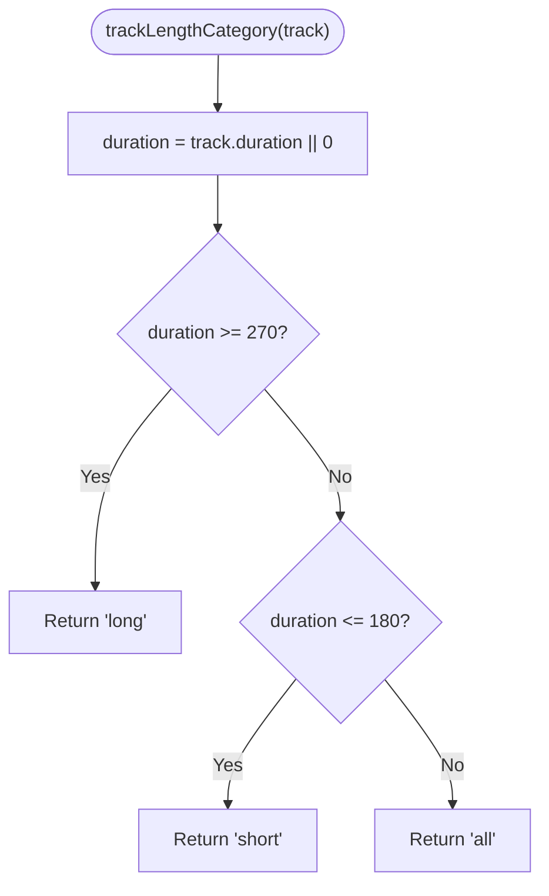
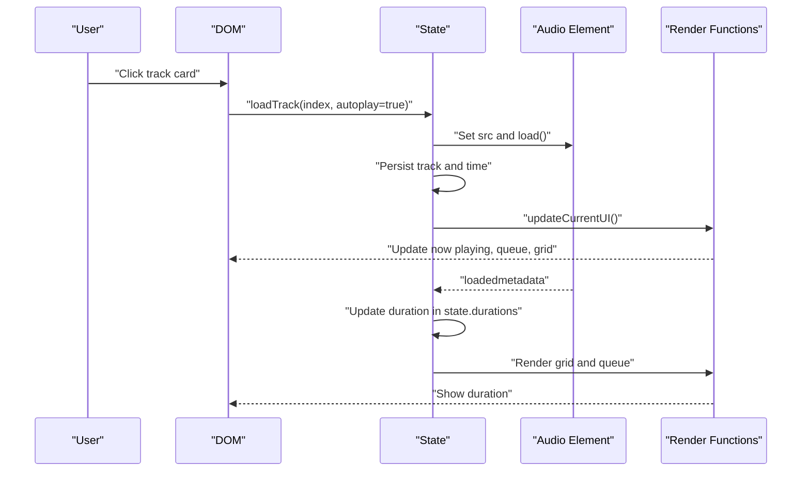
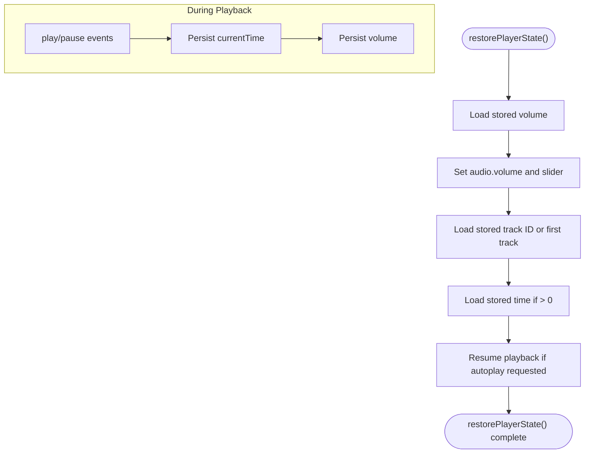
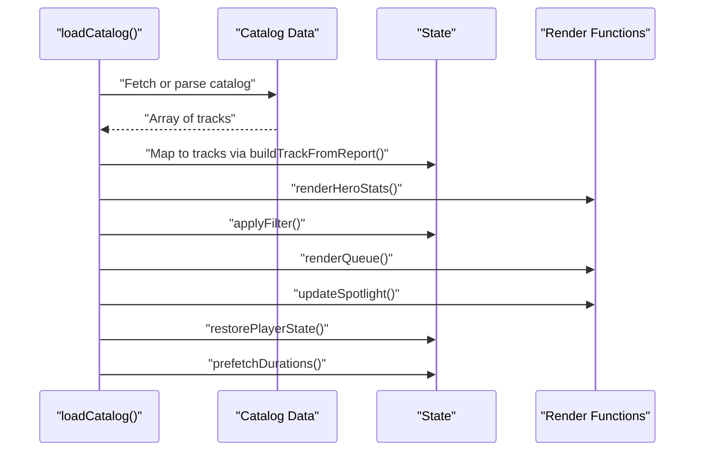
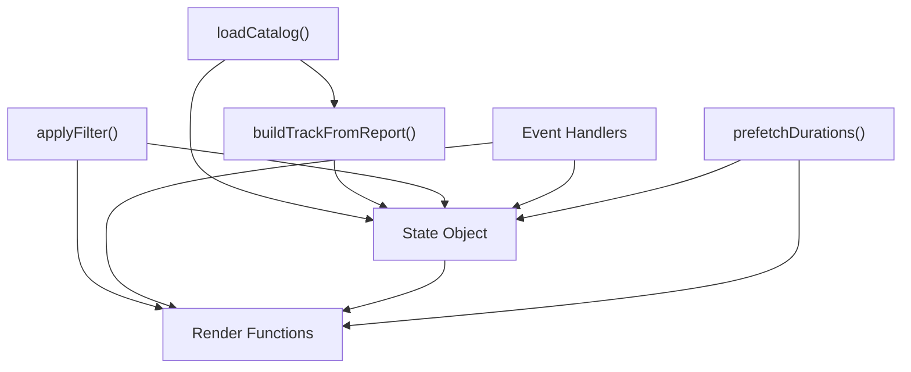

# State Management System

<cite>
**Referenced Files in This Document**
- [app.js](file://app.js)
- [index.html](file://index.html)
- [config.js](file://config.js)
- [conversion-report.json](file://conversion-report.json)
</cite>

## Table of Contents
1. [Introduction](#introduction)
2. [Project Structure](#project-structure)
3. [Core Components](#core-components)
4. [Architecture Overview](#architecture-overview)
5. [Detailed Component Analysis](#detailed-component-analysis)
6. [Dependency Analysis](#dependency-analysis)
7. [Performance Considerations](#performance-considerations)
8. [Troubleshooting Guide](#troubleshooting-guide)
9. [Conclusion](#conclusion)

## Introduction
This document describes the centralized state management system used by the MusicLab-IA application. The state object coordinates all playback, filtering, rendering, and persistence behaviors across the player interface. It encapsulates the track library, current playback position, search query, filter selection, and audio metadata, while synchronizing UI updates and browser storage.

## Project Structure
The state management is implemented in a single JavaScript module that integrates with HTML markup and configuration. The key files are:
- app.js: Central state object, state update functions, UI binding, and persistence logic
- index.html: DOM elements bound to state and rendered by state-driven functions
- config.js: Application configuration (audio base URL)
- conversion-report.json: Embedded catalog data used to initialize the state

**Diagram sources**
- [app.js:1-590](file://app.js#L1-L590)
- [index.html:1-318](file://index.html#L1-L318)
- [config.js:1-7](file://config.js#L1-L7)
- [conversion-report.json:1-317](file://conversion-report.json#L1-L317)

**Section sources**
- [app.js:1-590](file://app.js#L1-L590)
- [index.html:1-318](file://index.html#L1-L318)
- [config.js:1-7](file://config.js#L1-L7)
- [conversion-report.json:1-317](file://conversion-report.json#L1-L317)

## Core Components
The state object is a central data container with the following properties:
- tracks: Array of normalized track objects built from the catalog
- filteredTracks: Subset of tracks after applying filters and search
- currentIndex: Index of currently playing track (-1 indicates no track)
- query: Text search string used to filter titles/sources
- filter: Active filter category ("all", "long", "short", "recent")
- isPlaying: Boolean flag indicating playback state
- durations: Map of track ID to duration (seconds)

Initialization and persistence keys:
- STORAGE_KEYS: Keys for localStorage entries controlling track, volume, and current time

Key functions:
- buildTrackFromReport(): Factory that transforms catalog entries into track objects with computed properties
- applyFilter(): Computes filteredTracks based on query and filter
- loadTrack(index, options): Loads a track by index and updates UI
- playCurrent()/pauseCurrent(): Controls playback state and UI
- restorePlayerState(): Restores persisted state on page load
- prefetchDurations(): Preloads durations for all tracks

**Section sources**
- [app.js:1-590](file://app.js#L1-L590)

## Architecture Overview
The state management architecture follows a centralized controller pattern:
- State object holds all reactive data
- Event handlers mutate state and trigger UI updates
- UI functions render based on state snapshots
- Persistence layer synchronizes state to localStorage

**Diagram sources**
- [app.js:384-519](file://app.js#L384-L519)

## Detailed Component Analysis

### State Object and Initialization
The state object is declared globally and initialized with default values. It is populated during catalog loading and updated throughout playback.

- Tracks array: Built from catalog data using the track factory
- Filtered tracks: Derived from tracks based on query and filter
- Current index: Managed by loadTrack and navigation controls
- Query and filter: Updated by search input and filter buttons
- Playback state: Managed by play/pause toggles and audio events
- Durations map: Populated from metadata and prefetching

**Diagram sources**
- [app.js:1-104](file://app.js#L1-L104)

**Section sources**
- [app.js:1-9](file://app.js#L1-L9)
- [app.js:91-104](file://app.js#L91-L104)

### Track Factory: buildTrackFromReport()
The factory function transforms catalog entries into track objects with computed properties:
- id: Unique identifier derived from output filename
- index/total: Positional metadata for ordering and statistics
- title/source/output: Metadata for display and identification
- src: Full URL constructed from audio base URL and encoded filename
- palette: Generated color scheme based on title hash
- duration: Numeric duration (initially zero)
- recent: Boolean indicating if track is among the latest additions

**Diagram sources**
- [app.js:91-104](file://app.js#L91-L104)

**Section sources**
- [app.js:91-104](file://app.js#L91-L104)

### Filter Application: applyFilter()
The filter function computes filteredTracks by combining:
- Query-based matching against title and source
- Category-based filtering ("all", "long", "short", "recent")
- Length categorization using trackLengthCategory()

**Diagram sources**
- [app.js:106-131](file://app.js#L106-L131)
- [app.js:80-89](file://app.js#L80-L89)

**Section sources**
- [app.js:106-131](file://app.js#L106-L131)
- [app.js:80-89](file://app.js#L80-L89)

### Track Length Categorization
The categorization logic determines whether a track is "long", "short", or "all" based on duration thresholds:
- Duration >= 270 seconds: "long"
- Duration <= 180 seconds: "short"
- Otherwise: "all"

**Diagram sources**
- [app.js:80-89](file://app.js#L80-L89)

**Section sources**
- [app.js:80-89](file://app.js#L80-L89)

### State Update Mechanisms and UI Synchronization
State updates occur through event handlers and lifecycle functions:
- loadTrack(): Updates currentIndex, sets audio.src, resets seek, persists current track and time
- playCurrent()/pauseCurrent(): Toggle isPlaying and update UI text
- Event listeners: loadedmetadata, timeupdate, play, pause, ended, error
- Rendering: renderTrackGrid(), renderQueue(), updateCurrentUI(), updateSpotlight()

**Diagram sources**
- [app.js:231-254](file://app.js#L231-L254)
- [app.js:458-475](file://app.js#L458-L475)
- [app.js:198-214](file://app.js#L198-L214)
- [app.js:133-156](file://app.js#L133-L156)
- [app.js:158-171](file://app.js#L158-L171)

**Section sources**
- [app.js:231-254](file://app.js#L231-L254)
- [app.js:458-475](file://app.js#L458-L475)
- [app.js:198-214](file://app.js#L198-L214)
- [app.js:133-156](file://app.js#L133-L156)
- [app.js:158-171](file://app.js#L158-L171)

### Persistence Patterns with localStorage
The application persists selected state across sessions:
- Track selection: Persist current track ID and restore on load
- Volume: Persist audio volume level
- Current time: Persist last playback position for seamless resume

**Diagram sources**
- [app.js:544-554](file://app.js#L544-L554)
- [app.js:477-485](file://app.js#L477-L485)
- [app.js:515-518](file://app.js#L515-L518)

**Section sources**
- [app.js:544-554](file://app.js#L544-L554)
- [app.js:477-485](file://app.js#L477-L485)
- [app.js:515-518](file://app.js#L515-L518)

### Catalog Loading and Prefetching
The catalog loading process:
- Load catalog from embedded script or external JSON
- Transform each entry into a track object via buildTrackFromReport()
- Initialize UI stats, filters, queue, spotlight, and restore persisted state
- Prefetch durations for all tracks to improve perceived performance

**Diagram sources**
- [app.js:521-542](file://app.js#L521-L542)
- [app.js:556-576](file://app.js#L556-L576)

**Section sources**
- [app.js:521-542](file://app.js#L521-L542)
- [app.js:556-576](file://app.js#L556-L576)

## Dependency Analysis
The state management system exhibits tight coupling between:
- State object and UI rendering functions
- Event handlers and state mutations
- Catalog loader and track factory
- Persistence layer and playback lifecycle

**Diagram sources**
- [app.js:91-104](file://app.js#L91-L104)
- [app.js:106-131](file://app.js#L106-L131)
- [app.js:521-542](file://app.js#L521-L542)
- [app.js:556-576](file://app.js#L556-L576)
- [app.js:384-519](file://app.js#L384-L519)
- [app.js:133-181](file://app.js#L133-L181)

**Section sources**
- [app.js:91-104](file://app.js#L91-L104)
- [app.js:106-131](file://app.js#L106-L131)
- [app.js:521-542](file://app.js#L521-L542)
- [app.js:556-576](file://app.js#L556-L576)
- [app.js:384-519](file://app.js#L384-L519)
- [app.js:133-181](file://app.js#L133-L181)

## Performance Considerations
- Track duration preloading reduces UI latency by avoiding repeated metadata requests
- Efficient filtering uses a single pass over tracks with early exits
- Minimal DOM updates by batching render calls after state changes
- Hash-based palette generation avoids heavy computations per render cycle

## Troubleshooting Guide
Common issues and resolutions:
- No tracks displayed: Verify catalog loading succeeded and filteredTracks is populated
- Duration remains zero: Ensure loadedmetadata event fires and duration is set
- Playback does not resume: Confirm stored time is valid and within bounds
- Filter not applied: Check query trimming and filter button activation

**Section sources**
- [app.js:521-542](file://app.js#L521-L542)
- [app.js:458-475](file://app.js#L458-L475)
- [app.js:544-554](file://app.js#L544-L554)
- [app.js:412-424](file://app.js#L412-L424)

## Conclusion
The MusicLab-IA state management system provides a clean, centralized model for coordinating playback, filtering, rendering, and persistence. Its design enables predictable state transitions, efficient UI updates, and robust user experience across interactions and reloads.