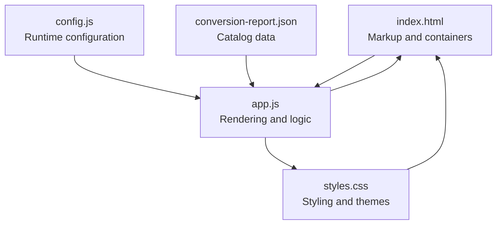
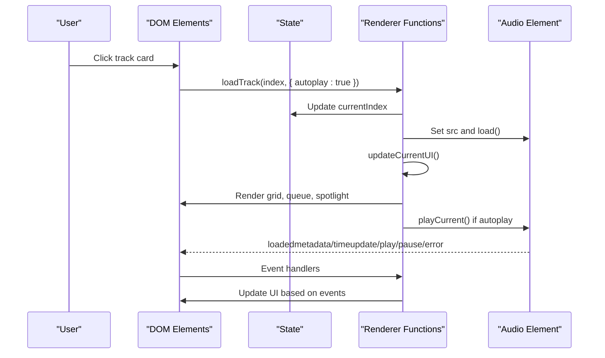
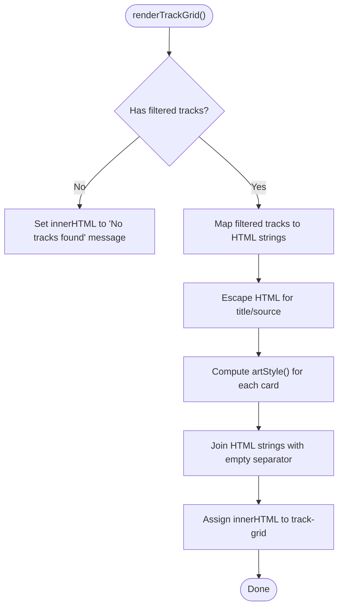
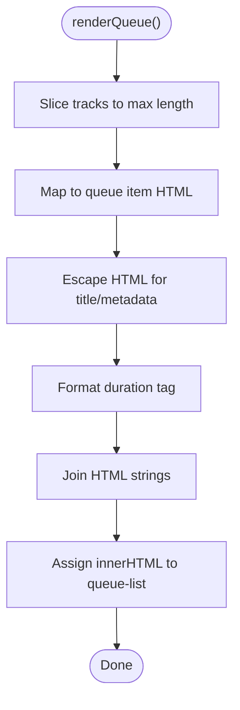
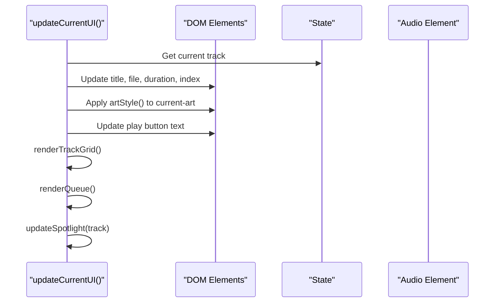
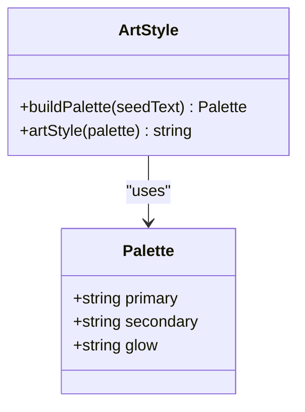
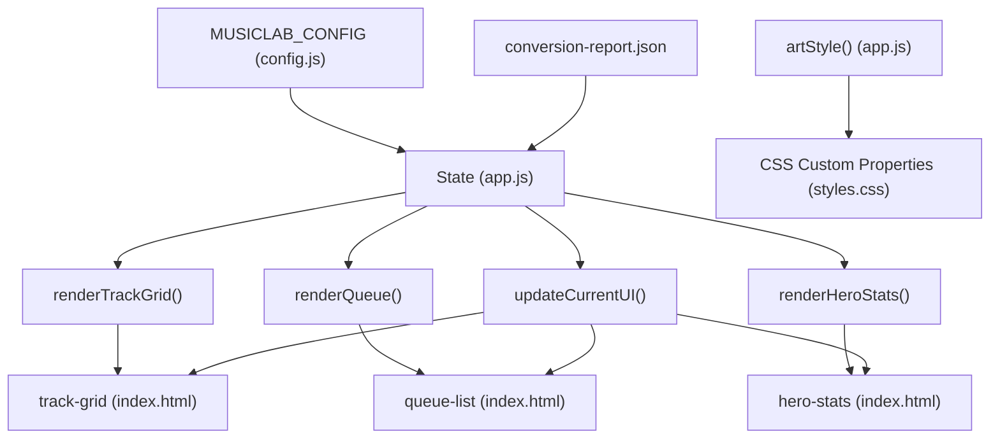

# UI Rendering Framework

<cite>
**Referenced Files in This Document**
- [app.js](file://app.js)
- [index.html](file://index.html)
- [styles.css](file://styles.css)
- [config.js](file://config.js)
- [conversion-report.json](file://conversion-report.json)
</cite>

## Table of Contents
1. [Introduction](#introduction)
2. [Project Structure](#project-structure)
3. [Core Components](#core-components)
4. [Architecture Overview](#architecture-overview)
5. [Detailed Component Analysis](#detailed-component-analysis)
6. [Dependency Analysis](#dependency-analysis)
7. [Performance Considerations](#performance-considerations)
8. [Troubleshooting Guide](#troubleshooting-guide)
9. [Conclusion](#conclusion)

## Introduction
This document describes the dynamic UI rendering framework responsible for DOM manipulation and component updates in the MusicLab-IA application. It focuses on the responsive grid layout rendering, playlist display, catalog statistics, coordinated UI updates, template generation using arrow functions and string interpolation, dynamic theming with CSS custom properties, XSS prevention, and error handling. It also provides examples of component lifecycle, re-rendering patterns, and performance optimization techniques.

## Project Structure
The application follows a minimal, single-page architecture with a clear separation between HTML markup, CSS styling, and JavaScript logic. The rendering framework is implemented in a single module that manages state, DOM updates, and user interactions.

**Diagram sources**
- [index.html:1-318](file://index.html#L1-L318)
- [app.js:1-590](file://app.js#L1-L590)
- [styles.css:1-543](file://styles.css#L1-L543)
- [config.js:1-7](file://config.js#L1-L7)
- [conversion-report.json:1-317](file://conversion-report.json#L1-L317)

**Section sources**
- [index.html:1-318](file://index.html#L1-L318)
- [app.js:1-590](file://app.js#L1-L590)
- [styles.css:1-543](file://styles.css#L1-L543)
- [config.js:1-7](file://config.js#L1-L7)
- [conversion-report.json:1-317](file://conversion-report.json#L1-L317)

## Core Components
This section documents the primary rendering functions and their roles in the UI framework.

- renderTrackGrid(): Renders the responsive grid of track cards based on filtered tracks and current selection.
- renderQueue(): Renders the playlist queue panel with up to a fixed number of items.
- renderHeroStats(): Renders catalog statistics in the hero section.
- updateCurrentUI(): Orchestrates simultaneous updates across multiple UI components when the current track changes.
- Template Generation: Uses arrow functions and string interpolation to generate track cards and queue items.
- Dynamic Theming: artStyle() generates CSS custom properties and gradients for dynamic theming.
- Security: escapeHtml() prevents XSS by escaping unsafe characters.
- Error Handling: renderFatalError() displays user-friendly error messages and disables interactive elements.

**Section sources**
- [app.js:133-181](file://app.js#L133-L181)
- [app.js:198-214](file://app.js#L198-L214)
- [app.js:216-229](file://app.js#L216-L229)
- [app.js:578-582](file://app.js#L578-L582)

## Architecture Overview
The rendering framework is event-driven and state-centric. The state object holds the application data, and UI functions are invoked in response to user actions and lifecycle events. The DOM is updated by generating HTML strings and assigning them to container elements.

**Diagram sources**
- [app.js:231-254](file://app.js#L231-L254)
- [app.js:198-214](file://app.js#L198-L214)
- [app.js:384-519](file://app.js#L384-L519)

## Detailed Component Analysis

### renderTrackGrid(): Responsive Grid Layout
Purpose:
- Generates a responsive grid of track cards based on filtered tracks.
- Highlights the currently playing track.
- Applies dynamic theming via CSS custom properties.

Key behaviors:
- Checks if filtered tracks exist; otherwise renders a message.
- Iterates over filtered tracks and builds HTML strings using arrow functions and string interpolation.
- Uses escapeHtml() to prevent XSS in titles and sources.
- Uses artStyle() to compute dynamic gradients for track cards.

Performance considerations:
- Uses map() to build HTML fragments and join("") to minimize DOM writes.
- Avoids repeated DOM queries inside the loop.

Accessibility:
- Uses semantic article elements with data attributes for identification.

**Section sources**
- [app.js:133-156](file://app.js#L133-L156)
- [app.js:216-229](file://app.js#L216-L229)

#### renderTrackGrid() Flowchart

**Diagram sources**
- [app.js:133-156](file://app.js#L133-L156)

### renderQueue(): Playlist Display
Purpose:
- Renders the queue panel with a limited number of items.
- Highlights the currently playing item.

Key behaviors:
- Slices the tracks array to a fixed maximum length.
- Builds queue items with title, metadata, and duration tag.
- Uses escapeHtml() for safety.
- Applies current track highlighting.

Performance considerations:
- Limits rendered items to reduce DOM size and improve scrolling performance.

**Section sources**
- [app.js:158-171](file://app.js#L158-L171)

#### renderQueue() Flowchart

**Diagram sources**
- [app.js:158-171](file://app.js#L158-L171)

### renderHeroStats(): Catalog Statistics
Purpose:
- Displays catalog statistics in the hero section.

Key behaviors:
- Computes totals and counts for long tracks.
- Renders formatted spans with counts.

**Section sources**
- [app.js:173-181](file://app.js#L173-L181)

### updateCurrentUI(): Coordinated UI Updates
Purpose:
- Orchestrates simultaneous updates across multiple UI components when the current track changes.

Components updated:
- Current track title, file, duration, index.
- Current artwork styling via artStyle().
- Play button text.
- Track grid and queue re-rendering.
- Spotlight panel update.

Lifecycle integration:
- Called after loading a track and after metadata loads.
- Ensures UI consistency across views.

**Section sources**
- [app.js:198-214](file://app.js#L198-L214)

#### updateCurrentUI() Sequence

**Diagram sources**
- [app.js:198-214](file://app.js#L198-L214)

### Template Generation System
Pattern:
- Arrow functions returning template literals for track cards and queue items.
- String interpolation for dynamic values.
- escapeHtml() to sanitize user-visible content.

Benefits:
- Clean separation of presentation logic from DOM manipulation.
- Easy to modify templates without changing control flow.
- Reduces risk of XSS by sanitizing inputs.

Examples:
- Track card template: [app.js:140-155](file://app.js#L140-L155)
- Queue item template: [app.js:159-170](file://app.js#L159-L170)

**Section sources**
- [app.js:140-155](file://app.js#L140-L155)
- [app.js:159-170](file://app.js#L159-L170)
- [app.js:216-222](file://app.js#L216-L222)

### Dynamic Theming with artStyle()
Purpose:
- Generates CSS custom properties and gradients for dynamic theming.

Implementation:
- Uses a palette derived from a seed text (track title).
- Returns inline styles with CSS custom properties for primary, secondary, and glow colors.
- Creates radial and linear gradients for visual depth.

Integration:
- Applied to track cards, current artwork, and spotlight artwork.
- Enables consistent theming across components.

**Section sources**
- [app.js:60-68](file://app.js#L60-L68)
- [app.js:224-229](file://app.js#L224-L229)
- [app.js:183-196](file://app.js#L183-L196)
- [app.js:208](file://app.js#L208)

#### artStyle() Class Diagram

**Diagram sources**
- [app.js:60-68](file://app.js#L60-L68)
- [app.js:224-229](file://app.js#L224-L229)

### XSS Prevention with escapeHtml()
Purpose:
- Prevents cross-site scripting by escaping unsafe characters in user-visible content.

Implementation:
- Replaces ampersand, less-than, greater-than, and quotation marks with HTML entities.

Usage:
- Applied to track titles and sources in templates.
- Also used in error messages.

**Section sources**
- [app.js:216-222](file://app.js#L216-L222)
- [app.js:578-582](file://app.js#L578-L582)

### Error Handling with renderFatalError()
Purpose:
- Displays a user-friendly error message and disables interactive elements when critical failures occur.

Behavior:
- Renders an error message in the track grid.
- Clears the queue list.
- Updates the spotlight description with the error message.

Integration:
- Triggered by audio element error events.
- Also used during catalog loading failures.

**Section sources**
- [app.js:578-582](file://app.js#L578-L582)
- [app.js:499-502](file://app.js#L499-L502)
- [app.js:586-589](file://app.js#L586-L589)

## Dependency Analysis
The rendering framework depends on:
- HTML containers defined in index.html.
- CSS custom properties and theme classes in styles.css.
- Runtime configuration in config.js.
- Catalog data in conversion-report.json.

**Diagram sources**
- [app.js:1-9](file://app.js#L1-L9)
- [app.js:133-181](file://app.js#L133-L181)
- [app.js:198-214](file://app.js#L198-L214)
- [index.html:26-33](file://index.html#L26-L33)
- [styles.css:1-14](file://styles.css#L1-L14)
- [config.js:1-7](file://config.js#L1-L7)
- [conversion-report.json:1-317](file://conversion-report.json#L1-L317)

**Section sources**
- [app.js:1-9](file://app.js#L1-L9)
- [index.html:26-33](file://index.html#L26-L33)
- [styles.css:1-14](file://styles.css#L1-L14)
- [config.js:1-7](file://config.js#L1-L7)
- [conversion-report.json:1-317](file://conversion-report.json#L1-L317)

## Performance Considerations
- Minimize DOM writes: Build HTML strings with map() and join(""), then assign innerHTML once per render function.
- Limit rendered items: renderQueue() slices the tracks array to a fixed maximum to keep the DOM manageable.
- Avoid redundant queries: Store DOM references in module scope (e.g., trackGrid, queueList).
- Efficient filtering: applyFilter() computes filteredTracks once and triggers targeted re-renders.
- Debounce user input: The search input handler calls applyFilter() on each keystroke; consider debouncing for large catalogs.
- Lazy metadata loading: prefetchDurations() probes audio metadata asynchronously to avoid blocking the UI.
- Canvas optimization: drawVisualizer() cancels previous animation frames and uses efficient drawing routines.

[No sources needed since this section provides general guidance]

## Troubleshooting Guide
Common issues and resolutions:
- No tracks displayed:
  - Verify that filteredTracks is populated after applying filters.
  - Check that renderTrackGrid() assigns innerHTML when filteredTracks is empty.
  - Confirm that applyFilter() is called after state.query or state.filter changes.
- Incorrect current track highlighting:
  - Ensure state.currentIndex is set before calling updateCurrentUI().
  - Verify that track IDs match between state and DOM data attributes.
- Theming not applied:
  - Confirm that artStyle() returns valid CSS custom property declarations.
  - Ensure that track cards and current artwork receive the computed styles.
- XSS warnings:
  - Ensure escapeHtml() is applied to all user-visible content in templates.
- Audio errors:
  - Check renderFatalError() is triggered on audio error events.
  - Verify CORS settings and audio URLs configured via MUSICLAB_CONFIG.

**Section sources**
- [app.js:106-131](file://app.js#L106-L131)
- [app.js:133-156](file://app.js#L133-L156)
- [app.js:198-214](file://app.js#L198-L214)
- [app.js:224-229](file://app.js#L224-L229)
- [app.js:216-222](file://app.js#L216-L222)
- [app.js:499-502](file://app.js#L499-L502)
- [app.js:578-582](file://app.js#L578-L582)

## Conclusion
The UI rendering framework employs a clean, state-driven approach with focused rendering functions, efficient template generation, robust security practices, and dynamic theming. By orchestrating updates through updateCurrentUI(), the framework ensures consistent UI state across multiple panels. Performance is optimized through careful DOM manipulation, limited rendering scopes, and asynchronous metadata loading. The modular design facilitates maintenance and extension while preserving a responsive and accessible user experience.