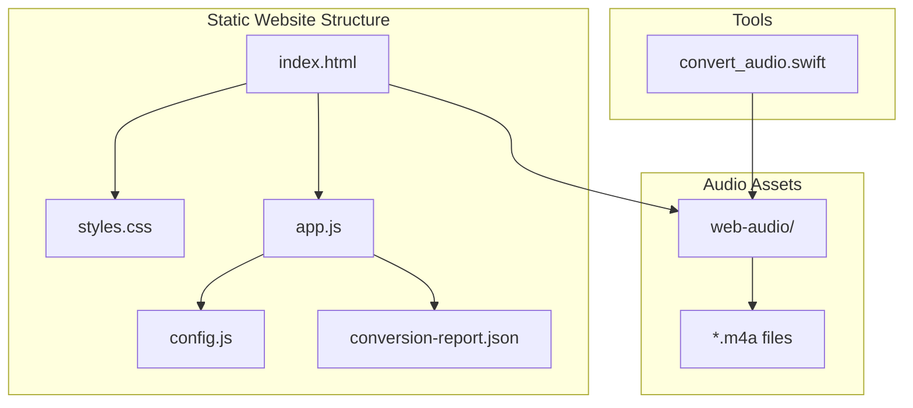
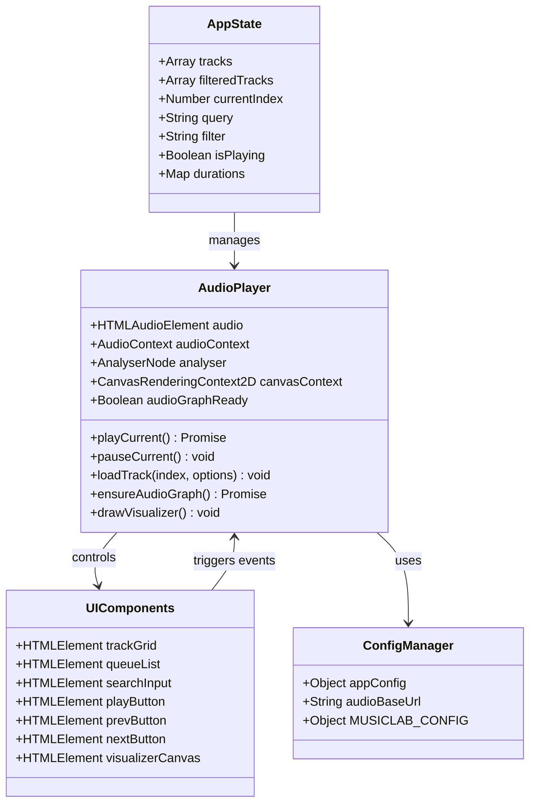
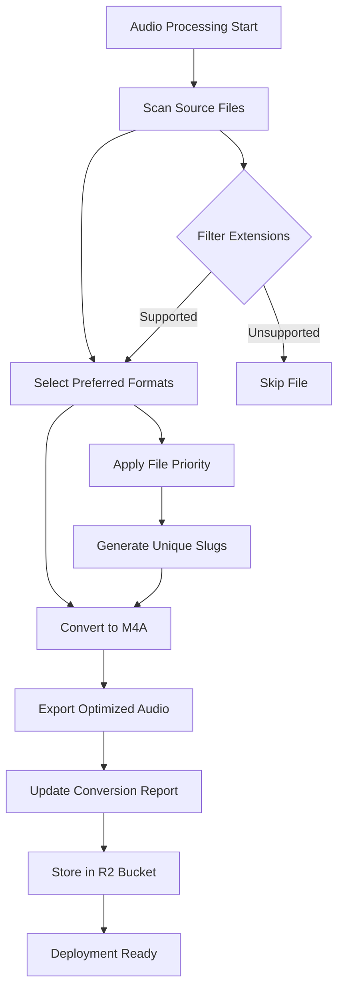
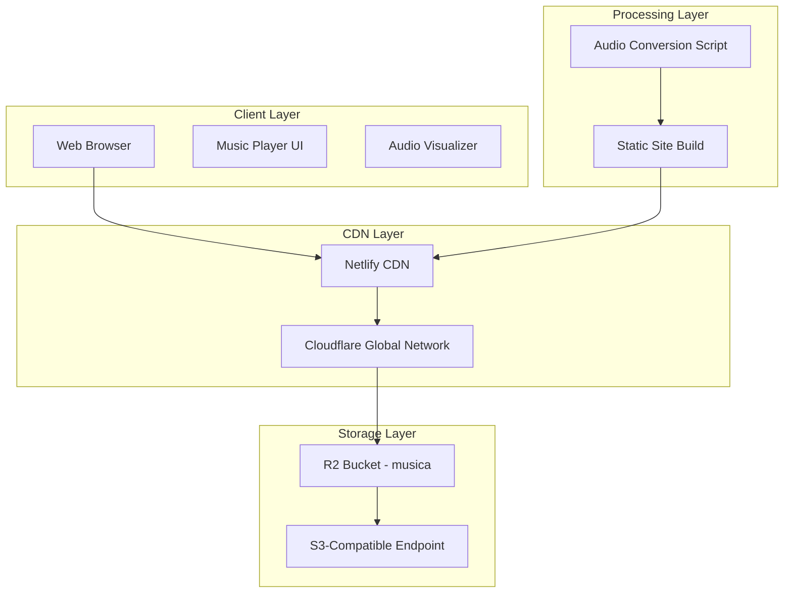
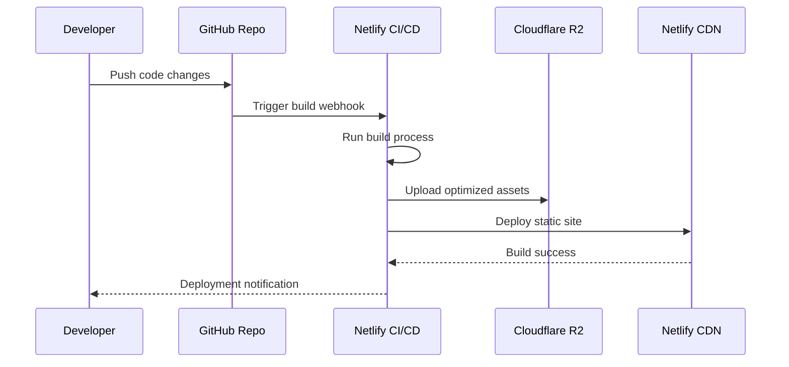
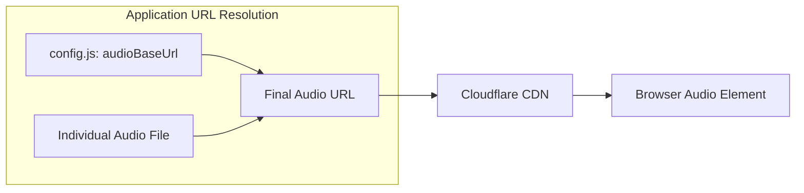
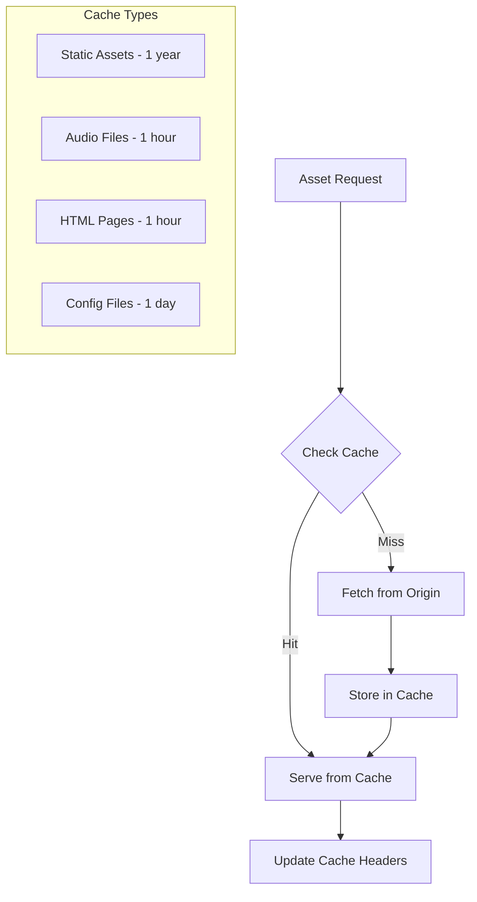
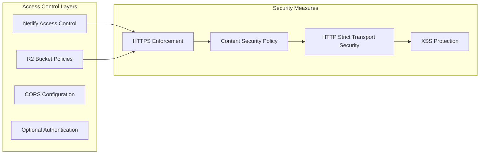
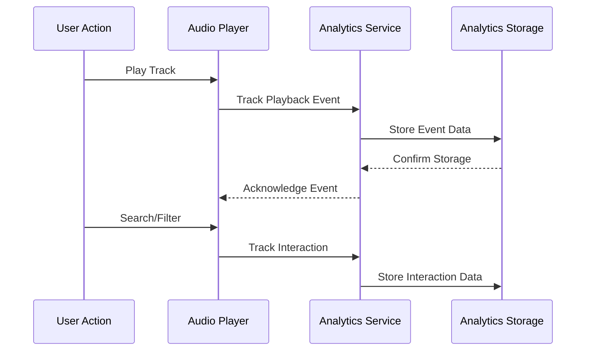
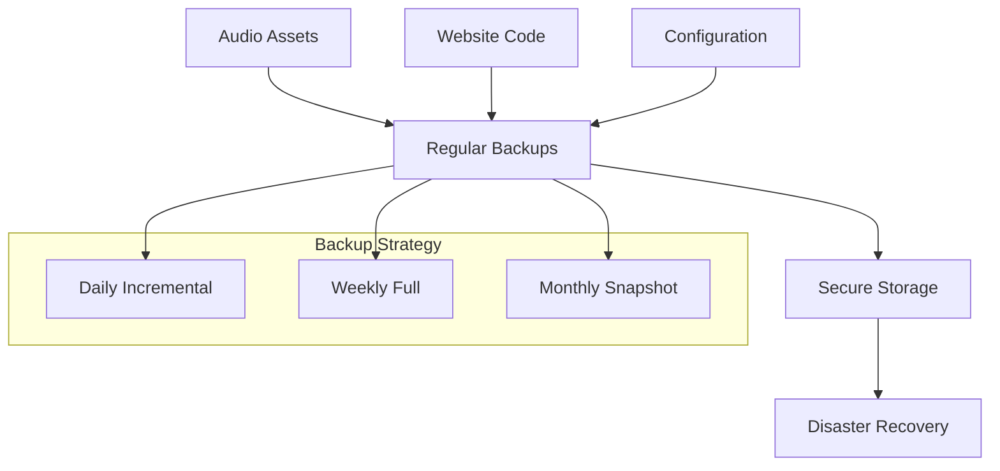

# Deployment and Hosting

<cite>
**Referenced Files in This Document**
- [README.md](file://README.md)
- [index.html](file://index.html)
- [config.js](file://config.js)
- [app.js](file://app.js)
- [styles.css](file://styles.css)
- [conversion-report.json](file://conversion-report.json)
- [tools/convert_audio.swift](file://tools/convert_audio.swift)
</cite>

## Table of Contents
1. [Introduction](#introduction)
2. [Project Structure](#project-structure)
3. [Core Components](#core-components)
4. [Architecture Overview](#architecture-overview)
5. [Netlify Deployment](#netlify-deployment)
6. [Cloudflare R2 Configuration](#cloudflare-r2-configuration)
7. [Production Optimization](#production-optimization)
8. [Security Considerations](#security-considerations)
9. [Monitoring and Analytics](#monitoring-and-analytics)
10. [Troubleshooting Guide](#troubleshooting-guide)
11. [Maintenance Procedures](#maintenance-procedures)
12. [Conclusion](#conclusion)

## Introduction

MusicLab-IA is a static web music player designed to showcase a curated collection of audio tracks. The application follows a modern deployment strategy using Netlify for hosting and Cloudflare R2 for audio storage, ensuring optimal performance and global distribution.

The player features a sophisticated audio visualization system, responsive design, and efficient asset loading mechanisms. Audio files are stored separately from the codebase in Cloudflare R2 buckets to optimize deployment and reduce repository size.

## Project Structure

The MusicLab-IA project follows a clean, static website architecture with the following key components:



**Diagram sources**
- [index.html:1-318](file://index.html#L1-L318)
- [config.js:1-7](file://config.js#L1-L7)
- [app.js:1-590](file://app.js#L1-L590)

**Section sources**
- [README.md:1-27](file://README.md#L1-L27)
- [index.html:1-318](file://index.html#L1-L318)

## Core Components

### Application Architecture

The MusicLab-IA player consists of several interconnected components working together to deliver an optimal audio streaming experience:



**Diagram sources**
- [app.js:1-590](file://app.js#L1-L590)
- [config.js:1-7](file://config.js#L1-L7)

### Audio Catalog Management

The application uses a structured approach to manage audio assets through conversion reports and configuration:



**Diagram sources**
- [tools/convert_audio.swift:19-174](file://tools/convert_audio.swift#L19-L174)
- [conversion-report.json:1-317](file://conversion-report.json#L1-L317)

**Section sources**
- [app.js:1-590](file://app.js#L1-L590)
- [config.js:1-7](file://config.js#L1-L7)
- [tools/convert_audio.swift:1-174](file://tools/convert_audio.swift#L1-L174)

## Architecture Overview

The MusicLab-IA architecture follows a distributed system pattern optimized for static hosting:



**Diagram sources**
- [README.md:14-27](file://README.md#L14-L27)
- [config.js:1-7](file://config.js#L1-L7)
- [app.js:91-104](file://app.js#L91-L104)

## Netlify Deployment

### Initial Setup

1. **Repository Preparation**
   - Ensure all audio files are stored in the Cloudflare R2 bucket
   - Verify the conversion report is up-to-date
   - Confirm the `audioBaseUrl` in `config.js` points to the correct R2 bucket

2. **Netlify Account Configuration**
   - Create a Netlify account at [netlify.com](https://netlify.com)
   - Connect your GitHub repository containing the MusicLab-IA project
   - Configure automatic deployments from the main branch

3. **Build Settings**
   - Build command: `npm run build` (if applicable)
   - Publish directory: Root directory of the project
   - Environment variables: Configure Cloudflare credentials if needed

### Continuous Deployment Workflow



**Diagram sources**
- [README.md:14-27](file://README.md#L14-L27)

### Environment Variables

Configure the following environment variables in Netlify:

| Variable Name | Description | Example Value |
|---------------|-------------|---------------|
| `AUDIO_BASE_URL` | Public URL for R2 bucket | `https://pub-16f1d7c21e584d2e81313d652073c029.r2.dev` |
| `BUCKET_NAME` | Cloudflare R2 bucket name | `musica` |
| `ACCOUNT_ID` | Cloudflare account identifier | `772f4847778a206556d947f5cddcdd6c` |

### Build Configuration

The application requires minimal build configuration due to its static nature:

1. **Static Asset Handling**
   - All JavaScript, CSS, and HTML are served statically
   - Audio files are loaded dynamically from R2 bucket URLs
   - No client-side compilation required

2. **Caching Strategy**
   - Static assets cached indefinitely with version hashes
   - Audio files cached with short TTL for metadata updates
   - Browser caching configured through Netlify headers

**Section sources**
- [README.md:14-27](file://README.md#L14-L27)
- [config.js:1-7](file://config.js#L1-L7)

## Cloudflare R2 Configuration

### Bucket Setup

1. **Create R2 Bucket**
   ```bash
   # Using Wrangler CLI
   wrangler r2 bucket create musica
   ```

2. **Bucket Permissions**
   - Enable public read access for audio files
   - Configure CORS settings for cross-origin audio loading
   - Set appropriate lifecycle policies for storage costs

3. **S3 Compatibility**
   - Use the provided S3 endpoint for programmatic access
   - Configure IAM policies for secure access
   - Enable versioning for backup and rollback capabilities

### URL Configuration

The application expects audio files to be accessible via the configured base URL:



**Diagram sources**
- [config.js:47-48](file://config.js#L47-L48)
- [app.js:99](file://app.js#L99)

### Audio File Organization

Audio files should be organized in the R2 bucket according to the conversion report:

1. **Directory Structure**
   ```
   musica/
   └── web-audio/
       ├── alma-dele.m4a
       ├── aquela-sonata.m4a
       └── [other audio files]
   ```

2. **File Naming Convention**
   - Generated during conversion process
   - Slugified titles with unique identifiers
   - Maintained consistency with conversion report

**Section sources**
- [config.js:1-7](file://config.js#L1-L7)
- [conversion-report.json:1-317](file://conversion-report.json#L1-L317)
- [tools/convert_audio.swift:125-154](file://tools/convert_audio.swift#L125-L154)

## Production Optimization

### Asset Compression

The application employs several optimization strategies:

1. **Audio Compression**
   - All audio files converted to M4A format
   - Optimized for streaming performance
   - Preserved quality while reducing file size

2. **Static Asset Optimization**
   - CSS minification through build process
   - JavaScript bundling and tree-shaking
   - Image optimization for visual elements

3. **CDN Caching**
   - Intelligent cache headers for different asset types
   - Edge caching for improved global performance
   - Cache invalidation strategies for updates

### Caching Strategies



### Performance Monitoring

Implement the following monitoring strategies:

1. **Core Web Vitals Tracking**
   - Measure Largest Contentful Paint (LCP)
   - Monitor First Input Delay (FID)
   - Track Cumulative Layout Shift (CLS)

2. **Audio Streaming Metrics**
   - Track audio load times
   - Monitor streaming buffer health
   - Measure connection quality indicators

3. **CDN Performance**
   - Monitor origin response times
   - Track edge cache hit ratios
   - Measure geographic performance variations

**Section sources**
- [tools/convert_audio.swift:59-90](file://tools/convert_audio.swift#L59-L90)
- [app.js:556-576](file://app.js#L556-L576)

## Security Considerations

### SSL Certificate Management

1. **Automatic Certificate Provisioning**
   - Netlify automatically provisions SSL certificates
   - Supports HTTPS-only delivery of all assets
   - Automatic certificate renewal through platform infrastructure

2. **Certificate Validation**
   - Domain validation occurs during site setup
   - Certificate issuance handled by Let's Encrypt
   - Monitoring for certificate expiration and renewal

### Access Control



### Cross-Origin Resource Sharing (CORS)

Configure CORS policies for optimal audio streaming:

1. **Permissive CORS for Audio**
   - Allow cross-origin requests for audio files
   - Restrict other resource types appropriately
   - Configure appropriate preflight handling

2. **Security Headers**
   - Implement Content Security Policy
   - Enforce SameSite cookies for session management
   - Configure X-Frame-Options protection

**Section sources**
- [index.html:242](file://index.html#L242)
- [config.js:1-7](file://config.js#L1-L7)

## Monitoring and Analytics

### Performance Monitoring

1. **Real User Monitoring (RUM)**
   - Implement Core Web Vitals collection
   - Track audio streaming performance metrics
   - Monitor CDN edge performance globally

2. **Application Performance Monitoring**
   - Monitor audio player error rates
   - Track playback failure scenarios
   - Measure user engagement with audio content

### Analytics Integration



### Health Checks

Implement automated health monitoring:

1. **Site Availability**
   - Monitor Netlify deployment status
   - Track CDN edge locations availability
   - Verify audio bucket accessibility

2. **Performance Metrics**
   - Monitor page load times
   - Track audio streaming latency
   - Measure API response times

**Section sources**
- [app.js:499-502](file://app.js#L499-L502)
- [app.js:521-542](file://app.js#L521-L542)

## Troubleshooting Guide

### Common Deployment Issues

#### Audio Loading Failures

**Symptoms**: Audio files fail to load or stream properly

**Causes and Solutions**:
1. **Incorrect Base URL Configuration**
   - Verify `audioBaseUrl` in `config.js` matches R2 bucket URL
   - Ensure trailing slash handling is consistent
   - Check for typos in bucket names or endpoints

2. **CORS Policy Issues**
   - Verify R2 bucket CORS configuration allows audio file access
   - Check browser console for CORS-related errors
   - Ensure proper preflight handling for audio requests

3. **File Path Resolution**
   - Confirm audio file names match conversion report entries
   - Verify file encoding in URLs (use `encodeURIComponent`)
   - Check for case sensitivity in file names

#### Netlify Build Failures

**Symptoms**: Deployment fails during build process

**Common Causes**:
1. **Missing Dependencies**
   - Static site remains functional without build dependencies
   - Ensure all required files are present in repository
   - Verify conversion report is up-to-date

2. **Environment Variable Issues**
   - Check Netlify environment variables are properly configured
   - Verify variable names match application expectations
   - Ensure sensitive values are properly escaped

#### CDN Performance Issues

**Symptoms**: Slow loading times or inconsistent performance

**Solutions**:
1. **Cache Configuration**
   - Verify cache headers for different asset types
   - Check CDN edge cache hit ratios
   - Implement cache invalidation strategies

2. **Geographic Performance**
   - Monitor performance across different regions
   - Adjust CDN settings for optimal routing
   - Consider regional bucket placement

### Debugging Tools and Techniques

1. **Browser Developer Tools**
   - Use Network tab to monitor audio loading
   - Check Console for JavaScript errors
   - Monitor Performance tab for rendering issues

2. **Application Logging**
   - Implement structured logging for audio events
   - Track error conditions and recovery attempts
   - Monitor audio context initialization failures

3. **External Monitoring**
   - Set up uptime monitoring for critical endpoints
   - Configure alerting for performance degradation
   - Monitor error rates and user impact

**Section sources**
- [app.js:499-502](file://app.js#L499-L502)
- [app.js:521-542](file://app.js#L521-L542)
- [config.js:1-7](file://config.js#L1-L7)

## Maintenance Procedures

### Regular Maintenance Tasks

1. **Audio Asset Updates**
   - Periodically review and update audio catalog
   - Validate audio file integrity and quality
   - Remove obsolete or corrupted audio files

2. **Configuration Management**
   - Review and update Cloudflare R2 configuration
   - Monitor bucket storage costs and usage
   - Update access policies as needed

3. **Performance Optimization**
   - Monitor Core Web Vitals metrics
   - Analyze CDN performance across regions
   - Optimize cache configurations based on usage patterns

### Backup and Recovery



### Update Procedures

1. **Code Updates**
   - Test changes locally before deployment
   - Verify audio loading continues to work
   - Monitor performance after updates

2. **Audio Catalog Updates**
   - Regenerate conversion report after adding new tracks
   - Verify audio files upload to R2 bucket
   - Test playback functionality for new tracks

3. **Infrastructure Updates**
   - Monitor Cloudflare service status
   - Review Netlify platform updates
   - Test SSL certificate renewals

**Section sources**
- [tools/convert_audio.swift:159-174](file://tools/convert_audio.swift#L159-L174)
- [conversion-report.json:1-317](file://conversion-report.json#L1-L317)

## Conclusion

The MusicLab-IA deployment strategy leverages modern cloud infrastructure to deliver an optimal audio streaming experience. By separating static assets from audio content and utilizing Cloudflare's global network, the application achieves excellent performance and reliability.

Key success factors include:
- Proper separation of concerns between static assets and dynamic audio content
- Strategic use of CDN infrastructure for global performance
- Robust error handling and monitoring systems
- Secure configuration with proper access controls
- Comprehensive testing and validation processes

The deployment architecture provides a solid foundation for scaling and maintaining the MusicLab-IA platform while ensuring reliable audio streaming for users worldwide.