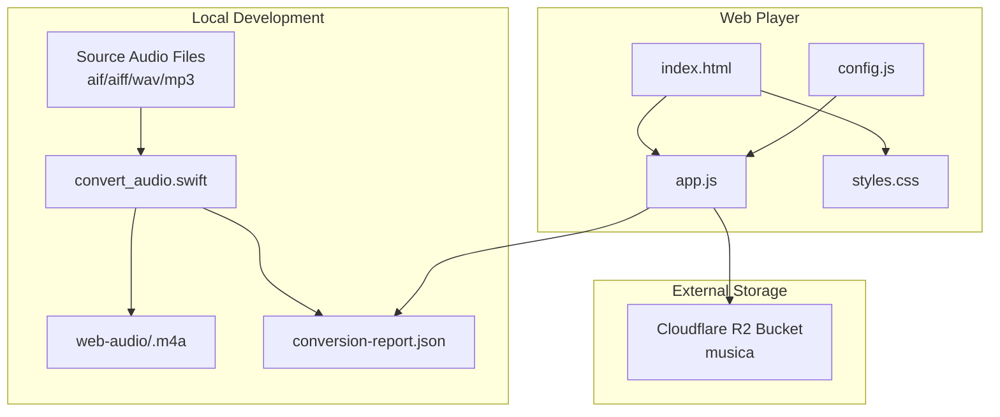
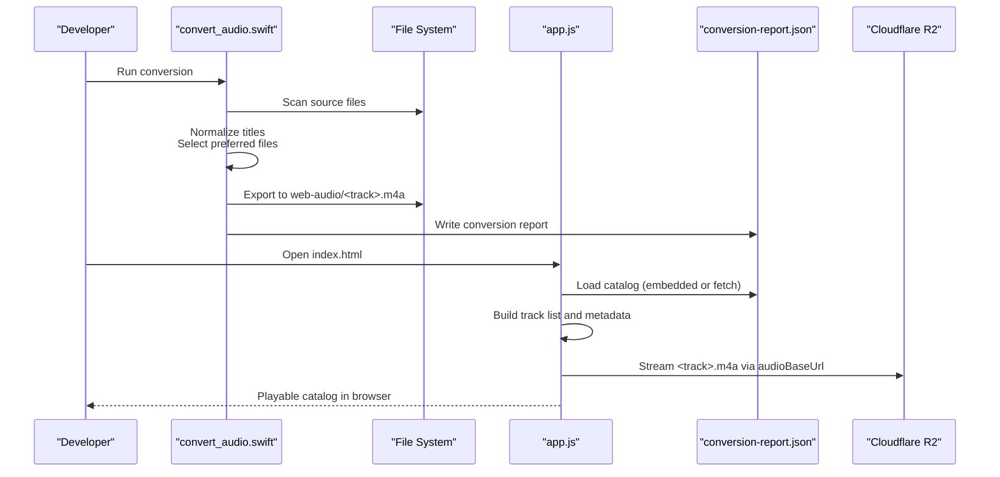
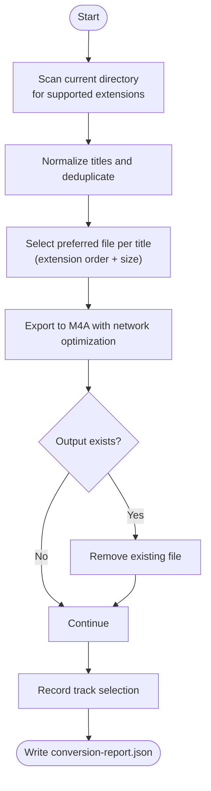
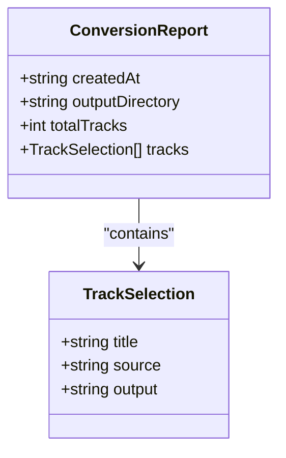
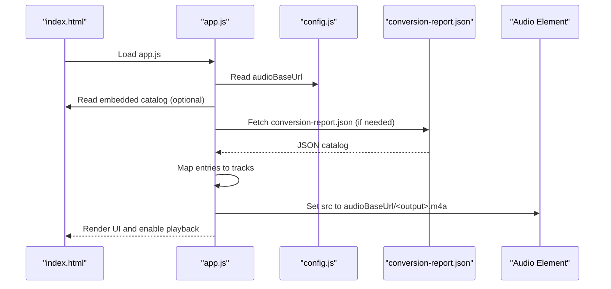
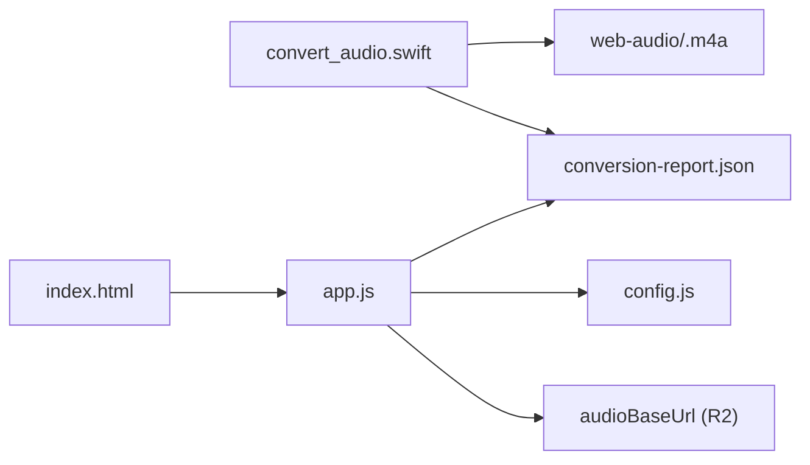

# Development Tools and Utilities

<cite>
**Referenced Files in This Document**
- [convert_audio.swift](file://tools/convert_audio.swift)
- [conversion-report.json](file://conversion-report.json)
- [index.html](file://index.html)
- [app.js](file://app.js)
- [config.js](file://config.js)
- [README.md](file://README.md)
- [styles.css](file://styles.css)
</cite>

## Table of Contents
1. [Introduction](#introduction)
2. [Project Structure](#project-structure)
3. [Core Components](#core-components)
4. [Architecture Overview](#architecture-overview)
5. [Detailed Component Analysis](#detailed-component-analysis)
6. [Dependency Analysis](#dependency-analysis)
7. [Performance Considerations](#performance-considerations)
8. [Troubleshooting Guide](#troubleshooting-guide)
9. [Conclusion](#conclusion)
10. [Appendices](#appendices)

## Introduction
This document describes the development tools and utilities used to manage and stream audio assets for the MusicLab-IA project. It focuses on the Swift-based audio conversion pipeline that transforms source audio files into M4A format optimized for streaming, the conversion report system that catalogs processed tracks, and the integration of those tracks into the web player. It also provides best practices for automation, continuous integration, and troubleshooting common conversion issues.

## Project Structure
The project consists of:
- A Swift script that discovers source audio files, selects preferred variants, exports them to M4A, and generates a conversion report.
- A static web player that loads the conversion report to build the catalog, stream the tracks, and present a UI for browsing and playback.
- Configuration and deployment guidance for hosting audio assets externally and embedding the catalog locally.

**Diagram sources**
- [convert_audio.swift:1-174](file://tools/convert_audio.swift#L1-L174)
- [conversion-report.json:1-317](file://conversion-report.json#L1-L317)
- [index.html:1-318](file://index.html#L1-L318)
- [app.js:1-590](file://app.js#L1-L590)
- [config.js:1-7](file://config.js#L1-L7)

**Section sources**
- [README.md:1-27](file://README.md#L1-L27)
- [index.html:1-318](file://index.html#L1-L318)
- [app.js:1-590](file://app.js#L1-L590)
- [config.js:1-7](file://config.js#L1-L7)

## Core Components
- Swift conversion pipeline: Discovers source files, normalizes titles, selects preferred extensions, exports to M4A with network optimization, and writes a conversion report.
- Conversion report: JSON catalog containing creation timestamp, output directory, total track count, and a list of track entries with normalized titles, original filenames, and output filenames.
- Web player: Loads the catalog (from embedded JSON or remote conversion report), builds track metadata, streams M4A files, and renders UI elements.
- Configuration: External audio base URL and storage endpoint configuration for production deployment.

**Section sources**
- [convert_audio.swift:12-174](file://tools/convert_audio.swift#L12-L174)
- [conversion-report.json:1-317](file://conversion-report.json#L1-L317)
- [app.js:521-542](file://app.js#L521-L542)
- [config.js:1-7](file://config.js#L1-L7)

## Architecture Overview
The audio asset pipeline and player integration form a cohesive workflow:
- Local conversion: The Swift script scans the current directory for supported audio files, resolves duplicates by extension preference and size, exports to M4A in a dedicated web-audio folder, and records a conversion report.
- Catalog ingestion: The web player reads the conversion report either from an embedded JSON element or via a fetch request, constructs track objects, and sets the audio source URLs based on a configurable base URL.
- Streaming: Tracks are streamed from the configured audio base URL, enabling fast seeking and efficient playback.

**Diagram sources**
- [convert_audio.swift:98-174](file://tools/convert_audio.swift#L98-L174)
- [app.js:521-542](file://app.js#L521-L542)
- [index.html:243-315](file://index.html#L243-L315)
- [config.js:1-7](file://config.js#L1-L7)

## Detailed Component Analysis

### Swift Conversion Pipeline
The Swift script orchestrates the entire conversion process:
- Discovery: Scans the current directory for supported extensions and filters out hidden files.
- Selection: Normalizes titles, deduplicates by title, and prefers higher-quality source files (order prioritizes aif/aiff/wav/mp3; ties broken by file size).
- Export: Uses AVFoundation’s export session with Apple M4A preset and network optimization enabled.
- Reporting: Generates a conversion report with creation timestamp, output directory, total tracks, and a list of track selections.

**Diagram sources**
- [convert_audio.swift:98-174](file://tools/convert_audio.swift#L98-L174)

Key behaviors and settings:
- Preferred source order: aif, aiff, wav, mp3.
- Network optimization: Enabled during export to optimize streaming.
- Output directory: web-audio, created automatically if missing.
- Slug generation: Derived from normalized titles, with uniqueness ensured by appending numeric suffixes.

Best practices derived from the script:
- Keep source filenames consistent and meaningful to improve normalization and slug generation.
- Prefer uncompressed or high-bitrate originals (aif/aiff/wav) for best quality.
- Run conversions in a clean directory to avoid unintended duplicates.

**Section sources**
- [convert_audio.swift:19-20](file://tools/convert_audio.swift#L19-L20)
- [convert_audio.swift:22-42](file://tools/convert_audio.swift#L22-L42)
- [convert_audio.swift:44-57](file://tools/convert_audio.swift#L44-L57)
- [convert_audio.swift:59-90](file://tools/convert_audio.swift#L59-L90)
- [convert_audio.swift:96-96](file://tools/convert_audio.swift#L96-L96)
- [convert_audio.swift:122-154](file://tools/convert_audio.swift#L122-L154)
- [convert_audio.swift:159-170](file://tools/convert_audio.swift#L159-L170)

### Conversion Report System
The conversion report is a JSON artifact that captures:
- Creation timestamp.
- Output directory name.
- Total number of tracks.
- List of track entries with normalized title, original filename, and output filename.

The web player consumes this report to build the catalog and set audio URLs.

**Diagram sources**
- [convert_audio.swift:12-17](file://tools/convert_audio.swift#L12-L17)
- [conversion-report.json:1-317](file://conversion-report.json#L1-L317)

Integration details:
- Embedded catalog: The HTML page includes an embedded JSON element for immediate loading without network requests.
- Remote fallback: If the embedded element is empty, the player fetches conversion-report.json from the server.
- Base URL: The audio base URL is configurable and defaults to a local web-audio directory; in production, it points to the external storage bucket.

**Section sources**
- [index.html:243-315](file://index.html#L243-L315)
- [app.js:521-542](file://app.js#L521-L542)
- [app.js:91-104](file://app.js#L91-L104)
- [config.js:1-7](file://config.js#L1-L7)

### Web Player Integration
The player integrates the catalog and streams tracks:
- Catalog loading: Reads the embedded JSON or fetches conversion-report.json, then maps each entry to a track object with computed properties (palette, duration, recent).
- Playback: Sets the audio element’s source to the configured base URL plus the encoded output filename.
- UI rendering: Builds the library grid, queue panel, and spotlight based on the loaded catalog.

**Diagram sources**
- [index.html:243-315](file://index.html#L243-L315)
- [app.js:521-542](file://app.js#L521-L542)
- [app.js:91-104](file://app.js#L91-L104)
- [config.js:1-7](file://config.js#L1-L7)

**Section sources**
- [app.js:46-48](file://app.js#L46-L48)
- [app.js:521-542](file://app.js#L521-L542)
- [app.js:91-104](file://app.js#L91-L104)
- [index.html:243-315](file://index.html#L243-L315)

### Batch Conversion Procedures
- Prepare source files: Place supported audio files (aif/aiff/wav/mp3) in the project root. Prefer higher-quality originals to maximize output fidelity.
- Run the converter: Execute the Swift script from the project root. It will:
  - Create the web-audio directory if absent.
  - Scan for source files and normalize titles.
  - Export each selected file to M4A with network optimization.
  - Generate conversion-report.json with the catalog of exported tracks.
- Verify outputs: Confirm that web-audio contains the expected M4A files and that conversion-report.json lists all tracks.

Automation tips:
- Schedule periodic runs to refresh the catalog after adding new sources.
- Use CI to automate conversion and report generation as part of the build process.

**Section sources**
- [convert_audio.swift:98-174](file://tools/convert_audio.swift#L98-L174)
- [README.md:12-12](file://README.md#L12-L12)

### Quality Optimization Settings
- Export preset: Apple M4A preset ensures compatibility and efficient streaming.
- Network optimization: Enabled to optimize for streaming delivery.
- Source selection: Prefers higher-quality formats and larger files among duplicates.

These settings balance quality and streaming performance.

**Section sources**
- [convert_audio.swift:61-69](file://tools/convert_audio.swift#L61-L69)
- [convert_audio.swift:44-57](file://tools/convert_audio.swift#L44-L57)

### Integrating New Tracks into the Catalog
- Add new source files to the project root.
- Re-run the conversion script to export new tracks and update conversion-report.json.
- Commit updated conversion-report.json and upload M4A files to the configured audio base URL (e.g., Cloudflare R2).
- Verify playback in the web player.

**Section sources**
- [README.md:18-20](file://README.md#L18-L20)
- [app.js:521-542](file://app.js#L521-L542)

## Dependency Analysis
The following diagram shows how the Swift script, conversion report, and web player depend on each other and on configuration:

**Diagram sources**
- [convert_audio.swift:98-174](file://tools/convert_audio.swift#L98-L174)
- [index.html:243-315](file://index.html#L243-L315)
- [app.js:521-542](file://app.js#L521-L542)
- [config.js:1-7](file://config.js#L1-L7)

**Section sources**
- [convert_audio.swift:98-174](file://tools/convert_audio.swift#L98-L174)
- [index.html:243-315](file://index.html#L243-L315)
- [app.js:521-542](file://app.js#L521-L542)
- [config.js:1-7](file://config.js#L1-L7)

## Performance Considerations
- Streaming optimization: The export session enables network optimization, reducing latency and improving buffering for web playback.
- Efficient catalog loading: The player preloads metadata for all tracks to provide instant duration information and smooth UI updates.
- Asset hosting: Hosting M4A files on a CDN or object storage (e.g., Cloudflare R2) improves global delivery and reduces origin bandwidth.
- Automation cadence: Running conversions periodically avoids large batches and keeps the catalog fresh without blocking deployments.

[No sources needed since this section provides general guidance]

## Troubleshooting Guide
Common issues and resolutions:
- No tracks appear in the player:
  - Ensure conversion-report.json exists and is readable by the web server.
  - Verify the audio base URL in config.js points to the correct location where M4A files are hosted.
  - Confirm that the embedded catalog element in index.html is not empty or corrupted.
- Conversion fails or exits early:
  - Check that the current directory contains supported audio files (aif/aiff/wav/mp3).
  - Ensure sufficient disk space in the web-audio directory.
  - Review the conversion report for errors logged during export.
- M4A files not playing:
  - Confirm that the audio base URL is publicly accessible and that CORS settings permit anonymous access.
  - Validate that filenames are URL-safe and percent-encoded when used in src attributes.
- Duplicate or conflicting filenames:
  - The converter appends numeric suffixes to slugs to ensure uniqueness; verify that the output filenames are distinct and match the catalog entries.

**Section sources**
- [app.js:528-533](file://app.js#L528-L533)
- [app.js:499-502](file://app.js#L499-L502)
- [convert_audio.swift:122-154](file://tools/convert_audio.swift#L122-L154)
- [config.js:1-7](file://config.js#L1-L7)

## Conclusion
The Swift-based conversion pipeline provides a robust, automated way to transform diverse audio sources into M4A files optimized for streaming. The conversion report serves as the authoritative catalog for the web player, which dynamically builds the UI and streams tracks from a configurable base URL. By following the best practices outlined here—preferencing high-quality sources, automating conversions, and hosting assets on reliable infrastructure—you can maintain a scalable and performant audio catalog.

[No sources needed since this section summarizes without analyzing specific files]

## Appendices

### Appendix A: Running the Conversion Script
- Place supported audio files in the project root.
- Execute the Swift script from the command line in the project directory.
- After completion, verify:
  - The web-audio directory contains M4A files.
  - conversion-report.json lists all exported tracks.

**Section sources**
- [convert_audio.swift:98-174](file://tools/convert_audio.swift#L98-L174)

### Appendix B: Configuring Production Deployment
- Set the audio base URL in config.js to the public endpoint of your storage bucket (e.g., Cloudflare R2).
- Upload all M4A files to the configured bucket.
- Ensure the bucket allows anonymous GET access for audio playback.

**Section sources**
- [README.md:18-20](file://README.md#L18-L20)
- [config.js:1-7](file://config.js#L1-L7)

### Appendix C: Continuous Integration Considerations
- Automate conversion runs on push to main or on schedule.
- Validate conversion-report.json integrity and upload artifacts to the CDN or object storage.
- Gate deployments until conversion succeeds and assets are reachable.

[No sources needed since this section provides general guidance]