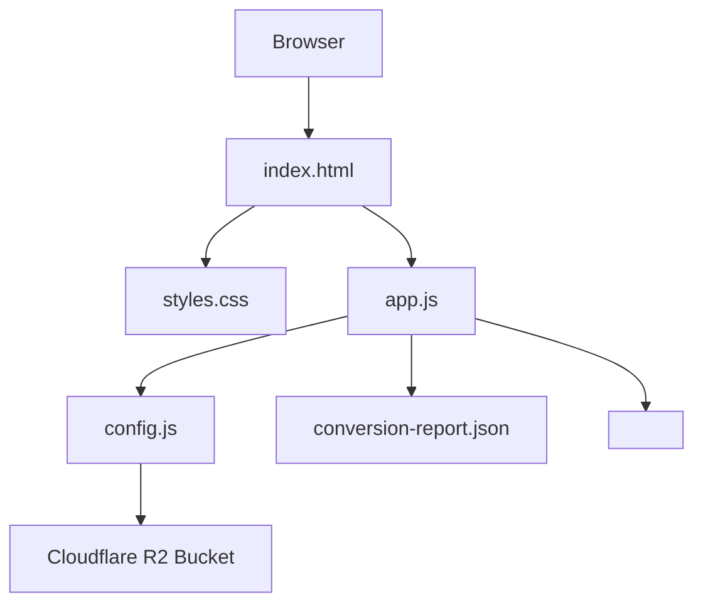
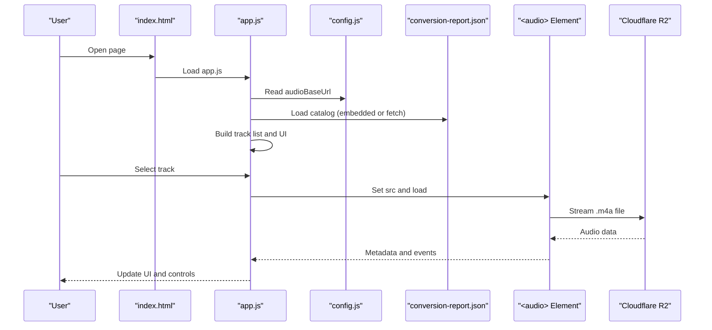
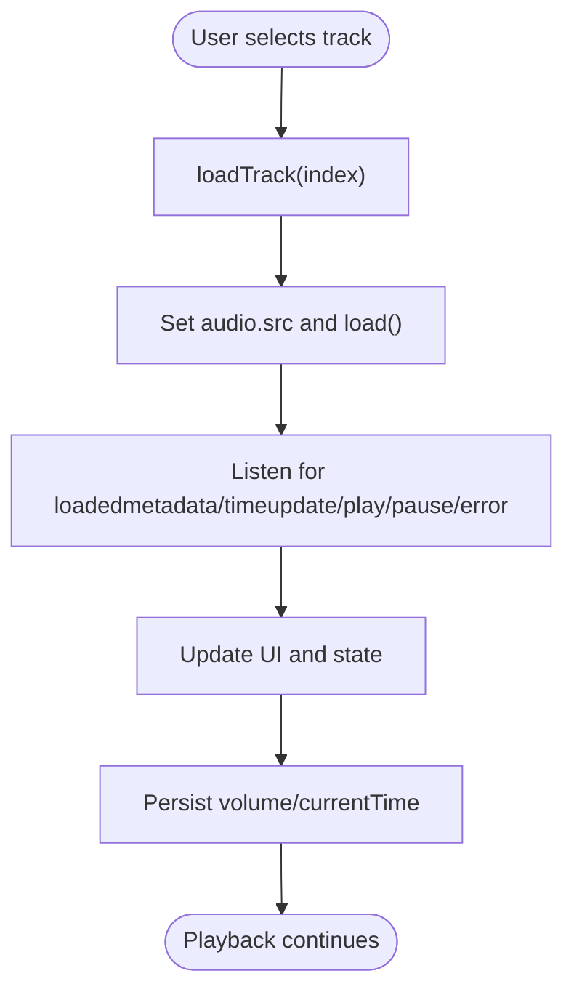
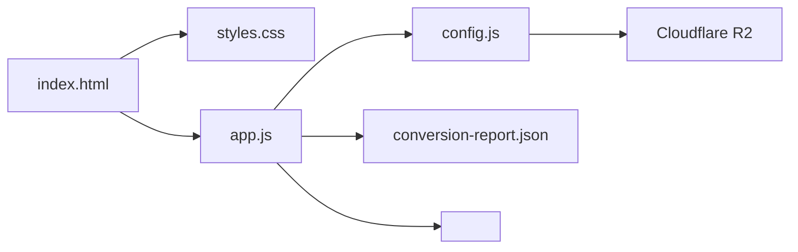

# Getting Started

<cite>
**Referenced Files in This Document**
- [README.md](file://README.md)
- [index.html](file://index.html)
- [app.js](file://app.js)
- [config.js](file://config.js)
- [styles.css](file://styles.css)
- [conversion-report.json](file://conversion-report.json)
- [tools/convert_audio.swift](file://tools/convert_audio.swift)
</cite>

## Table of Contents
1. [Introduction](#introduction)
2. [Prerequisites](#prerequisites)
3. [Project Structure](#project-structure)
4. [Local Development Setup](#local-development-setup)
5. [Cloudflare R2 Storage Configuration](#cloudflare-r2-storage-configuration)
6. [Deployment to Netlify](#deployment-to-netlify)
7. [Initial Usage](#initial-usage)
8. [Core Components](#core-components)
9. [Architecture Overview](#architecture-overview)
10. [Detailed Component Analysis](#detailed-component-analysis)
11. [Dependency Analysis](#dependency-analysis)
12. [Performance Considerations](#performance-considerations)
13. [Troubleshooting Guide](#troubleshooting-guide)
14. [Conclusion](#conclusion)

## Introduction
MusicLab-IA is a static web music player designed to showcase a curated collection of audio tracks. The application loads metadata from a conversion report, renders a responsive interface, and streams audio from a configured storage backend. It is optimized for deployment on Netlify with Cloudflare R2 for audio assets.

## Prerequisites
Before setting up MusicLab-IA locally, ensure you have:
- Basic HTML/CSS/JavaScript knowledge
- Understanding of modern web APIs (Audio, Fetch, LocalStorage)
- A modern browser for development and testing
- Command-line access for running the Swift audio conversion script (macOS required)

## Project Structure
The project consists of a minimal, static frontend with a clear separation of concerns:
- index.html: Main page structure and embedded catalog data
- app.js: Player logic, UI rendering, and audio playback
- config.js: Global configuration for audio base URL and Cloudflare R2 settings
- styles.css: Responsive design and theming
- conversion-report.json: Catalog of tracks generated during audio conversion
- tools/convert_audio.swift: Audio conversion utility for macOS

**Diagram sources**
- [index.html](file://index.html)
- [app.js](file://app.js)
- [config.js](file://config.js)
- [conversion-report.json](file://conversion-report.json)

**Section sources**
- [README.md](file://README.md)
- [index.html](file://index.html)
- [app.js](file://app.js)
- [config.js](file://config.js)
- [styles.css](file://styles.css)
- [conversion-report.json](file://conversion-report.json)
- [tools/convert_audio.swift](file://tools/convert_audio.swift)

## Local Development Setup
Follow these steps to run MusicLab-IA locally:

1. Clone or download the repository to your machine.
2. Open index.html in a modern browser to preview the interface.
3. The player will automatically load the embedded catalog data from the HTML script tag and stream audio from the configured base URL.
4. For audio conversion and catalog generation, use the included Swift script on macOS:
   - Place source audio files in the project root
   - Run the conversion script to generate web-audio/ and conversion-report.json
   - Replace the embedded catalog data with the generated report if desired

Notes:
- The player prefers embedded catalog data for immediate loading; it falls back to fetching conversion-report.json if the embedded data is unavailable.
- Audio files must be placed in the configured output directory and accessible via the audio base URL.

**Section sources**
- [index.html](file://index.html)
- [app.js](file://app.js)
- [conversion-report.json](file://conversion-report.json)
- [tools/convert_audio.swift](file://tools/convert_audio.swift)

## Cloudflare R2 Storage Configuration
MusicLab-IA expects audio assets to reside in a Cloudflare R2 bucket named musica. The configuration includes:
- audioBaseUrl: Public URL of the R2 bucket
- bucketName: musica
- accountId: Cloudflare account identifier
- s3Endpoint: S3-compatible endpoint for the R2 bucket

Adjustments:
- Update audioBaseUrl in config.js to match your deployed R2 bucket’s public URL before deploying to Netlify.
- Ensure all audio files are uploaded to the musica bucket under the web-audio directory.

Security and CORS:
- Configure the R2 bucket for public read access.
- Ensure CORS settings allow cross-origin requests from your Netlify domain.

**Section sources**
- [config.js](file://config.js)
- [README.md](file://README.md)

## Deployment to Netlify
Deploying MusicLab-IA to Netlify is straightforward:

1. Prepare your audio assets:
   - Upload all .m4a files to the musica bucket in Cloudflare R2
   - Confirm they are publicly accessible under the configured audioBaseUrl

2. Configure Netlify:
   - Connect your repository to Netlify
   - Set the build command to a static site build (no build step required)
   - Set publish directory to the project root
   - Add environment variables if needed (not required for this static app)

3. Finalize configuration:
   - Verify the audio base URL in config.js points to your R2 bucket
   - Test the deployed site to ensure audio loads correctly

Post-deploy checks:
- Confirm the player loads the catalog and audio streams without errors
- Verify the visualizer and controls function as expected

**Section sources**
- [README.md](file://README.md)
- [config.js](file://config.js)

## Initial Usage
Once deployed, users can interact with MusicLab-IA as follows:

- Load the player: Visit the Netlify URL to open the interface
- Browse tracks: Use the library panel to view all tracks
- Play audio: Click a track card or queue item to load and play
- Control playback: Use the controls to play/pause, skip tracks, and adjust volume
- Seek through tracks: Drag the timeline slider to jump to different positions
- Filter and search: Use filters (All, Long, Short, Recent) and the search field to refine the library

Basic controls overview:
- Play/Pause button toggles playback
- Previous/Next buttons navigate the queue
- Volume slider adjusts output level
- Timeline slider enables seeking

**Section sources**
- [index.html](file://index.html)
- [app.js](file://app.js)

## Core Components
MusicLab-IA comprises several cohesive components:

- Configuration module: Provides global settings for audio base URL and R2 integration
- Player engine: Manages track loading, playback state, and UI updates
- UI renderer: Builds and updates the DOM for tracks, queue, and hero section
- Catalog loader: Loads track metadata from embedded or external sources
- Visualizer: Draws frequency bars using Web Audio API (optional)

Key responsibilities:
- app.js orchestrates state, events, and rendering
- config.js centralizes environment-specific settings
- index.html embeds the catalog and loads scripts/styles
- styles.css defines responsive layout and theming
- conversion-report.json supplies track metadata

**Section sources**
- [app.js](file://app.js)
- [config.js](file://config.js)
- [index.html](file://index.html)
- [styles.css](file://styles.css)
- [conversion-report.json](file://conversion-report.json)

## Architecture Overview
The application follows a static, client-side architecture with a clear data flow:

**Diagram sources**
- [index.html](file://index.html)
- [app.js](file://app.js)
- [config.js](file://config.js)
- [conversion-report.json](file://conversion-report.json)

## Detailed Component Analysis

### Player Engine (app.js)
The player engine manages playback, UI state, and audio graph initialization. It handles:
- Track selection and loading
- Playback controls (play, pause, next, previous)
- Seeking and volume adjustment
- Duration probing and persistence
- Event-driven UI updates

Key behaviors:
- Uses LocalStorage to persist volume, current track, and playback position
- Applies filters and search to the track list
- Renders the hero spotlight and queue panels
- Optionally draws a frequency visualizer using Web Audio API

**Diagram sources**
- [app.js](file://app.js)

**Section sources**
- [app.js](file://app.js)

### Configuration Module (config.js)
The configuration module exposes environment-specific settings:
- audioBaseUrl: Base URL for audio files
- bucketName: Target R2 bucket name
- accountId: Cloudflare account identifier
- s3Endpoint: S3-compatible endpoint for R2

Adjustments:
- Update audioBaseUrl to match your deployed R2 bucket URL before building/deploying

**Section sources**
- [config.js](file://config.js)

### Catalog Loader
The catalog loader supports two modes:
- Embedded mode: Reads the catalog from the HTML script tag
- External mode: Fetches conversion-report.json from the server

Behavior:
- Parses the catalog and builds track objects with derived properties
- Computes length categories and recency indicators
- Prefetches durations for UI responsiveness

**Section sources**
- [index.html](file://index.html)
- [app.js](file://app.js)
- [conversion-report.json](file://conversion-report.json)

### Visualizer (Optional)
The visualizer uses the Web Audio API to draw frequency bars:
- Initializes AudioContext and analyser on demand
- Resumes audio context when needed
- Draws animated bars synchronized with playback

Note: The visualizer flag is currently disabled in the codebase; enabling it requires changing the configuration.

**Section sources**
- [app.js](file://app.js)

## Dependency Analysis
The application maintains low coupling and clear boundaries:

**Diagram sources**
- [index.html](file://index.html)
- [app.js](file://app.js)
- [config.js](file://config.js)
- [conversion-report.json](file://conversion-report.json)

**Section sources**
- [index.html](file://index.html)
- [app.js](file://app.js)
- [config.js](file://config.js)
- [conversion-report.json](file://conversion-report.json)

## Performance Considerations
- Audio optimization: Tracks are exported as .m4a with network optimization enabled
- Lazy loading: Durations are prefetched to improve perceived performance
- Minimal dependencies: Static assets reduce runtime overhead
- Responsive design: CSS adapts layouts for various screen sizes

## Troubleshooting Guide
Common issues and resolutions:

- Audio fails to load:
  - Verify the audio base URL in config.js points to your R2 bucket
  - Ensure files exist in the musica bucket under the web-audio directory
  - Confirm public read access and CORS settings on the bucket

- Catalog not loading:
  - Check that the embedded catalog data is present in index.html
  - If relying on external fetch, confirm conversion-report.json is accessible

- Visualizer not appearing:
  - The visualizer is currently disabled; enable it by adjusting the configuration flag
  - Ensure the browser allows autoplay and audio context initialization

- Playback controls not responding:
  - Confirm the audio element is present and not blocked by browser policies
  - Check for JavaScript errors in the browser console

- Local vs. deployed differences:
  - Embedded catalog loads immediately; external fetch may fail in local file:// context
  - Use a local server for testing audio streaming

**Section sources**
- [app.js](file://app.js)
- [config.js](file://config.js)
- [README.md](file://README.md)

## Conclusion
MusicLab-IA provides a streamlined, static music player suitable for showcasing curated audio collections. By configuring Cloudflare R2 and deploying to Netlify, you can deliver a responsive, accessible listening experience. Use the included Swift tool to convert and catalog audio assets, and leverage the modular architecture for easy customization and maintenance.