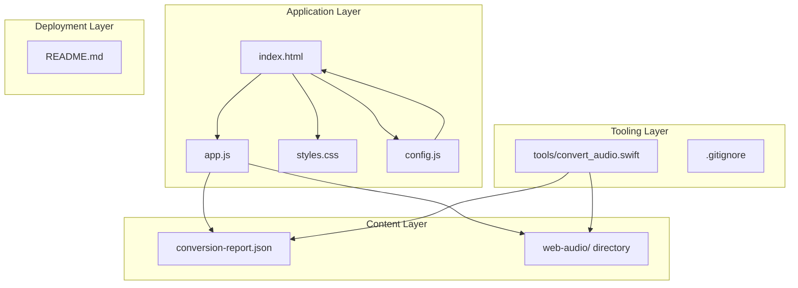
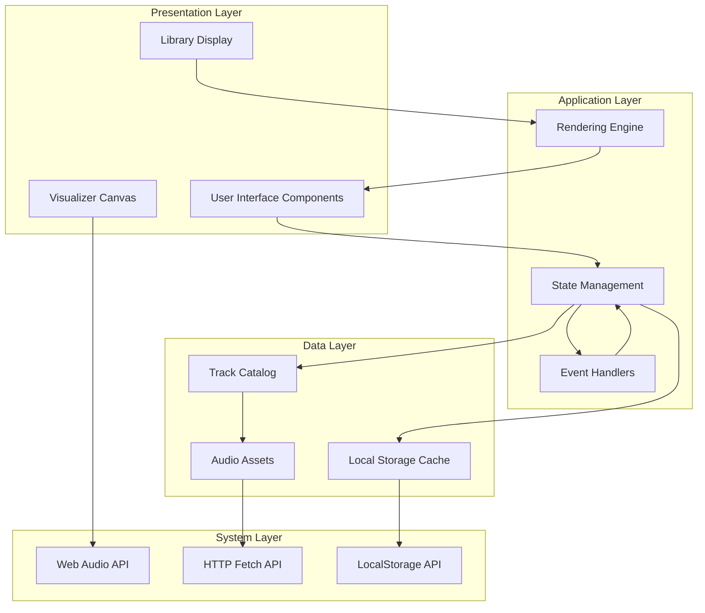
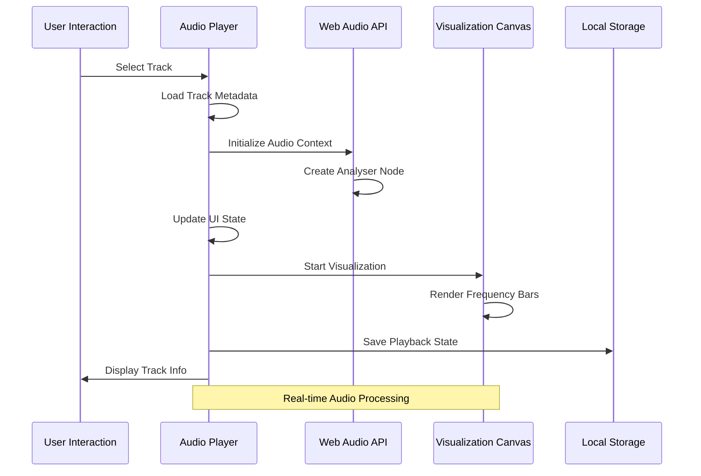
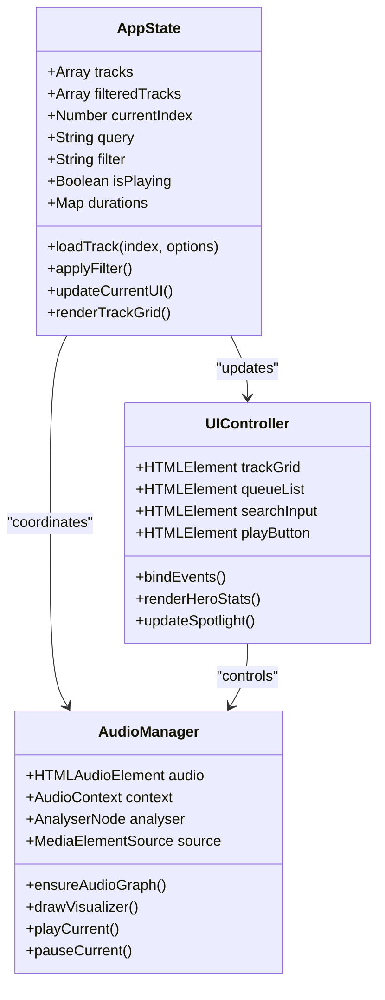
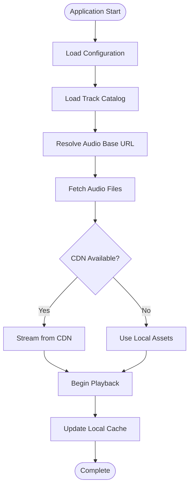
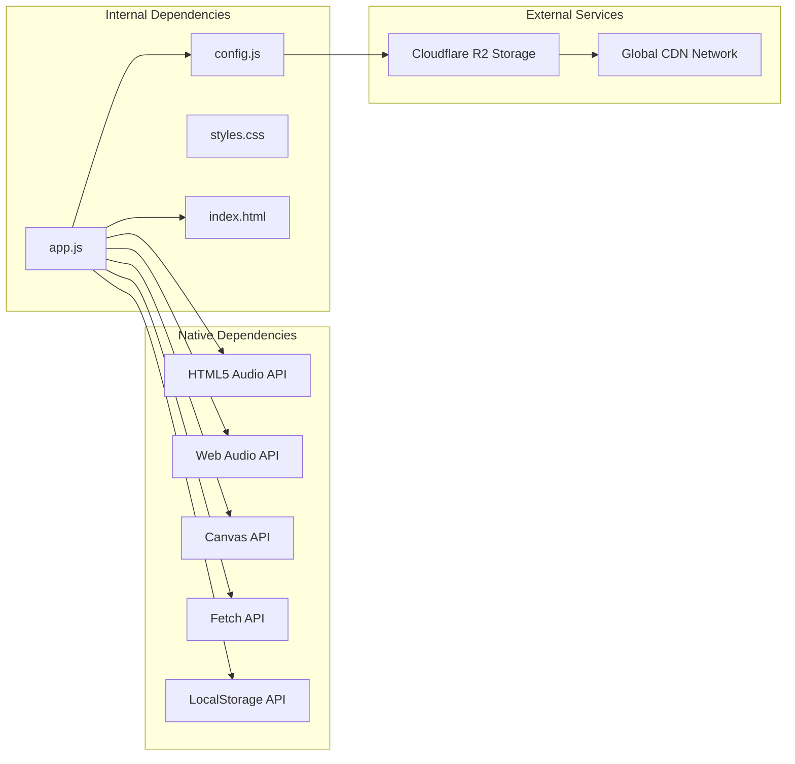

# Project Overview

<cite>
**Referenced Files in This Document**
- [README.md](file://README.md)
- [index.html](file://index.html)
- [app.js](file://app.js)
- [config.js](file://config.js)
- [styles.css](file://styles.css)
- [conversion-report.json](file://conversion-report.json)
- [tools/convert_audio.swift](file://tools/convert_audio.swift)
- [.gitignore](file://.gitignore)
</cite>

## Table of Contents
1. [Introduction](#introduction)
2. [Project Structure](#project-structure)
3. [Core Components](#core-components)
4. [Architecture Overview](#architecture-overview)
5. [Detailed Component Analysis](#detailed-component-analysis)
6. [Dependency Analysis](#dependency-analysis)
7. [Performance Considerations](#performance-considerations)
8. [Troubleshooting Guide](#troubleshooting-guide)
9. [Conclusion](#conclusion)

## Introduction

MusicLab-IA is a static web music player designed as a showcase for the MusicLab-IA ecosystem. This vanilla JavaScript application serves as a modern, interactive platform for streaming and visualizing a curated collection of acoustic compositions. The project represents a sophisticated blend of traditional music production techniques with contemporary web technologies, creating an immersive audio-visual experience that bridges analog creativity with digital distribution.

The application functions as both a functional music library and a demonstration of advanced web audio capabilities. It showcases over 60 carefully curated tracks spanning two decades of musical experimentation, featuring instruments including digital keyboards, Akai EWI USB controllers, Korg Kaossilator synthesizers, and professional DAW environments. The platform serves as a bridge between traditional music creation and AI-assisted composition, particularly highlighting the integration of authorial melodies with lyric collections generated through Suno AI.

## Project Structure

The MusicLab-IA project follows a clean, modular architecture centered around a single-page application (SPA) design pattern. The structure emphasizes separation of concerns through distinct layers for presentation, logic, configuration, and styling.

**Diagram sources**
- [index.html:1-318](file://index.html#L1-L318)
- [app.js:1-590](file://app.js#L1-L590)
- [config.js:1-7](file://config.js#L1-L7)

The project maintains a minimal footprint with only seven core files, emphasizing simplicity and maintainability. The architecture supports both local development and cloud deployment through Cloudflare R2 storage integration.

**Section sources**
- [README.md:1-27](file://README.md#L1-L27)
- [index.html:1-318](file://index.html#L1-L318)
- [app.js:1-590](file://app.js#L1-L590)

## Core Components

### Audio Player Engine

The audio player represents the heart of the MusicLab-IA application, implementing a comprehensive media playback system built entirely on vanilla JavaScript and HTML5 Audio APIs. The player manages a sophisticated state machine controlling track selection, playback progression, and user interaction handling.

Key player capabilities include:
- **Track Management**: Dynamic loading and switching between audio tracks with persistent state
- **Playback Controls**: Full media element integration supporting play, pause, seek, and volume adjustment
- **Progress Tracking**: Real-time timeline updates with visual seek bar integration
- **Storage Persistence**: Local storage integration for maintaining user preferences across sessions

### Visualization System

The visualization component implements real-time audio spectrum analysis using the Web Audio API's AnalyserNode. This system creates dynamic, responsive visualizations that react to the currently playing audio content.

Visualization features include:
- **Frequency Analysis**: Real-time FFT processing of audio frequency data
- **Canvas Rendering**: High-performance 2D canvas drawing with gradient effects
- **Responsive Design**: Adaptive visualization that responds to track changes and playback state
- **Performance Optimization**: Efficient animation frame management and cleanup procedures

### Library Management Interface

The application presents a dual-panel interface showcasing both individual track details and comprehensive library browsing capabilities. The interface adapts seamlessly across device sizes while maintaining visual consistency and accessibility standards.

Library features encompass:
- **Track Grid Display**: Responsive grid layout for browsing the complete catalog
- **Filtering System**: Category-based filtering for long, short, and recently added tracks
- **Search Functionality**: Real-time search across track titles and source filenames
- **Queue Management**: Visual queue display showing up to 18 tracks with duration indicators

**Section sources**
- [app.js:1-590](file://app.js#L1-L590)
- [index.html:145-239](file://index.html#L145-L239)
- [styles.css:424-436](file://styles.css#L424-L436)

## Architecture Overview

MusicLab-IA employs a layered architecture that separates presentation, business logic, and data management concerns. The system operates as a client-side SPA with intelligent caching and offline-first capabilities.

**Diagram sources**
- [app.js:1-590](file://app.js#L1-L590)
- [index.html:242-315](file://index.html#L242-L315)
- [config.js:1-7](file://config.js#L1-L7)

The architecture emphasizes performance and user experience through several key design decisions:
- **Static Asset Loading**: All audio content loaded from Cloudflare R2 storage for optimal CDN delivery
- **Lazy Initialization**: Components initialize only when needed, reducing startup overhead
- **Event-Driven Updates**: Reactive UI updates triggered by state changes rather than polling
- **Memory Management**: Proper cleanup of audio contexts and animation frames to prevent memory leaks

**Section sources**
- [app.js:280-319](file://app.js#L280-L319)
- [config.js:1-7](file://config.js#L1-L7)

## Detailed Component Analysis

### Audio Pipeline Architecture

The audio processing pipeline demonstrates sophisticated integration of multiple web APIs to deliver seamless playback experiences.

**Diagram sources**
- [app.js:256-272](file://app.js#L256-L272)
- [app.js:280-319](file://app.js#L280-L319)
- [app.js:321-359](file://app.js#L321-L359)

The pipeline implements several optimization strategies:
- **Context Management**: Proper initialization and suspension of Web Audio contexts
- **Resource Cleanup**: Automatic disposal of audio nodes and animation frames
- **Error Recovery**: Graceful handling of playback failures with user feedback
- **Performance Monitoring**: Efficient rendering with requestAnimationFrame coordination

### State Management System

The application employs a centralized state management pattern that coordinates all interactive components through a single source of truth.

**Diagram sources**
- [app.js:1-590](file://app.js#L1-L590)

The state management system provides:
- **Consistent State**: Single source of truth for all UI components
- **Event Coordination**: Centralized event handling for user interactions
- **Performance Optimization**: Efficient rendering through selective DOM updates
- **Accessibility Compliance**: Proper ARIA attributes and keyboard navigation support

### Cloud Storage Integration

The application integrates seamlessly with Cloudflare R2 for scalable audio asset delivery, implementing a robust content delivery strategy.

**Diagram sources**
- [config.js:1-7](file://config.js#L1-L7)
- [app.js:91-104](file://app.js#L91-L104)
- [app.js:521-542](file://app.js#L521-L542)

The integration provides:
- **Scalable Delivery**: Global CDN distribution through Cloudflare R2
- **Cost Efficiency**: Reduced bandwidth costs through optimized caching
- **High Availability**: Multi-region redundancy for reliable access
- **Security**: Signed URLs and access control for protected assets

**Section sources**
- [config.js:1-7](file://config.js#L1-L7)
- [app.js:91-104](file://app.js#L91-L104)
- [app.js:521-542](file://app.js#L521-L542)

## Dependency Analysis

The MusicLab-IA project maintains minimal external dependencies, relying primarily on native browser APIs and standard web technologies.

**Diagram sources**
- [app.js:1-590](file://app.js#L1-L590)
- [config.js:1-7](file://config.js#L1-L7)
- [index.html:242-315](file://index.html#L242-L315)

The dependency structure ensures:
- **Browser Compatibility**: No build tools or transpilation required
- **Fast Loading**: Minimal payload with zero runtime dependencies
- **Development Simplicity**: Straightforward local development setup
- **Deployment Flexibility**: Static hosting compatibility across platforms

**Section sources**
- [app.js:1-590](file://app.js#L1-L590)
- [config.js:1-7](file://config.js#L1-L7)

## Performance Considerations

MusicLab-IA implements several performance optimization strategies to ensure smooth operation across diverse devices and network conditions.

### Rendering Optimizations

The visualization system employs efficient rendering techniques to minimize CPU and GPU usage:
- **Animation Frame Coordination**: Synchronized rendering with browser refresh cycles
- **Selective Updates**: Only redraw visualization when audio data changes
- **Canvas Optimization**: Efficient pixel manipulation with minimal DOM interactions
- **Memory Management**: Proper cleanup of visualization resources during playback transitions

### Network Performance

Audio delivery utilizes optimized strategies for reduced latency and improved reliability:
- **Preloading Strategy**: Intelligent metadata preloading for instant track selection
- **CDN Integration**: Global content distribution for optimal regional performance
- **Connection Reuse**: Persistent connections for multiple audio requests
- **Error Recovery**: Graceful degradation when CDN services are unavailable

### Memory Management

The application implements comprehensive memory management practices:
- **Resource Cleanup**: Automatic disposal of audio contexts and visualization canvases
- **Event Listener Management**: Proper removal of event handlers during component lifecycle
- **State Optimization**: Efficient state updates minimizing unnecessary DOM manipulations
- **Cache Control**: Strategic caching of frequently accessed data with automatic invalidation

## Troubleshooting Guide

### Common Issues and Solutions

**Audio Playback Problems**
- Verify CORS configuration for Cloudflare R2 bucket access
- Check browser autoplay policies and user gesture requirements
- Ensure audio files are properly encoded as M4A format
- Confirm network connectivity to CDN endpoints

**Visualization Not Working**
- Verify Web Audio API availability in target browsers
- Check canvas element rendering permissions
- Ensure proper audio context initialization
- Validate frequency analysis data availability

**State Management Issues**
- Clear browser local storage for corrupted state recovery
- Verify localStorage quota availability
- Check for concurrent tab conflicts affecting state synchronization
- Review browser extension interference with local storage

**Deployment Problems**
- Confirm proper MIME type configuration for audio files
- Verify Cloudflare R2 bucket permissions and access keys
- Check Netlify deployment configuration and build settings
- Validate SSL certificate requirements for secure audio streaming

**Section sources**
- [app.js:499-502](file://app.js#L499-L502)
- [app.js:280-319](file://app.js#L280-L319)
- [README.md:14-26](file://README.md#L14-L26)

## Conclusion

MusicLab-IA represents a sophisticated example of modern web audio application development, successfully combining artistic vision with technical excellence. The project demonstrates how vanilla JavaScript, HTML5 APIs, and cloud storage services can be integrated to create compelling digital experiences.

The application's strength lies in its architectural simplicity while delivering advanced functionality. Through careful consideration of user experience, performance optimization, and scalability requirements, MusicLab-IA serves as both a functional music player and a technical demonstration of web audio capabilities.

The project's integration with Cloudflare R2 storage showcases modern deployment strategies that balance cost efficiency with global accessibility. The Swift-based audio conversion pipeline demonstrates thoughtful tooling that bridges traditional music production workflows with contemporary web distribution requirements.

For developers seeking to understand modern web audio implementation, MusicLab-IA provides a comprehensive reference implementation covering state management, real-time visualization, cloud integration, and performance optimization. The project's clean architecture and minimal dependencies make it an excellent foundation for similar applications requiring sophisticated audio playback capabilities.