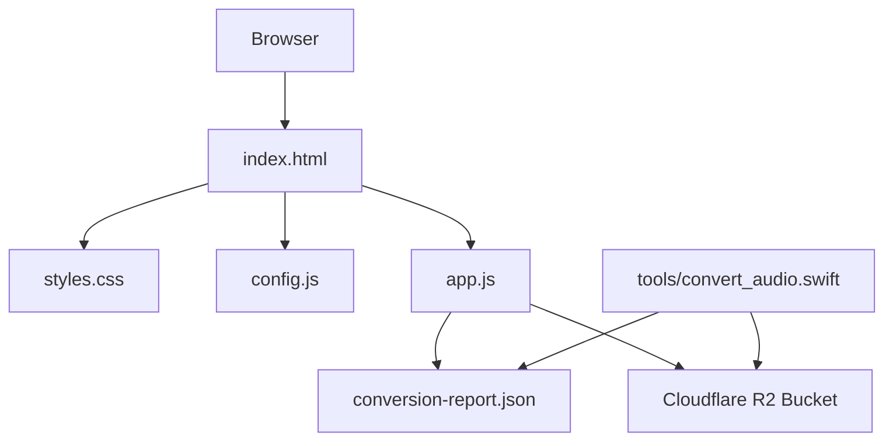
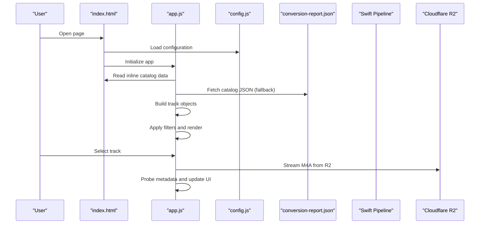
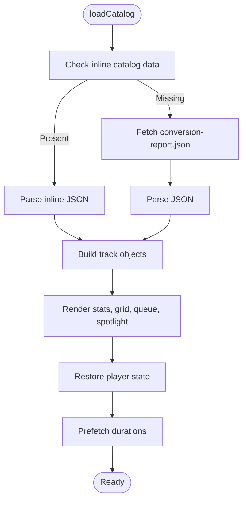
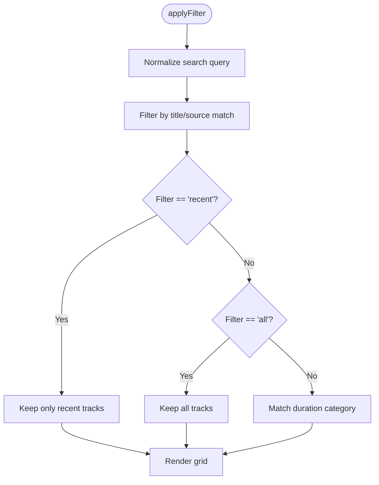
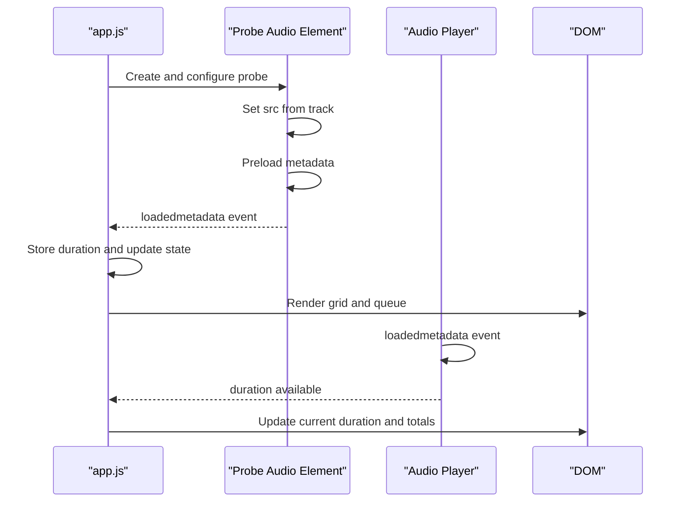
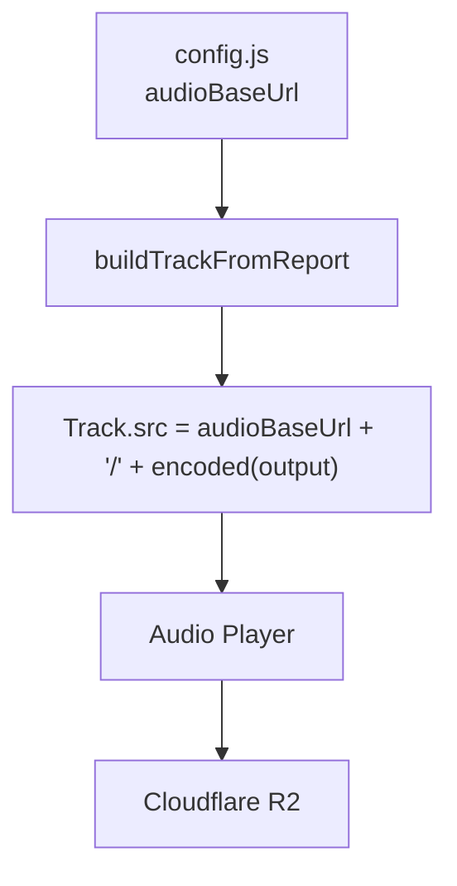
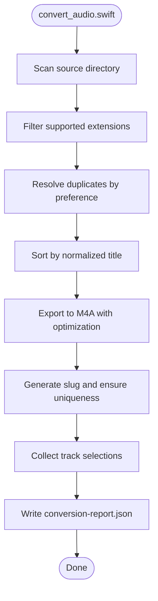
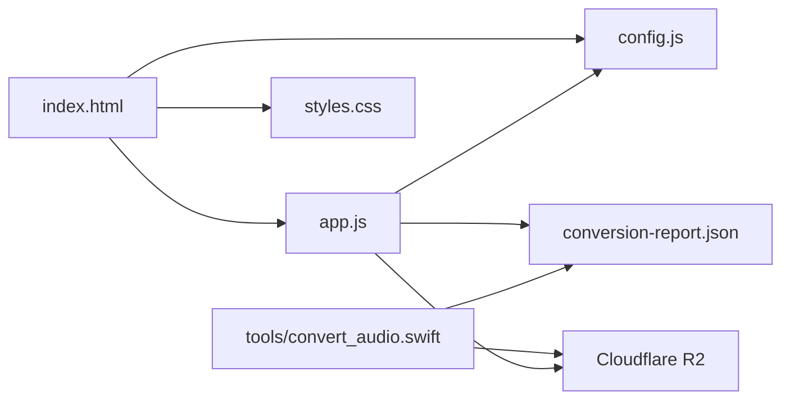

# Track Catalog Management

<cite>
**Referenced Files in This Document**
- [README.md](file://README.md)
- [index.html](file://index.html)
- [app.js](file://app.js)
- [config.js](file://config.js)
- [conversion-report.json](file://conversion-report.json)
- [tools/convert_audio.swift](file://tools/convert_audio.swift)
- [styles.css](file://styles.css)
</cite>

## Table of Contents
1. [Introduction](#introduction)
2. [Project Structure](#project-structure)
3. [Core Components](#core-components)
4. [Architecture Overview](#architecture-overview)
5. [Detailed Component Analysis](#detailed-component-analysis)
6. [Dependency Analysis](#dependency-analysis)
7. [Performance Considerations](#performance-considerations)
8. [Troubleshooting Guide](#troubleshooting-guide)
9. [Conclusion](#conclusion)

## Introduction
This document explains the track catalog management system for the MusicLab-IA project. It covers how the embedded catalog is built using a conversion report, how tracks are filtered and searched, and how the system integrates with Cloudflare R2 for audio delivery. The system manages 62 optimized tracks, each converted to M4A format and indexed via a structured JSON catalog. Users can discover tracks by duration categories, recency, and free-text search, with dynamic rendering and persistent playback state.

## Project Structure
The project consists of a static web application with a client-side catalog loader, UI components, and a Swift-based conversion pipeline that generates the catalog and optimized audio assets.

**Diagram sources**
- [index.html:1-318](file://index.html#L1-L318)
- [app.js:521-542](file://app.js#L521-L542)
- [config.js:1-7](file://config.js#L1-L7)
- [conversion-report.json:1-317](file://conversion-report.json#L1-L317)
- [tools/convert_audio.swift:1-174](file://tools/convert_audio.swift#L1-L174)

**Section sources**
- [README.md:1-27](file://README.md#L1-L27)
- [index.html:1-318](file://index.html#L1-L318)
- [app.js:521-542](file://app.js#L521-L542)
- [config.js:1-7](file://config.js#L1-L7)
- [conversion-report.json:1-317](file://conversion-report.json#L1-L317)
- [tools/convert_audio.swift:1-174](file://tools/convert_audio.swift#L1-L174)

## Core Components
- Embedded catalog loader: Reads the conversion report either from an inline script tag or from a JSON file, builds track objects, and initializes UI state.
- Track filtering and search: Applies query-based filtering and duration-based categories (short/long/recent/all).
- Cloudflare R2 integration: Uses the configured base URL to stream optimized M4A tracks from the remote bucket.
- Persistent playback state: Restores volume, current track, and playback position across sessions.
- Dynamic rendering: Updates the grid, queue, spotlight, and visualizer in real time as filters change and tracks load.

**Section sources**
- [app.js:521-542](file://app.js#L521-L542)
- [app.js:106-131](file://app.js#L106-L131)
- [app.js:133-156](file://app.js#L133-L156)
- [app.js:544-554](file://app.js#L544-L554)
- [config.js:1-7](file://config.js#L1-L7)

## Architecture Overview
The system follows a client-first architecture:
- The HTML page embeds the catalog data via a script tag for immediate availability.
- On load, the JavaScript engine parses the catalog, constructs track objects, and renders the UI.
- Tracks are streamed from Cloudflare R2 using the configured base URL.
- Filtering and search are computed client-side against the in-memory catalog.
- Metadata probing occurs asynchronously to populate duration and update the UI.

**Diagram sources**
- [index.html:242-315](file://index.html#L242-L315)
- [app.js:521-542](file://app.js#L521-L542)
- [app.js:556-576](file://app.js#L556-L576)
- [config.js:1-7](file://config.js#L1-L7)
- [conversion-report.json:1-317](file://conversion-report.json#L1-L317)
- [tools/convert_audio.swift:159-174](file://tools/convert_audio.swift#L159-L174)

## Detailed Component Analysis

### Embedded Catalog Loading
The catalog loader supports two modes:
- Inline catalog: The HTML page includes a script element containing the JSON report. This ensures immediate availability without an extra network request.
- Fallback catalog: If the inline element is empty, the loader fetches the JSON file from the server.

Key behaviors:
- Parses the report and maps each track to a normalized object with derived properties (palette, recent flag).
- Initializes UI statistics and applies default filters.
- Prefetches durations for all tracks to improve perceived performance.

**Diagram sources**
- [app.js:521-542](file://app.js#L521-L542)
- [index.html:242-315](file://index.html#L242-L315)
- [conversion-report.json:1-317](file://conversion-report.json#L1-L317)

**Section sources**
- [app.js:521-542](file://app.js#L521-L542)
- [index.html:242-315](file://index.html#L242-L315)
- [conversion-report.json:1-317](file://conversion-report.json#L1-L317)

### Track Filtering and Search
The filtering system supports:
- Free-text search: Case-insensitive substring match on title and source fields.
- Duration-based categories: Short (< 180 seconds), Long (> 270 seconds), and All.
- Recency-based discovery: Tracks are marked as recent based on their position in the catalog (top 12 entries).

Filtering logic:
- Query is trimmed and lowercased before matching.
- Recent filter restricts results to tracks flagged as recent.
- Duration filter compares the track’s duration against thresholds.
- The filtered set is rendered immediately.

**Diagram sources**
- [app.js:106-131](file://app.js#L106-L131)
- [app.js:80-89](file://app.js#L80-L89)

**Section sources**
- [app.js:106-131](file://app.js#L106-L131)
- [app.js:80-89](file://app.js#L80-L89)

### Metadata Processing and Dynamic Rendering
Metadata processing:
- On first load, the player probes each track’s duration via a temporary audio element with metadata preload.
- When metadata loads, the duration is stored and the UI updates immediately.
- Current track duration and total time are synchronized with the player.

Dynamic rendering:
- Grid cards show index, duration, title, and source.
- Queue panel displays the first 18 tracks with duration tags.
- Hero statistics summarize total tracks and long tracks.
- Spotlight highlights the currently playing track with contextual description.

**Diagram sources**
- [app.js:556-576](file://app.js#L556-L576)
- [app.js:458-475](file://app.js#L458-L475)
- [app.js:133-156](file://app.js#L133-L156)
- [app.js:158-171](file://app.js#L158-L171)
- [app.js:173-181](file://app.js#L173-L181)

**Section sources**
- [app.js:556-576](file://app.js#L556-L576)
- [app.js:458-475](file://app.js#L458-L475)
- [app.js:133-156](file://app.js#L133-L156)
- [app.js:158-171](file://app.js#L158-L171)
- [app.js:173-181](file://app.js#L173-L181)

### Cloudflare R2 Integration
The system streams tracks from Cloudflare R2 using a configurable base URL. The configuration object defines:
- audioBaseUrl: Public URL of the R2 bucket hosting the optimized audio files.
- bucketName and accountId: Metadata for deployment context.
- s3Endpoint: S3-compatible endpoint for potential future migrations.

Loading behavior:
- Track objects are constructed with a src property combining the base URL and encoded filename.
- The audio element uses anonymous cross-origin attributes to support streaming from R2.

**Diagram sources**
- [config.js:1-7](file://config.js#L1-L7)
- [app.js:91-104](file://app.js#L91-L104)
- [index.html:242](file://index.html#L242)

**Section sources**
- [config.js:1-7](file://config.js#L1-L7)
- [app.js:91-104](file://app.js#L91-L104)
- [index.html:242](file://index.html#L242)

### Conversion Pipeline and Catalog Generation
The Swift tool performs:
- File discovery: Scans the current directory for supported audio files.
- Deduplication: Chooses preferred file extensions and resolves duplicates by title.
- Slug generation: Creates safe filenames from track titles.
- Export: Converts each file to M4A using Apple’s optimized preset.
- Report generation: Writes a JSON report with creation timestamp, output directory, total count, and track entries.

**Diagram sources**
- [tools/convert_audio.swift:98-154](file://tools/convert_audio.swift#L98-L154)
- [tools/convert_audio.swift:159-174](file://tools/convert_audio.swift#L159-L174)

**Section sources**
- [tools/convert_audio.swift:1-174](file://tools/convert_audio.swift#L1-L174)
- [conversion-report.json:1-317](file://conversion-report.json#L1-L317)

## Dependency Analysis
The application exhibits low coupling and clear separation of concerns:
- HTML provides the shell and inline catalog data.
- CSS handles presentation and theming.
- app.js orchestrates state, rendering, and playback.
- config.js centralizes external configuration.
- conversion-report.json is the authoritative catalog source.
- tools/convert_audio.swift produces the catalog and optimized assets.

**Diagram sources**
- [index.html:1-318](file://index.html#L1-L318)
- [app.js:521-542](file://app.js#L521-L542)
- [config.js:1-7](file://config.js#L1-L7)
- [conversion-report.json:1-317](file://conversion-report.json#L1-L317)
- [tools/convert_audio.swift:159-174](file://tools/convert_audio.swift#L159-L174)

**Section sources**
- [index.html:1-318](file://index.html#L1-L318)
- [app.js:521-542](file://app.js#L521-L542)
- [config.js:1-7](file://config.js#L1-L7)
- [conversion-report.json:1-317](file://conversion-report.json#L1-L317)
- [tools/convert_audio.swift:159-174](file://tools/convert_audio.swift#L159-L174)

## Performance Considerations
- Embedded catalog reduces latency by avoiding an additional network request on initial load.
- Metadata probing is asynchronous and batched across all tracks to minimize UI blocking.
- Duration caching via a Map accelerates repeated lookups during rendering.
- Lazy rendering of queue items limits DOM updates to the first 18 tracks.
- Local storage persists volume and playback position to reduce reinitialization overhead.
- CSS animations are disabled by default to avoid unnecessary GPU usage; they can be enabled conditionally if needed.

[No sources needed since this section provides general guidance]

## Troubleshooting Guide
Common issues and resolutions:
- Catalog fails to load: Verify the inline script tag contains valid JSON and the fallback fetch returns a 200 status. Check browser console for errors.
- Tracks show zero duration: Ensure metadata probing completes and the audio element fires the loadedmetadata event. Confirm CORS settings on the R2 bucket allow anonymous access.
- Incorrect base URL: Update the audioBaseUrl in config.js to the public R2 endpoint before deploying.
- Playback errors: Inspect the audio element’s error property and ensure the M4A files are present and accessible at the configured URL.
- Filter not applying: Confirm the filter buttons set the correct dataset values and that the query input triggers applyFilter on input events.

**Section sources**
- [app.js:586-589](file://app.js#L586-L589)
- [app.js:499-502](file://app.js#L499-L502)
- [config.js:1-7](file://config.js#L1-L7)
- [index.html:242](file://index.html#L242)

## Conclusion
The MusicLab-IA track catalog management system combines a robust client-side architecture with a Swift-based conversion pipeline to deliver a responsive, searchable, and visually engaging music library. The embedded catalog ensures fast startup, while Cloudflare R2 provides scalable, low-latency streaming. Advanced filtering and metadata probing enable intuitive discovery and smooth playback, with persistent state for continuity across sessions.