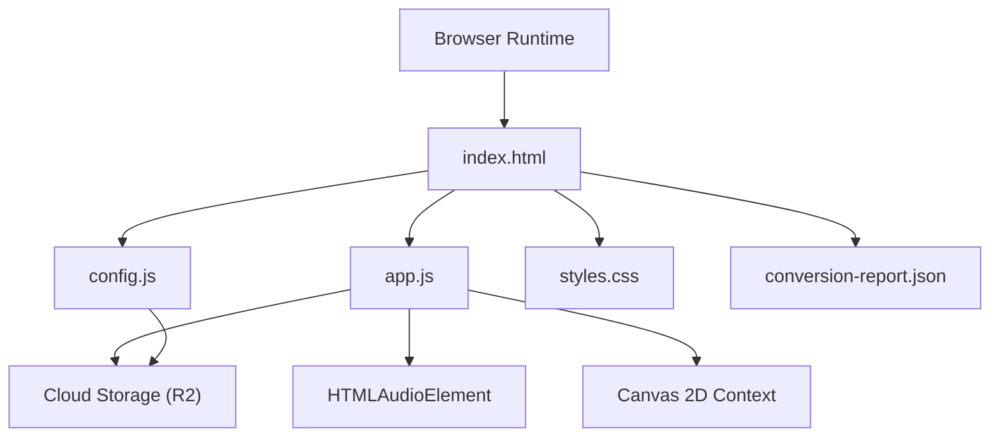
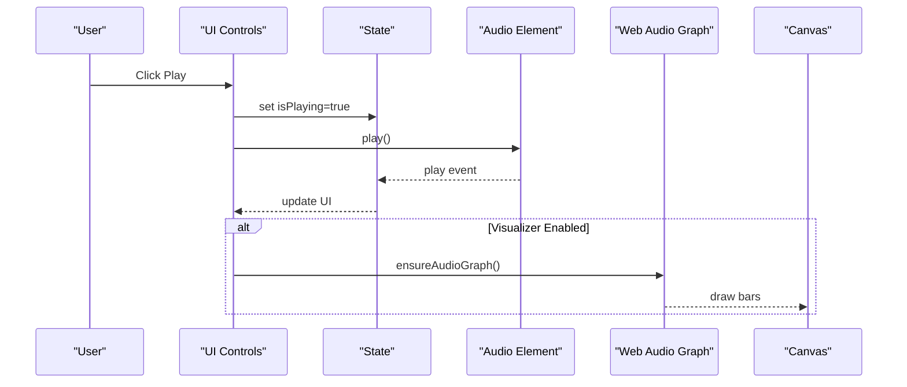
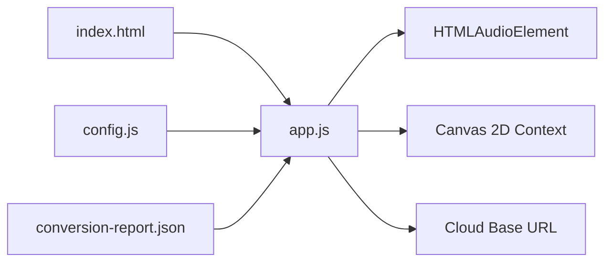

# Troubleshooting and FAQ

<cite>
**Referenced Files in This Document**
- [README.md](file://README.md)
- [index.html](file://index.html)
- [app.js](file://app.js)
- [config.js](file://config.js)
- [styles.css](file://styles.css)
- [conversion-report.json](file://conversion-report.json)
- [tools/convert_audio.swift](file://tools/convert_audio.swift)
</cite>

## Update Summary
**Changes Made**
- Added comprehensive CORS troubleshooting section for Amazon S3 R2 storage integration
- Updated audio loading issues section with specific solutions for cross-origin resource sharing problems
- Enhanced cloud storage connectivity troubleshooting with R2-specific guidance
- Added audio element attribute recommendations for resolving CORS issues

## Table of Contents
1. [Introduction](#introduction)
2. [Project Structure](#project-structure)
3. [Core Components](#core-components)
4. [Architecture Overview](#architecture-overview)
5. [Detailed Component Analysis](#detailed-component-analysis)
6. [Dependency Analysis](#dependency-analysis)
7. [Performance Considerations](#performance-considerations)
8. [Troubleshooting Guide](#troubleshooting-guide)
9. [Conclusion](#conclusion)
10. [Appendices](#appendices)

## Introduction
This document provides comprehensive troubleshooting and FAQ guidance for the MusicLab-IA music player. It focuses on diagnosing and resolving audio playback issues, visualization errors, and cloud storage connectivity concerns. It also covers browser compatibility, Web Audio API limitations, performance tuning, configuration pitfalls, deployment problems, and development workflow issues. Practical diagnostic procedures and debugging/logging strategies are included for audio processing, UI rendering, and state management conflicts.

**Updated** Added comprehensive coverage of CORS-related audio loading issues with Amazon S3 R2 storage and specific solutions for cross-origin resource sharing problems.

## Project Structure
The MusicLab-IA player is a static single-page application composed of:
- HTML entry with embedded catalog data and DOM elements for playback, visualization, and UI
- JavaScript application logic for state management, audio playback, filtering, and visualization
- CSS for theming and responsive layout
- Configuration module for cloud storage base URL and metadata
- Conversion toolchain to produce optimized M4A tracks and a catalog report

**Diagram sources**
- [index.html:1-318](file://index.html#L1-L318)
- [app.js:1-590](file://app.js#L1-L590)
- [config.js:1-7](file://config.js#L1-L7)
- [conversion-report.json:1-317](file://conversion-report.json#L1-L317)

**Section sources**
- [README.md:1-27](file://README.md#L1-L27)
- [index.html:1-318](file://index.html#L1-L318)
- [app.js:1-590](file://app.js#L1-L590)
- [config.js:1-7](file://config.js#L1-L7)
- [styles.css:1-543](file://styles.css#L1-L543)
- [conversion-report.json:1-317](file://conversion-report.json#L1-L317)
- [tools/convert_audio.swift:1-174](file://tools/convert_audio.swift#L1-L174)

## Core Components
- State management: central state object holds tracks, filters, current index, and durations
- Audio element: HTMLAudioElement with event-driven playback and seeking
- Visualization: Canvas-based frequency bars using Web Audio API analyser
- UI rendering: dynamic updates to track grid, queue, spotlight, and now playing panel
- Configuration: runtime configuration injected via global object for cloud base URL
- Catalog loading: embedded JSON or remote fetch of conversion report

Key implementation references:
- State and UI bindings: [app.js:1-590](file://app.js#L1-L590)
- Audio events and error handling: [app.js:477-502](file://app.js#L477-L502)
- Visualization lifecycle: [app.js:280-382](file://app.js#L280-L382)
- Catalog loading and fallback: [app.js:521-542](file://app.js#L521-L542)
- Embedded catalog in HTML: [index.html:242-315](file://index.html#L242-L315)
- Configuration injection: [config.js:1-7](file://config.js#L1-L7)

**Section sources**
- [app.js:1-590](file://app.js#L1-L590)
- [index.html:242-315](file://index.html#L242-L315)
- [config.js:1-7](file://config.js#L1-L7)

## Architecture Overview
The player follows a reactive architecture:
- UI elements trigger actions that update state
- State changes drive DOM updates and audio operations
- Visualization is optional and depends on Web Audio API availability
- Tracks are loaded from a configured cloud storage base URL

**Diagram sources**
- [app.js:256-272](file://app.js#L256-L272)
- [app.js:280-319](file://app.js#L280-L319)
- [app.js:321-359](file://app.js#L321-L359)

## Detailed Component Analysis

### Audio Playback Engine
- Playback lifecycle: load track, play/pause, seek, ended transitions
- Error handling: logs audio error events and renders a fatal error message
- Persistence: stores current track ID, volume, and current time in local storage

Common issues:
- Autoplay restrictions: browsers may require user interaction before allowing audio to play
- CORS and cross-origin: ensure media URLs are served with appropriate headers
- Duration probing: metadata is prefetched; failures can delay duration display

Diagnostic references:
- Play/pause toggling: [app.js:426-432](file://app.js#L426-L432)
- Seek handling: [app.js:508-513](file://app.js#L508-L513)
- Error handling: [app.js:499-502](file://app.js#L499-L502)
- Duration prefetch: [app.js:556-576](file://app.js#L556-L576)

**Section sources**
- [app.js:231-254](file://app.js#L231-L254)
- [app.js:426-432](file://app.js#L426-L432)
- [app.js:499-502](file://app.js#L499-L502)
- [app.js:508-513](file://app.js#L508-L513)
- [app.js:556-576](file://app.js#L556-L576)

### Visualization Pipeline
- Visualizer is disabled by default in code; enabling it requires changing a flag and ensuring Web Audio API support
- Frequency bars are drawn on a 2D canvas using analyser data
- Lifecycle: ensure graph, draw loop, idle painting

Common issues:
- Suspended audio context after tab switch or backgrounding
- Unsupported analyser or missing MediaElementSource
- Disabled visualizer flag prevents graph creation

Diagnostic references:
- Visualizer flag: [app.js:48](file://app.js#L48)
- Graph initialization: [app.js:280-319](file://app.js#L280-L319)
- Draw loop: [app.js:321-359](file://app.js#L321-L359)
- Idle painting: [app.js:361-382](file://app.js#L361-L382)

**Section sources**
- [app.js:48](file://app.js#L48)
- [app.js:280-319](file://app.js#L280-L319)
- [app.js:321-359](file://app.js#L321-L359)
- [app.js:361-382](file://app.js#L361-L382)

### Catalog Loading and Rendering
- Loads catalog from embedded JSON or remote fetch
- Builds track objects with derived attributes and palettes
- Applies filters and renders grids and queues

Common issues:
- Network fetch failures leading to catalog load errors
- Incorrect audio base URL causing 404s for media assets
- Missing embedded catalog data

Diagnostic references:
- Embedded catalog: [index.html:242-315](file://index.html#L242-L315)
- Remote fetch fallback: [app.js:521-542](file://app.js#L521-L542)
- Track building: [app.js:91-104](file://app.js#L91-L104)

**Section sources**
- [index.html:242-315](file://index.html#L242-L315)
- [app.js:521-542](file://app.js#L521-L542)
- [app.js:91-104](file://app.js#L91-L104)

### Configuration and Cloud Storage
- Configuration object defines cloud base URL and related identifiers
- Deployment instructions require setting the public R2 URL before publishing
- CORS and origin policies must permit cross-origin media loading

Diagnostic references:
- Configuration object: [config.js:1-7](file://config.js#L1-L7)
- Deployment notes: [README.md:14-21](file://README.md#L14-L21)

**Section sources**
- [config.js:1-7](file://config.js#L1-L7)
- [README.md:14-21](file://README.md#L14-L21)

## Dependency Analysis
- app.js depends on:
  - index.html for DOM nodes and embedded catalog
  - config.js for runtime configuration
  - conversion-report.json for fallback catalog loading
- Visualization depends on Web Audio API and Canvas 2D context
- Cloud storage base URL drives media URLs built from catalog entries

**Diagram sources**
- [index.html:242-315](file://index.html#L242-L315)
- [app.js:1-590](file://app.js#L1-L590)
- [config.js:1-7](file://config.js#L1-L7)
- [conversion-report.json:1-317](file://conversion-report.json#L1-L317)

**Section sources**
- [index.html:242-315](file://index.html#L242-L315)
- [app.js:1-590](file://app.js#L1-L590)
- [config.js:1-7](file://config.js#L1-L7)
- [conversion-report.json:1-317](file://conversion-report.json#L1-L317)

## Performance Considerations
- Prefer M4A encoding for optimal streaming and reduced latency
- Avoid unnecessary reflows by batching DOM updates during rendering
- Limit visualization complexity when CPU/GPU constrained
- Defer heavy operations until after initial catalog load completes

[No sources needed since this section provides general guidance]

## Troubleshooting Guide

### Audio Playback Problems
Symptoms:
- No sound when pressing play
- Immediate pause after starting
- Seeking does not work
- Duration shows zero or incorrect

Root causes and fixes:
- Autoplay blocked: Trigger play from a user gesture (click/tap). The player attempts to play on first click; ensure the user interaction occurs before invoking play.
  - Reference: [app.js:256-272](file://app.js#L256-L272)
- CORS/media access denied: Verify the cloud storage bucket serves media with appropriate CORS headers and allows cross-origin access.
  - Reference: [README.md:18-20](file://README.md#L18-L20)
- Invalid or missing audio base URL: Ensure the configured base URL points to the public R2 endpoint.
  - Reference: [config.js:1-7](file://config.js#L1-L7)
- Network errors: Check network tab for 404/403 responses; confirm file names match catalog entries.
  - Reference: [app.js:499-502](file://app.js#L499-L502)
- Duration probing delays: Metadata is prefetched; wait briefly for durations to populate.
  - Reference: [app.js:556-576](file://app.js#L556-L576)

Diagnostic checklist:
- Open DevTools Console and Network tabs; look for audio error messages and failed requests
- Confirm the audio element's currentSrc resolves to a reachable URL
- Verify the embedded catalog matches the media filenames
  - Reference: [index.html:242-315](file://index.html#L242-L315)

**Section sources**
- [app.js:256-272](file://app.js#L256-L272)
- [app.js:499-502](file://app.js#L499-L502)
- [app.js:556-576](file://app.js#L556-L576)
- [config.js:1-7](file://config.js#L1-L7)
- [README.md:18-20](file://README.md#L18-L20)
- [index.html:242-315](file://index.html#L242-L315)

### CORS-Related Audio Loading Issues with Amazon S3 R2 Storage
**Updated** Added comprehensive troubleshooting for CORS-related audio loading problems with Amazon S3 R2 storage.

Symptoms:
- Audio loads but produces CORS errors in browser console
- Audio fails to play with "Failed to load" errors
- Network tab shows 403/404 CORS blocked responses
- Cross-origin requests are denied despite correct URLs

Root causes and fixes:
- Missing crossOrigin attribute: Add `crossOrigin="anonymous"` to the audio element to enable CORS for cross-origin media loading
  - Reference: [index.html:242](file://index.html#L242)
- R2 bucket CORS configuration: Ensure Cloudflare R2 bucket allows cross-origin requests from your domain
  - Reference: [config.js:1-7](file://config.js#L1-L7)
- Preload attribute conflicts: Remove `preload="metadata"` if causing CORS issues, or adjust to `preload="none"`
  - Reference: [index.html:242](file://index.html#L242)
- Mixed content blocking: Ensure both your website and R2 bucket use HTTPS consistently
  - Reference: [config.js:1-7](file://config.js#L1-L7)

Diagnostic checklist:
- Check browser console for CORS-related error messages
- Verify network tab shows OPTIONS preflight requests succeeding
- Confirm audio element has `crossOrigin="anonymous"` attribute
- Validate R2 bucket CORS settings allow your domain
- Test direct URL access to audio files in browser

**Section sources**
- [index.html:242](file://index.html#L242)
- [config.js:1-7](file://config.js#L1-L7)

### Visualization Errors
Symptoms:
- Visualizer does not appear
- Bars flicker or fail to draw
- Audio continues but no visualization

Root causes and fixes:
- Visualizer disabled by default: Change the flag to enable visualization and ensure Web Audio API support.
  - Reference: [app.js:48](file://app.js#L48)
- Suspended audio context: Resume the context after user interaction or tab switch.
  - Reference: [app.js:280-319](file://app.js#L280-L319)
- Unsupported analyser or missing MediaElementSource: Ensure the browser supports the analyser node and media element source.
  - Reference: [app.js:297-311](file://app.js#L297-L311)
- Canvas not present or style issues: Confirm the canvas element exists and is visible.
  - Reference: [index.html:166-168](file://index.html#L166-L168)

Diagnostic checklist:
- Toggle visualizer flag and reload
- Inspect Web Audio context state and resume if suspended
- Verify analyser and source connections
  - Reference: [app.js:280-319](file://app.js#L280-L319)

**Section sources**
- [app.js:48](file://app.js#L48)
- [app.js:280-319](file://app.js#L280-L319)
- [index.html:166-168](file://index.html#L166-L168)

### Cloud Storage Connectivity Issues
Symptoms:
- Catalog fails to load
- Media URLs 404 or CORS blocked
- Deployment appears broken on hosting platform

Root causes and fixes:
- Incorrect base URL: Update the configuration to the public R2 bucket URL before deploying.
  - Reference: [README.md:20](file://README.md#L20)
  - Reference: [config.js:1-7](file://config.js#L1-L7)
- Missing embedded catalog: Ensure the embedded JSON is present or the remote fetch succeeds.
  - Reference: [index.html:242-315](file://index.html#L242-L315)
  - Reference: [app.js:521-542](file://app.js#L521-L542)
- Hosting restrictions: Publish to a static host that supports cross-origin media access and CORS.

Diagnostic checklist:
- Compare configured base URL with the actual R2 endpoint
- Validate media URLs against the catalog entries
  - Reference: [conversion-report.json:1-317](file://conversion-report.json#L1-L317)

**Section sources**
- [README.md:20](file://README.md#L20)
- [config.js:1-7](file://config.js#L1-L7)
- [index.html:242-315](file://index.html#L242-L315)
- [app.js:521-542](file://app.js#L521-L542)
- [conversion-report.json:1-317](file://conversion-report.json#L1-L317)

### Browser Compatibility and Web Audio API Limitations
- Autoplay policies: Many browsers restrict autoplay; user interaction is required before play().
  - Reference: [app.js:256-272](file://app.js#L256-L272)
- Cross-origin media: Ensure media is served with appropriate CORS headers.
  - Reference: [README.md:18-20](file://README.md#L18-L20)
- Web Audio API support: Some environments disable or restrict analyser nodes.
  - Reference: [app.js:297-311](file://app.js#L297-L311)

Diagnostic checklist:
- Test on a modern desktop browser with autoplay allowed
- Verify CORS headers for media resources
- Check browser console for Web Audio errors

**Section sources**
- [app.js:256-272](file://app.js#L256-L272)
- [app.js:297-311](file://app.js#L297-L311)
- [README.md:18-20](file://README.md#L18-L20)

### Performance Troubleshooting Techniques
- Reduce visualizer complexity: Disable visualization or lower analyser FFT size
  - Reference: [app.js:300](file://app.js#L300)
- Minimize DOM updates: Batch UI updates after state changes
- Optimize media: Use M4A as produced by the conversion toolchain
  - Reference: [tools/convert_audio.swift:59-90](file://tools/convert_audio.swift#L59-L90)

**Section sources**
- [app.js:300](file://app.js#L300)
- [tools/convert_audio.swift:59-90](file://tools/convert_audio.swift#L59-L90)

### Configuration Errors
Common mistakes:
- Leaving default base URL unchanged
  - Reference: [config.js:1-7](file://config.js#L1-L7)
- Not updating base URL before deployment
  - Reference: [README.md:20](file://README.md#L20)
- Missing embedded catalog for offline testing
  - Reference: [index.html:242-315](file://index.html#L242-L315)

Fix steps:
- Edit the configuration object with the correct R2 public URL
- Rebuild and redeploy with updated configuration
- Verify embedded catalog presence for local testing

**Section sources**
- [config.js:1-7](file://config.js#L1-L7)
- [README.md:20](file://README.md#L20)
- [index.html:242-315](file://index.html#L242-L315)

### Deployment Issues
- Static hosting requirements: Host on a platform that serves static assets with CORS enabled
- Base URL mismatch: Ensure the deployed configuration points to the live R2 endpoint
- Local vs. production differences: Use embedded catalog for local testing; rely on remote fetch in production

**Section sources**
- [README.md:14-21](file://README.md#L14-L21)
- [index.html:242-315](file://index.html#L242-L315)

### Development Workflow Problems
- Conversion pipeline: Run the Swift script to generate M4A files and update the catalog
  - Reference: [tools/convert_audio.swift:1-174](file://tools/convert_audio.swift#L1-L174)
- Catalog synchronization: Ensure the catalog reflects the actual media filenames
  - Reference: [conversion-report.json:1-317](file://conversion-report.json#L1-L317)

**Section sources**
- [tools/convert_audio.swift:1-174](file://tools/convert_audio.swift#L1-L174)
- [conversion-report.json:1-317](file://conversion-report.json#L1-L317)

### Diagnostic Procedures
Audio processing issues:
- Inspect audio error events and currentSrc
  - Reference: [app.js:499-502](file://app.js#L499-L502)
- Verify duration probing completion
  - Reference: [app.js:556-576](file://app.js#L556-L576)

UI rendering problems:
- Check track grid and queue rendering logic
  - Reference: [app.js:133-171](file://app.js#L133-L171)
- Confirm spotlight updates and current card state
  - Reference: [app.js:183-214](file://app.js#L183-L214)

State management conflicts:
- Review state transitions and event handlers
  - Reference: [app.js:426-456](file://app.js#L426-L456)
- Validate localStorage persistence keys
  - Reference: [app.js:50-54](file://app.js#L50-L54)

**Section sources**
- [app.js:499-502](file://app.js#L499-L502)
- [app.js:556-576](file://app.js#L556-L576)
- [app.js:133-171](file://app.js#L133-L171)
- [app.js:183-214](file://app.js#L183-L214)
- [app.js:426-456](file://app.js#L426-L456)
- [app.js:50-54](file://app.js#L50-L54)

### Debugging Tools, Logging Strategies, and Profiling
- Console logging: Use browser DevTools to inspect audio errors and state logs
- Network tab: Monitor media requests and CORS responses
- Performance tab: Profile UI rendering and audio graph drawing
- Web Audio debugging: Inspect context state and analyser node connections
  - Reference: [app.js:280-319](file://app.js#L280-L319)

**Section sources**
- [app.js:280-319](file://app.js#L280-L319)

## Conclusion
MusicLab-IA relies on a clean separation between UI, state, and audio processing. Most issues stem from autoplay restrictions, CORS misconfiguration, or incorrect cloud storage base URLs. By following the diagnostic procedures and applying the targeted fixes outlined above, you can resolve playback, visualization, and deployment challenges effectively.

**Updated** The addition of CORS troubleshooting guidance specifically addresses cross-origin resource sharing problems with Amazon S3 R2 storage, providing developers with practical solutions for audio loading issues in cloud storage environments.

[No sources needed since this section summarizes without analyzing specific files]

## Appendices

### Frequently Asked Questions

Q: What audio formats are supported?
A: The player streams M4A files generated by the conversion toolchain. Ensure your media is exported as M4A for optimal performance.
- Reference: [tools/convert_audio.swift:59-90](file://tools/convert_audio.swift#L59-L90)

Q: Which browsers are supported?
A: Modern browsers with Web Audio API and Canvas support are required. Autoplay may require user interaction.
- Reference: [app.js:256-272](file://app.js#L256-L272)

Q: Why is the visualizer not showing?
A: The visualizer is disabled by default. Enable it and ensure Web Audio API support.
- Reference: [app.js:48](file://app.js#L48)
- Reference: [app.js:297-311](file://app.js#L297-L311)

Q: How do I fix "Failed to load catalog"?
A: Ensure the embedded catalog is present or that the remote fetch succeeds. Verify the base URL points to the correct R2 endpoint.
- Reference: [index.html:242-315](file://index.html#L242-L315)
- Reference: [app.js:521-542](file://app.js#L521-L542)
- Reference: [README.md:20](file://README.md#L20)

Q: How do I deploy correctly?
A: Publish to a static host that supports CORS and update the base URL in configuration before deploying.
- Reference: [README.md:14-21](file://README.md#L14-L21)
- Reference: [config.js:1-7](file://config.js#L1-L7)

Q: What should I check if seeking does not work?
A: Confirm that duration is known and the seek range input is bound to audio.currentTime updates.
- Reference: [app.js:508-513](file://app.js#L508-L513)
- Reference: [app.js:477-485](file://app.js#L477-L485)

Q: How do I fix CORS-related audio loading issues with R2 storage?
**Updated** Added FAQ for CORS-related audio loading issues with Amazon S3 R2 storage.

A: Add `crossOrigin="anonymous"` to the audio element and configure your R2 bucket CORS settings to allow cross-origin requests from your domain. Ensure both your website and R2 bucket use HTTPS consistently.
- Reference: [index.html:242](file://index.html#L242)
- Reference: [config.js:1-7](file://config.js#L1-L7)

Q: What CORS settings should I use for Cloudflare R2?
**Updated** Added specific CORS configuration guidance for Cloudflare R2 storage.

A: Configure your R2 bucket CORS policy to allow requests from your domain with the following headers: `Access-Control-Allow-Origin: https://yourdomain.com`, `Access-Control-Allow-Methods: GET`, and `Access-Control-Allow-Credentials: true`. Ensure the bucket endpoint URL matches your configured audioBaseUrl.
- Reference: [config.js:1-7](file://config.js#L1-L7)

**Section sources**
- [tools/convert_audio.swift:59-90](file://tools/convert_audio.swift#L59-L90)
- [app.js:256-272](file://app.js#L256-L272)
- [app.js:48](file://app.js#L48)
- [app.js:297-311](file://app.js#L297-L311)
- [index.html:242-315](file://index.html#L242-L315)
- [app.js:521-542](file://app.js#L521-L542)
- [README.md:14-21](file://README.md#L14-L21)
- [config.js:1-7](file://config.js#L1-L7)
- [app.js:508-513](file://app.js#L508-L513)
- [app.js:477-485](file://app.js#L477-L485)
- [index.html:242](file://index.html#L242)