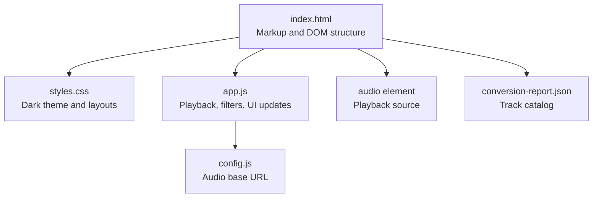
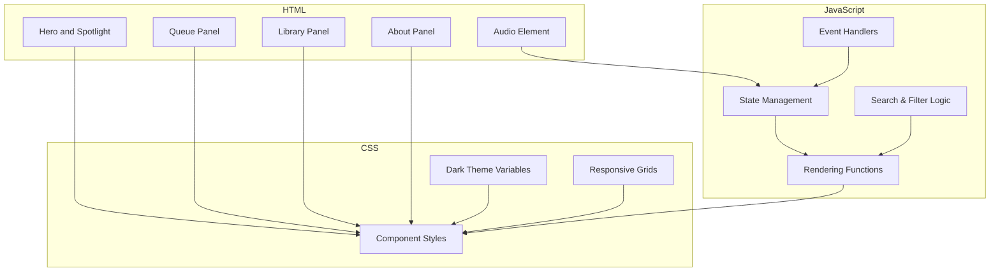
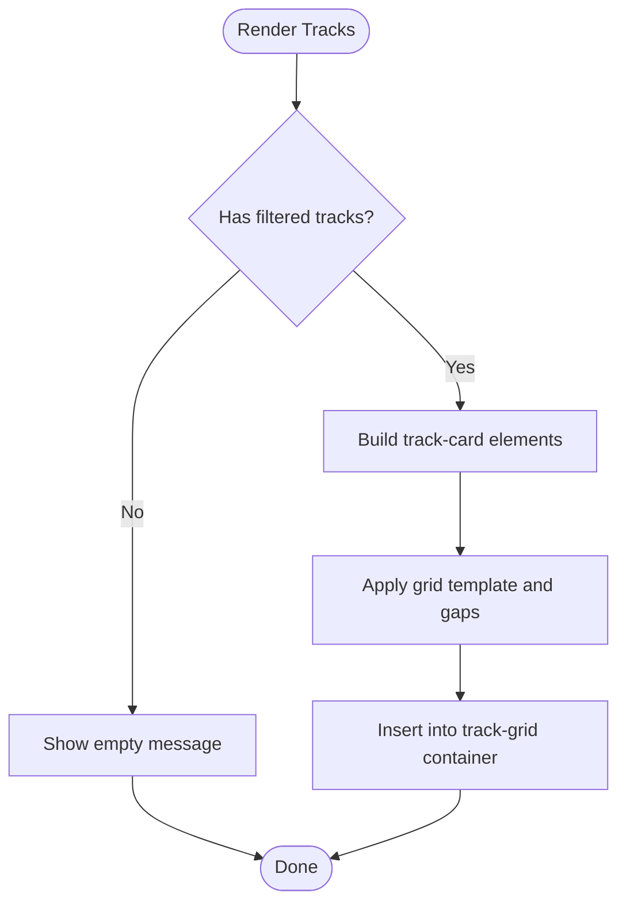
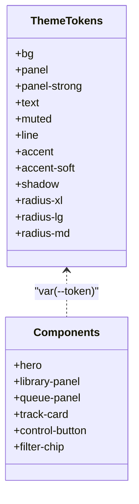
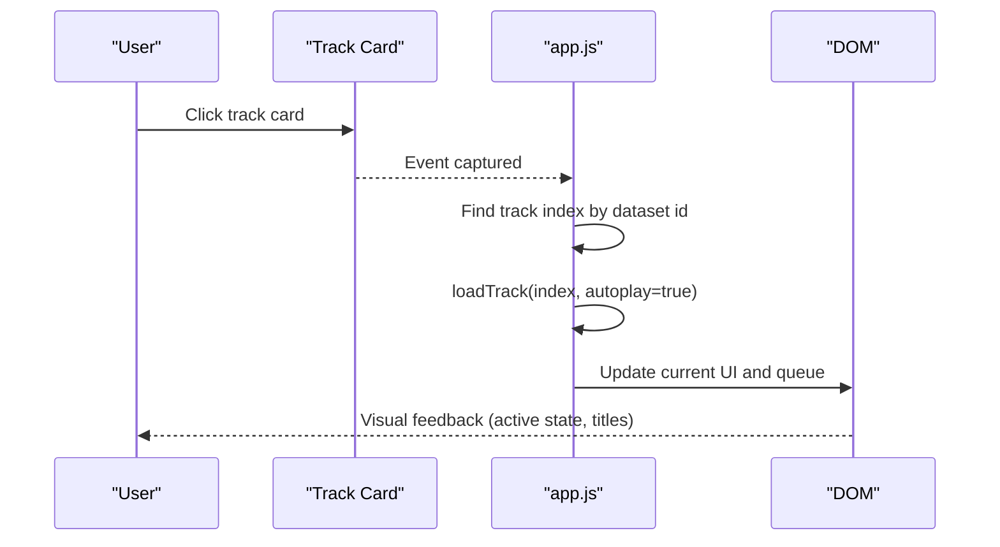
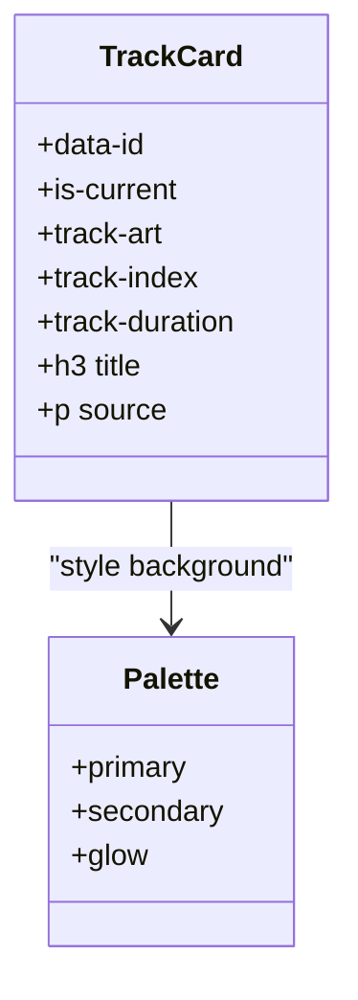
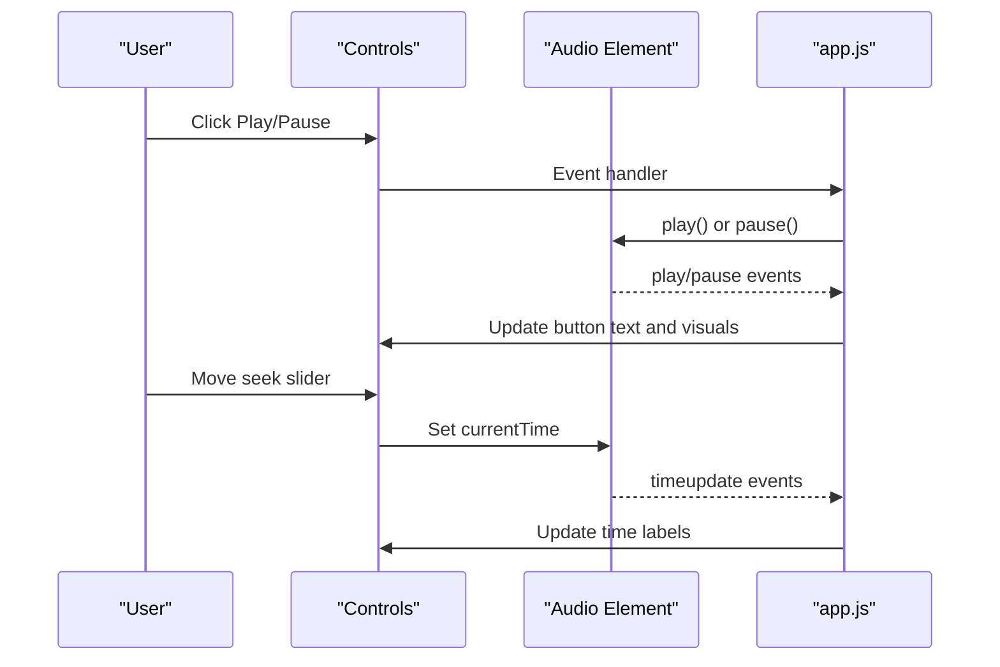
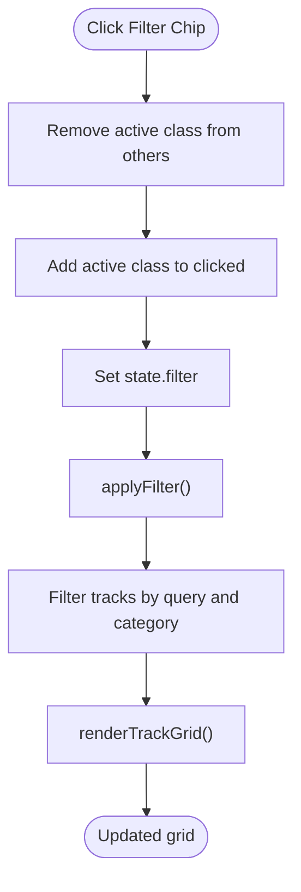
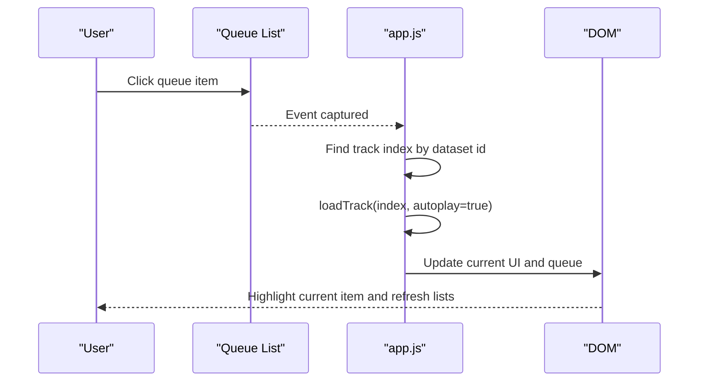
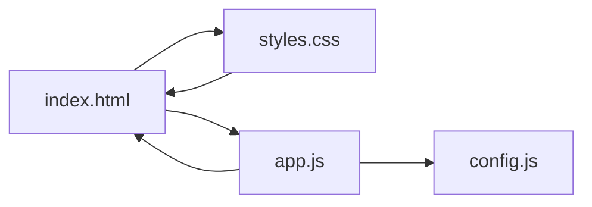

# User Interface Components

<cite>
**Referenced Files in This Document**
- [index.html](file://index.html)
- [styles.css](file://styles.css)
- [app.js](file://app.js)
- [config.js](file://config.js)
- [README.md](file://README.md)
</cite>

## Table of Contents
1. [Introduction](#introduction)
2. [Project Structure](#project-structure)
3. [Core Components](#core-components)
4. [Architecture Overview](#architecture-overview)
5. [Detailed Component Analysis](#detailed-component-analysis)
6. [Dependency Analysis](#dependency-analysis)
7. [Performance Considerations](#performance-considerations)
8. [Troubleshooting Guide](#troubleshooting-guide)
9. [Conclusion](#conclusion)
10. [Appendices](#appendices)

## Introduction
This document describes the user interface components of the MusicLab-IA web player. It focuses on the responsive grid layout system for track display, the dark theme implementation using CSS custom properties, and interactive element design patterns. It documents the visual appearance and behavior of key UI components including track cards, playback controls, filter panels, and queue management. Accessibility features, responsive design principles, and cross-browser compatibility considerations are explained, along with guidelines for UI customization, theme modification, and component styling. Examples of component states, animations, and user interaction patterns are included, alongside performance optimization recommendations for smooth UI rendering across devices.

## Project Structure
The application consists of a minimal static structure:
- index.html: Main page markup with sections for hero, spotlight, queue panel, library panel, and audio element.
- styles.css: Dark theme CSS with CSS custom properties, responsive grids, and component styles.
- app.js: Player logic, filtering, search, queue management, and UI updates.
- config.js: Global configuration for audio base URL and storage endpoint.
- conversion-report.json: Embedded catalog of tracks used by the app.

**Diagram sources**
- [index.html:1-318](file://index.html#L1-L318)
- [styles.css:1-543](file://styles.css#L1-L543)
- [app.js:1-590](file://app.js#L1-L590)
- [config.js:1-7](file://config.js#L1-L7)

**Section sources**
- [index.html:1-318](file://index.html#L1-L318)
- [README.md:1-27](file://README.md#L1-L27)

## Core Components
This section outlines the primary UI components and their roles:
- Hero and Spotlight: Prominent header area with title, subtitle, stats, and featured track presentation.
- Queue Panel: Now playing area with current track card, visualizer, playback controls, timeline, and queue list.
- Library Panel: Track grid with search and filter chips, displaying all tracks.
- About Panel: Expandable panel with project manifesto and links.

Key interactive elements:
- Buttons: Pill-shaped buttons for actions like “Saber mais”, “Tocar agora”, and playback controls.
- Inputs: Range sliders for seek and volume, and a search field.
- Cards: Track cards and queue items with hover and active states.

Accessibility and responsive behavior:
- Semantic headings and labels.
- Screen-reader-only text for assistive technologies.
- Responsive breakpoints for mobile and tablet layouts.

**Section sources**
- [index.html:10-242](file://index.html#L10-L242)
- [styles.css:47-543](file://styles.css#L47-L543)
- [app.js:106-131](file://app.js#L106-L131)

## Architecture Overview
The UI architecture combines declarative HTML with imperative JavaScript for dynamic updates. CSS custom properties define the dark theme and enable easy customization. Grid layouts adapt to screen size, while JavaScript manages state, rendering, and user interactions.

**Diagram sources**
- [index.html:10-242](file://index.html#L10-L242)
- [styles.css:1-543](file://styles.css#L1-L543)
- [app.js:1-590](file://app.js#L1-L590)

## Detailed Component Analysis

### Responsive Grid Layout System for Track Display
The track grid uses CSS Grid with automatic column sizing and gaps. It adapts across breakpoints:
- Desktop: Columns sized to fit multiple tracks with consistent spacing.
- Tablet: Two-column layout for smaller screens.
- Mobile: Single-column layout for compact viewing.

**Diagram sources**
- [app.js:133-156](file://app.js#L133-L156)
- [styles.css:345-350](file://styles.css#L345-L350)

**Section sources**
- [styles.css:345-350](file://styles.css#L345-L350)
- [app.js:133-156](file://app.js#L133-L156)

### Dark Theme Implementation Using CSS Custom Properties
The dark theme is centralized in the :root scope with variables for backgrounds, text, accents, and radii. Panels, typography, and interactive elements consistently reference these variables. The color-scheme declaration ensures system preference alignment.

Key theme tokens:
- Backgrounds: base, panel, panel-strong
- Text: primary, muted
- Accents: primary and soft variants
- Borders and shadows: line and shadow
- Border radii: xl, lg, md

**Diagram sources**
- [styles.css:1-14](file://styles.css#L1-L14)
- [styles.css:47-60](file://styles.css#L47-L60)
- [styles.css:20-22](file://styles.css#L20-L22)

**Section sources**
- [styles.css:1-14](file://styles.css#L1-L14)
- [styles.css:20-22](file://styles.css#L20-L22)

### Interactive Element Design Patterns
Interactive elements follow consistent patterns:
- Hover effects: subtle elevation and border transitions.
- Active states: gradient backgrounds and active chips.
- Focus and accessibility: aria attributes and screen-reader labels.

Common patterns:
- Buttons: pill-shaped with hover lift effect.
- Chips: rounded filter chips with active state.
- Inputs: accent color aligned with theme.

**Diagram sources**
- [app.js:392-400](file://app.js#L392-L400)
- [app.js:231-254](file://app.js#L231-L254)
- [app.js:198-214](file://app.js#L198-L214)

**Section sources**
- [styles.css:226-248](file://styles.css#L226-L248)
- [app.js:384-419](file://app.js#L384-L419)

### Track Cards
Track cards present metadata and visual indicators:
- Visual: Dynamic gradient background derived from a palette built from the track title.
- Index and duration: Displayed on the card’s art area.
- Title and source: Clear typography hierarchy.
- States: Current card highlights border and background.

**Diagram sources**
- [index.html:237](file://index.html#L237)
- [app.js:224-229](file://app.js#L224-L229)
- [app.js:140-155](file://app.js#L140-L155)

**Section sources**
- [index.html:237](file://index.html#L237)
- [app.js:224-229](file://app.js#L224-L229)
- [app.js:140-155](file://app.js#L140-L155)

### Playback Controls
The playback controls include:
- Previous, Play/Pause, Next buttons.
- Timeline with current time and total duration.
- Volume slider with labeled control.

Behavior:
- Play/Pause toggles state and updates button text.
- Seek slider syncs with audio progress.
- Volume slider updates audio volume and persists to storage.

**Diagram sources**
- [app.js:426-432](file://app.js#L426-L432)
- [app.js:477-485](file://app.js#L477-L485)
- [app.js:508-513](file://app.js#L508-L513)

**Section sources**
- [index.html:170-199](file://index.html#L170-L199)
- [app.js:426-432](file://app.js#L426-L432)
- [app.js:477-485](file://app.js#L477-L485)

### Filter Panels
Filter chips allow quick filtering by:
- All tracks
- Long tracks (> 270 seconds)
- Short tracks (< 180 seconds)
- Recent tracks (last 12 added)

Behavior:
- Active chip highlights.
- Filtering recomputes and re-renders the track grid.

**Diagram sources**
- [app.js:412-419](file://app.js#L412-L419)
- [app.js:106-131](file://app.js#L106-L131)
- [app.js:133-156](file://app.js#L133-L156)

**Section sources**
- [index.html:223-235](file://index.html#L223-L235)
- [app.js:106-131](file://app.js#L106-L131)

### Queue Management
The queue panel displays:
- Current track card with index, file, and duration.
- Visualizer canvas during playback.
- Queue list with up to 18 items, highlighting the current track.

Behavior:
- Clicking a queue item loads and plays the selected track.
- Current track state updates across UI.

**Diagram sources**
- [app.js:402-410](file://app.js#L402-L410)
- [app.js:231-254](file://app.js#L231-L254)
- [app.js:158-171](file://app.js#L158-L171)

**Section sources**
- [index.html:146-203](file://index.html#L146-L203)
- [app.js:158-171](file://app.js#L158-L171)

### Visual Appearance and Behavior
Typography and layout:
- Serif headings for prominent titles; sans-serif body text.
- Grid-based sections with consistent spacing and rounded corners.
- Accent color used for highlights and active states.

Animations and transitions:
- Smooth hover transitions on buttons and cards.
- Visualizer bars during playback; idle wave pattern otherwise.

Accessibility:
- Screen-reader-only labels for assistive technologies.
- ARIA attributes for expandable panels and controls.

**Section sources**
- [styles.css:70-77](file://styles.css#L70-L77)
- [styles.css:226-248](file://styles.css#L226-L248)
- [app.js:384-390](file://app.js#L384-L390)

### Responsive Design Principles and Cross-Browser Compatibility
Responsive breakpoints:
- Wide desktop: Hero and now playing grid side-by-side.
- Narrow desktop: Single-column layout for both hero and queue.
- Tablet: Two-column track grid.
- Mobile: Single-column track grid and stacked controls.

Cross-browser considerations:
- CSS custom properties for theme tokens.
- Flexbox and Grid for layout stability.
- Media queries for adaptive layouts.

**Section sources**
- [styles.css:503-542](file://styles.css#L503-L542)

### UI Customization and Theme Modification Guidelines
Customization approaches:
- Modify CSS custom properties in :root to change theme colors and radii.
- Adjust grid templates and gaps for different layouts.
- Override component styles for specific sections.

Theme tokens to customize:
- Backgrounds, text, muted, line, accent, shadow, and radii.
- Component-specific overrides for cards, buttons, and inputs.

**Section sources**
- [styles.css:1-14](file://styles.css#L1-L14)
- [styles.css:345-350](file://styles.css#L345-L350)

### Examples of Component States, Animations, and Interaction Patterns
Component states:
- Track cards: default, hovered, current.
- Filter chips: default, hovered, active.
- Buttons: default, hovered, pressed.

Animations:
- Hover lift on interactive elements.
- Visualizer bars during playback.
- Idle wave pattern when paused.

Interaction patterns:
- Click-to-load track.
- Click-to-play/pause.
- Drag seek slider to scrub.
- Drag volume slider to adjust level.

**Section sources**
- [styles.css:236-241](file://styles.css#L236-L241)
- [app.js:321-382](file://app.js#L321-L382)
- [app.js:426-432](file://app.js#L426-L432)

## Dependency Analysis
The UI components depend on:
- HTML structure for DOM nodes and semantic sections.
- CSS for theme tokens, layout, and component styles.
- JavaScript for state management, rendering, and event handling.

**Diagram sources**
- [index.html:1-318](file://index.html#L1-L318)
- [styles.css:1-543](file://styles.css#L1-L543)
- [app.js:1-590](file://app.js#L1-L590)
- [config.js:1-7](file://config.js#L1-L7)

**Section sources**
- [index.html:1-318](file://index.html#L1-L318)
- [app.js:1-590](file://app.js#L1-L590)
- [config.js:1-7](file://config.js#L1-L7)

## Performance Considerations
Optimization strategies:
- Efficient rendering: batch DOM updates and minimize reflows.
- Debounced search: throttle input events to reduce re-renders.
- Lazy loading: preloading metadata and deferring heavy operations.
- Canvas optimization: cancel animation frames when not playing.
- Storage persistence: cache durations and playback state to avoid redundant network requests.

[No sources needed since this section provides general guidance]

## Troubleshooting Guide
Common issues and resolutions:
- Audio loading errors: The app logs errors and displays a fatal error message in the track grid. Ensure the audio base URL is configured correctly and the bucket is accessible.
- Visualizer not rendering: The visualizer is disabled by default; enabling it requires a compatible browser and proper audio graph initialization.
- Persistent state restoration: If playback state does not persist, verify local storage permissions and keys.

**Section sources**
- [app.js:499-502](file://app.js#L499-L502)
- [app.js:584-589](file://app.js#L584-L589)
- [app.js:544-554](file://app.js#L544-L554)

## Conclusion
The MusicLab-IA UI combines a cohesive dark theme, responsive grid layouts, and interactive elements to deliver a polished listening experience. CSS custom properties centralize theming, while JavaScript manages state and rendering. The design emphasizes accessibility, responsiveness, and performance, with clear patterns for customization and extension.

[No sources needed since this section summarizes without analyzing specific files]

## Appendices

### Appendix A: Accessibility Features
- Screen-reader-only labels for assistive technologies.
- ARIA attributes for expandable panels and controls.
- Keyboard-friendly focus order and visible focus indicators.

**Section sources**
- [styles.css:491-501](file://styles.css#L491-L501)
- [app.js:384-390](file://app.js#L384-L390)

### Appendix B: Cross-Browser Compatibility Notes
- CSS custom properties are widely supported; fallbacks can be added if needed.
- Grid and Flexbox are well-supported in modern browsers; ensure vendor prefixes if targeting older environments.
- Canvas and Web Audio APIs require HTTPS contexts in some browsers.

**Section sources**
- [styles.css:1-14](file://styles.css#L1-L14)
- [app.js:280-319](file://app.js#L280-L319)